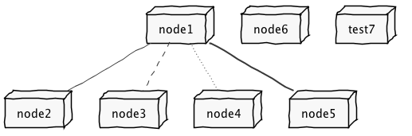

LAPR4/NSheets Project Repository
================================

# 1. General Notes about the Project

This project uses Maven.

The default Maven lifecycle comprises of the following phases:

	validate - validate the project is correct and all necessary information is available
	compile - compile the source code of the project
	test - test the compiled source code using a suitable unit testing framework. These tests should not require the code be packaged or deployed
	package - take the compiled code and package it in its distributable format, such as a JAR.
	verify - run any checks on results of integration tests to ensure quality criteria are met
	install - install the package into the local repository, for use as a dependency in other projects locally
	deploy - done in the build environment, copies the final package to the remote repository for sharing with other developers and projects. 

To build type:

	mvn clean verify

To execute type:

	mvn gwt:run
	

# 2. Integration of ANTLR4 and GWT

See [https://github.com/aranega/antlr4-gwt](https://github.com/aranega/antlr4-gwt)

**Notes**
- The antlr4-gwt only works with antlr4 version 4.2.2!

# X. Notes on the Organization of the Repositories

**Common repository**

Each lab class (i.e., "Turma PL") will have one common repository. The class will have a number that will be used to identify the repository. For instance, the class number **1** will have a common repository with the name: **cogsi-rep-17-18-g1**. The class with number **2** will have a common repository with the name: **cogsi-rep-17-18-g2**

The common repository is used to submit each sprint delivery (only the selected students!). Students do not work on the common repository, it is only used for sprint submissions!

**individual repository**

Each student will have an individual repository. Students should use this repository for their development.

Each student will have a Student Team Number. The number of the lab class and the Student Team Number will be used to identify the student individual repository. For instance, for the student with Student Team Number 3 of the lab class 2 the individual repository will have the name: **cogsi-rep-17-18-g2-s3**

Students should use Bitbucket Issues to reference their work/commits in the repository. They should commit regularly.

**Students should not use the Bitbucket Wiki for documentation. All documentation should be done in the repository using markdown and the suggested MD files, following the structure that is exemplified here.**

**Both repositories must have the same structure of folders!**

[//]: # (Os links para outras paginas markdown devem ser sempre relativos a pasta actual)

# Y. Individual Pages

These are links for the individual pages/folders of each Student. The first two are only examples. After knowing his/her Student Team Number, each student should update the table and the folder structure of the repository accordingly.

For instance, if my name is Maria Ferreira and I have the Student Team Number 2 I should update the row number 2 in this table. I should also create a new folder in the repository, as illustrated.

|Student Team Number |Student Name                         |Link         											  |
|--------------------|-------------------------------------|------------------------------------|
| **1**      				 | Joao Amaral 												 |[Joao Amaral](student-1122334/) |
| **2**    					 | Maria Ferreira											 |[Maria Ferreira](student-1133224/) |
| **3**    					 | 																		 |																	  |
| **4**    					 | 																		 |																	  |
| **5**    					 | 																		 |																	  |
| **6**    					 | 																		 |																	  |
| **7**    					 | 																		 |																	  |
| **8**    					 | 																		 |																	  |
| **9**    					 | 																		 |																	  |
| **10**    				 | 																		 |																	  |
| **11**    				 | 																		 |																	  |
| **12**    				 | 																		 |																	  |
| **13**    				 | 																		 |																	  |
| **14**    				 | 																		 |																	  |
| **15**    				 | 																		 |																	  |
| **16**    				 | 																		 |																	  |
| **17**    				 | 																		 |																	  |
| **18**    				 | 																		 |																	  |
| **19**    				 | 																		 |																	  |
| **20**    				 | 																		 |																	  |
| **21**    				 | 																		 |																	  |
| **22**    				 | 																		 |																	  |
| **23**    				 | 																		 |																	  |
| **24**    				 | 																		 |																	  |
| **25**    				 | 																		 |																	  |

# Z. Sprints

The following table is used to register the work of the students that are selected to present at each Sprint Review. For instance, if I am Student "Maria Ferreira" (1133224) and I was selected to make the second presentation for Sprint 1 then I should update this table as illustrated.

**Documentation for each Sprint**

|Sprint  | Sprint Presentation 1                  |  Sprint Presentation 2                |  Sprint Presentation 3                |  Sprint Presentation 4                |  Sprint Presentation 5                |
|--------|----------------------------------------|---------------------------------------|---------------------------------------|---------------------------------------|---------------------------------------|
| **1**  |[Joao Amaral](student-1122334/sp1)  |[Maria Ferreira](student-1133224/sp1) |                                       |                                       |																				|
| **2**  |																				|																				|																				|																				|  																			|
| **3**  |																				|																				|																				|																				|  																			|
| **4**  |																				|																				|																				|																				|  																			|
| **5**  |																				|																				|																				|																				|  																			|

# X. How to Use These README.md Type of Files

All documentation about the project should be included in readme.MD files in the repository.

Every student will work on his/her own folder in the repository. The folder should have a name following the pattern **student-**<student registration number>. For instance, for "Maria Ferreira" the folder should be **student-113324**.

Inside the student folder there should be a subfolder for each Sprint. Their names should be **sp1** through **sp5**. Inside these folder there should be a file named **readme.MD** with documentation about the Sprint. All the files/artifacts used for the Sprint should be inside these folders (or in subfolders of theses folders).

**Images and PlantUml**

This repository includes a **build.gradle** file that can be used to generated images for PlantUML diagrams.

For processing all **.puml** files in the repository simply type in the root:

	gradle

For instance, the next image was generated with this command. The PlantUml file is **net.puml** (located in the root of the repository) and the resulting image is **net.png** (also located in the root of the repository).

**Note:** You will need to have **gradle** installed in your system to execute the command.

Images with gravizo

