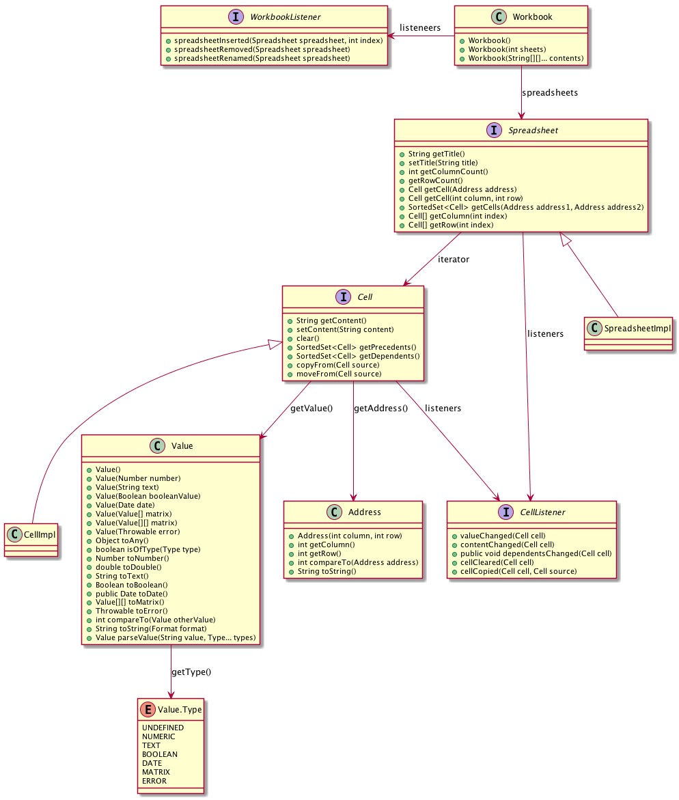
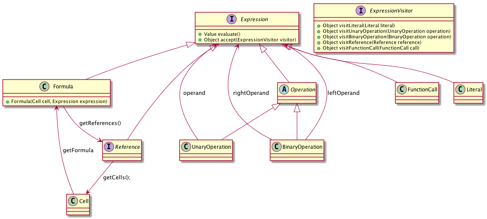

LAPR4/NSheets Project Documentation
================================

# 1. Organization

Each **Class Section** (i.e., "Turma PL") **is a Team** in the LAPR4 Project.

Each Team will have its one fork of the NSheets repository.

To help the management of the project each Team is further divided in 3 groups named: Red, Green and Blue.

The Requirements of the Project are also divided in three functional areas: Core, IPC and Lang.

The Project will be developed during 3 Sprints. During each sprint, each group works in a specific functional area. Each group (and student) must work in all three functional areas.

Groups should be defined before the start of the project and should remain stable during the project.

# 2. Individual Pages

These are links for the individual pages/folders of each Student. The first one is only an example that you should delete when the team starts the project. Each student should update the table and the folder structure of the repository accordingly.

| Group | Student Number     | Student Name                        | Link 							  |
|------|--------------------|-------------------------------------|------------------------------------|
| White  | **s4567890**      			| John Doe					|[John Doe](white/s4567890/) |
| Red  | **s1161569**    	 	 			| Hugo Carvalho			|[Hugo Carvalho](red/s1161569/)	   |
| Red  | **s1161155**			      	| Hugo Fernandes 		|[Hugo Fernandes](red/s1161155/)	 |
| Red  | **s1160777**		    			| Marco Carneiro		|[Marco Carneiro](red/s1160777/)	 |
| Red  | **s1161109**			   			| David Santiago		|[David Santiago](red/s1161109/)	 |
| Red  | **s1161110**			      	| David Maia				|[David Maia](red/s1161110/)			 |
| Red  | **s1161213**	      			| Filipe Simão			|[Filipe Simão](red/s1161213/)		 |
| Red  | **s1120608**			      	| Norberto Sousa 		|[Norberto Sousa](red/s1120608/)	 |
| Red  | **s1151231**			      	| Ricardo Correia 	|[Ricardo Correia](red/s1151231/)	 |
| Green | **s1151136**			        | Carlos Rodrigues	|[Carlos Rodrigues](green/s1151136/)	|
| Green | **s1150575**	      			| João Vieira				|[João Vieira](green/s1150575/)				|
| Green | **s1160696**	      			| João Santiago			|[João Santiago](green/s1160696/)			|
| Green | **s1160570**			      	| Paulo Magalhães	  |[Paulo Magalhães](green/s1160570/)		|
| Green | **s1171776**			      	| Nemanja	Cosic			|[Nemanja	Cosic](green/s1171776/)		  |
| Green | **s1171787**			      	| Predrag	Miljic		|[Predrag Miljic](green/s1171787/)	  |
| Green | **s1171815**			   			| Zoran Protic	  	|[Zoran Protic](green/s1171815/)			|
| Blue | **s1161248**			      	| João Oliveira	  	|[João Oliveira](blue/s1161248/)	  |
| Blue | **s1130443**			      	| Ana Jesus					|[Ana Jesus](blue/s1130443/)				|
| Blue | **s1150371**			      	| José Silva 				|[José Silva](blue/s1150371/)				|
| Blue | **s1091234**			     		| Pedro Tedim				|[Pedro Tedim](blue/s1091234/)		  |
| Blue | **s1140420**			     		| Rodrigo Soares		|[Rodrigo Soares](blue/s1140420/)		|
| Blue | **s1150585**			      	| Daniel Fernandes	|[Daniel Fernandes](blue/s1150585/)	|
| Blue | **s1171786**		      		| Pietro Falco			|[Pietro Falco](blue/s1171786/)			|
| Blue | **s1171715**			      	| Barbara Csonka		|[Barbara Csonka](blue/s1171715/)		|

# 3. Planning Overview

This is a table that should display the overall planning of the team. This is simply and example and you should update the table with the plan of your team.

| Group | Sprin1     | Sprint2        | Sprint 3	  |
|------|------------|----------------|-------------|
| Red  | Core   		| IPC			| Lang        |
| Green  | IPC      | Lang		    | Core		  |
| Blue  | Lang	    | Core	  		| IPC    	  |

# 4. Planning Detail

| Group | Student                      | Sprint1                                        | Sprint2                                      | Sprint3 							          |
|------|------------------------------|------------------------------------------------|----------------------------------------------|----------------------------------------------|
| White  | [John Doe](white/s4567890/) | [Core00.0](white/s4567890/sp1)            | [IPC00.0](white/s45678901/sp2)           | [Lang00.0](white/s4567890/sp3) |
| Red  |[Hugo Carvalho](red/s1161569/)   | [Core03.1](red/s1161569/sp1)	 		       | [IPC08.1](red/s1161569/sp2)  	      |	  |
| Red  |[Hugo Fernandes](red/s1161155/)	 | [Core05.1](red/s1161155/sp1) |								 |		|
| Red  |[Marco Carneiro](red/s1160777/)  | [Core02.1](red/s1160777/sp1)	|						 |		|
| Red  |[David Santiago](red/s1161109/)  | [Core07.1](red/s1161109/sp1) |								 |		|
| Red  |[David Maia](red/s1161110/)      | [Core08.1](red/s1161110/sp1) |								 |		|
| Red  |[Filipe Simão](red/s1161213/) 	 | [Core06.1](red/s1161213/sp1) |								 |		|
| Red  |[Norberto Sousa](red/s1120608/)  | [Core01.1](red/s1120608/sp1) |								 |		|
| Red  |[Ricardo Correia](red/s1151231/) |               |                 |    |
| Green |[Carlos Rodrigues](green/s1151136/) |  [IPC06.1](green/s1151136/sp1)|								 |		|
| Green |[João Vieira](green/s1150575/) 		 | 	[IPC04.1](green/s1150575/sp1)|								 |		|
| Green |[João Santiago](green/s1160696/) 	 | [IPC05.1](green/s1160696/sp1)|								 |		|
| Green |[Paulo Magalhães](green/s1160570/)  | [IPC01.1](green/s1160570/sp1)|[Lang01.2(green/s1160570/sp2)]|		|
| Green |[Nemanja Cosic](green/s1171776/)  	 | 							|								 |		|
| Green |[Predrag Miljic](green/s1171787/) 	 | 							|								 |		|
| Green |[Zoran Protic](green/s1171815/) 		 | 							|								 |		|
| Blue |[João Oliveira](blue/s1161248/)    | [Lang08.1](blue/s1161248/sp1)							|	[Core06.2](blue/s1161248/sp2)							 |		|
| Blue |[Ana Jesus](blue/s1130443/) 		   | MIA							|	MIA							 |		|
| Blue |[José Silva](blue/s1150371/) 		   | [Lang06.1](blue/s1150371/sp1)							|								 |		|
| Blue |[Pedro Tedim](blue/s1091234/) 	   | [Lang01.1](blue/s1091234/sp1)							|	[Core01.2](blue/s1091234/sp2)							 |		|
| Blue |[Rodrigo Soares](blue/s1140420/)   | [Lang02.1](blue/s1140420/sp1)				|	[Core04.2](blue/s1140420/sp2)							 |		|
| Blue |[Daniel Fernandes](blue/s1150585/) | [Lang05.1](blue/s1150585/sp1)						|	[Core05.2](blue/s1150585/sp2)							 |		|
| Blue |[Pietro Falco](blue/s1171786/)	 	 | [Lang04.1](blue/s1171786/sp1)							|								 |		|
| Blue |[Barbara Csonka](blue/s1171715/)   | [Lang03.1](blue/s1171715/sp1)             | [Core03.2](blue/s1171715/sp2)               |    |

# 5. Requirements

The ultimate goal of this project is to develop the first version of Cleansheets for the Web. As such, it may be wise to study the previous desktop version. You may fork the desktop version available in [Bitbucket](https://bitbucket.org/lei-isep/csheets). Along with the code you may find the documentation (i.e., the manual) in 'manual/doc/lapr4_manual.pdf'.

The requirements for this new version are similar to the ones of the previous version but some updates have been made by the Product Owner. You may find the specific requirements for this edition further down in this section.

In this document four terms that are related to similar concepts are used: feature, functional increment, use case and user story. Although similar they are different. Features refer to the identification of a requirement in this document. Each requirement/feature is further divided into functional increments. Normally, each functional increment depends on the previous increment of the same feature. It can also depend on other features, but that is to be discovered during the normal process of analysis. Functional increments of a feature should be developed in sequence.

One can state that the functional increment is the unit of work in this project. Usually a functional increment can be specified using the formalism of "user stories". Also, a user story can be further described by the formalism of "use cases". For the most common and simpler cases we can say that one functional increment corresponds to one user story which, in turn, corresponds to one use case. That is why it is normally "safe" to use whatever term we prefer. However, one should pay attention during analysis, because sometimes that correspondence may not be true.

Requirements are classified in three functional areas:  
	- **Core**: These are requirements that are related to the architecture and common functionalities of NSheets  
	- **Languages** These are requirements that are related to the formulas of NSheets and other aspects related to languages, parsers and grammars  
	- **IPC**: These are requirements that explore interprocess communication  

**Rules for the Scheduling of Requirements**  
	- The project is a team work. Important design decisions (e.g., with impact in the architecture or futures developments) must be discussed and taken as a team.  
	- Each Feature Increment must be developed individually.  
	- Features that are mandatory are required to be developed.  
	- Some features may be dependent on others. Students must make sure that dependent features are ready and, if not, develop the required functionality.    
	- When a Feature is started it must be completed, i.e., all the three functional increments must be developed.

## 5.1 Core

### Core01 - Workbook View (Mandatory)

- **Core01.1 - Partial Workbook View**

	The workbook page should be related to one of the workbooks displayed in the home page. It should be possible to create a new empty workbook in the home page.
	Workbooks should be persisted in the server. At this moment a workbook must only have one spreadsheet.

- **Core01.2 - Complete Workbook View**

	The application should now support complete workbooks, i.e., workbooks with several spreadsheets. It should be possible to make references between sheets in the formulas.
	It should also be possible to delete workbooks and update their metadata (name and description).

- **Core01.3 - Several Active Workbooks**

	It should be possible to open several workbooks at the same time. It should be possible to make references between workbooks in the formulas.

### Core02 - Extensions (Mandatory)

- **Core02.1 - Basic Extension Mechanism**

	Implement an extension mechanism that can be used to add functionality to the application. For the moment it should support extensions that add cell decorators. The application should also have a new settings page with a specific section for each extension. For testing purposes a new extension should be developed that changes the background color of numeric cells according to its value being positive or negative. The color should be configured in the settings page.

- **Core02.2 - Full Extension Mechanism**

	The extensions should now contribute also with popup menus in cells, menu options in the navigator and side bars.

- **Core02.3 - Enable/Disable Extensions**

	It should be possible to enable and disable extensions. At least one of the extensions of Core08 should be updated to support this feature.

### Core03 - Sort and Dependencies in Cells

- **Core03.1 - Sort Range of Cells**

	Sort a range of cells. A range of cells is a rectangular area delimited by an upper left corner and a lower right corner. The sorting is based on one or more columns of the range. It should be possible to select the order: ascending or descending. Interaction with the user should be based on a popup menu. It should be possible to sort data of the following types: numeric, text or date.

- **Core03.2 - Filter Range of Cells**

	It should be possible to filter a range of cells. The filter should be a boolean formula that is applied to each row (and a specific column of the range). If the result is true, the row is visible. If the result is false, the row should become invisible.

- **Core03.3 - Dependency Tree Extension**

	This feature should implement a similar functionality to the one provided by the "Dependency Tree Extension" in the Desktop version of Cleansheets.

### Core04 - Charts

- **Core04.1 - Basic Chart Wizard**

	The application should have a new menu option to launch a wizard to help the user create a bar chart. The wizard should have 2 steps. In the first step, the user should input the name of the chart and the range of cells that contains the data for the plot of the chart. The user should also select if the data is in the rows or columns of the range and if the first row or the first column are to be considered labels. In the second step the wizard should display a preview of the chart. The wizard should allow the user to move between steps 1 and 2. If the wizard is confirmed the cell in the left upper corner of the range should have a mark (e.g., icon) that indicates that the cell has a chart associated with it. A popup menu option in the cell should provide access to the chart.

- **Core04.2 - Advanced Chart Wizard**

	The previous bar chart can now be configured to display bars side by side or stacked. The application should also support a new type of charts: pie charts. The wizard should now give the user the possibility to select the type of chart. The charts can now be produced using data that is in a different spreadsheet of the workbook. The application should now include a window (or page, or section in a page) that displays the list of existing charts and that can be used to enable/disable the display of each chart as well as give access to the chart wizard so that it is possible to change the existing charts. It should also be possible the delete existing charts using this window.

- **Core04.3 - Dynamic Charts**

	The charts should now be dynamic. A dynamic chart is a chart that is automatically updated when its source data changes. The application should now graphically mark the range of cells that are source to charts (e.g., with a surrounding border). Also, when the mouse hovers over the left upper corner of a range of cells that is the source of a chart a preview of the chart should appear.

### Core05 - Contacts, Tasks and Reminders

- **Core05.1 - Contacts**

	Each user of the applications should have a list of contacts. A contact is another user of the application that has established a contact with the user of the application. A user of the application may establish a contact with another user by sending an invitation if he/she knows the email of the other user. A user may or not accept an invitation. A user can block/unblock invitations from other users.

- **Core05.2 - Tasks**

	It should be possible to create, edit and remove tasks. A task has a name, a description, and a list of contacts. A task also has a priority level (1 to 5) and a percentage of completion. The application should have a window to display and edit tasks. It should be possible to sort and filter the tasks using expressions based on its fields. For instance, it should be possible to only display tasks which are not completed. Tasks should be visible to all the contacts related to the task.

- **Core05.3 - Reminders**

	It should be possible to create, edit and remove reminders. The user is notified when the due date of the reminder arrives. A reminder has a name, a description and a time stamp (due date). The application should only allow valid time stamps. The application should list all the existing reminders. When the due date of a reminder is reached the application should automatically display an alert to the user in a popup window. This popup window should display the name, description and due date of the reminder. The window should have two buttons. One button to close the window and the other button to remind again the user in a specific elapse of time (e.g., 5 minutes).

### Core06 - Calendar

- **Core06.1 - Calendar**

	The application should have a calendar view to display events. An event has a title, description, time stamp and duration. Events should be displayed in the calendar ordered by their time stamp. It should be possible to create, edit and delete events. The calendar should display all events.

- **Core06.2 - Basic Agenda**

	The calendar view should now evolve into an agenda view that may display several calendars. It should be possible to create, edit and remove calendars. Each user can have one or more calendars. Each calendar has a name (e.g., work, birthdays, home, etc.) and a textual description. It should be possible to associate a color to a calendar (events of that calendar are displayed with the color of the calendar). It should be possible to filter what calendars are displayed in the agenda view.	The agenda view can be implemented as a simple list of events (from the calendars). The view should display only actual and future events.

- **Core06.3 - Advanced Agenda**

	The agenda view should now have a display area divided in 24 slots, one for each hour of the day. Each of the slots should have a small text displaying the hour of the day. The Events should be displayed in a size corresponding to its duration and in the color of the calendar. It should be possible to select the calendars to display in the view. When double clicking in an event its edit window should appear. It should be possible to switch between this new view and the previous view. The view should include buttons to move between days and to select the day to display.

### Core07 - Notes

- **Core07.1 - Notes**

	It should be possible to create, edit and remove text notes. A user can have one or more notes. There should be a window to list the textual notes of a user. A text note should be entered as multiline text in which the first line is interpreted as the title of the text note. The time stamp of the creation of the note should be also associated with the text note. The application should maintain the history of modifications for each text note. When a text note is selected, the application should display its history. For each version, the application should display the time stamp and the first line (i.e., the title).

- **Core07.2 - Lists**

	It should be possible to create, edit and remove list notes. A list note is similar to a textual note but each line is displayed as a check box (that can be checked or unchecked). The first line is also interpreted as the title of the list note. It should be possible to generate a new version of a text note or list based on an old version of it. When this happens, the application should "open" the new version for edit with the same contents of the old version. This is the only "trace" that may eventually link to the old version.

- **Core07.3 - Search and Export Notes**

	It should be possible to search for notes (text and lists) within a time interval. The query expression should allow to search based on the title and/or contents of the notes. It should be possible to use regular expressions to search the contents of the notes that are within the time interval. It should be possible to open a specific note by double clicking on it in the result list. It should be possible to export the search results into a range in an spreadsheet.

### Core08 - Base Extensions

- **Core08.1 - Styles in Cells Extension**

	The application should have a new extension to associate styles with cells. The functionality should be similar to the one present in the desktop version of Cleansheets.

- **Core08.2 - Comments in Cells Extension**

	The application should have a new extension to associate textual comments with cells. The functionality should be similar to the one present in the desktop version of Cleansheets.

- **Core08.3 - Images in Cells Extension**

	The application should have a new extension similar to the previous one but regarding the possibility of associating images with cells.

## 5.2 IPC

### IPC01 - Security (Mandatory)

- **IPC01.1 - User Authentication**

	All the pages of the application should require an authenticated user (except the "About" page). The application should have a "Login" page (Hint: Gatekeepers in GWTP). Some hard-coded users should be defined to be initially used for authentication. There should also exist a super-user that is able to access **everything**.

- **IPC01.2 - Register User**

	The application should add the possibility of registering new users. The identification of a user should be based on his email. Each user should have an email, name, nickname and picture (i.e., face photo). The application should display the nickname and photo of the authenticated user in the top of every page.

- **IPC01.3 - Security Profile**

	The application should now have a new "Profile" page to allow users to manage their accounts. The user should be able to change his information (name, nickname and photo) and also delete the account. The super-user should be able to access all the accounts and be able to enable/disable accounts. When an account is disable its user is not able to authenticate.  

### IPC02 - Search and Replace

- **IPC02.1 - Spreadsheet Search**

	The application should now allow for searching the contents of the active workbook. The new window should be composed of two parts. The first part (upper part of the window) should contain a text box for the user to enter a regular expression to be the basis for the search. This part should also contain a button to launch the search. The second part (lower part of the window) should be used to display the search results (cell coordinates and value or contents). The search should include no only the content of the cell (i.e., the text entered by the user) but also its value (that could have been calculated by a formula).

- **IPC02.2 - Workbook Search and Replace**

	The application should now have a new option for "Search and Replace". This new window should be similar to the search window but with an area to enter the replacing text. When search and replace is launched, when a match is found, the window should display "what" was found, "where" the match has occurred and how it will become after the replace. The user should then confirm the replacement or select next (to continue the search). The window should include a button to apply the replacing to all the matches without asking each time. Similarly to the search only option, this option should also have parameters to refine the search, for instance, what type of cells to include in the search (or if it should include formulas or comments). "Search" and "Search and Replace" should should include contents of all the spreadsheets of the active workbook.

- **IPC02.3 - Global Search/Replace**

	The application should now support "Search" and "Search and Replace" to be applied for all the workbooks of the user (may they be active/open or not). It should be possible to apply the search to workbooks which name matches a specific regular expression.  

### IPC03 - PDF

- **IPC03.1 - Basic PDF Export**

	It should be possible to export to PDF an entire workbook, a spreadsheet or a range of cells. The contents should include only the values of the cells (and not its formulas, for instance). The user should be able to select the content to be exported and also if the document should have a table of contents with links to the sections or not. If select, sections/chapters should be generated for each spreadsheet of the workbook. The generated PDF should be downloaded to the user local file system.

- **IPC03.2 - PDF Style Export**

	The generated PDF should now mimic as far as possible the screen style of the exported contents. For instance, the formatting of the cells in the PDF should be similar to the screen. It should be also possible to configure the type of lines to use for cell delimitation, the type of line and color. This is to be applied when rendering all cells in the PDF. Note that this is different from the style used for cells borders in the screen.

- **IPC03.3 - PDF Complete Export**

	At this level, the export may include all the contents that are persisted with a workbook. For instance, all the following contents should be exported: the source of formulas, comments, images, macros, etc. However, the user should be given the possibility to select the type of contents to include in the PDF. Therefore, it is expected that the PDF includes sections that represent the visual aspect of the exported spreadsheets (as far as possible in a similar manner to how they are displayed on screen) and also new sections to include the contents that do not appear in the cells like, for instance, macros, comments or images. In each of this sections the contents should make references to the cells that are related to them (if they are related to cells).

### IPC04 - XML

- **IPC04.1 - Export XML**

	It should be possible to export the contents of an workbook, spreadsheet or part of a spreadsheet to a XML file. As we want to optimize as much as possible the process the solution should not rely on any third party library. The application should have a window/page to configure the XML tags to use for each type of element. The export should only include the value of the cells. The generated XML should be downloaded to the user local file system.

- **IPC04.2 - Import XML**

	It should be possible to import (i.e., upload) data from an XML file (this operation is the "inverse" of the previous one). Depending on the contents of the XML file, the data from the file can replace the contents of the active workbook, a spreadsheet or a range of a spreadsheet.

- **IPC04.3 - Full XML Import/Export**

	The previous options should now include all the persisting elements of the workbooks (i.e., all the contents that are normally persisted with the workbook, such as macros, formatting styles, comments, etc.). The import should now ask the user if the file contents should replace or append the existing workbook contents.

### IPC05 - CLS/CSV Persistence

- **IPC05.1 - Export to CSV**

	It should be possible to export the contents of an workbook, spreadsheet or part of a spreadsheet to a CSV file. As we want to optimize as much as possible the process the solution should not rely on any third party library. The application should have a window/page to configure the CSV format (e.g, field separator or string delimiter). The export should only include the value of the cells. The generated CSV should be downloaded to the user local file system.

- **IPC05.2 - Export to CLS**

	It should be possible to export an workbook to a CLS file. The CLS format is the native format used by the desktop version of Cleansheets. It should be possible to open the exported CLS file in the desktop version of Cleansheets. The generated CLS should be downloaded to the user local file system.

- **IPC05.3 - Import/Export CSV and CLS**

	It should be possible to import and export in both formats: CLS and CSV.

### IPC06 - Workbook Sharing				

- **IPC06.1 - Public Workbooks**

	Workbooks should be considered public. A public workbook is a workbook that can be accessed by all users. The "Home" page should display all the workbooks. It should be possible to apply filters to this view/page to display only workbooks with specific names or descriptions (the application should accepted regular expressions to filter the workbooks). It should be possible to open, rename or delete a selected workbook in this page/view.

- **IPC06.2 - Private Workbooks**

	Workbooks that are created by the user should be considered private. The "Home" page should now be able to display private and public workbooks. It should be possible to apply filters to this view/page to display only private or public workbooks with specific names or descriptions (the application should accepted regular expressions to filter the workbooks). Public and private workbooks should have some visual distinction (e.g, icon).

- **IPC06.3 - Share Workbooks**

	It should be possible to apply individual sharing options to each workbook. A workbook can now be shared with only specific users. In this context, a public workbook is simply a workbook that is shared with everyone. Also, the share should have a type: view, read-only, write. View only allows the listing of the name and description of the workbook. Read-only allow to open the workbook but not to edit it. Write should allow full edition.

### IPC07 - Collaborative Workbook Editing

- **IPC07.1 - Base Concurrent Edition**

	Concurrent editions of the same Workbook should display updates "as much as possible" in realtime.

- **IPC07.2 - Full Concurrent Edition**

	The Workbook View should display other users that are editing the same workbook and have a visual identification for the cells that other users are editing.

- **IPC07.3 - Message Exchange**

	The Workbook View should have an area to allow collaborate users to exchange small text messages.

### IPC08 - Online Chat

- **IPC08.1 - Public Chat**

	Add a Page/View to allow all online users to exchange text messages (i.e., a public chat room).

- **IPC08.2 - Private Chat**

	Users should now be able to create private chat rooms. They should invite other users (by using their email).

- **IPC08.3 - Full Chat**

	Users should be able to post Images and make mentions of other users (they should receive a notification email if they are not online).

## 5.3 Lang

### Lang01 - Formulas (Mandatory)

- **Lang01.1 - Block of Instructions**

	Add the possibility of writing blocks (or sequences) of instructions. A block must be delimited by curly braces and its instructions must be separated by ";". The instructions of a block are executed sequentially and the block "result" is the result of the last statement of the block. For example, the formula "= {1+ 2; sum (A1:A10); B3 + 4 }" must result in the sequential execution of all expressions and the result is the value of the expression "B3 + 4". Add the assign operator (its symbol is ":="). This operator assigns to its left the result of the right expression. At the moment the left of the assign operator can only be a cell reference. The FOR loop should also be implemented based on instruction blocks. For example, the formula"= FOR {A1: = 1 ; A1<10; A2: = A2 + A1; A1: = A1 + 1 }" executes a for loop in which: the first expression is the initialization, the second term is the boundary condition, all other expressions are performed for each iteration of the loop.

- **Lang01.2 - Monetary Language**

	Add a new formulas language (currently the application only has Excel formulas that begin with the character "="). The new language should do only calculations related to currencies. The character that begins the formula should be "#". The formula should only accept the addition, subtraction, multiplication and division operators. Operands are monetary values in which it is necessary to provide the currency (e.g., 10.21e, 1.32£ or 0.20$). All expressions are required to be contained within brackets with the currency prefix in which we want the result, e.g., "#euro{10.32$ + 12.89£}" or "#dollar{ 10.32$ + 12.89£}" or "#pound{10.32$ + 12.89£}". For the user to use this language instead of the "regular" Excel language it should start the formula by the character "#" instead of the "=" character. The application should also provide a way for setting exchange rates (by means of a configuration). The implementation should avoid the use of numbers in floating point representation (e.g., float, double) in order to avoid precision problems.

- **Lang01.3 - Eval and While Loops**

	Add the Eval function. This function has a single parameter that is a string. When executed, this function will "compile" the formula contained in the only parameter and execute the resulting expression. The result of Eval is the result of the execution of the compiled expression. For example, if we write the following formula "=" 2 + 3 "" we get the string "2 + 3" in the cell. However, if we write the formula "= eval (" 2 + 3 ")" the value obtained in the cell is 5. Add the following two loop functions: DoWhile and WhileDo. The DoWhile executes the first expression in loop while the second expression evaluates to true. In each iteration of the loop the the first expression is the first to be evaluated. The WhileDo executes the second expression in loop while the first evaluates to true. In each iteration of the loop the the first expression is the first to be evaluated. Example: "= {@Counter:=1; WhileDo(Eval( "A"&@Counter)> 0; {C1:=C1+Eval("B"&@Counter); @Counter:=@Counter+1 }) }" . In this example, the cell C1 will get the sum of all the values of column B in that the corresponding values in column A are greater than zero.

### Lang02 - Variables

- **Lang02.1 - Temporary Variables**

	Add support for temporary variables. The name of temporary variables must start with the "_" sign. When a variable is referred in a formula for the first time, it is created. To set the value of a variable it must be used on the left of the assign operator (":="). Temporary variables are variables that only exist in the context of the execution of a formula. Therefore, it is possible for several formulas to use temporary variables with the same name and they will be different instances. Example: "= {_Counter:=1; WhileDo(Eval( "A"&_Counter)> 0; {C1:=C1+Eval("B"&_Counter); _Counter:=_Counter+1 }) }” . In this example, the cell C1 will get the sum of all the values of column B in that the corresponding values in column A are greater than zero.

- **Lang02.2 - Global Variables**

	Add support for global variables. Global variables are variables that exist in the context of the workbook and are persisted with the workbook. The name of global variables must start with the "@" sign. When a variable is referred in a formula for the first time it is created. To set the value of a variable it must be used on the left of the assign operator (":="). Attention should be given to synchronization problems. For an example of the use of global variables see Lang01.3.

- **Lang02.3 - Arrays and Variable Editor**

	Add support for array variables (temporary and global). Any variable can be an array. When accessing a variable only by its name it should be inferred the position 1 of the array. To explicitly access a position in a array variable the position index should be specified inside brackets (following the name of the variable). For example, the formula "=@abc[2]:=123" will set the position 2 of the global variable @abc to the value 123. Each position of an array can be of a different type. For instance it should be possible to have an array with numeric and alphanumeric values.
	There should also be a window to display and edit the value of global variables. The values that appear in this window should be automatically updated when the variables are updated.

### Lang03 - Tools based on Formulas

- **Lang03.1 - Conditional Formating of Cells**

	Update the "style" extension so that it can be used for the conditional formatting of cells based on the result of the execution of formulas. For the style of a cell to be conditional it must have an associated formula and two formatting styles. One of the styles is applied when the formula evaluates to true and the other when it evaluates to false. The editing of these settings should be done in a window.

- **Lang03.2 - Conditional Formating of Ranges**

	Enable the application to apply conditional formatting to a range of cells (also in the style extension). The idea is that a single formula could be applied to all the cells in the range (one at a time) in order to evaluate what style to apply. For that to be possible it is necessary to add a new special kind of variable to the formulas that represents the "current" cell. This special variable could be named "_cell". For instance, the formula "=_cell >= 10" could be associated to a range format. In this case, the application would evaluate the formula for each cell in the range and apply the formatting style in accordance with the result of the formula. In this example, all cell in the range with a value greater or equal to 10 would receive the style associated with the true result and the others the style associated with the false result. The window for editing the settings should also be updated so that it is clear if the format is for a single cell or for a range. Within the window it should also be possible to remove existing conditional style formatting.

- **Lang03.3 - Tables and Filters**

	Add new functionality to support the concept of "tables". A table is essentially a range of cells. The first row of this range of cells can be used as header of the table columns (the contents of these cells becomes the name of the columns). Once a table is defined it should be possible to filter its contents by using formulas. A formula that is used as a filter of a table is applied to each row of the table. If the result is true, the row is visible, if the result is false, the row should become invisible. To facilitate the writing of such formulas a new special variable should be added to formulas. This new variable should be an array variable that represents the value of the columns of the table for the current row. Lets consider, for instance, that the new variable is called "_col". For example, it should be possible to use "_col[2]" to get the value of column 2 for the current row. It should also be possible to use the name of the column instead of the index. For instance, if the header of column 2 is "cidade" it should be possible the get the value of this column for the current row by using "_col["cidade"]". An example of a filter for a table could be: "=or(_col["idade"]>10; _col[3]<123)". This extension should have a window that should be used to edit tables and its filters.

### Lang04 - Function Wizard

- **Lang04.1 - Insert Function Basic Wizard**

	The application should have an option to launch a wizard to aid the user in calling functions in formulas. This new window should display a list of possible functions. The construction of this list should be made dynamically based on the self-description of the functions. When a function is selected in the list its syntax should be displayed in a edit box. The "syntax" should include the name of the function and its parameters. For example, for the factorial function, that only has one parameter, the following text should be displayed in the edit box "= FACT(Number)". The window should also contain an area to display a text describing the selected function (i.e., help text). The window should have an "Apply" and a "Cancel" button. If the user selects the "Apply" button the text of the syntax of the function should be written in the "formula bar".

- **Lang04.2 - Insert Function Intermediate Wizard**

	The wizard window should display an edit box for each parameter of the selected function. The user should use these edit boxes to enter the values for each parameter of the function. As the user enters the values the wizard should display (in a new region of the window) the result of the execution of the formula or a message explaining the problem. The function list should now include also the operators as well as the functions that are dynamically loaded from java.lang.Math. The wizard should be now launched from an icon or button located in the "formula bar".

- **Lang04.3 - Insert Function Advanced Wizard**

	The wizard should now have an edit box where the formula is gradually constructed. The user should be able to edit the formula text freely. The functions or operators (and the values of its parameters/operands) selected from the list should now be inserted in the position of the cursor in the new edit box. The wizard should continue to have an area to display the evaluation of the formula (that should be produced dynamically, as the user edits the formula). The wizard should also have a new window that should display the structure of the formula expression like an abstract syntax tree (i.e., the structure resulting from the formula compilation). When the user clicks a tree element its respective text in the edit box should appear highlighted.

### Lang05 - Forms

- **Lang05.1 - Forms Editor**

	The application should have a new option to launch a window for editing a form. A Form is a window that is designed by the end user and is used for interacting with the user (input and output). The new window should support the creation and testing of a Form. Forms should be very simple. A Form should be composed of rows, each row can be empty or have one or two visual widgets. The supported visual widgets are: button (to invoke actions); edit box (to enter data) and static text box (to display data). It should be possible to set the core properties of these widgets (like the text to display in a static text box, for instance). In the edit form window it should be possible to: add a new row; remove an existing row; edit an existing row; "play" the form and close the edit form window. The "play" button is for testing the appearance of a form during its design (see example in the next Figure). At the moment it is only required to support a single Form for each workbook. Macros and formulas should have a new function that can be used to display the form of the current workbook. Forms should have an icon or button to close the form. When the form is closed the function (in macros or formulas) who call it returns.

- **Lang05.2 - Forms and Variables**

	In order for forms to become useful in formulas or macros it is necessary to associate data with the contents of the visual widgets. The mechanism used for that will be the binding of variables (macros or formulas variables) with the contents of the visual widgets. One simple way to achieve this is by using temporary variables (from macros and formulas). The matching between widgets and variables should be done by associating the ones with the same name. When displaying a form (in the context of a macro or a formula), if the temporary variables with the same name of widgets exist, them they are used to set the content of the widgets. For widgets for which no temporary variables with the same name are found then new temporary variables should be created. The user should be able to change the contents of edit boxes. When closing the form window the contents of the temporary variables should be updated from the contents of the corresponding visual widgets.

- **Lang05.3 - Advanced Forms**

	It should now be possible to create multiple forms for each workbook. To distinguish Forms, each one should have a unique name (within its workbook). The function (in macros and formulas) that displays the forms should now have one parameter that is used to pass the name of the form to display (since there can be several forms for each workbook).
	When displaying a form it should be possible specify if it should be read only (i.e., it will display the value of the variables but does not allow any update) or writable (in this case the form should allow for the user to modify the values that are displayed). Writable forms should have a new "Update" button. When the user clicks in the update button the form closes and the current values of the widgets update the corresponding variables. If the user closes the form window by any other means the variables should not be updated. It should be also possible to specify the "mode" of the form window (when invoking the display of a form). Two modes are allowed: modal and modeless. A modal form window is a window that will block the macro or formula that call it until the user closes the form window. The macro or formula will only resume execution when the form is closed. A modeless for window is a window that will no block the calling macro or formula, i.e., the macro or formula will continue its execution in parallel with the display of the form. Modeless forms do not return anything. Model forms should return the name of the button that was used to close the window.

### Lang06 - Macros Script Language

- **Lang06.1 - Macros Language**

	The application should have a new option to open a window to edit and execute a single macro. Macros should be designed as a complete new language in the application. However, its initial grammar should be very simple and "inspired" in the language of the formulas. In particular, a macro is simply a sequence of formulas that are executed sequentially. The formulas are the same as those used in the cells. Each line of the macro may contain a formula or be a comment. A comment is a line that starts with the character ";". The lines of the macros must support all that is possible to do with the cell formulas that start with "=" (but in the macros the lines can not start with "="). The macro is to be associated with the current workbook. The result of executing a macro is the result of the last executed instruction. The new window should have an area to edit the text of the macro and button to run the macro. The result of the execution of the macro should also appear in the window.

- **Lang06.2 - Multiple Macros**

	The application should now support multiple macros. Each macro should have a name and should be associated with an workbook. The grammar of the macros should also have a mechanism to support the invocation of macros. It only should be possible to invoke macros of the same workbook. Special attention should be devoted to recursion (i.e., avoiding infinite recursion).

- **Lang06.3 - Macros with Parameters**

	Macros should now have parameters. The syntax for macros should now include an header that should include the name of the macro and its parameters (all parameters should have a distinct name). The parameters should be considered only input parameters. However, it should be possible to freely reference parameters inside the macro. That is to say that, inside a macro, parameters should be used like variables. Macros should support local variables that exist only in the context of a macro. This local variables should have a syntax similar to the one described for the temporary variables of formulas. The invocation of macros must now include the values for its parameters.

### Lang07 - Visual Basic Script Language

- **Lang07.1 - Base Visual Basic Language**  

	The application should support a language inspired in the syntax of [Visual Basic](https://en.wikipedia.org/wiki/Microsoft_Small_Basic). This language is to be an alterntive language to writing "Macros". This feature increment should have the same functionality as Lang06.1 but with the adaptations required by the syntax of the language.

- **Lang07.2 - Visual Basic with Methods without Parameters**

	This feature increment should have the same functionality as Lang06.2 but with the adaptations required by the syntax of the language.

- **Lang07.3 - Visual Basic with Methods with parameters**

	This feature increment should have the same functionality as Lang06.3 but with the adaptations required by the syntax of the language.

### Lang08 - Java Script Language

- **Lang08.1 - Base Javascript Language**

	The application should support a language inspired in the syntax of [Javascript](https://en.wikipedia.org/wiki/JavaScript#Syntax). This language is to be an alterntive language to writing "Macros". This feature increment should have the same functionality as Lang06.1 but with the adaptations required by the syntax of the language.

- **Lang08.2 - Javascript with Methods without parameters**

	This feature increment should have the same functionality as Lang06.2 but with the adaptations required by the syntax of the language.

- **Lang08.3 - Javascript with Methods with parameters**

	This feature increment should have the same functionality as Lang06.3 but with the adaptations required by the syntax of the language.

# 6. Grading/Assessment

Assessment and grading will take place during sprint reviews.

The version to be reviewed in each sprint must be closed before the first class of the following Tuesdays:

- **Sprint 1: Jun, 5**

- **Sprint 2: Jun, 12**

- **Sprint 3: Jun, 19**

The grade of each sprint has a weight of 20% in the final score of the project.

As described next, each student will have an **individual technical assessment during one of the sprints**. Besides contributing to the assessment of the group during the sprint this assessment will also have an weight of 40% in the final score of the project.

**Project Final Score = Sprint 1 Score &ast; 0,2 + Sprint 2 Score &ast; 0,2 + Sprint 3 Score &ast; 0,2 + Individual Technical Score &ast; 0,4**

Each group is responsible for one functional area in a sprint. Each group will be assessed by the corresponding teacher of the functional area (in the first class after the sprint deadline).

## Sprint Reviews

Sprint reviews take place in the first class of the functional area (core, ipc or lang) after the sprint deadline.

The expected duration of a sprint review is 60 minutes.

There are three phases in the sprint review:
- **Phase 1: Deployment**
- **Phase 2: Functional Demonstration**
- **Phase 3: Technical Analysis**

In the final of this session the **teacher should give feedback** about the performance of the students **and also inform of their scores**.

### Phase 1: Sprint Overview and Deployment

During this phase one of the members of the group:

- gives and overview of the developed issues/tasks and group work during the sprint
- demonstrate to the teacher how the application was deployed (e.g., the application will be executed from inside the IDE; the application will be executed from a local web server; the application will be executed from a local virtual machine, etc.).

This phase should take 1 to 5 minutes

** Grading **

Rubric **T- Team Work**

*This grade is the same for all the members of the group.*

Weight: 10% of the sprint grade.

- **0- non implemented / unacceptable.** **There are no evidences of team work**. There are almost no issues and commits are very rudimentary in its descriptions and frequency.

- **1- attempt.** **There are small evidences of team work**. Some issues seem correct in terms of their life-cycle. Connections between issues and commits is very rudimentary. The description of issues seem to have some significant problems.

- **2- many defects.** **There are some evidences of team work**. Several issues seem correct in terms of their life-cycle. Connections between issues and commits is frequent but may be improved (e.g., commits are not used to control the state of issues). The description of issues is accurate.

- **3- some defects.** **There are evidences of a team process of decision making** in which the student participates actively although some minor problems may exist such as dependencies discovered only late in the process. Issues and commits are almost fully connected.

- **3,5- correct.** **There are evidences of a team process of decision making** in which the student participates actively and that results in the **assignment of tasks in a clear and managed way and in a timely fashion**. Issues and commits are fully connected.

- **4- exceptional.** There are evidences of a team process of decision making which is leaded and coordinated by the student and that results in the assignment of tasks in a clear and managed way and in a timely fashion. There are evidences of group tasks such as integration, tests or deployment activities.

Rubric **D- Deployment**

*This grade is the same for all the members of the group.*

Weight: 20% of the sprint grade.

- **0- non implemented / unacceptable.** The group was unable to demonstrate the application outside of the IDE.

- **1- attempt.** The application **runs without the IDE in a local web server**. The group was able to demonstrate the application without any major fault but **after the deadline** (there may have been some minor integration problems before the demonstration). The demonstration was based on the tagged version from Bitbucket that was dowloaded from the moodle.

- **2- many defects.** The application **runs without the IDE in a local web server**. The group was able to demonstrate the application **within the deadline** although with some minor runtime faults during the demonstration or without running all the tests or with significant test failures not justified. The correct version was used (tagged in Bitbucket and uploaded to moodle).

- **3- some defects.** The application **runs without the IDE in a web server in local virtual machine**. The group was able to demonstrate the application **within the deadline and without runtime faults during the demonstration** and running all the tests with "significant" coverage. The correct version was used (tagged in Bitbucket and uploaded to moodle).

- **3,5- correct.** The application **runs without the IDE in a web server in local virtual machine or container and can be accessed "externally"**. The group was able to demonstrate the application **within the deadline and without runtime faults during the demonstration** and running all the tests with "significant" coverage. The correct version was used (tagged in Bitbucket and uploaded to moodle).

- **4- exceptional.** The application **runs without the IDE in a web server in remote virtual machine or container (i.e., in the cloud)**. The group was able to demonstrate the application **within the deadline and without runtime faults during the demonstration** and running all the tests with "significant" coverage. The correct version was used (tagged in Bitbucket and uploaded to moodle).  If applicable, the group did take into account evolution aspects of the solution such as support for files from previous versions or upgrading the database from previous versions.

### Phase 2: Functional Demonstration

During this phase each one of the members of the group will demonstrate the functionalities developed for their feature increment. **This demonstration is individual and mandatory**.

This phase should take 20 to 25 minutes for all the students of the group.

** Grading **

Rubric **R- Requirements Fulfillment**

*This grade is individual.*

Weight: 30% of the sprint grade.

- **0- non implemented / unacceptable.** The student did not develop any solution for the requirements.

- **1- attempt.** The student did not fulfill the requirements because of interpretation faults that were not properly justified.

- **2- many defects.** The student did fulfill all the requirements although with some faults in the interpretation that reveal an insufficient knowledge of the problem domain.

- **3- some defects.** The student did fulfill all the requirements and also did justify the eventual options related to the interpretation/analysis of the problem.

- **3,5- correct.** The student did fulfill the requirements, justified the options and also presented a critical analysis of the requirements and options that is an evidence of his understanding of the problem domain.

- **4- exceptional.** The previous item is true and the student also discuss alternatives that are supported by a rich understanding of the problem domain. These alternatives can be related to the problem domain or to high level architecture of solutions.

Rubric **O- Application Operation**

*This grade is individual.*

Weight: 10% of the sprint grade.

- **0- non implemented / unacceptable.** The student was not present or did not demonstrate his/her user story.

- **1- attempt.** The student tried to present his user story but was unable because he was not able to "locate" his features or the application did not function properly in the context of his features.

- **2- many defects.** The student was not able to locate and/or demonstrate a significant percentage of his user story features and it became inconclusive if features were developed or not.

- **3- some defects.** The student was able to present all the functionalities of the user story although with some insecurity or small unexpected behavior in the application.

- **3,5- correct.** The student was able to present all the user story without any incident and justified the options in the operation of the application regarding the user story.

- **4- exceptional.** The student was able to present all the user story without any incident. He also discussed possible alternatives with a robust analysis of justifications against or in favor of the alternatives in terms of the operation of the application.

### Phase 3: Technical Assessment

During this phase the teacher selects (randomly) 1/3 of members of the group to assess technically.

This technically assessment will be essentially based in evidences in the code and technical documentation.

This phase should take 30 to 35 minutes for all the selected students.

** Grading **

Rubric **A- Requirements Analysis**

*This grade is the average of the grades of the assessed students.*

Weight: 15% of the sprint grade.

- **0- non implemented / unacceptable.** There is no technical documentation relating the analysis for the user story.

- **1- attempt.** There is some technical documentation about the user story but it contains essentially the original description of the requirement.

- **2- many defects.** There is some technical documentation about the user story that goes further from the description of the requirement. It should include records about "studies" relating to the problem that make sense to the user story but are incomplete and are not sufficient to justify a possible solution. The analysis is essentially supported by textual descriptions.

- **3- some defects.** There is a robust analysis of the problem with well chosen technical artifacts (diagrams, grammars, etc.) for its documentation although some may have errors, such as referencing inexistent artifacts or having small notation errors.

- **3,5- correct.** There is a robust and very complete analysis of the problem with well chosen technical artifacts (diagrams, grammars, etc.) for its documentation and without errors.

- **4- exceptional.** The previous item is true and the technical document has an outstanding quality in its technical artifacts and written description of the problem and its analysis.

Rubric **DI- Design and Implementation**

*This grade is the average of the grades of the assessed students.*

Height: 15% of the sprint grade.

- **0- non implemented / unacceptable.** There is no technical documentation relating the design of the user story.

- **1- attempt.** The design documentation is very incipient (i.e., no technical artifacts or very incomplete/wrong), the code is very badly structured (e.g., long methods, lacking of comments, badly formatted code, code that does not follow the coding conventions of the language). Also there are no tests present (or they have no real value).

- **2- many defects.** The code follows good practices although some design patterns should have been applied. The technical documentation covers the majority of the solution although it may have some errors. However the appropriate type of technical artifacts for documenting design are present and the idea behind the solution is understandable. Code does not "goes against" the design options of the original code of the project. Unit tests seem to cover a significant amount of functionalities (e.g., more than 50%) but there was not test first approach.

- **3- some defects.** Unit tests do cover a significant amount of functionalities (e.g., more than 80%) and there are some evidences of a test first approach. The code does not "break" the design options of the original project code and the code follows the good practices of the technical area (e.g., synchronization for IPC, design patterns, grammar design for Lang). Also, the technical documentation (e.g., diagrams) is very complete and without significant errors.

- **3,5- correct.** There is a clear test-driven development approach and tests seem to cover a significant part of functionalities (e.g., more than 50%). The design follows good practices (and design patterns) and there is a coherence and integration in all the design options that are clearly and correctly documented and related to the analysis of the problem.

- **4- exceptional.** The previous item is true and the technical document has an outstanding quality in its technical artifacts and written description of the design of the solution. Tests seem to cover the main behavior of the user story.

## Grade Improvement

It is possible to improve the score in the following individual rubrics:

- **R- Requirements Fulfillment**

- **A- Requirements Analysis**

- **DI- Design and Implementation**

Rules for the improvement:

- only scores equal or greater than 1 can be improved;

- the improvement can result in a maximum of 1 value in the increment of the score (in the scale 1-4);

- the improvement must be performed until the next class with the same teacher (in the same week);

- the student may propose the improvement in the end of the sprint review and **the teacher must accept it**.

**Notes:**

- The teacher may refuse a proposal of improvement for several reasons. For instance, the redesign/refactoring may require to much time to complete or the historical performance of the student does not provide sufficient guarantees of success.

- An improvement may result in downgrade of the score if the student does not attain the defined goals.

# 7. Domain Class Diagrams

**Core**

**Formulas**

