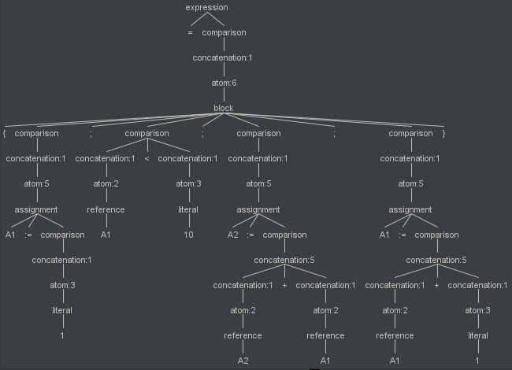
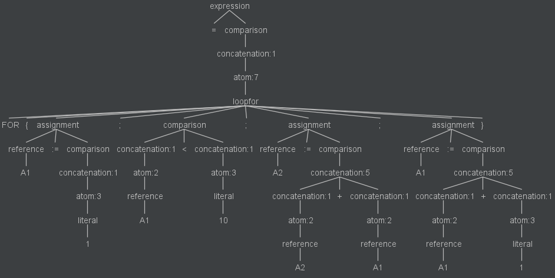
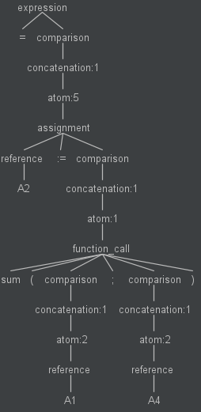
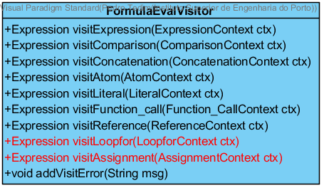
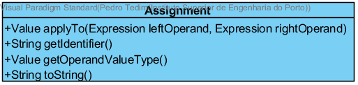
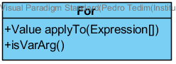
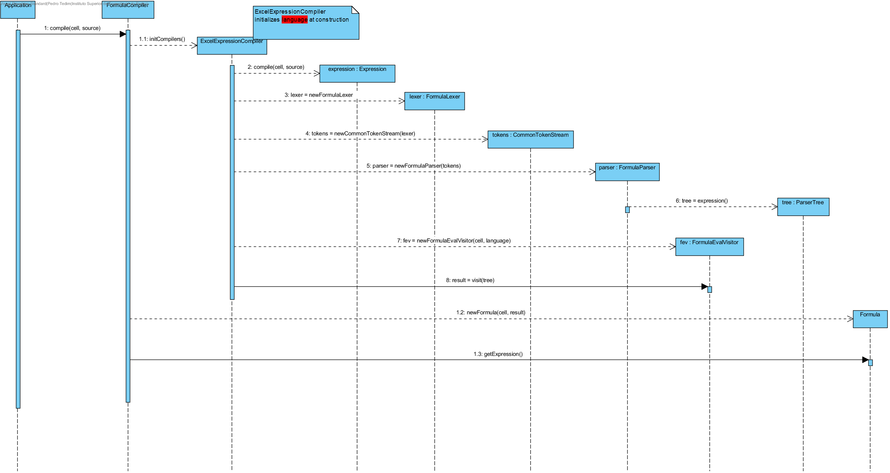

**Pedro Tedim** (s1091234) - Sprint 1 - Lang01.1
===============================

# 1. General Notes

*In this section you should register important notes regarding your work during the sprint. For instance, if you spend significant time helping a colleague or if you work in more than one feature increment.*

# 2. Requirements

Lang01.1 - Block of Instructions

Add the possibility of writing blocks (or sequences) of instructions. A block must be delimited by curly braces and its instructions must be separated by ";". The instructions of a block are executed sequentially and the block "result" is the result of the last statement of the block. For example, the formula "= {1+ 2; sum (A1:A10); B3 + 4 }" must result in the sequential execution of all expressions and the result is the value of the expression "B3 + 4". Add the assign operator (its symbol is ":="). This operator assigns to its left the result of the right expression. At the moment the left of the assign operator can only be a cell reference. The FOR loop should also be implemented based on instruction blocks. For example, the formula"= FOR {A1: = 1 ; A1<10; A2: = A2 + A1; A1: = A1 + 1 }" executes a for loop in which: the first expression is the initialization, the second term is the boundary condition, all other expressions are performed for each iteration of the loop.

Proposal:

**US1** - Update grammar Formula.g4 to include new rules and operators:

RULES:

* **assignment** (reference ASSIGN comparison)
* **block**
* **loopfor**
* **atom** (added loopfor, block and assignment)

OPERATORS:

* **FOR** ('FOR')
* **LCBRA** ('{')
* **RCBRA** ('}')
* **ASSIGN** (':=')

**US2** - Understand how the application works when inserting a new formula on the worksheet:
  * Is it supposed to generate visitor and listener code automatically?

# 3. Analysis
## 3.1 GRAMMAR ANALYSIS

1 - A block must be delimited by curly braces and its instructions must be separated by ";". The instructions of a block are executed sequentially and the block "result" is the result of the last statement of the block.

  * 1.1 - "= {1+ 2; sum (A1:A10); B3 + 4 }"

  

2 - The FOR loop should also be implemented based on instruction blocks. For example, the formula"= FOR {A1: = 1 ; A1<10; A2: = A2 + A1; A1: = A1 + 1 }" executes a for loop in which: the first expression is the initialization, the second term is the boundary condition, all other expressions are performed for each iteration of the loop.

  * 2.1 - "=FOR{A1:=1;A1<10;A2:=A2+A1;A1:=A1+1}"

  

3 - Add the assign operator (its symbol is ":="). This operator assigns to its left the result of the right expression. At the moment the left of the assign operator can only be a cell reference.

  * 3.1 - "=A2:=sum(A1;A4)"

  

## 3.2 Analysis Diagrams

1 - Interpreting the already existing Classes and application flow I realized that to  travel between ParserTree nodes new methods were needed to visit new grammar rule nodes in class ExpressionEvalVisitor.

**CD-FormulaEvalVisitor-** methods in red are the ones created to visitLoopFor node and visitAssignment node of the ParserTree.

2 - After creating the methods mentioned in point 1 of 3.2 section new Classes were needed to process the terminal nodes visited in the visitLoopFor(LoopForContext ctx) and visitAssignment(AssignmentContext ctx) visits.

**Assignment()**
Because an Assignment had binary characteristics (left and right operands), implementing the already existing BinaryOperator interface in Class Assignment was the solution I implemented.

Since Assignment implements BinaryOperator, it's class should have the following methods available:

**CD-Assignment-** Method applyTo(Expression leftOperand, Expression rightOperand), is one the two methods refered in point 2 that are responsible for the processing of  the terminalNodes at the end of the visit and to return the result of the Expression.

**For()**
For this specific class I realized that it's behaviour would be that of a function. Since the for cicle should visit more than one rule, an array of Expressions should be created in order to process the for cicle and its result.
Because the Fuction interface had an existing method to process the applyTo(Expressions[]arguments), the class For should implement said interface.

**CD-For-** Method applyTo(Expression[] arguments), is the one responsible for the processing of the BinaryOperators received in the arguments array. The binaryOperators for the expression **=FOR{A1:=1;A1<10;A2:=A2+A1;A1:=A1+1}** would be related to the following grammar rules:

  * arguments[0]-->Assignment
  * arguments[1]-->Comparison
  * arguments[2]-->Assignment
  * arguments[3]-->Assignment

# 4. Design

1 - Interpreting the application flow, in this section I will show some Sequence Diagrams to explain how a formula will be processed and interpreted in Java.

## 4.1. Tests

*In this section you should describe the design of the tests that, as much as possibe, cover the requirements of the sprint.*

Regarding tests we try to follow an approach inspired by test driven development. However it is not realistic to apply it for all the application (for instance for the UI part). Therefore we focus on the domain classes and also on the services provided by the server.

**Domain classes**

For the Domain classes we will have a class that represents the entity **WorkbookDescription**. This entity will have attributes that, for the moment, will be based on the class **WorkbookDescriptionDTO**:

	- name (string)
	- description (string)

**Test:** We should ensure that a WorkbookDescription can be created when all the attributes are set.  

	@Test(expected = IllegalArgumentException.class)
		public void ensureNullIsNotAllowed() {
		System.out.println("ensureNullIsNotAllowed");
		WorkbookDescription instance = new WorkbookDescription(null, null);
	}

**Services/Controllers**

For the services the application already has a service specified in the interface **WorkbooksService**:

	@RemoteServiceRelativePath("workbooksService")
	public interface WorkbooksService extends RemoteService {
		ArrayList<WorkbookDescriptionDTO> getWorkbooks();
	}

This method seems to be sufficient for supporting US1 but not US2.

For US2 we need a method that can be used to create a new WorkbookDescription given a WorkbookDescriptionDTO.

The proposal is:

	@RemoteServiceRelativePath("workbooksService")
	public interface WorkbooksService extends RemoteService {
		ArrayList<WorkbookDescriptionDTO> getWorkbooks();
		WorkbookDescriptionDTO addWorkbookDescription(WorkbookDescriptionDTO wdDto) throws DataException;
	}

Tests:  
- The tests on the controllers require the presence of a database.  
- We will use the database in memory (H2).  
- We will have a *controller* from adding new WorkbookDescriptions. This controller will be invoked by the GWT RPC service.
- We will have a *controller* from listing WorkbookDescriptions. This controller will be invoked by the GWT RPC service.

Controller **AddWorkbookDescriptionController**

**Test:** Verify the normal creation of an WorkbookDescription.  

	@Test
	public void testNormalBehaviour() throws Exception {
		System.out.println("testNormalBehaviour");
		final String name = "Workbook1";
		final String description = "Description for Workbook1";
		final WorkbookDescription expected = new WorkbookDescription(name, description);
		AddWorkbookDescriptionController ctrl = new AddWorkbookDescriptionController();
		WorkbookDescription result = ctrl.addWorkbookDescription(expected.toDTO());
		assertTrue("the added WorkbookDescription does not have the same data as input", expected.sameAs(result));
	}

Controller **ListWorkbookDescriptionController**

Note: We will be using the annotation @FixMethodOrder(MethodSorters.NAME_ASCENDING) to ensure the test methods are executed in order. This is useful since the memory database will have state changing between tests.

**Test:** At the beginning of the tests the memory database should be empty, so listWorkbookDiscriptions should return an empty set.

	   @Test
	   public void testAensureGetWorkbooksEmpty() {
		   System.out.println("testAensureGetWorkbooksEmpty");
		   ListWorkbookDescriptionController ctrl=new ListWorkbookDescriptionController();
		   Iterable<WorkbookDescription> wbs=ctrl.listWorkbookDescriptions();
		   assertTrue("the list of WorkbookDescriptions is not empty", !wbs.iterator().hasNext());
	   }

**Test:** If a WorkbookDescription is created it should be present in a following invocation of getWorkbooks().

		@Test
		public void testBtestDatabaseInsertion() throws Exception {
			System.out.println("testBtestDatabaseInsertion");
			final String name = "Workbook1";
			final String description = "Description for Workbook1";
			final WorkbookDescription expected = new WorkbookDescription(name, description);
			AddWorkbookDescriptionController ctrlAdd = new AddWorkbookDescriptionController();
			WorkbookDescription result = ctrlAdd.addWorkbookDescription(expected.toDTO());
			ListWorkbookDescriptionController ctrlList=new ListWorkbookDescriptionController();
			Iterable<WorkbookDescription> wbs=ctrlList.listWorkbookDescriptions();
			assertTrue("the added WorkbookDescription is not in the database", wbs.iterator().hasNext());
		}

**Test Coverage**  
- The actual coverage for domain classes: 61%
- The actual coverage for application(controller) classes: 100%

- TODO: Add more tests to increase the coverage of the domain class.

## 4.2. Design Patterns and Best Practices

*Present and explain how you applied design patterns and best practices.*

By memory we apply/use:  
- Singleton  
- Repository  
- DTO  
- MVP  

**TODO:** Exemplify the realization of these patterns using class diagrams and/or SD with roles marked as stereotypes.

# 5. Implementation

# 6. Integration/Demonstration

*In this section document your contribution and efforts to the integration of your work with the work of the other elements of the team and also your work regarding the demonstration (i.e., tests, updating of scripts, etc.)*

# 7. Final Remarks

*In this section present your views regarding alternatives, extra work and future work on the issue.*

Some Questions/Issues identified during the work in this feature increment:

1.

# 8. Work Log

*Insert here a log of you daily work. This is in essence the log of your daily work. It should reference your commits as much as possible.*

Commits:

[Started new example documentation for John Doe Core00.0.](https://bitbucket.org/lei-isep/nsheets/commits/7d9ae99772cce77627454021ea814867a8ef3223)

[Started UI code for Core00.0](https://bitbucket.org/lei-isep/nsheets/commits/88cd76f001939c0fd49ac124a258a3d6ee3dc087) This commit contains some experimental code for studying how the application works. Since it was done in a feature branch no harm to others.  

[Core00.0 Added Analysis SD](https://bitbucket.org/lei-isep/nsheets/commits/e98286e5dbaf11bdd363d0228008acd86f4155c1)

[Core00.0 - Added user stories](https://bitbucket.org/lei-isep/nsheets/commits/5238a88d01a46b4dd10e3d99c8977ac3950c4ea2)

[Core00.0 - Added analysis how GWT and the application work](https://bitbucket.org/lei-isep/nsheets/commits/cbd2bf4669e9b781657ad909aaa27a425c5cbdfd)

[Core00.0 - Analysis: explain GWTP and MVP](https://bitbucket.org/lei-isep/nsheets/commits/0c3e56339fbd7fc8a421770ce041dc29b2b1af40)

[Core00.0 - Analysis: Explain Server and the RPC mechanism](https://bitbucket.org/lei-isep/nsheets/commits/a11f952fd69f03d45cbb804bbad98f7feabfe30e)

[Core00.0 Worklog update](https://bitbucket.org/lei-isep/nsheets/commits/24c168ba5a7da770461fbebe566414ab98c90338)

[Core00.0 Analysis: update to the analysis sequence diagram with vision for integrating database/JPA.](https://bitbucket.org/lei-isep/nsheets/commits/30fbbeb02fa4a705eef213f30e0f7cd430550de9)

[Core00.0 - Analysis: Added Use Cases, Domain Model and more detailed "Analysis" Sequence Diagrams.](https://bitbucket.org/lei-isep/nsheets/commits/ec2e2a5ad8b9a7bf1cfa49cf5d464811e365f7b2)

[Updated some meta-descriptions in the example readme-md of Core00.0.](https://bitbucket.org/lei-isep/nsheets/commits/e2ad8d831bc730181e07af37651a814d245fe3e9)

[Core00.0: Analysis - Added system sequence diagrams / Design - SD moved to design section of documentation.](https://bitbucket.org/lei-isep/nsheets/commits/2e7873a1c56ab2c7844e19919fe13156edfcc332)

[Core00.0: Design/Tests- First draft for tests.](https://bitbucket.org/lei-isep/nsheets/commits/42411adda325fbab58c7d770ddc8fbe2b962d8aa)

[Core00.0 - Design/Tests: Added test for domain class WorkbookDescription.](https://bitbucket.org/lei-isep/nsheets/commits/fc5831bc452d4b69c0c9f568849e7aeddae329d1)

[Core00.0: Design/Implementation - Added design/implementation for list WorkbookDescriptions. Updated the documentation.](https://bitbucket.org/lei-isep/nsheets/commits/cd7ef6dec31a7b7b95b01b16f4cc82fd8c9b0d66)

[Core00.0 - Test/Design/Implementation: Added first draft for AddWorkbookDescription.](https://bitbucket.org/lei-isep/nsheets/commits/0fee8bbc971593596e23b5e4b5132f25f575e93e)

[Core00.0 - Tests/Design/Implementation: The server code is completed.](https://bitbucket.org/lei-isep/nsheets/commits/414db8752df3ba7af3233470408486de57afda11)

[Core00.0: Design - Updated SD for US add workbook description.](https://bitbucket.org/lei-isep/nsheets/commits/c5207e99c74b82209f46a123a93b9d0498efbe4e)

[Core00.0: Implementation - Added documentation about implementation of US2 (Add Workbook Description)](https://bitbucket.org/lei-isep/nsheets/commits/323b1199ba277f063502e6e7bc9b13ccb59a2147)

[Core00.0: Implementation - Added documentation.](https://bitbucket.org/lei-isep/nsheets/commits/48167bcfcc8c4bdd26f3352d16e41ca9eab072c1)

[Core00.0: Implementation: Updated Presenter implementation for add new workbook description.](https://bitbucket.org/lei-isep/nsheets/commits/7fb703f3718178e6ffde4a49d0b959064585f209)
