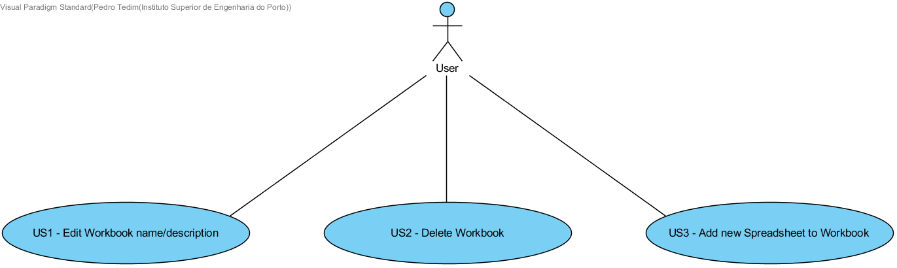
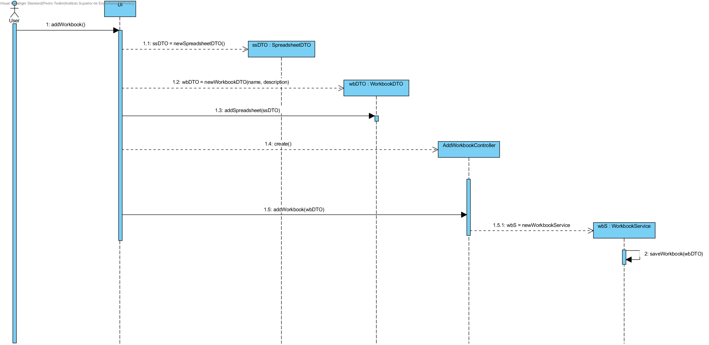
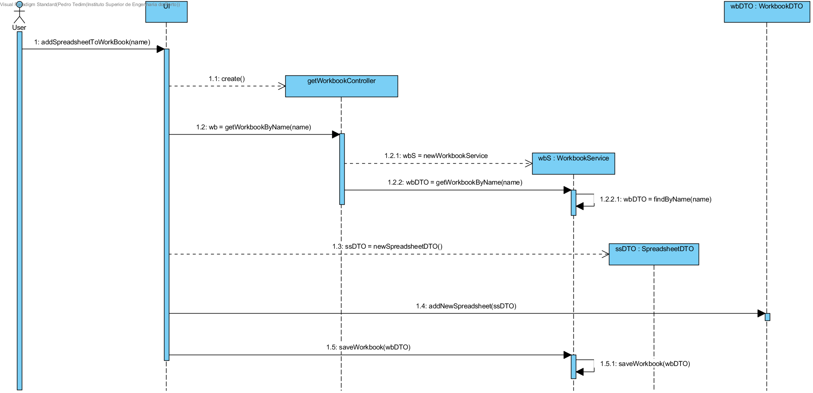
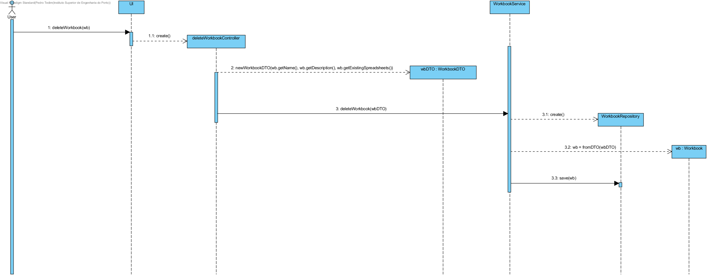

**Pedro Tedim** (s1091234) - Sprint 2 - Core01.2
===============================

# 1. General Notes

In this section I would like to state my opinion on the current structure of LAPR4 course. Two of our team mates are from Erasmus, which proved to be specially difficult to work with. This state of things only makes it harder for the hardworking students to be able to support so much responsibility and to be able to deliver well designed and implemented use cases.

# 2. Requirements

Core01.2 - Complete Workbook View

The application should now support complete workbooks, i.e., workbooks with several spreadsheets. It should be possible to make references between sheets in the formulas. It should also be possible to delete workbooks and update their metadata (name and description).

During interpretation of the use case, I was able to identify three different user stories as represented in the use case diagram above.

**US1** Edit Workbook name/description

**US2** Delete workbook

**US3** Add new Spreadsheet to Workbook

- This user story is supposed to answer to how one workbook now supports several spreadsheets.

# 3. Analysis
## 3.1 Project Structure

In this project there are 3 main modules to be mentioned:

* Client
* Shared
* Server

In this specific use case, these three modules will have the following responsibilities:

**Client**
Because we use a MVP approach, classes like WorkbookView and WorkbookPresenter, HomeView and HomePresenter should be available.

WorkbookView should have available a function to add a new spreadsheet or to select another one apart from the present one.

**Shared**
This module should wrap all the information produced by the user and send it to the server or to receive information from the server, wrap it, and present it to the user in the client module.

To be able to wrap the information mentioned above, in this module, there should be classes responsible for this action. I will apply a DTO pattern to answer to this problem.

DTO classes:

  * WorkbookDTO
  * WorkbookDescriptionDTO
  * SpreadsheetDTO

**Server**
This module should be responsible for transactions related with the database.

This module should be able to persist Workbooks, Spreadsheets and WorkbookDescriptions. To be able to do just that, entity classes like Workbook, WorkbookDescription and Spreadsheet should be available.

## 3.2 Analysis Diagrams

Because there were some mistakes in the implementation of the use case Core01.1 some modifications are in need to be implemented.

To understand how the flow of Core01.1 should be I design the following diagram:

The reconstruction of the project in terms of persistence proved to be difficult, a lot of classes implemented in sprint 1 had to be deleted or moved to another module.

# 4. Design

To add a spreadsheet to an existing workbook I created the following diagram:

The application should be able to find the workbook with the same name from the database, create a DTO related to that workbook with the information gathered from the database.
Then a new SpreadsheetDTO is created, added to the workbookDTO, persisted in the database and finally the updated workbookDTO will be saved in the DB.

To be able to persist spreadsheets of a workbook, the class SpreadsheetDTO should be implemented.

To delete an existing workbook I created the following Diagram:

error* The save(wb) method should be delete(wb)

## 4.1. Tests

## 4.2. Design Patterns and Best Practices

By memory we apply/use:  
- DTO
- Factory
- Repository
- MVP

# 5. Implementation

To understand how the project structure in terms of persistence should be implemented these jpa annotations should do the trick:

**WorkbookDescription**
This class should have the information of which Workbook it belongs with a relation of OneToOne, because one Workbook should only have one description.

    @Entity
    public class WorkbookDescription implements AggregateRoot<Long>, Serializable {

    // ORM primary key
    @Id
    @GeneratedValue
    private Long id;

    private String name;
    private String description;

    /**
     * The user email of the user that created this workbook, empty if public workbook
     */
    private String userMail;

    @OneToOne
    private Workbook workbook;

 **Workbook**
 This class should have the ability to store many Spreadsheets so a List of spreadsheets should be available. The annotation @OneToMany(targetEntity = SpreadsheetImpl.class) the target entity of the List is an object of SpreadsheetImpl.

    @Entity
    public class Workbook implements Iterable<Spreadsheet>, Serializable {

    @Id
    @GeneratedValue(strategy = GenerationType.AUTO)
    Long id;
    /**
     * The unique version identifier used for serialization
     */
    private static final long serialVersionUID = -6324252462576447242L;
    /**
     * The spreadsheets of which the workbook consists
     */
    @OneToMany(targetEntity = SpreadsheetImpl.class)
    private List<Spreadsheet> spreadsheets = new ArrayList<>();

    @ElementCollection
    private List<Macro> macros = new ArrayList<>();

**SpreadsheetImpl**
The spreadsheet should have the information of what Workbook it belongs. A relation of ManyToOne was implemented. To persist the cells, it's addresses and it's value. I created a OneToMany relationship with CellImp entity class. Because a spreadsheet consists in a n number of cells an ElementCollection should be implemented, this ElementColection should be compiled as a table that stores the cell addresses.

    @Entity
    public class SpreadsheetImpl implements Spreadsheet {

    @Id
    @GeneratedValue(strategy = GenerationType.AUTO)
    private Long id;

    /**
     * The unique version identifier used for serialization
     */
    private static final long serialVersionUID = 7010464744129096272L;

    /**
     * The workbook to which the spreadsheet belongs
     */
    @ManyToOne
    private Workbook workbook;

    /**
     * The cells that have been instantiated
     */
    @OneToMany(targetEntity = CellImpl.class)
    @ElementCollection
    @CollectionTable(name = "Cell_Adresses")
    @MapKeyColumn(name = "Column_Adresses")
    @Column(name = "Cell_Columns")
    private Map<Address, Cell> cells = new HashMap<Address, Cell>();

**CellImpl**
This class should have the information of which spreadsheet it belongs, because of this the annotation should be @VariableOneToOne to map to an interface, in this case Spreadsheet.

    @Entity
    public class CellImpl implements Cell, Serializable, IsSerializable {

    @Id
    @GeneratedValue(strategy = GenerationType.AUTO)
    /**
     * The unique version identifier used for serialization
     */
    private static final long serialVersionUID = 926673794084390673L;

    /**
     * The spreadsheet to which the cell belongs
     */
    @VariableOneToOne
    private Spreadsheet spreadsheet;

    /**
     * The address of the cell
     */
    @Embedded
    private Address address;

    /**
     * The value of the cell
     */
    @Embedded
    private Value value = new Value();

    /**
     * The cell's precedents
     */
    @ElementCollection
    private Set<Cell> precedents = new TreeSet<Cell>();

    /**
     * The cell's dependents
     */
    @ElementCollection
    private Set<Cell> dependents = new TreeSet<Cell>();

    @Id
    @GeneratedValue(strategy = GenerationType.AUTO)
    private Long id;   

**Address**
Because Address is dependent on the existence of a cell
the @Embeddable annotation over a class defines that, it does not have independent existence. The same goes for value.

    @Embeddable
    public class Address implements Comparable<Address>, Serializable {

**Value**
As described for Address

    @Embeddable
    public class Value implements Comparable<Value>, Serializable {

# 6. Integration/Demonstration

# 7. Final Remarks

This sprint was extremely difficult to complete, since the use case I was assigned with was dependent on the good execution on the previous one. To be able to partially implement Core01.2, I had to completely reconstruct our project structure an integrate it with the already completed use cases. With the help of my colleague Norberto, we were able to do so.

# 8. Work Log

Important Commits:

[Core01.2 - Start of Documentation](https://bitbucket.org/lei-isep/lapr4-18-2dl/commits/d2472487d8b649c81bbd5665b69b20195ce06a2f)

[Core01.1 - Project restructuring](https://bitbucket.org/lei-isep/lapr4-18-2dl/commits/c009c497f74a76675fcf4297fb71809c2dec42ca)This was an huge commit

[Core01.1 - Project pesistence.xml updated to accept new entity classes and entities](https://bitbucket.org/lei-isep/lapr4-18-2dl/commits/99299130eeddafce59028b3d6ea084ddaae97ddb)

[Core01.1 - Project pesistence.xml updated to accept new entity classes and entities](https://bitbucket.org/lei-isep/lapr4-18-2dl/commits/8baa2b1f3af7f80a4cb121e62bb112b39603c625)

[Core01.1 - Project pesistence.xml more updates](https://bitbucket.org/lei-isep/lapr4-18-2dl/commits/27d83711ac83d8251d7d22f9d590b65cb6bb2562)

[Core01.2 - Delete workbook implementation](https://bitbucket.org/lei-isep/lapr4-18-2dl/commits/708a73da9b4c9185cd8feae2770d00b8ccb7271b)

[Core01.2 - Rename and adding spreadsheet to workbook implementation](https://bitbucket.org/lei-isep/lapr4-18-2dl/commits/98e8ae16ba7e378f875259cd5a8a0ff8cafc1aa7)
