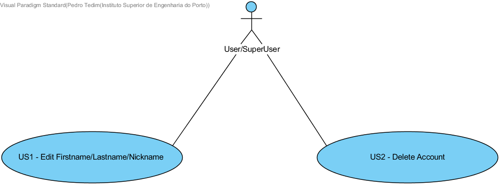
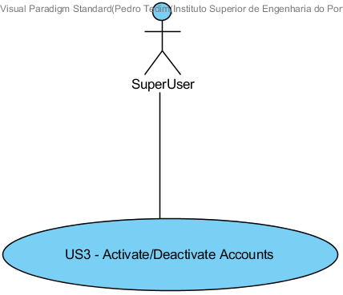
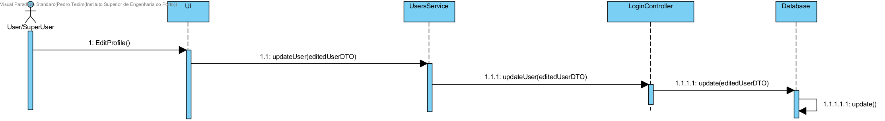
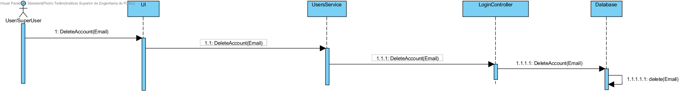
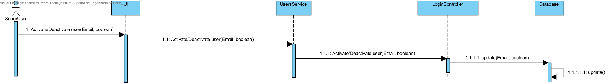

**Pedro Tedim** (s1091234) - Sprint 3 - IPC01.3
===============================

# 1. General Notes

With the help of my team mates I was able to almost implement 100% of this UC.

# 2. Requirements

IPC01.3 - Security Profile

The application should now have a new "Profile" page to allow users to manage their accounts. The user should be able to change his information (name, nickname and photo) and also delete the account. The super-user should be able to access all the accounts and be able to enable/disable accounts. When an account is disable its user is not able to authenticate.

During interpretation of the use case, I was able to identify two different user stories as represented in the use case diagram above for both the user and the superUser.

**US1** Edit Firstname/Lastname/Nickname

**US2** Delete Account

I was also able to identify one user story for the SuperUser.

**US3** Activate/Deactivate Accounts

# 3. Analysis
## 3.1 Project Structure

I should be able to user classes like User, UserDTO and all it's attributes. Analysing the current state of the application I was able to identify that the LoginController Class made By Paulo of team Green, already has methods that I would have to use for this UC.

These methods are responsible for returning one user by it's email. Based on this method I was able to create methods like updateUser(UserDTO), deleteUser(Email), and getUsers().

getUsers() wil be used to list all users to the admin so he can be able to activate and deactivate account according to it's information of activation persisted in the database.

## 3.2 Analysis Diagrams

For a user to edit it's information (Firstname, Lastname, Nickname) I created the following SD:

For a user to to delete it's account I created the following SD:

For a superUser to be able to activate/deactivate an account I created the following diagram:

# 4. Design

For a user to edit it's information (Firstname, Lastname, Nickname) I created the following SSD:

For a user to to delete it's account I created the following SSD:

For a superUser to be able to activate/deactivate an account I created the following SSD:

## 4.1. Tests

## 4.2. Design Patterns and Best Practices

# 5. Implementation

# 6. Integration/Demonstration

# 7. Final Remarks

This sprint was relatively easy to do. I had some difficulties because I was not familiar with the GWT material framework and was hard to format a good looking UI

# 8. Work Log

Important Commits:
