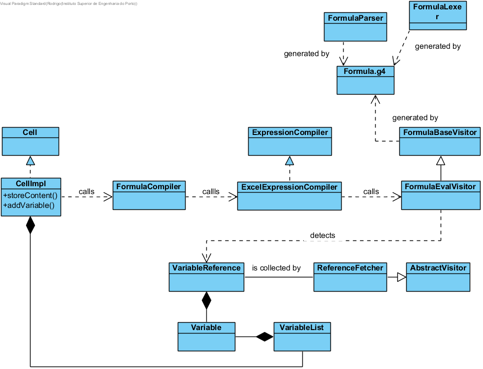
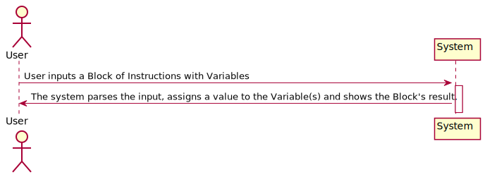
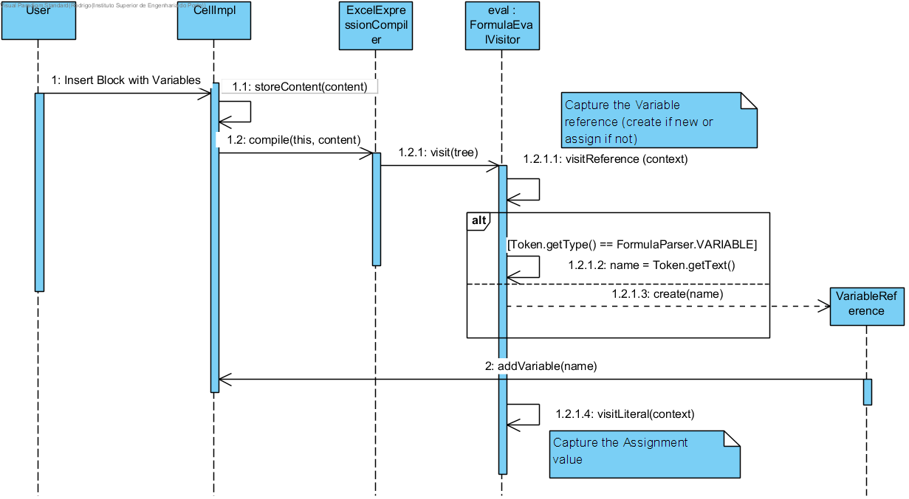

**Rodrigo Soares** (s1140420) - Sprint 1 - Lang02.1
===============================

# 1. General Notes

The first 2 days (Tuesday and Wednesday) were dedicated to making sure everyone on Team BLUE was properly setup (sucks to be the Scrum Master :P). Barbara and Pietro in particular required a bit of extra care since they are not familiar with Java development at all - installing and configuring the IDE, giving them some pointers on Java, and promoting their integration into the group, as they were a bit left out during the skills module of LAPR4.

TL;DR: No time for myself until Friday.

Started exploring the app on Friday, stumbling around like a drunken sailor.

# 2. Requirements

Lang02.1 - Temporary Variables should be recognized within the scope of an input formula.

Quoting the Product Owner:
"Add support for temporary variables. The name of temporary variables must start with the "\_" sign. When a variable is referred in a formula for the first time, it is created. To set the value of a variable it must be used on the left of the assign operator (":="). Temporary variables are variables that only exist in the context of the execution of a formula. Therefore, it is possible for several formulas to use temporary variables with the same name and they will be different instances. Example: "= {\_Counter:=1; WhileDo(Eval( "A"&\_Counter)> 0; {C1:=C1+Eval("B"&\_Counter); \_Counter:=\_Counter+1 }) }” . In this example, the cell C1 will get the sum of all the values of column B in that the corresponding values in column A are greater than zero."

Instead of the previous example, which uses artefacts that will supposedly only be implemented in Sprints 2 or 3 (like "WhileDo" and "Eval", Lang01.3), let's use a simpler one:

  *"= {\_Counter:=1; \_Counter:=\_Counter+1 }*

If that block goes into a Cell, and in conjunction with the specs for Lang01.1, the result must be "2" because a "Counter" variable is set to "1" and then incremented by "1".

This behavior therefore seems to be a very basic acceptance criteria. Note, however, that the requirements state VARIABLES (plural), which means a given Formula can include declarations for multiple ones.

Also, semantically speaking a Variable can be of any of the pre-defined "NUMERIC", "LITERAL" or "DATE" types. I must confess, however, that I will be looking at it as a "NUMERIC" type, as that seems to be the more realistic goal given my limited grasp of LPROG. In other words, I will try to ensure proper behavior as a "NUMERIC" and functional tests will assume as much, and if enough time remains I will try to make it work as "LITERAL" and/or "DATE"

Dependencies:

Lang01.1 is a critical dependency, because if NSheets is not capable of processing Blocks of Instructions as a Formula, then there is really no User-side way to check if the Variables are actually storing their value.

US - As a User of the Application I want to be able to use Variables in my Blocks of Instructions

# 3. Analysis

Things that concern this Sprint:

- Understand how a Cell content is passed from the Client side over to the Core part of the app. This is already being done, so I just need to make sure I know where to capture the input String (I'm guessing it's a String) and then use parse it accordingly

Things that do NOT concern this Sprint:

- Understand how GWT works. The app is already capable of accepting input values and passing them to the Core section, so I probably won't have to dabble in the UI itself (based on GWT).  

- Understand how persistence is done. "Temporary Variables", as stated, only exist in the scope of a Formula, so they will not need to be Saved with the Workbook, which means I should ignore database/persistence concerns (Lang02.2 and/or Lang02.3 might have to, though)

## 3.1 Which classes/packages am I gonna interact with (mainly)?

I've determined that I am probably going to spend my time in the "shared" Module of NSheets - that's where the "core", "formula" and "lang" packages are, after all.

After some mind-numbing debugging, here's the notes I came up with:

- "pt.isep.nsheets.shared.core.CellImpl.storeContent()" is triggered whenever I press "ENTER" after typing something in a Cell. More importantly, the "Content" parameter IS the String to be parsed, which confirms my suspicion that the UI part is done.
- Still on "storeContent()":

private void storeContent(String content) throws FormulaCompilationException {
		// Parses formula
		Formula formula = null;
		if (content.length() > 1)
			formula = FormulaCompiler.getInstance().compile(this, content);

		// Stores content and formula
		this.content = content;
		this.formula = formula;
		updateDependencies();
	}

It starts by creating a "null" Formula and THEN, by calling "FormulaCompiler.getInstance().compile(this, content);". Judging by the already existing comment of "//Parses formula", this is the stuff right here. I'm going to have to go into the "compile()" method, because that's all it takes for Formula to have all its attributes properly set.

-Analysing the "compile()" method, it seems like it goes through a list of "compilers" that might be able to parse the formula if it makes sense to them. The only one added to that list is an "ExcelExpressionCompiler" (careful with that trademark), so let's dig into that.

- Digging into "ExcelExpressionCompiler", I see that it's already taking care of defining and instantiating a basic Excel language.

## 3.2 Grammar and Language  

- Managed to find the Grammar "formula" for this "Excel Language" in "Other Sources", specifically "pt.isep.nsheets.shared.core.formula.compiler". Several definitions for "expression", "assignment", "comparison", but nothing for variables. I'll have to add rules for them here.

- Almost everything in this Grammar has a 1-to-1 match with "core" Java classes, so I'm probably gonna have to create one for "Variable", and maybe one for "VariableList" to ensure cases where someone inputs more than 1 Variable (I could do it as "List<Variable>", but I presume this will be crucial for further Sprints, so promoting it to Class)

- With Pedro Tedim's help (1091234), I've been able to see in IntelliJ ANTLR plugin (I use NetBeans, FML) that ANTLR only recognizes a Variable IF it is made part of the "REFERENCE" rule in the Grammar. We thought it could be an Atom, but not so. It makes sense, given that a VARIABLE should behave just like a CELL_REF (e.g. "A1" or "B2"): they're both references.

- There is indeed a "CellReference" class in "pt.isep.nsheets.shared.core.formula.lang", which implements "Reference". I'm probably gonna have to create a "VariableReference" in similar manner.

- Here are the proposed changes to "Formula.g4":

reference
	:	CELL_REF
		( ( COLON ) CELL_REF )?
                | VARIABLE
	;

  VARIABLE
          : UND LETTER ( NUMBER | LETTER) *
          ;

UND             : '\_';

## 3.3 Server and RPC

. No changes here, this only affects the "core" in "NShared"

## 3.4 Analysis Diagrams

The main idea for the "workflow" of this feature increment.

**Use Cases**

- **Use Cases**. There is only one Use-Case, and that is typing in a Formula with Variables

**Domain Model (for this feature increment)**

**System Sequence Diagrams**

# 4. Design

. "CellImpl" reaches the "ExcelExpressionCompiler" after going through the more general "FormulaCompiler". This class goes through all available compilers ("Excel" being the only one available by default, additional ones will need to be added for the JavaScript and VisualBasic "inspired" languages).

. I have opted to create a new method "visitVariableReference()".

. Created "VariableReference", which is to "Variable" the same as "CellReference" is to "Cell": a kind-of "pointer" that includes a "Variable" in it.

. Altered "CellImpl.storeContent()" to copy Variable data to the FormulaCompiler

## 4.1. Tests

I have used the built-in "Console.java" class in "NShared" to test functionality as I developed it.

The lack of unit-testing is the biggest flaw of my work this week and the one I am the least proud of, because my less-than-standard aptitude at LPROG means I am not really sure how to test my methods (took me a LONG time to even discern what the logical flow would be)

## 4.4. Design Patterns and Best Practices

In my opinion, the application has a potential Design issue:

public class Formula{

    //The Cell this Formula belongs to
    private Cell cell;

}

public class Cell{

    //The Formula in this Cell
    private Formula formula;

}

This reflexive association does not seem like a good practice, as most associations should be single-way whenever possible. However, I am not Mr. Einar Pehrson, so I can't imagine the issues he faced 13 years ago when building this from scratch, and this might be the best solution.
It amuses me to no end, however, to write "Cell.getFormula().getCell().getFormula().getCell()(...)" until the heat death of the Universe.

One Design flaw that I DO know is a bad practice that was introduced by me is the use of side-effects in "CellImpl.storeContent()":

private void storeContent(String content) throws FormulaCompilationException {
		// Parses formula
		Formula formula = null;

		if (content.length() > 1)
			formula = FormulaCompiler.getInstance().compile(this, content);
}

When the "compile()" method executes, it internally sets the "VariableList" in "this" Cell, and I wish I found a way to make that more transparent. The problem is that as you dig deeper into the call-stack, most methods keep a hold of that "Cell" reference, so that is the best place to store variables.

Other than the obivous "Visitor" pattern, I cannot think of any specific Patterns I might have used - no DTO for UI/UX, no Repository for persistence.

# 5. Implementation

**Code Organization**  

As stated previously, all development was done only on the "NShared" module - User Input and Persistence are not my concerns for this Sprint, so no need to deal with Client or Server.

I followed the recommended organization for packages:  
- Code should be added (when possible) inside packages that identify the group, sprint, functional area and author;
- I used **pt.isep.nsheets.shared.core.formula.lapr4.blue.s1.lang.n1140420.tempVariables** for NEW classes, and left a comment with my student number "1140420" in other classes I have made modifications to.

Here are the NEW classes:
. Variable;
. VariableReference - container for "Variable", works similarly to "CellReference";
. VariableList - contains a HashMap that maps a Variable's "name" to the actual "Variable", so you can know if a Variable already exists or not;

Here is a brief summary of changed classes:

. AbstractVisitor - created "visitVariableReference()";
. FormulaEvalVisitor.visitReference() - condition to detect "VARIABLE" tokens included;
. ExpressionVisitor - created "visitVariableReference()"";
. ExpressionBuilder - implements "visitVariableReference()";
. CellImpl.storeContent()
. CellImpl.addVariable() - adds a Variable if new, BUT returns it without adding if not.
. Formula - added a field of "VariableList"

# 6. Integration/Demonstration

*In this section document your contribution and efforts to the integration of your work with the work of the other elements of the team and also your work regarding the demonstration (i.e., tests, updating of scripts, etc.)*

# 7. Final Remarks and Tips for the next guy

. Big shoutout to Pedro Tedim (1091234) for helping me out with the Grammar. I came up with my rules, but having his input was a big confidence booster.

. I am positive the Grammar "Formula.g4" is correct, but an alternative I would explore would be to create a new rule for "variablereference" instead of including "VARIABLE" in "reference".

. "pt.isep.nsheets.shared.core.formula.util.ReferenceFetcher" is a class I looked at pretty late in development. I don't think there's anything to change there, but trying out an implementation of the "visitVariableReference()" method here would be my next course of action.

# 8. Work Log

I never drank an ounce of alcohol in my life, but I must have been drunk when I mentioned "[Lang03.1]" in my commits INSTEAD OF "[Lang02.1]".

I also forgot, up until the last 24h or so, to include "[fixing issue #52]" to link them to my Bitbucket Issue. A mistake that I will not be making for Sprint 2...

Important Commits:

[Updated UC distribution for Team BLUE and created default "sp1" folders and markdown files for my team Lang02.1.](https://bitbucket.org/lei-isep/lapr4-18-2dl/commits/d504dffbca27ea4db63fefb89c1243d5da39735b)

[Wrote Requirements and Analysis Lang02.1](https://bitbucket.org/lei-isep/lapr4-18-2dl/commits/b039d15a5a03c8556949bc6ff30a8d03788af3fd)

[Lang02.1 SSD](https://bitbucket.org/lei-isep/lapr4-18-2dl/commits/7d1385db958d5c294d401374297dc787f171ff55)

[Lang02.1 Introducing Variable](https://bitbucket.org/lei-isep/lapr4-18-2dl/commits/1803d0d0c1cf554a3bed2f2ee5b5fa90b7c4e6af)

[Lang02.1 - Created Variable and VariableList](https://bitbucket.org/lei-isep/lapr4-18-2dl/commits/371695642805c1349f365c088325416fec1e94cd)

[Lang02.1 - Some further insight into CellReference allows me to conclude "VariableReference" will be necessary](https://bitbucket.org/lei-isep/lapr4-18-2dl/commits/8fe729d63868259c089f6e3d2c7eff2a62c683f6)

[Lang02.1 - Added VariableList to Formula ](https://bitbucket.org/lei-isep/lapr4-18-2dl/commits/b3e1dcfef05625af98a0ff5529e5d8fa2118e041)

[Lang02.1 - Added VariableReference, which will behave similarly as a CellReference](https://bitbucket.org/lei-isep/lapr4-18-2dl/commits/ab661ec45fd478dc63b2187d8abfb27c5f34e7ed)

[Lang02.1 - Added "visitVariableReference()" to Visitor classes. I was thinking of using the existing "visitReference()", but it seems to me like it's best to split this](https://bitbucket.org/lei-isep/lapr4-18-2dl/commits/238957cc7ab43510b1aab6ee7714152346cd5d82)

[Lang02.1 - Changed VariableReference to Expression, to avoid implementing some methods that seem unnecessary for now. Also want to avoid the "visits" to use those methods (like "getCells()") because if they do, they'd throw exceptions](https://bitbucket.org/lei-isep/lapr4-18-2dl/commits/ae1d1a03a75235cbcd44aea8669bd12c8486bedc)

[Lang02.1 - Changed Assignment operator class. Pedro Tedim suspects an "instance of" is necessary to recognize a "VariableReference". The man is clearly more comfortable with this grammar mumbo-jumbo than I am. Plus, his Lang01.1 UC seems to be working.](https://bitbucket.org/lei-isep/lapr4-18-2dl/commits/8f0cabad541517a47ae55011b7d1a642033ede08)

[Lang02.1 - Editing FormulaEvalVisitor, "visitReference()". I've put "VARIABLE" in the "reference" rule in the Grammar, and this class seems to have "visits" for every single rule, so this is my best shot. Using the "Token" bullshit that I found in the "visitLiteral()" method](https://bitbucket.org/lei-isep/lapr4-18-2dl/commits/c820ce9aad519ee86116b130d58e53b0356440e5)

[Lang02.1 - Reworked VariableReference to have a Cell instead of a Formula: the processing steps have several references to "Cell", so it's basically saving VariableReferences in Cell 1st, and only AFTER the "compile()" method is done is it possible to assign Variables to a Formula](https://bitbucket.org/lei-isep/lapr4-18-2dl/commits/f7deab7db4fd65b6651fe62f1e6b731112658507)

[Lang02.1 - Reworked README.md, SSD, SD and CD to better reflect my work](https://bitbucket.org/lei-isep/lapr4-18-2dl/commits/2536ea335f40ebb29aca837ad0663e5cdf7d2657)
