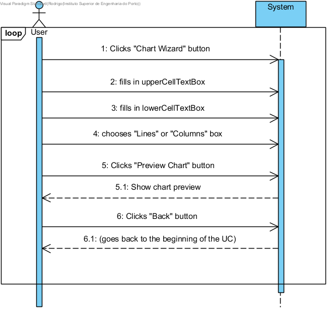
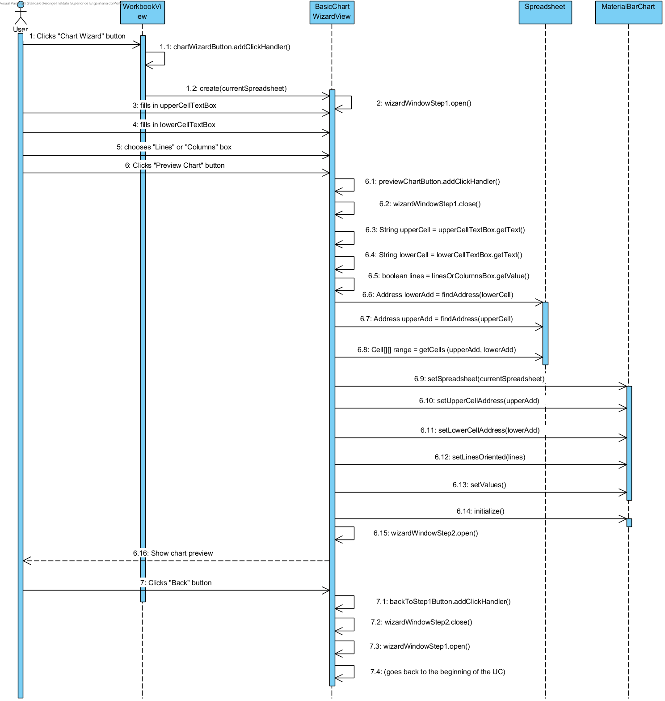

**Rodrigo Soares** (s1140420) - Sprint 2 - Core04.1
===============================

# 1. General Notes

Pedro Tedim and Norberto Sousa detected the need to rework some core classes (mostly related to Workbooks)

# 2. Requirements

Core04.1 - Basic Chart Wizard

Quoting the Product Owner:
	"The application should have a new menu option to launch a wizard to help the user create a bar chart. The wizard should have 2 steps. In the first step, the user should input the name of the chart and the range of cells that contains the data for the plot of the chart. The user should also select if the data is in the rows or columns of the range and if the first row or the first column are to be considered labels. In the second step the wizard should display a preview of the chart. The wizard should allow the user to move between steps 1 and 2. If the wizard is confirmed the cell in the left upper corner of the range should have a mark (e.g., icon) that indicates that the cell has a chart associated with it. A popup menu option in the cell should provide access to the chart.""

## 2.1 What does the Client want, exactly?

 After a quick 5 minute exchange with the Client on 07-06-2018, I showed him the following demos in Excel:

 

 

 He said they were "pretty cool", so they will serve as a common ground for the end goal.

Dependencies:

The major dependency will be detecting the current Workbook and its Spreadsheet.

User Story - As a User of the Application I want to be able to generate bar charts based on a range of Cells, to get a visual representation of data

# 3. Analysis

## 3.0 Is there anything online to make my life easier?

 No sense in reinventing the wheel when I'm way out of my depth, and I'm betting someone already had a crack at this. Lurking online, I came across some WONDERFUL examples of bar charts implementations, with source code included:

  http://gwt-charts.appspot.com/#bar

	https://github.com/GwtMaterialDesign/gwt-material-demo/blob/master/src/main/java/gwt/material/design/demo/client/ui/charts/MaterialBarChart.ui.xml

	https://github.com/GwtMaterialDesign/gwt-material-demo/blob/master/src/main/java/gwt/material/design/demo/client/ui/charts/MaterialBarChart.java

All I need is to download "GWT Charts 0.9.10", an unofficial API for all kinds of charts. It's on Maven, here:
	https://mvnrepository.com/artifact/com.googlecode.gwt-charts/gwt-charts/0.9.10

Just have to alter the POM.xml to include this Dependency:

<!-- https://mvnrepository.com/artifact/com.googlecode.gwt-charts/gwt-charts -->
<dependency>
    <groupId>com.googlecode.gwt-charts</groupId>
    <artifactId>gwt-charts</artifactId>
    <version>0.9.10</version>
</dependency>

## 3.1 Which classes/packages am I gonna interact with (mainly)?

 Going to create a new package for my stuff: "pt.isep.nsheets.client.lapr4.blue.s2.s1140420.basicChartWizard"

## 3.1.0. Is there anything from previous Sprints I can reuse?

- Hugo Carvalho did some interesting work in Sprint 1 in "Core03.1 - Sort Cells" related to selecting a range of Cells. As stated in his docs, "shared.core.SpreadsheetImpl" contains the methods "findReference()" (which finds a Cell's Address), so I'll use that. He also did some widgets to allow the user to select a range of cells, so I'll base mine on that too.

## 3.1.1. Shared

- "MaterialBarChart" should have been created here, but due to time constraints it stayed in the "Client" module, while I was still figuring out this whole "GWT" thing.

## 3.1.2 Client

- Majority of the work will be developed here, in terms of creating a new Window to act as the Wizard.

## 3.1.3 Server and RPC

. No changes here, I am not going to concern myself with persistence for now.

## 3.4 Analysis Diagrams

The main idea for the "workflow" of this feature increment.

**Use Cases**

- **Use Cases**. There is only one Use-Case, and that is generating a chart

**Domain Model (for this feature increment)**

The major change for the domain model is "MaterialBarChart".

**System Sequence Diagrams**

# 4. Design

To simulate a "wizard" like interaction, 2 MaterialWindows have been declared in the "BasicChartWizardView.ui.xml", one for each step of the Wizard: "wizardWindowStep1" and "wizardWindowStep2". The mentioned XML dictates which UI fields each Window contains.

It is possible to go back and forth between these windows, but the biggest flaw in my Design is that these Windows "persist" in the View when moving between them, which causes side-effects of them not "refreshing" each time they are re-opened (e.g. Chart Previews will stack up in Step 2)

## 4.1. Design Patterns and Best Practices

Patterns I SHOULD have used but did not:

 . MVP - all of the new code for this UC is contained almost exclusively in a View (BasicChartWizardView) instead of the logic being mostly delegated to a Presenter, and the View just having simple declarations.

# 5. Implementation

**Code Organization**  

As stated previously, all development was done only on the "NShared" module - User Input and Persistence are not my concerns for this Sprint, so no need to deal with Client or Server.

I followed the recommended organization for packages:  
- Code should be added (when possible) inside packages that identify the group, sprint, functional area and author;
- I used **pt.isep.nsheets.client.lapr4.blue.s2.s1140420.basicChartWizard** for NEW classes, and left a comment with my student number "1140420" in other classes I have made modifications to.

Here are the NEW classes:
. BasicChartWizardView - the View for this UC. Contains 2 MaterialWindows, for the 2 steps described in the Requirements. Includes the accompanying XML file, where all the UI element declarations are present
. MaterialBarChart - Chart behaviour. Right now present only in the Client side, as I did not have time to contemplate persistence.

Here is a brief summary of changed classes:

. WorkbookView (and accompanying XML) - integrated "BasicChartWizardView" into them by use of the MaterialButton "chartWizardButton";

## 5.1 testing

### MaterialBarChart

Here are proposed tests that should be implemented for my specific methods in that class (ones that I did not reuse from the GWT Tutorials). Unfortunately I am not able to run them successfully because creating a Cell means using GWT transpiler from somewhere other than Client code, which throws an exception. If I follow a suggestion so that the Test class extends "GWTTestCase", it's obviously not picked up by JUnit, "No tests found".

@Test
	public void transpose()  throws FormulaCompilationException {
			Cell[][] cellMatrix = new Cell[5][4];

			for (int i = 0; i < cellMatrix.length; i++){
					for (int j = 0; j < cellMatrix[0].length; i++){
							cellMatrix[i][j] = new CellImpl(null, null, "i+j");
					}
			}

			Cell expected[][] = new Cell[4][5];
			for (int i = 0; i < cellMatrix.length; i++){
					for (int j = 0; j < cellMatrix[0].length; i++){
							expected[j][i] = new CellImpl(null, null, "i+j");
					}
			}

			Cell result[][] = MaterialBarChart.transpose (cellMatrix);

			for (int i = 0; i < result.length; i++) {
					for (int j = 0; j < result[0].length; j++) {
							org.junit.Assert.assertTrue(result[i][j].getContent().equals(expected[i][j]));
					}
			}

	}

	@Test
	public void cellsToValueMatrix() throws IllegalValueTypeException, FormulaCompilationException {
			Cell[][] cellMatrix = new Cell[5][4];

			for (int i = 0; i < cellMatrix.length; i++){
					for (int j = 0; j < cellMatrix[0].length; i++){
							cellMatrix[i][j] = new CellImpl(null, null, "i+j");
					}
			}

			int expected[][] = new int[5][4];
			for (int i = 0; i < expected.length; i++){
					for (int j = 0; j < expected[0].length; i++){
							expected[i][j] = i+j;
					}
			}

			int result[][] = MaterialBarChart.cellsToValueMatrix (cellMatrix);

			org.junit.Assert.assertTrue(result.equals(expected));
	}

## 5.2 Known issues and bugs

- I cannot capture labels or identifiers for the Columns yet, only generate predefined ones;

- Row/column transposition fails to generate a chart. "MaterialBarChart.transpose()" is most likely the root cause;

- Charts are not associated or stored with a given Cell, only a visual artifact for now. Consider moving "MaterialBarChart" to the "shared" module to be able to create an instance of it inside a "CellImpl";

- Charts only work for square ranges (i.e. 3x3, 4x4). I suspect the issue lies with "MaterialBarChart.setValues()", which calls "spreadsheet.getCellRangeMatrix(upperCellAddress, lowerCellAddress);" I should have tested this method.

- There is a hard limit of "3" rows/columns for the chart, and I don't know why. I have double-checked for any hard-coded limits in "MaterialBarChart", nothing. If this limit is surpassed, no chart is visible. It has nothing to do with window size because the charts are sized according to the available space;

- Going back and forth in the wizard does NOT delete existing charts: they keep being accumulating on the page, so either the Design needs to change, OR find out how to "erase" previously drawn charts.

# 6. Integration/Demonstration

*In this section document your contribution and efforts to the integration of your work with the work of the other elements of the team and also your work regarding the demonstration (i.e., tests, updating of scripts, etc.)*

# 7. Final Remarks and Tips for the next guy

. Find a way to test the transposition. It's something so simple, but I should have tested earlier to figure out a way. Test the algorithm
