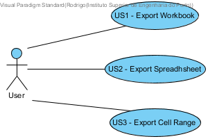

**Rodrigo Soares** (1140420) - Sprint 3 - IPC03.1
===============================

# 1. General Notes

Filipe from Team RED was responsible for this UC in the previous Sprint. He was friendly and honest briefing me and was fine with me starting this UC from scratch.

Marco Carneiro (also Team RED), who had done the CLS export, took the time to brief me on how he did it - although I must confess I didn't understand any of it, through no faul of his own.

In this sprint, it took me a very serious amount of time to get familiar with client-server communication in GWT. I literally had to stay up one night banging my head against the wall trying to understand what a "Servlet" and "Service" are, how they're related, how to map them properly in the "Web.xml" files, etc.

**Teamwork**

 Since myself, Barbara and Daniel had 3 very similar Use Cases (Export PDF/XML/CSV, respectively), we decided on Day 1 to pool our resources together. Although everybody did a bit of Design, Backend and Frontend, here's the highlights of our collaborative workflow:

  - I figured out the GWT Client-Server communication and explained it to Daniel and Barbara. From there it was relatively simple for them to develop their own implementations based on mine;
  - Daniel worked on the UI and how to capture current Workbook or select a specific Spreadsheet. Barbara and I adapted his UI almost verbatim
  - Barbara worked on mapping the implementation to correct and insightful Design diagrams

 Here are our main limitations:

  - Rodrigo (myself): missed 2nd half of RCOMP, no understanding of Client-Server communication. Also the Scrum Master, so considerable time dedicated to helping out other team members;
  - Daniel: difficulties understanding Client-Server communication as well;
  - Barbara (Erasmus): no prior experience with Java, was not enrolled in any of the other subjects like LPROG, RCOMP, SCOMP, EAPLI, so in a massive disadvantage compared to other students.

 I can confidently say that if these 3 average students had not worked together, each would have most likely NOT have produced a functional UC. Instead, even though all 3 UCs need improving, we are proud of our work and confident that given extra time that would be a possiblity.

# 2. Requirements

 It should be possible to export to PDF an entire workbook, a spreadsheet or a range of cells. The contents should include only the values of the cells (and not its formulas, for instance). The user should be able to select the content to be exported and also if the document should have a table of contents with links to the sections or not. If select, sections/chapters should be generated for each spreadsheet of the workbook. The generated PDF should be downloaded to the user local file system.

 

 During interpretation of the use case, I was able to identify three different user stories as represented in the use case diagram above.

 **US1** Export Workbook

 **US2** Export Spreadhsheet

 **US3** Export Cell range

Here are the Requirements that have NOT been met due to time-constraints (including my Scrum Master responsibilities):

 - Export Values of Cells. The demo purposefully includes an example of a Cell with "=14+7" which is exported verbatim. This should be converted to "21" instead, but that would imply further modifications to the "Spreadsheet" class to generate a DTO with only Values, which was a bit outside the scope of this specific UC (and I didn't have time to do this extra)

# 3. Analysis

As it can be seen on the diagram as well, the core of this task were the following modules and its details:

## 3.1 Analysis Diagrams

**Domain Model**

**Sequence Diagram (encapsulating all User Stories)**

##Client module

	ExportPDFView class, in pt.isep.nsheets.client.lapr4.blue.s3.s1140420ExportToPDF

	- btnExport() method

	On the Client side, there is this specific view, called ExportPDFView, which is a window that has the users interactions. It has a button called btnExport(), and once it was clicked by the user, it starts the whole process itself.

	The button uses the exportToDownload() method in DownloadToPDFServiceAsync interface, and the Server will actually implement it in the Shared module as well, in the DownloadToPDFService.

	Both the Server and Client knows that the communication service exist (DownloadToPDFServiceAsync); Those two interfaces were being defined in Shared module.

 **IMPORTANT**: make sure to check out the Service-Servlet mapping in the Client's "web.xml" file at **nsheets/src/main/webapp/WEB-INF/web.xml**, annotated with my student number, "1140420"

##Shared module

	DownloadToPDFServiceAsync interface

	- exportToDownload() - this method is being used by the Client side, once the request was sent

	DownloadToPDFService

	- exportToDownload() - this method is being used by the Server when the request was sent from the Client side

##Server module

	DownloadPDFImpl class

	- doGet(HttpServletRequest request, HttpServletResponse, response)

	When the client sends a request to the server, and it gets a response as well. Once the Server gets the request from the Client side, this doGet method will automatically execute. This is basically an HTTP protocol, that all servers needs to do.

	- generatePDFFromWorkbook(WorkbookDTO workbookDTO, String fileMame)

	This method generates the PDF file, and it will generate it Server side.
	It is important to mention that this method uses Data Transfer Object (DTO), which is a trimmed down version of an entity (so this is the trimmed down version of the Workbook class, in our case, that only has the spreadsheets).

	- sendPDFfile(HttpServletResponse response, String fileName)

 	This method basically opens up the file that already exists on the server, and converts it to array of bytes. Once I have an array of bytes, I just create an OutputStream, and write them. When this thing executes, the client already has the file on their end.

	- exportToDownload(WorkbookDTO toExport)

	This method is familiar to each side (to the Server and to the Client also). Here, it is being captured what the client sent through. It is going to be saved in a local field. Whenever the exportToDownload is called, this field has to be set in order to define the actual Workbook that has to be downloaded.

	Moreover, as it was mentioned before, the DownloadPFImpl class:

	- extends RemoteServiceServlet class, which has already existed. The class DonwloadPDFImpl extends it, in order to be able to use it during the work.

	- implements iText, which is an external library.

# 4. Design

## 4.1. Tests

    public void generatePDF() throws FileNotFoundException {
        String fileName = "./"+"generatedPDFTest"+".pdf";

        DownloadPDFImplRod servlet = new DownloadPDFImplRod();

        PdfDocument generatedPDF = servlet.generatePDFFromWorkbook (servlet.dummyWorkbook(), fileName);

        byte[] bytes = servlet.getFile(fileName);

        assertTrue( bytes != null );
    }

    public void spreadsheetToPDFTable() throws FileNotFoundException {
        System.out.println("spreadsheetToPDFTable");

        int columns = 3, rows = 4;
        String[][] content = {{"4","3","2"}, {"s123","--","s"}, {"+sad","+io","-12..12"}, {"bssd","asd","ads"}};
        SpreadsheetDTO spreadsheet = new SpreadsheetDTO("Test Spreadsheet", columns, rows, content);

        Table instance = new DownloadPDFImplRod().spreadsheetToPDFTable(spreadsheet);

        Table expected = new Table(columns);
        expected.addCell("4");
        expected.addCell("3");
        expected.addCell("2");

        expected.addCell("s123");
        expected.addCell("--");
        expected.addCell("s");

        expected.addCell("+sad");
        expected.addCell("+io");
        expected.addCell("-12..12");

        expected.addCell("bssd");
        expected.addCell("asd");
        expected.addCell("ads");

        //Generate test results
        PdfDocument doc = new PdfDocument(new PdfWriter("spreadsheetToPDFTableTest.pdf"));
        Document testResult = new Document(doc);

        testResult.add(new Paragraph("Expected Table:"));
        testResult.add(expected);
        testResult.add(new Paragraph("Generated Table:"));
        testResult.add(instance);
        testResult.close();

        //Compare every single Cell
        for (int i = 0; i < expected.getNumberOfRows(); i++) {
            for (int j = 0; j < expected.getNumberOfColumns(); j++) {
                assertEquals(expected.getCell(i, j).toString(), instance.getCell(i, j).toString());
            }
        }
    }

    public void workbookToPDF() throws FileNotFoundException {
        System.out.println("workbookToPDF");

        //Instance data
        int columns = 3, rows = 4;
        String[][] content1 = {{"4","3","2"},
                {"s123","--","s"},
                {"+sad","+io","-12..12"},
                {"bssd","asd","ads"}};

        SpreadsheetDTO spreadsheet1 = new SpreadsheetDTO("Spreadsheet1", columns, rows, content1);

        columns = 3; rows = 5;
        String[][] content2 = {{"4","3","2"},
                {"s123","--","s"},
                {"+sad","+io","-12..12"},
                {"bssd","asd","ads"},
                {"bssd","asd","ads"}};

        SpreadsheetDTO spreadsheet2 = new SpreadsheetDTO("Spreadsheet2", columns, rows, content2);

        List<SpreadsheetDTO> spreadsheets = new ArrayList<SpreadsheetDTO>();
        spreadsheets.add(spreadsheet1);
        spreadsheets.add(spreadsheet2);
        WorkbookDTO workbook = new WorkbookDTO(spreadsheets, spreadsheets.size());

        //Expected data
        Table table1 = new Table(columns);
        table1.addCell("4");
        table1.addCell("3");
        table1.addCell("2");

        table1.addCell("s123");
        table1.addCell("--");
        table1.addCell("s");

        table1.addCell("+sad");
        table1.addCell("+io");
        table1.addCell("-12..12");

        table1.addCell("bssd");
        table1.addCell("asd");
        table1.addCell("ads");

        Table table2 = new Table(columns);
        table2.addCell("4");
        table2.addCell("3");
        table2.addCell("2");

        table2.addCell("s123");
        table2.addCell("--");
        table2.addCell("s");

        table2.addCell("+sad");
        table2.addCell("+io");
        table2.addCell("-12..12");

        table2.addCell("bssd");
        table2.addCell("asd");
        table2.addCell("ads");

        table2.addCell("bssd");
        table2.addCell("asd");
        table2.addCell("ads");

        List<Table> instance = new DownloadPDFImplRod().workbookToPDF(workbook);

        //Generate test results
        PdfDocument doc = new PdfDocument(new PdfWriter("workbookToPDFTest.pdf"));
        Document testResult = new Document(doc);

        testResult.add(new Paragraph("Expected Table 1:"));
        testResult.add(table1);
        testResult.add(new Paragraph("Generated Table 1:"));
        testResult.add(instance.get(0));

        testResult.add(new Paragraph("Expected Table 2:"));
        testResult.add(table2);
        testResult.add(new Paragraph("Generated Table 2:"));
        testResult.add(instance.get(1));

        testResult.close();
        //Compare every single Cell in Table 1
        for (int i = 0; i < table1.getNumberOfRows(); i++) {
            for (int j = 0; j < table1.getNumberOfColumns(); j++) {
                assertEquals(table1.getCell(i, j).toString(), instance.get(0).getCell(i, j).toString());
            }
        }

        //Compare every single Cell in Table 2
        for (int i = 0; i < table2.getNumberOfRows(); i++) {
            for (int j = 0; j < table2.getNumberOfColumns(); j++) {
                assertEquals(table2.getCell(i, j).toString(), instance.get(1).getCell(i, j).toString());
            }
        }
    }

    These tests generate PDF files server-side, which were very useful to determine if the PDF conversion was working regardless of the hours I spent trying to make the Client-Server communication work. They saved my life in this UC

## 4.2. Design diagrams

**For US1**

**For US2**

**For US3**

# 5. Implementation

## 5.1. Used and modified classes

**Client**
- User Interface - **pt.isep.nsheets.client.lapr4.blue.s3.s1140420ExportToPDF**

	WorkbookView.java class (Client side)

 exportToPdfButton.addClickHandler(event -> {
            new ExportToPDFView(this.getActiveCell().getSpreadsheet().getWorkbook());
        });

 The actual button that shows up on the website. It uses the current workbook (getWorkbook()).

	ExportPDFView.java class (Client side), pt.isep.nsheets.client.lapr4.blue.s3.s1140420ExportToPDF

 Here is a simplified snapshot of how a Workbook can be exported. The actual method has additional logic to allow selection of a Spreadhsheet or a Cell range

 btnExport.addClickHandler(event -> {

            WorkbookDTO dto = workbook.toDTO();

            DownloadToPDFServiceAsync downAsync = GWT.create(DownloadToPDFService.class);

            downAsync.exportToDownload(dto, new AsyncCallback<WorkbookDTO>() {
                @Override
                public void onFailure(Throwable caught) {
                    MaterialToast.fireToast("Error in Export to PDF! " + caught.getMessage());
                }

                @Override
                public void onSuccess(WorkbookDTO result) {
                    String url = GWT.getModuleBaseURL() + "downloadToPDFService?filename=" + "generatedPDF" + ".pdf";//textBox1.getText();
                    Window.open(url, "Download PDF file", "status=0,toolbar=0,menubar=0,location=0");
                }
            });
        });
        window.open();

   After the button was clicked, a dto will be generated (WorkbookDTO dto = workbook.toDTO();). It is important to notice that this class has the whole Workbook as a parameter, but once again, we are only using the trimmed down version - that's why the DTO shows up here.

   Then, an asynchronous service will be done by GWT, based on the "normal" one (DownloadToPDFService.class). From this service, I am going to call the method exportToDownload ( downAsync.exportToDownload(dto, new AsyncCallback<WorkbookDTO>()).

   It needs the actual Workbook, and a new asynchronous call back to this view, that what should happen.

   If it manages to reach the server, it is a success (onSuccess(WorkbookDTO result)), so we will get the URL (GWT.getModuleBaseURL()), which is the path of the file located on the server. Then I specify the file name what I want, I give a name, and then a window will open up, telling that the file is downloading.

**Shared**
- Shared Services - **pt.isep.nsheets.shared.services**

**Server**
- Services - **pt.isep.nsheets.server.services**

	DownloadPDFWorkbookImpl.java class (Server side)

    public WorkbookDTO exportToDownload(WorkbookDTO toExport) {
        this.toExport = toExport;
        return toExport;
    }

    This method is familiar to each side (to the Server and to the Client also). Here, it is being captured what the client sent through. It is going to be saved in a local field. Whenever the exportToDownload is called, this field has to be set in order to define the actual Workbook that has to be downloaded.

    This class extends RemoteServiceServlet, and implements ExportPDFWorkbookService.

    protected void doGet(HttpServletRequest request, HttpServletResponse response) {
        String fileName = request.getParameter("filename");

        try {
            //1st, generate a local PDF file
            generatePDFFromWorkbook (toExport, fileName);
            //2nd, send it through
            sendPDFfile(response, fileName);
        } catch (FileNotFoundException e) {
            e.printStackTrace();
        } catch (IOException e) {
            e.printStackTrace();
        }
    }

    Since this is a method that already exists, I used override. It has a request, and a corresponding response as a parameter.

    In the fileName, I'm using a default name ( String fileName = "generatedPDF.pdf";//request.getParameter("filename");). So what the server has to do - as it is written in comments too -, first, to generate a local PDF file, and second, to send it through.

	public PdfDocument generatePDFFromWorkbook (WorkbookDTO workbookDTO, String filename) throws FileNotFoundException {
        List<Table> result = workbookToPDF(workbookDTO);

        PdfDocument lowLevelDoc = new PdfDocument(new PdfWriter(filename));
        Document document = new Document(lowLevelDoc);

        for (Table table : result) {
            document.add(table);
        }
        document.close();

        return lowLevelDoc;
    }

    This method uses things from iText, which is an existing library that can be used to create PDF from Java. Once this method executes, there will be a file wherever on the Client's computer (this uses browsers' built-in "Download" windows, most of them allowing the user to choose a Download location), with the given name, and sendFile method sends it through.

 	public byte[] getFile(String filename) {

        byte[] bytes = null;

        try {
            java.io.File file = new java.io.File(filename);
            if (file.exists()){
                FileInputStream fis = new FileInputStream(file);
                bytes = new byte[(int) file.length()];
                fis.read(bytes);
            }
            else{
                System.out.println ("File does not exist");
            }
        } catch (Exception e) {
            e.printStackTrace();
        }

        return bytes;
    }

DownloadUtility.java
    This method basically opens up the file that already exists on the server, and converts it to array of bytes. Once I have an array of bytes, I just create an OutputStream, and write them. When this thing executes, the client already has the file on their end.

     public void sendfile(HttpServletResponse response, String fileName) throws IOException {
        int BUFFER = 1024 * 100;//set a reasonable size
        response.setContentType( "application/octet-stream" );
        response.setHeader( "Content-Disposition:", "attachment;filename=" + fileName);
        ServletOutputStream outputStream = response.getOutputStream();
        byte[] bytes = getFile(fileName);
        response.setContentLength( Long.valueOf( bytes.length ).intValue() );
        response.setBufferSize( BUFFER );
        outputStream.write(bytes);
        outputStream.close();
    }

## 5.2. Code organization overview
**Spreadsheet and Cell Range**

 To avoid making this documentation overly verbose, the "Client", "Shared" and "Server" sections above refer only to the "Export Workbook" User Story. Here are the corresponding classes for the remaining User Stories. The code itself is very similar:

 **Server (Servlet Implementations)** - **pt.isep.nsheets.server.services**

 - **DownloadUtility** - created a posteriori to contain methods common to all Servlets, as a code cleanup

 - **ExportPDFWorkbookImpl**

 - **ExportPDFSpreadsheetImpl**

 - **ExportPDFCellRangeImpl**

 **Shared (Service Synchronous Interfaces)** - **pt.isep.nsheets.shared.services**

 - **ExportPDFWorkbookService**

 - **ExportPDFSpreadsheetService**

 - **ExportPDFCellRangeService**

 **Shared (Service Asynchronous Interfaces)** - **pt.isep.nsheets.shared.services**

 - **ExportPDFWorkbookServiceAsync**

 - **ExportPDFSpreadsheetServiceAsync**

 - **ExportPDFRangeServiceAsync**

 **Client (Views)**

 - **WorkbookView** - **pt.isep.nsheets.client.application.workbook**

 - **ExportPDFView** - **pt.isep.nsheets.client.lapr4.blue.s3.s1140420ExportToPDF**

 In addition, Service-Servlet mapping is **ESSENTIAL**:

 - **web.xml** - **nsheets/src/main/webapp/WEB-INF/web.xml**

# 7. Work log

"Assigning to me given it is necessary for IPC03.2. Conferred with Filipe Simao"

[IPC03.1 - Added iText library dependency to POM.xml](https://bitbucket.org/lei-isep/lapr4-18-2dl/commits/687b14a0effd)

[IPC03.1 - Modified iText library dependency for an older version with more tutorials](https://bitbucket.org/lei-isep/lapr4-18-2dl/commits/2d78e10f54f9)

[IPC03.1 - Created class responsible for converting Workbook DTOs to PDF Elements](https://bitbucket.org/lei-isep/lapr4-18-2dl/commits/ad9b24f52043)

[IPC03.1 - Created 1st major tests for the PDF conversion methods, 100% success on "mvn test"](https://bitbucket.org/lei-isep/lapr4-18-2dl/commits/b15464aaf99c)

[IPC03.1 - Created method "generatePDFFromWorkbook()", which I will test to see if it works in a view](https://bitbucket.org/lei-isep/lapr4-18-2dl/commits/c3d79ac7073c)

[IPC03.1 - Using iText7 again and ditching the older version (iText5)](https://bitbucket.org/lei-isep/lapr4-18-2dl/commits/225a3aa42a03)

[IPC03.1 - Created my own View, don't want to delete Filipe's just yet, might prove useful](https://bitbucket.org/lei-isep/lapr4-18-2dl/commits/31be82cdc3d9)

[IPC03.1 - Commenting out everything on Filipe's Servlet implementation, to make sure I don't accidentally use it. Will delete this class once mine is 100% operational](https://bitbucket.org/lei-isep/lapr4-18-2dl/commits/888fa282eb2e)

[IPC03.1 - Created basic Domain methods to generate PDF entities from WorkbookDTOs, using the iText7 library.](https://bitbucket.org/lei-isep/lapr4-18-2dl/commits/d238861e2f46)

[IPC03.1 - Updated Domain tests](https://bitbucket.org/lei-isep/lapr4-18-2dl/commits/130161ef230e)

[IPC03.1 - Updated "web.xml" files both on "Client" and "Shared" to map my Servlets](https://bitbucket.org/lei-isep/lapr4-18-2dl/commits/d64319e3d37f)

[IPC03.1 - Integrated my functionality into the "WorkbookView", replacing Filipe's](https://bitbucket.org/lei-isep/lapr4-18-2dl/commits/73e6373df85b)

[IPC03.1 - Tests now generate relevant PDF documents to help detect false-failures](https://bitbucket.org/lei-isep/lapr4-18-2dl/commits/5ef00a32d332)

[IPC03.1 - Disabling the PDF test files generation, as it is causing minor Git conflicts for other people. Will have to add ".pdf" files to gitignore later](https://bitbucket.org/lei-isep/lapr4-18-2dl/commits/3b13acbd9737)

[IPC03.1 - Now the download accepts a "filename"](https://bitbucket.org/lei-isep/lapr4-18-2dl/commits/46349c9aac0f)

[IPC03.1 - Renamed Service and Servlet to be consistent with other Exports](https://bitbucket.org/lei-isep/lapr4-18-2dl/commits/09c49fd3fc27)

[IPC03.1 - Deleted old PDF Servlet, no longer needed](https://bitbucket.org/lei-isep/lapr4-18-2dl/commits/51dae0e102ee)

[IPC03.1 - SpreadsheetDTO can now return a sub-matrix of its content](https://bitbucket.org/lei-isep/lapr4-18-2dl/commits/a56c78a58afa)

[IPC03.1 - Created Class Diagram](https://bitbucket.org/lei-isep/lapr4-18-2dl/commits/a909007f6f05)

[IPC03.1 - Created Service interface for Spreadsheet export](https://bitbucket.org/lei-isep/lapr4-18-2dl/commits/c865101b83cd)

[IPC03.1 - Created Service interface for cell range export](https://bitbucket.org/lei-isep/lapr4-18-2dl/commits/90846d4c0d4e)

[IPC03.1 - Implemented Service interface for Spreadsheet export as a Servlet](https://bitbucket.org/lei-isep/lapr4-18-2dl/commits/f7168533e6cd)

[IPC03.1 - Removed duplicate code](https://bitbucket.org/lei-isep/lapr4-18-2dl/commits/e05a159e2c1e)

[IPC03.1 - Reusing Daniel's UI since he is now able to choose Workbook, Spreadsheet or cell range](https://bitbucket.org/lei-isep/lapr4-18-2dl/commits/7db23bc198b5)

[IPC03.1 - Service-Servlet mapping](https://bitbucket.org/lei-isep/lapr4-18-2dl/commits/13f1b485024e)

[IPC03.1 - Defined User Stories](https://bitbucket.org/lei-isep/lapr4-18-2dl/commits/d17d4895ae23)

[IPC03.1 - Completed Class Diagram](https://bitbucket.org/lei-isep/lapr4-18-2dl/commits/d0d9a2fc29db)

[IPC03.1 - Created Sequence Diagrams for all User Stories](https://bitbucket.org/lei-isep/lapr4-18-2dl/commits/319539811012)

[IPC03.1 - README 1st draft](https://bitbucket.org/lei-isep/lapr4-18-2dl/commits/2bc541a70c93)

[IPC03.1 - Created SSD for all User Stories](https://bitbucket.org/lei-isep/lapr4-18-2dl/commits/15bf2990cf5c)

[IPC03.1 - README 1st draft](https://bitbucket.org/lei-isep/lapr4-18-2dl/commits/2bc541a70c93)

[IPC03.1 - Completed Documentation](https://bitbucket.org/lei-isep/lapr4-18-2dl/commits/0cb3ded50a40)
