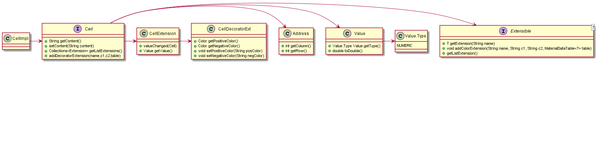

**José Silva** (s1150371) - Sprint 2 - Core02.1
===============================

# 1. General Notes

In the middle of this week i changed my UC , previously Core8.2, because Core2.1 needed to be implemented and it was a mandatory UC.
# 2. Requirements

Core02.1 -Implement an extension mechanism that can be used to add functionality to the application. For the moment it should support extensions that add cell decorators. The application should also have a new settings page with a specific section for each extension. For testing purposes a new extension should be developed that changes the background color of numeric cells according to its value being positive or negative. The color should be configured in the settings page.

**Proposal**:

  
  - **US1**: User can change the background color of numeric cells.
  
 # 3. Analysis
 
For this feature increment i need to:  

- Understand how the application works and also understand the key aspects of GWT, since it is the main technology behind the application  

- Understand how the WorkBook page is implemented, how to change a table's background color and how to change the table's background color when a value changes 

- Understand where it is more efficient to create the classes I will be needing 

- Understand what is left to do from sprint 1 
  

## 3.1  Analysis Diagrams
**Domain Model**

# 4. Design

## 4.1. Tests

## 4.2. Requirements Realization

*In this section you should present the design realization of the requirements.*

Following the guidelines for JPA from EAPLI we envision a scenario like the following for realizing the use cases for this feature increment.

**For US1**

## 4.3. Classes
*Present and describe the major classes of you solution.*

- **WorkbookView** will organize all the data
- **ExtensionManagerView** will comunnicate with the user

## 4.4. Design Patterns and Best Practices

*Present and explain how you applied design patterns and best practices.*

By memory we apply/use:  
- Singleton
- GRASP
- DTO
- SOLID

# 5. Implementation

*If required you should present in this section more details about the implementation. For instance, configuration files, grammar files, etc. You may also explain the organization of you code. You may reference important commits.*

**For US1**

Firstly there is a settings page. In the settings page there are two boxes where the colors can be configured. The apply button saves the changes and triggers the extension whenever a value is changed.

**Notes:**
- The extension mechanism could not be tested because the method to add the color extension takes as param a MaterialDataTable<?>  and gwt outputs an error when taking MaterialDataTable<WorkbookView.SheetCell> as input.
- For now the color can be configured in settings->ExtensionManager and the method to color the spreadsheet is hardcoded in WorkBookView.negativeColors()

**Code Organization** 

The code for this sprint:

Project **shared**  
- Updated the classes: **pt.isep.nsheets.shared.core.Cell/CellImpl** ,**pt.isep.nsheets.shared.lapr4.red.s1160777.ext.Extensible**
- Created the class: **pt.isep.nsheets.shared.lapr4.blue.s1150371.ext.CellDecoratorExt**  

Project **NSheets** 
- Updated the classes: **pt.isep.nsheets.client.aaplication.workbook.WorkbookView** and **ExtensionManagerView**  
- Updated the file: **ExtensionManagerView.ui.xml**  

# 6. Integration/Demonstration

## Settings Page

## Workbook 

# 7. Final Remarks 

*In this section present your views regarding alternatives, extra work and future work on the issue.*

