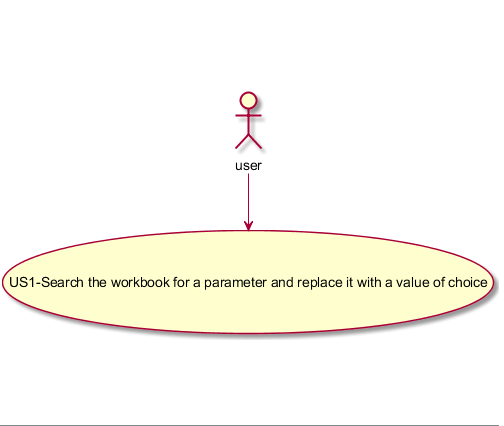
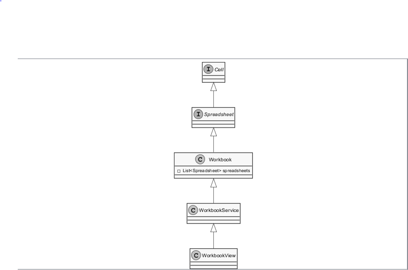
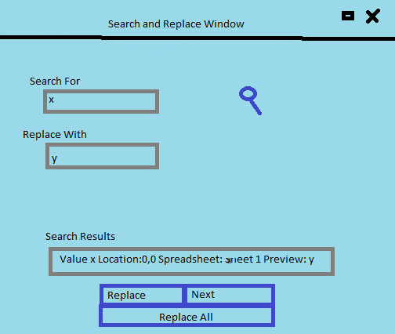

**José Silva** (s1150371)  - Sprint 3 - IPC02.2
===============================

# 1. General Notes

     The application should now have a new option for "Search and Replace". 
	 
# 2. Requirements #

**IPC02.2:**

The application should now have a new option for "Search and Replace". This new window should be similar to the search window but with an area to enter the replacing text. When search and replace is launched, when a match is found, the window should display "what" was found, "where" the match has occurred and how it will become after the replace. The user should then confirm the replacement or select next (to continue the search). The window should include a button to apply the replacing to all the matches without asking each time. Similarly to the search only option, this option should also have parameters to refine the search, for instance, what type of cells to include in the search (or if it should include formulas or comments). "Search" and "Search and Replace" should should include contents of all the spreadsheets of the active workbook.

**Proposal:**

*US1*- As a user I want to search contents of the active workbook and replace them with my content of choice.

# 3. Analysis

## 3.3 Analysis Diagrams

The main idea for the "workflow" of this feature increment.

**Use Cases**

**Domain Model**

**System Sequence Diagrams**

- The user selects the button Search and Replace. The system 'asks' for the value or text to find and the replacement.The user inputs the values and the replacement and press Search And Replace.The system for each find, shows a new window with the information of the find(Location,Content) and asks if the user wants to replace or next(skip). The user selects replace. The system replaces the cell content.

## 3.4 Presentation
At the Workbook page, there will be a button that’s going to allow to Search and Replace. This button, when clicked, opens a Window to search and replace.

# 4. Design

## 4.1. Tests

## 4.2. Requirements Realization
In the diagram below you can see how the classes interect and the sucessefull workflow of the use case.

**US1-Search and Replace**

Notes:  
- **WorkbooksServices** performs the GWT RPC mechanism;

- **SearchAndReplaceController** is the *use case controller*;  

- **WorkbookView**  is the view that presents the tasks;

- **WorkbookPresenter** adds the needed behaviours to the view

## 4.3. Classes

- WorkbooksServiceImpl - connection between the graphic part and the functionality controller;

- WorkbookPresenter, WorkbookView, WorkbooksView.xml - every class in regard to the graphic part of the functionality;

- SearchAndReplaceController - Controller/Logic

## 4.4. Design Patterns and Best Practices

By memory we apply/use:
- DTO  

- MVP

- For UI Implementation we used the GWT Material Documentation 

# 5. Implementation

To trigger the search and replace window I implemented the following button: 

Button code in WorkbookView.xml:

	<m:MaterialButton ui:field="btnOpenSearchReplace" text="Search and Replace" size="MEDIUM" iconType="SEARCH" waves="LIGHT" backgroundColor="BLUE" textColor="WHITE" iconPosition="RIGHT"/>

After the search and replace button is click a SearchAndReplace pop-up window should appear:

SearchAndReplaceWindow code in WorkbookView.xml:
	 
	 <ma:window.MaterialWindow ui:field="windowSearchAndReplace" backgroundColor="WHITE"
                                      toolbarColor="BLUE"
                                      width="50%" title="Search and Replace on SpreadSheet">
                <m:MaterialPanel padding="32" textAlign="CENTER" height="200px">
                    <m:MaterialTextBox ui:field="textBoxSearchFor" placeholder="Search in all worksheets"
                                       label="Search in all worksheets" grid="s9" active="true"/>
                    <m:MaterialTextBox ui:field="textBoxReplacementText" placeholder="Replacement text"
                                       label="Replacement text" grid="s9" active="true"/>
                    <m:MaterialIcon ui:field="btnSearchReplace" iconType="SEARCH" iconColor="BLUE"
                                    waves="DEFAULT"
                                    circle="true" grid="s1"/>
                </m:MaterialPanel>
                <m:MaterialPanel margin="60" padding="32" textAlign="CENTER" height="150px">
                    <m:MaterialRow margin="60">
                        <m:MaterialTextArea ui:field="resultsSearchAndReplace" label="Search Results:"
                                            resizeRule="AUTO"
                                            readOnly="true"/>
                        <m:MaterialButton waves="LIGHT" backgroundColor="BLUE" text = "replace" ui:field="replaceButton" />                        
                        <m:MaterialButton waves="LIGHT" backgroundColor="BLUE" text = "next" ui:field="nextButton" />  
                        <m:MaterialButton waves="LIGHT" backgroundColor="BLUE" text = "Replace All" ui:field="replaceAllButton" />                  
                    </m:MaterialRow>
                </m:MaterialPanel>
            </ma:window.MaterialWindow>
			
**Code Organization**  

The code for this sprint:  

**Server**
- Controllers -	**pt.isep.nsheets.server.lapr4.blue.s3.ipc.n1150371.searchAndReplace.application**
- Services - **pt.isep.nsheets.server.services**

**Shared**
- Shared Services - **pt.isep.nsheets.shared.services**

**NShests**
- User Interface - **pt.isep.nsheets.client.application.workbook**

# 6. Integration/Demonstration
This usercase is not fully implemented, altought it is functional. The user is able to search and replace but the parameters to refine the search are missing. Also, i was unable to replace the Spreadsheet Cell contents on the server, because the contents updated on WorkbookDTO weren't being saved, so the replacement method is currently hardcoded in the ui.

  
*Search Button*

*Next Button*

*Next Button - End of Search*

*Replacement Button (Single Replacement)*

*Replacement All Button*

To improve later: Parameters to refine the search, server sided replacements.

# 7. Final Remarks
-----------------------------------------------------------------------------------------------------------------------------------------------------------------------------------------------------------

# 8. Work Log

[IPC 02.2 -SearchAndReplace - UI](https://bitbucket.org/lei-isep/lapr4-18-2dl/commits/3c3dab9699ab89a278c38a494bb4fd7b6160994b)

[IPC 02.2 -SearchAndReplace - WorkbookService and SearchAndReplaceController](https://bitbucket.org/lei-isep/lapr4-18-2dl/commits/8f21a3151cdd4df708b3a41454e043a9ccf61653)

[IPC 02.2 -SearchAndReplace - Implementation Search and Next](https://bitbucket.org/lei-isep/lapr4-18-2dl/commits/c501cbc7371ff0aba303538af23afa8b0450c3c5)

[IPC 02.2 -SearchAndReplace - Implementation Replace and ReplaceAll](https://bitbucket.org/lei-isep/lapr4-18-2dl/commits/51bbd8054fe518514990ca7b5d50e16c2770d7f2)

