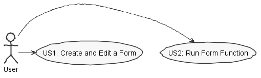

**Daniel Fernandes** (s1150585) - Sprint 1 - Lang05.1 - Forms Editor
===============================

# 1. General Notes

- I’ve helped my erasmus colleagues as often as I had the chance to. Regarding the project configuration as well as in terms of implementation.

# 2. Requirements

Lang05.1 - Forms Editor

The application should have a new option to launch a window for editing a form. A Form is a window that is designed by the end user and is used for interacting with the user (input and output). The new window should support the creation and testing of a Form. Forms should be very simple. A Form should be composed of rows, each row can be empty or have one or two visual widgets. The supported visual widgets are: button (to invoke actions); edit box (to enter data) and static text box (to display data). It should be possible to set the core properties of these widgets (like the text to display in a static text box, for instance). In the edit form window it should be possible to: add a new row; remove an existing row; edit an existing row; "play" the form and close the edit form window. The "play" button is for testing the appearance of a form during its design (see example in the next Figure). At the moment it is only required to support a single Form for each workbook. Macros and formulas should have a new function that can be used to display the form of the current workbook. Forms should have an icon or button to close the form. When the form is closed the function (in macros or formulas) who call it returns.

Proposal:

US1 - As the application user I want to be able to create, edit and preview a form associated with a certain workbook.

US2 - As the application user I want to be able to execute the designated actions in each form line.

# 3. Analysis

For this feature increment, since it is the first one to be developed in a new project I need to:  

- Understand how the application works and also understand the key aspects of GWT, since it is the main technology behind the application  

- As the application user I want to be able to execute the designated actions in each form line.

- Understand how the form will be associated to a workbook.

- Understand how one function (in a formula or macro) will be implemented so that the form of the current workbook can be shown.

## 3.1 Form editor
- The forms’ editor will be triggered through a button placed on the workbook view. Clicking that button will create a new form editor view. That view will check if the current workbook already has an associated form. If it has, the editor will present the previously inserted values. If it hasn’t, it will be shown an empty form.

- The form editor view will also provide a play button which will allow previewing the form before it has been saved on the database.

- To save the form, there will be a save button available. When the button is pressed the form is saved and closed. The function (in macros or formulas) who called the form returns.

## 3.2 Form
- It will be through the form’s view that the actions will be executed. There will be a button available that will allow to run an action one by one. For implementation reasons I couldn’t make two action running at the same time, hence why I chose to use checkboxes.

- Each form line will be composed by two labels (one for the action name and another for the action instructions) and a checkbox.

- The form’s preview can be done in two ways. The first through the editor, and the second one will be triggered by a function (macros and formulas).

## 3.3 Analysis Diagrams

The main idea for the "workflow" of this feature increment.

**Use Cases**

**Domain Model**

**System Sequence Diagrams**

**For US1**

**For US2**

# 4. Design

## 4.1. Tests

*In this section you should describe the design of the tests that, as much as possibe, cover the requirements of the sprint.*

## 4.2. Requirements Realization

**For US1**

Notes:  
- The diagram only depicts the less technical details of the scenario;  
- For clarity reasons details such as the PersistenceContext or the RepositoryFactory are not depicted in this diagram.   
- **FormEditorWindow** is the window that shows the Forms Editor ;  
- **FormEditorController** is the *use case controller*;  
- **FormWindow** is the class that previews the end Form look;
- **Form** is form's domain class that will be associated with the current workbook

**For US2**

Notes:  
- The diagram only depicts the less technical details of the scenario;  
- For clarity reasons details such as the PersistenceContext or the RepositoryFactory are not depicted in this diagram.   
- **FormWindow** is the class that previews the end Form look and allows the actions to be triggered;
- **FormEditorController** is the *use case controller*;  
- **Form** is form's domain class that will be associated with the current workbook

## 4.3. Classes

- **FormEditorView** - Creates the forms editor window. Some widgets are created just in the class regarding the need to create the rows dynamically.
- **FormEditorView.ui** - XML scheme of the forms editor window.
-	**FormEditorController** - makes the connection between the forms editor window, the form’s domain class and persistency.
-	**FormView.java** -  Creates the forms preview window. It’s triggered through the editor or if a function is called.
-	**FormView.ui** - XML scheme of the forms view.
-	**FormController** - Makes the connection between forms preview window, the form’s domain class and presistency. It is also responsible for the implementation of the actions triggered in the form.
-	**Form** -  Domain. It contains every form’s row (name and action).

## 4.4. Design Patterns and Best Practices

By memory we apply/use:  
- Singleton  
- Repository  
- DTO  
- MVP

For UI Implementation we used the GWT Material Documentation   

# 5. Implementation

**For US1**

To trigger the forms editor, in the class WorkbookView I implemented the following button:
In WorkbookView Class:

		@UiField
    	MaterialIcon formButton;

In WorkbookView.ui Class:

	<m:MaterialIcon ui:field="formButton" iconType="FORMAT_LIST_BULLETED" tooltip="New Form" iconColor="BLUE" waves="DEFAULT" circle="true" grid="s1" />

**For US2**

In the forms viewer I chose to use a single button to trigger the actions’ forms. Besides the text fields there will be a checkbox to each line. That checkbox will select the function in use. You can never run two actions simultaneously. The labels and the checkboxes  will be created in the FormView considering that they need to be created dynamically.

	   <ma:window.MaterialWindow ui:field="formWindow" width="70%" title="Form">
            <m:MaterialPanel padding="5" textAlign="CENTER" height="50px">
                <m:MaterialIcon ui:field="executeForm" iconType="FORWARD" tooltip="Execute Form" iconColor="BLUE" waves="DEFAULT" circle="true" grid="s1" />
            </m:MaterialPanel>      
      </ma:window.MaterialWindow>

**Code Organization**  

The code for this sprint:  
Project **server**
- Controllers and Domain: **pt.isep.nsheets.server.lapr4.blue.s1.lang.n1150585.forms**    

Project **NShests**
- Windows Creation: **pt.isep.nsheets.client.lapr4.blue.s1.s1150585.formsEditor**

# 6. Integration/Demonstration

My contribution to the team consisted essentially in sharing my knowledge regarding GWT and API material. Through sharing links like the following ones, I think I contributed for a better understanding in these two subjects.

	-https://dev.arcbees.com/gwtp/tutorials/
	-https://material.io/tools/icons/?style=baseline
	-https://gwtmaterialdesign.github.io/gwt-material-demo/2.0-SNAPSHOT/#window

Furthermore, I tried my best to integrate my Erasmus teammates. I have also helped installing Maven and all the tools needed to develop this application.

Lastly, I highlight the fact that I was dependent on other functionalities, mainly Workbooks persistency. This has only delayed my Use Case implementation.

# 7. Final Remarks
----------------------------------------------------------------------------------------------------------------
# 8. Work Log

Commits:
