**Daniel Fernandes** (s1150585) - Sprint 2 - Core05.2 - Tasks
===============================

# 1. General Notes

-----------------------------------------------------------------------------------------------------------------------------------------------------------------------------------------------------------------------------------------------------------

# 2. Requirements

Core05.1 - Tasks

It should be possible to create, edit and remove tasks. A task has a name, a description, and a list of contacts. A task also has a priority level (1 to 5) and a percentage of completion. The application should have a window to display and edit tasks. It should be possible to sort and filter the tasks using expressions based on its fields. For instance, it should be possible to only display tasks which are not completed. Tasks should be visible to all the contacts related to the task.

Proposal:

US1 - As an application user I want to be able to create tasks;

US2 -  As an application user I want to be able to delete tasks;

US3 - As an application user I want to be able to edit tasks;

US4 - As an application user I want to be able to filter tasks accordingly to their fields.

# 3. Analysis

To develop this feature I will need to:

- Understand how the contacts are persisted in the data base to be able to associate them to the tasks;

- Understand how I’m going to persist the tasks in the database;

-	Analyze every class related to the business;

- Understand how I'm going to show the tasks in the application and show the data

## 3.1 Contacts persistence
Although the UC Core05.1 implementation wasn't totally functional in the last iteration, the contacts can be persisted in the database. I am just going to need access to the contacts table to associate the users to a specific task. For that reason, I won't do any type of amendment in my colleague’s implementation.

## 3.2 Database persistence
To persist the tasks in the database, I’ll need to make the following changes:

- Create a TaskDTO class (shared) to be able to interpret the values of each task in the UI and save in the database as “Task”;

- Create services to be able to make the connection between the database and the graphic interface - TaskService, TaskServiceAsync (shared) and TaskServicelmpl (server);

- Create JPA classes that will allow to make the persistence in the database - TaskRepository (interface) and JPATaskRepository (contains JPQL instructions that will make changes in the database);

- Create a controller that will make the con between the Services and the Tasks Repository.

## 3.3 Business analysis

In regard to the business analysis I’m going to need a Task domain class. That class will contain the following fields:

- Title;

- Description;

- Priority;

- Percentage of Completion;

- Contacts List.

## 3.4 Presentation

Regarding the presentation, I’ll opt to create a view in which all the tasks are loaded. At the bottom right corner, there will be a button that’s going to allow to add tasks.

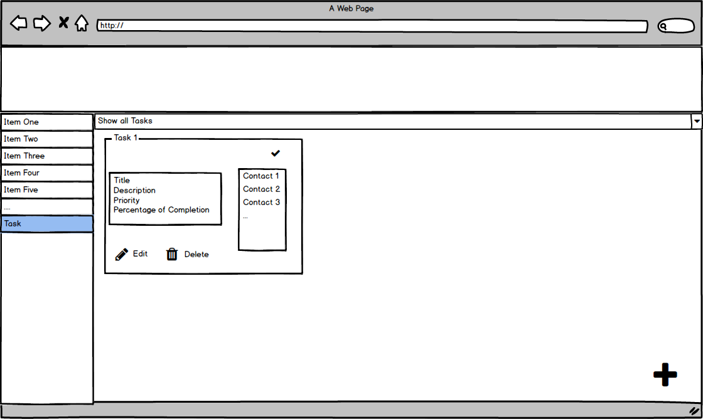

To edit the form, I’ll create a window that’s going to allow every task field to be edited.

## 3.3 Analysis Diagrams

The main idea for the "workflow" of this feature increment.

**Use Cases**

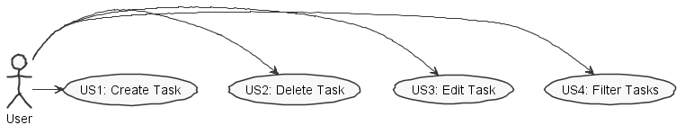

**Domain Model**

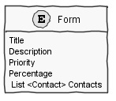

**System Sequence Diagrams**

**For US1**

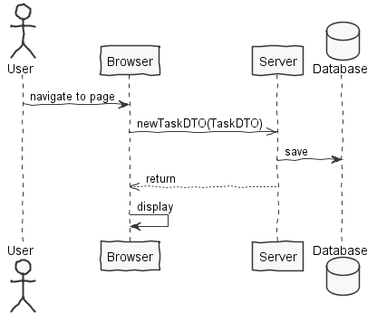

**For US2**

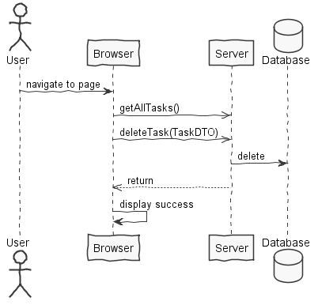

**For US3**

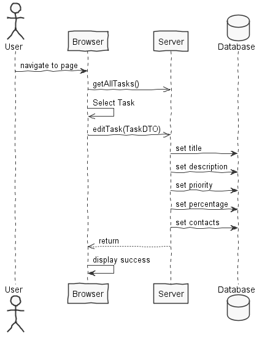

**For US4**

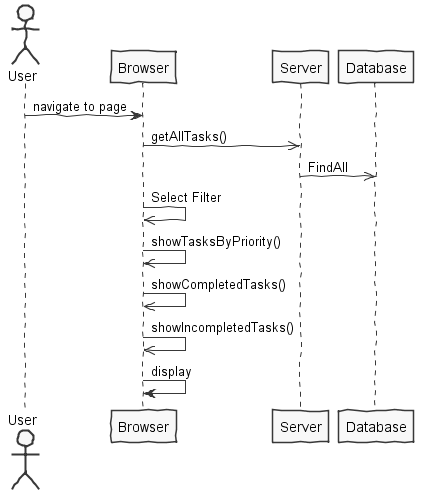

# 4. Design

## 4.1. Tests

Regarding tests we try to follow an approach inspired by test driven development. However it is not realistic to apply it for all the application (for instance for the UI part). Therefore we focus on the domain classes and also on the services provided by the server.

**Domain Classes**

**Task**
  - id (long)
  - title (string)
  - description (string)
  - priority (int)
  - percentage (int)

    @Test
    public void testSameAs() {
        System.out.println("sameAs");

        Task t1 = new Task("teste1", "descrição 1", 1, 1);
        Task t2 = new Task("teste2", "descrição 2", 1, 1);
        Task t3 = new Task("teste3", "descrição 3", 1, 1);
        Task t4 = new Task("teste4", "descrição 4", 1, 1);

        Task instance1 = new Task("teste1", "descrição 1", 1, 1);
        boolean expResult1 = true;
        boolean result1 = instance1.sameAs(t1);
        assertEquals(expResult1, result1);

        boolean expResult2 = false;
        boolean result2 = t2.sameAs(t3);
        assertEquals(expResult2, result2);

        Task instance3 = new Task("teste4", "descrição 4", 1, 1);
        boolean expResult3 = true;
        boolean result3 = instance3.sameAs(t4);
        assertEquals(expResult1, result1);
    }

    @Test
    public void testGetTitle() {
        System.out.println("getTitle");

        Task instance = new Task("teste1", "descrição 1", 1, 1);
        String expResult = "teste1";
        String result = instance.getTitle();
        assertEquals(expResult, result);

        Task instance1 = new Task("teste2", "descrição 1", 1, 1);
        String expResult1 = "teste2";
        String result1 = instance1.getTitle();
        assertEquals(expResult1, result1);
    }

    @Test
    public void testGetDescription() {
        System.out.println("getDescription");

        Task instance = new Task("teste1", "descrição 1", 1, 1);
        String expResult = "descrição 1";
        String result = instance.getDescription();
        assertEquals(expResult, result);

        Task instance1 = new Task("teste2", "descrição 2", 1, 1);
        String expResult1 = "descrição 2";
        String result1 = instance1.getDescription();
        assertEquals(expResult1, result1);
    }

    @Test
    public void testGetPriority() {
        System.out.println("getPriority");

        Task instance1 = new Task("teste1", "descrição 1", 1, 1);
        int expResult1 = 1;
        int result1 = instance1.getPriority();
        assertEquals(expResult1, result1);

        Task instance2 = new Task("teste2", "descrição 1", 2, 1);
        int expResult2 = 2;
        int result2 = instance2.getPriority();
        assertEquals(expResult2, result2);

        Task instance3 = new Task("teste3", "descrição 1", 3, 1);
        int expResult3 = 3;
        int result3 = instance3.getPriority();
        assertEquals(expResult3, result3);

        Task instance4 = new Task("teste4", "descrição 1", 4, 1);
        int expResult4 = 4;
        int result4 = instance4.getPriority();
        assertEquals(expResult4, result4);

        Task instance5 = new Task("teste5", "descrição 1", 5, 1);
        int expResult5 = 5;
        int result5 = instance5.getPriority();
        assertEquals(expResult5, result5);

        Task instance6 = new Task("teste6", "descrição 1", 1, 1);
        int expResult6 = 0;
        int result6 = instance6.getPriority();
        assertNotEquals(expResult6, result6);
    }

    @Test
    public void testGetPercentage() {

        Task instance1 = new Task("teste1", "descrição 1", 1, 100);
        int expResult1 = 100;
        int result1 = instance1.getPercentage();
        assertEquals(expResult1, result1);

        Task instance2 = new Task("teste2", "descrição 1", 2, 0);
        int expResult2 = 0;
        int result2 = instance2.getPercentage();
        assertEquals(expResult2, result2);

        Task instance3 = new Task("teste3", "descrição 1", 3, 50);
        int expResult3 = 50;
        int result3 = instance3.getPercentage();
        assertEquals(expResult3, result3);

        Task instance4 = new Task("teste4", "descrição 1", 1, 100);
        int expResult4 = 0;
        int result4 = instance4.getPercentage();
        assertNotEquals(expResult4, result4);
    }

    @Test
    public void testToDTO() {
        System.out.println("toDTO");

        Task instance = new Task("teste1", "descrição 1", 1, 1);
        TaskDTO expResult = new TaskDTO("teste1", "descrição 1", 1, 1);
        TaskDTO result = instance.toDTO();
        assertNotEquals(expResult, result);
    }

    @Test
    public void testFromDTO() {
        System.out.println("fromDTO");
        TaskDTO dto = new TaskDTO("teste1", "descrição 1", 1, 1);
        Task expResult = new Task("teste1", "descrição 1", 1, 1);
        Task result = Task.fromDTO(dto);
        assertNotEquals(expResult, result);
    }

**Controllers**

**TaskController**

    @Test
    public void testGet_all_tasks() {
        System.out.println("get_all_tasks");
        TasksController instance = new TasksController();
        Task t1 = new Task("title1","description1",1,1);
        Task t2 = new Task("title2","description2",1,1);
        Task t3 = new Task("title3","description3",1,1);
        Task t4 = new Task("title4","description4",1,1);

        instance.addTask(t1.toDTO());
        instance.addTask(t2.toDTO());
        instance.addTask(t3.toDTO());
        instance.addTask(t4.toDTO());

        Iterable<Task> it1 = instance.get_all_tasks();
        ArrayList <Task> it2 = new ArrayList<>();
        it2.add(t1);
        it2.add(t2);
        it2.add(t3);
        it2.add(t4);
        assertEquals(it1, it2);
    }

  Due to time constraints, I haven't been able to implement all of the controller tests

## 4.2. Requirements Realization

**For US1**

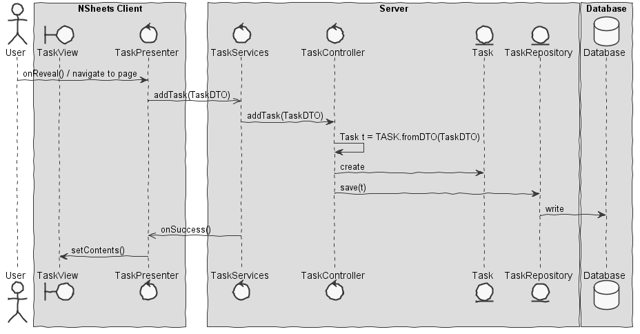

Notes:  
- The diagram only depicts the less technical details of the scenario;  

- For clarity reasons details such as the PersistenceContext or the RepositoryFactory are not depicted in this diagram.

- **TaskServices** performs the GWT RPC mechanism;

- **TaskController** is the *use case controller*;

- **TaskViewWindow**  is the view that presents the tasks;

- **TaskPresenter** adds the needed behaviours to the view;

- **Task** is task's domain class that will be persisted.

**For US2**

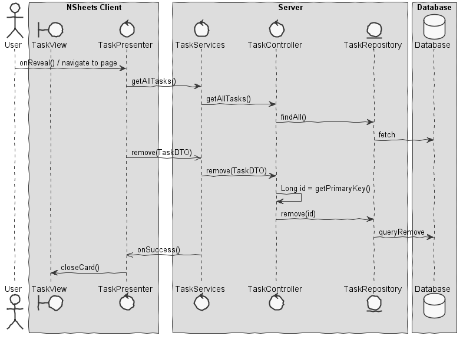

Notes:  
- The diagram only depicts the less technical details of the scenario;  

- For clarity reasons details such as the PersistenceContext or the RepositoryFactory are not depicted in this diagram.

- **TaskServices** performs the GWT RPC mechanism;

- **TaskController** is the *use case controller*;  

- **TaskViewWindow**  is the view that presents the tasks;

- **TaskPresenter** adds the needed behaviours to the view.

**For US3**

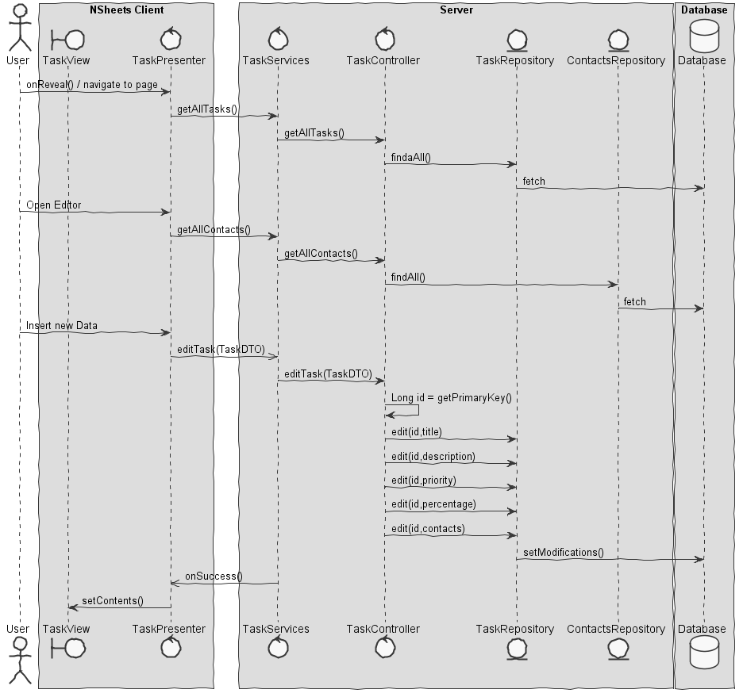

Notes:  
- The diagram only depicts the less technical details of the scenario;  

- For clarity reasons details such as the PersistenceContext or the RepositoryFactory are not depicted in this diagram.  

- **TaskServices** performs the GWT RPC mechanism;

- **TaskController** is the *use case controller*;  

- **TaskViewWindow**  is the view that presents the tasks;

- **TaskPresenter** adds the needed behaviours to the view.

**For US4**

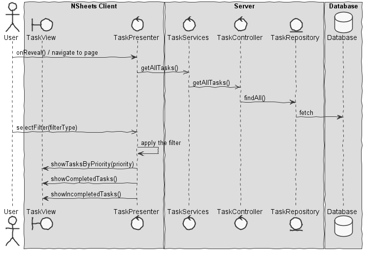

Notes:  
- The diagram only depicts the less technical details of the scenario;  

- For clarity reasons details such as the PersistenceContext or the RepositoryFactory are not depicted in this diagram.

- **TaskServices** performs the GWT RPC mechanism;

- **TaskController** is the *use case controller*;  

- **TaskViewWindow**  is the view that presents the tasks;

- **TaskPresenter** adds the needed behaviours to the view

## 4.3. Classes

- Task - business table that will be persisted;

- TasksServiceImpl - connection between the graphic part and the functionality controller;

- TasksModulo, TasksPresenter, TasksView, TasksView.xml - every class in regard to the graphic part of the functionality;

- TaskController - makes the connection between services and the tasks repository;

- JPATaskRepository - Tasks Repository. Performs the querys in JPQL.

## 4.4. Design Patterns and Best Practices

By memory we apply/use:   
- Repository  

- DTO  

- MVP

- Factory

- For UI Implementation we used the GWT Material Documentation   

# 5. Implementation

To trigger the tasks view I implemented the following menu button:

Existing XML code in MenuView.xml

 	<m:MaterialLink  targetHistoryToken="{tokens.getTasks}" iconPosition="LEFT" iconType="ASSIGNMENT_TURNED_IN" text="Tasks" />

**Code Organization**  

The code for this sprint:  

**Server**
- Controllers - **pt.isep.nsheets.server.lapr4.blue.s2.core.n1150585.tasks.application**
- Domain - **pt.isep.nsheets.server.lapr4.blue.s2.core.n1150585.tasks.domain**
- Persistence -  **pt.isep.nsheets.server.lapr4.white.s1.core.n4567890.workbooks.persistence**
- Persistence JPA - **pt.isep.nsheets.server.lapr4.white.s1.core.n4567890.workbooks.persistence.jpa**
- Services - **pt.isep.nsheets.server.services**

**Shared**
- Shared Services - **pt.isep.nsheets.shared.services**

**NShests**
- User Interface - **pt.isep.nsheets.client.lapr4.blue.s2.s1150585.Tasks**

# 6. Integration/Demonstration

All in all, this use case implementation was successful. It is possible to create tasks and to store them in the database. Those same tasks can be edited and eliminated. The preview of the set of tasks can also be filtered by priority and by state.

In regard to the graphics, I feel like the tasks view fits with the remaining project, there was a concern in not staying away from what was already implemented.

Task View - Final

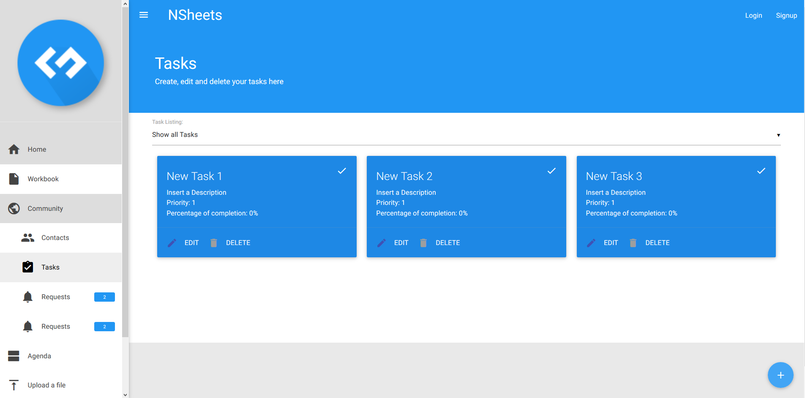

Task Editor - Final

To improve later: Associate Contacts with Tasks.

I had some difficulties in associating the contacts with each task. Although the contacts are saved in the database, I had big trouble in connecting my colleagues code to mine. In the database the contacts are being saved in a table with two columns (Strings), each one represents a user. That's why it becomes difficult to create tasks views accordingly with the contact list of each task. Therefore, it would be difficult to visually present the contacts association to each task. I tried to fix the problem but due to the lack of time and the work load i was unable to do it. To make this use case functional, I chose to focus in creating and eliminating tasks, as well as editing them.

Working with my teammates was productive. Even though we're just a few elements and all the difficulties concerning the Erasmus colleagues, I tried to help as often as I could and to be an active element of the team. As the two sprints I’ve made so far included graphics, I consider that I was useful to my team in implementing GWT tools.

# 7. Final Remarks
-----------------------------------------------------------------------------------------------------------------------------------------------------------------------------------------------------------

# 8. Work Log

[Core 05.2 -Tasks. Persistence](https://bitbucket.org/lei-isep/lapr4-18-2dl/commits/37a1363fd10f420489d4cc0b43c66640001e98c3)

[Core 05.2 - Tasks - Delete Tasks](https://bitbucket.org/lei-isep/lapr4-18-2dl/commits/3423bae6d47b3f92b92b877611e05bde4f86c2d1)

[Core 05.2 - Tasks - Edit Tasks](https://bitbucket.org/lei-isep/lapr4-18-2dl/commits/e3ce303b6b83ee08dddbb66ce16d3a08d5bca0c2)

[Core 05.2 - Tasks - Order by Percentage of Completion](https://bitbucket.org/lei-isep/lapr4-18-2dl/commits/4e7806ba019c60cff73f1f7a26d42707b48b4d26)

[Core 05.2 - Web.xml bugs fixed commits](https://bitbucket.org/lei-isep/lapr4-18-2dl/commits/381f21dfddb77b68d251bd28e779bd1b5c6d33ba)

[Core 05.2 - Tasks - UI Improvements](https://bitbucket.org/lei-isep/lapr4-18-2dl/commits/db472b177c2e769d596f8c1624fd9aa105223e89)

[Core 05.2 - Tasks  - Correction of bugs related with previous commits](https://bitbucket.org/lei-isep/lapr4-18-2dl/commits/f0a7b277403eb6439088ea65ff5049ddf8129b7d)

[Core05.2 - Package Name Correction](https://bitbucket.org/lei-isep/lapr4-18-2dl/commits/87516f6a79b189a72cb99f79b5376334ecdf8978)

[Core05.2 - Tasks - Check Task Button Implemented](https://bitbucket.org/lei-isep/lapr4-18-2dl/commits/6925357db03270f2fb36b45cd44af386b7340c0b)

[Core05.2 - Bug Fixed](https://bitbucket.org/lei-isep/lapr4-18-2dl/commits/46b1befa158f2187ded37c4a3fbb641df437c4a4)

[Core 05.2 - Tasks - Technical Documentation](https://bitbucket.org/lei-isep/lapr4-18-2dl/commits/73a576fc084c5d9e6e32c932fd4827d90dae1c8c)

[Core 05.2 - Tasks - Domain and controller tests](https://bitbucket.org/lei-isep/lapr4-18-2dl/commits/ab5a91d305c14c7f9142b550b4180fbccccc5e0e)

[Core 05.2 - Tasks - Techinal Documentation Updated](https://bitbucket.org/lei-isep/lapr4-18-2dl/commits/9036b15459158bf4b1f8701508ad70cce815c44d)
