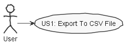
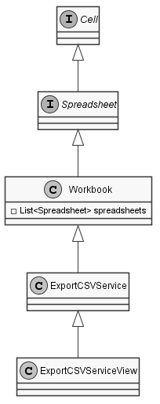
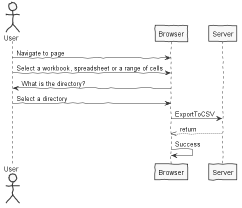
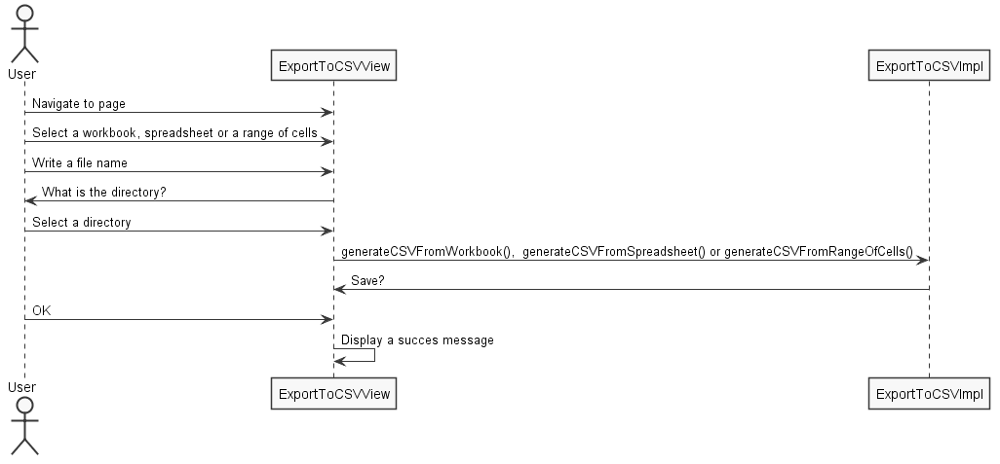

**Daniel Fernandes** (s1150585) - Sprint 2 - Core05.2 - Tasks
===============================

# 1. General Notes

-----------------------------------------------------------------------------------------------------------------------------------------------------------------------------------------------------------------------------------------------------------

# 2. Requirements

**IPC05.1 - Export to CSV**

It should be possible to export the contents of an workbook, spreadsheet or part of a spreadsheet to a CSV file. As we want to optimize as much as possible the process the solution should not rely on any third party library. The application should have a window/page to configure the CSV format (e.g, field separator or string delimiter). The export should only include the value of the cells. The generated CSV should be downloaded to the user local file system.

**Proposal**:

US1 - As an application user I want to be able to have an option to export a full workbook, only one spreadsheet or a cells interval to CSV and save the file in my computer.

# 3. Analysis

To develop this feature I will need to:

- Understand how the CSV files will be generated;

- Understand how the CSV file will be downloaded from the browser.

## 3.1 Creating CSV files
To generate CSV files I will to use the Java FileWriter native class, which will allow me to write carácteres in files. The CSV file organisation consists in writing in rows and columns as shown in the workbook. The cells delimiter can be a string or a field separator.

**Search:**
- Creating CSV files - [Java Code Geeks](https://examples.javacodegeeks.com/core-java/writeread-csv-files-in-java-example/)

## 3.2 File Download
To be able to download the file I will need to create a Servlet. The Servlet is a class that's going to allow the file download. In this class, the file’s name will be attributed (the UI sends the parameter) and the download. To make the download I will need to use the Java OutputStream native class. An output stream accepts output bytes and sends them to some sink. The download should be made to a directory chosen by the user and to the project's root folder.

**Search:**
- Servlets - [Code Java](http://www.codejava.net/java-ee/servlet/java-servlet-download-file-example)
- Class OutputStream - [Docs Oracle](https://docs.oracle.com/javase/7/docs/api/java/io/OutputStream.html)

## 3.3 Analysis Diagrams

**Use Cases**

**Domain Model**

**System Sequence Diagrams**

**For US1**

# 4. Design

## 4.1. Tests

Due to lack of time it was impossible to generate unit tests which would allow to validade the solution correction. However, I will leave some test suggestions below for future implementations:

- Test if the workbook cells are equal to the ones on the file;
- Test if the method that extracts the cells interval is working correctly;
- Test if the method that extracts the worksheet is selecting the right one;
- ...

## 4.2. Requirements Realization

**For US1**

Notes:  
- The diagram only depicts the less technical details of the scenario;  

- **ExportToCSVView** -Is the view that allows to edit how the CSV file is exported;

- **ExportCSVImpl** - Is the class that will convert a workbook, a spreadsheet or a range of cells in CSV. It's also responsible to make the download.

## 4.3. Classes
**IMPL**
 - **ExportCSVImpl** -Is the class that will contain a CSV workbook. It will also be responsible for making the download;
 - **ExportCSVSpreadsheetImpl** - Is the class that will convert a spreadsheet in CSV and it's also responsible to make the download;
 - **ExportCSVRangeServiceImpl** -Is the class that will convert a range of cells in CSV. It's also responsible to make the download.

  **NOTE** - To simplify I’ve only represented the class ExportCSVImpl in SD.

**Service Interface**
- **ExportCsvService** - Interface that will implement the ExportCSVlmpl;
- **ExportCsvService** - Interface that will implement the ExportCSVSpreadsheetlmpl;
- **ExportCsvService** - Interface that will implement the ExportCSVRangeServicelmpl

**Async Interface**
- **ExportCsvServiceAsync** - Interface that will allow to connect the view to the ExportCSVlmpl;
- **ExportCsvServiceAsync** - Interface that will allow to connect the view to the ExportCSVSpreadsheetlmpl;
- **ExportCsvServiceAsync** - Interface that will allow to connect the view to the ExportCSVRangeServicelmpl.

**View**
- **ExportCSVView** - Class that declares every object in the view.
- **ExportCSVView.ui.XML** - Declaration of some material objects in XML

## 4.4. Design Patterns and Best Practices
By memory we apply/use:   
- DTO  
- For UI Implementation we used the GWT Material Documentation   

# 5. Implementation

To trigger the Export To CSV view I implemented the following button on workbook View:

    @UiField
    MaterialButton exportToCSVButton;

Code that triggers the Export To CSV View:

        exportToCSVButton.addClickHandler(event -> {
            new ExportCsvView(this.getActiveCell().getSpreadsheet().getWorkbook());
        });

Code that allows to generate the CSV file of a workbook:

        File file = new File(filename);
        FileWriter fileWriter = null;
        try {

            fileWriter = new FileWriter(file);
             fileWriter.append("SEP=" + "," + "\n");

            for (SpreadsheetDTO spreadsheet : workbookDTO.getSpreadsheets()) {

               // fileWriter.append("Spreadsheet:");

                String[][] content = spreadsheet.getContent();

                for (int i = 0; i < content.length; i++) {
                    for (int j = 0; j < content[0].length; j++) {
                        fileWriter.append(content[i][j]);
                        fileWriter.append(",");
                    }
                    fileWriter.append("\n");
                }
            }

        } catch (Exception e) {

            System.out.println("Error in CsvFileWriter !!!");

            e.printStackTrace();

        } finally {
            try {
                fileWriter.flush();
                fileWriter.close();
            } catch (IOException e) {
                System.out.println("Error while flushing/closing fileWriter !!!");
                e.printStackTrace();
            }
            return fileWriter;
        }

**Code Organization**  

The code for this sprint:  

**Server**
- Services - **pt.isep.nsheets.server.services**

**Shared**
- Shared Services - **pt.isep.nsheets.shared.services**

**NShests**
- User Interface - **pt.isep.nsheets.client.lapr4.blue.s3.s1150585.ExportToCSV**

# 6. Integration/Demonstration
Although this is the Sprint 3, this UC should have been implemented in Sprint 1. Initially, I was going to do IPC05.3, however, this use case wasn't working. Graphically, it only had a UI that didn't perform any type of action. Code wise, it still didn't have the method that allowed to export the workbook to CSV. Therefore, I decided to start this UC from scratch.

As I said before, my initial thoughts were to make the IPC05.3. I could have implemented only the CLS file import implemented in IPC05.3. However, the CLS file that was being exported didn't have a regular structure. As I didn't know if this export would be valid I didn't take a change only importing to CLS.

When I finally initiated the IPC04.1 I was hoping to at least implement some IPC05.3 (import CSV), however, due to lack of time, it wasn't possible. I’ve lost most of my time analysing what my colleagues had done in IPC05.1 and IPC04.2, therefore I didn't have any time left to do that implementation. On the other hand, now considering the workload in IPC05.1, I realized that implementing more than one UC by iteration was unrealistic.

I would also highlight that during this sprint I’ve helped my Erasmus colleague Barbara making the technical documentation through attempting to share my knowledge regarding design and problem analysis that I’ve learned in my degree so far.

All in all, this UC implementation was positive. The export to CSV can be done to a full workbook, to a single spreadsheet or to a range of cells.

Lastly, I also highlight the support Rodrigo Soares has shown. Besides being a scrum master extremely concerned with the group and the class needs has also guided me in the method that makes the CSV file download.

# 7. Final Remarks
-----------------------------------------------------------------------------------------------------------------------------------------------------------------------------------------------------------

# 8. Work Log

[IPC 05.1 - Export To CSV - UI structure](https://bitbucket.org/lei-isep/lapr4-18-2dl/commits/b2560126469c)

[IPC 05.1 - Export To CSV - Export Structure](https://bitbucket.org/lei-isep/lapr4-18-2dl/commits/2937781b2816)

[IPC 05.1 - Export To CSV - Export Workbook to CSV](https://bitbucket.org/lei-isep/lapr4-18-2dl/commits/de072b6229ad)

[IPC 05.1 - Export To CSV - Export Spreadsheet to CSV](https://bitbucket.org/lei-isep/lapr4-18-2dl/commits/d7f8ea47ecc6)

[IPC 05.1 - Export To CSV - Export by range of cells](https://bitbucket.org/lei-isep/lapr4-18-2dl/commits/86b6a4eaf977)

[IPC 05.1 - Export To CSV - Spreadsheet chooser added](https://bitbucket.org/lei-isep/lapr4-18-2dl/commits/542172113899)

[IPC 05.1 - Export To CSV - Some improvements](https://bitbucket.org/lei-isep/lapr4-18-2dl/commits/573167d84d23)
