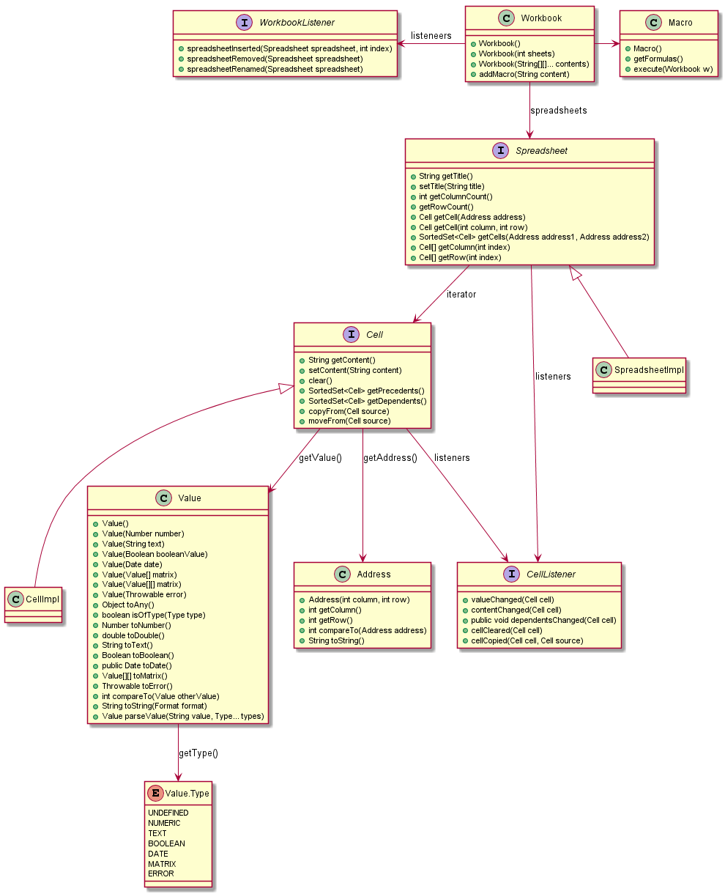
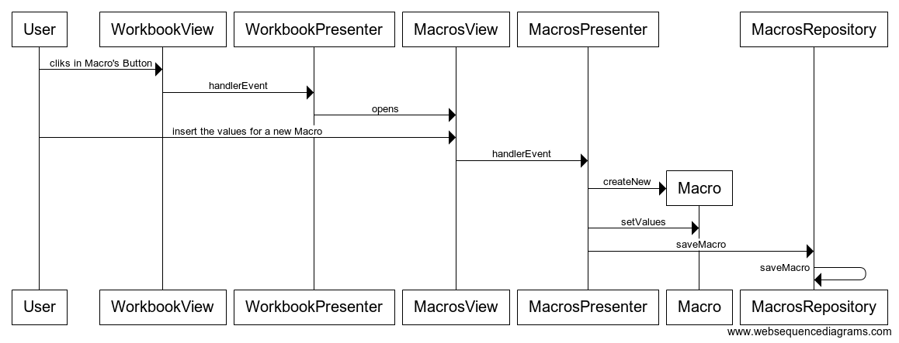
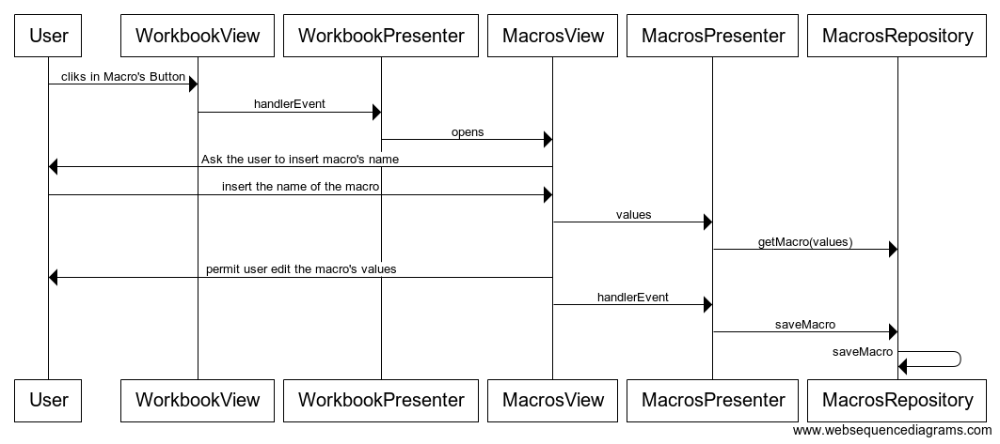
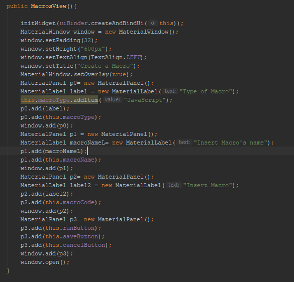
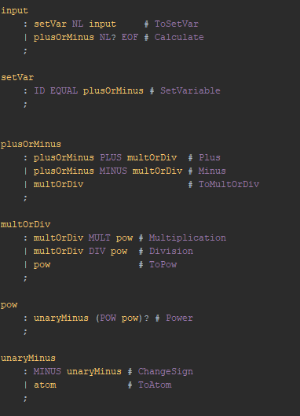

**João Oliveira** (1161248) - Sprint 1 - Lang08.1
===============================

# 1. General Notes

In this sprint I spend most of time understanding how MVP works and how adapt to the project, the ui and the grammar was created but it is needed connect the diferents components of the code.

# 2. Requirements

The mean requirement for this sprint is:

The application should support a language inspired in the syntax of Javascript. This language is to be an alterntive language to writing "Macros". This feature increment should have the same functionality as Lang06.1 but with the adaptations required by the syntax of the language.

UC1: Create a new workbook's macro.
UC2: Edit one workbook's macro.
UC2: Run one workbook's macro.

# 3. Analysis

For this feature increment, since it is the first one to be developed in a new project I need to:  

- Understand how I can display an UI for user insert the macro's value

- Understand how I can implement the best grammar for the language

- Understand how I can get the current workbook's value.

## 3.1 Analysis Diagrams

**Domain Model (for this feature increment)**

# 4. Design

Based in the previous Model and the MVP model i try to do the best design.
## 4.1. Tests
 

## 4.2. Requirements Realization

Following the guidelines for MVP from EAPLI we envision a scenario like the following for realizing the use cases for this feature increment.

**For UC1**

**For UC2**

## 4.3. Classes

- **Macro** has a one-to-one relationship with Workbook

## 4.4. Design Patterns and Best Practices

*Present and explain how you applied design patterns and best practices.*

By memory we apply/use:  
- Repository  
- MVP

**TODO:** Exemplify the realization of these patterns using class diagrams and/or SD with roles marked as stereotypes. 

# 5. Implementation

Macro's View
 

Parte of Grammar
 

# 6. Integration/Demonstration

*In this section document your contribution and efforts to the integration of your work with the work of the other elements of the team and also your work regarding the demonstration (i.e., tests, updating of scripts, etc.)*
It was very dificult understand how the model MVP was implemneted in project and it was the main
cause of a lack of time to implement all the features of the sprint.

# 7. Final Remarks 

*In this section present your views regarding alternatives, extra work and future work on the issue.*

Some Questions/Issues identified during the work in this feature increment:

1. I was depend of a implemention of a method to get a current workbook.

