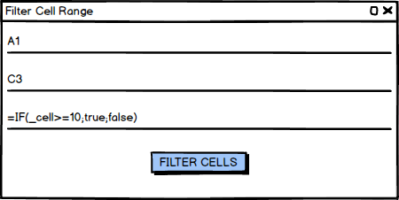

**Barbara Csonka** (1171715) - Sprint 2 - Core03.2
===============================

# 1. General Notes

At the start of Sprint 2, I had unexpected personal issues, which made me even more difficult to perform my best during this week. Since my own laptop had to be taken to service, and plus the fact that I had to leave the city for days because of personal reasons, it took me serious amount of time to solve this temporary and unfortunate situation. Again, just like in SP1, I could always rely on my team, which was huge easement for me.

# 2. Requirements

My task was the following: 

The user should be able to define a range of cells, doing things on the active spreadsheet.
The user should be able to define a certain column, where the formula - defined by the user - will be performed on.
In the light of the previous requirement, the rows what are in the ranged should be filtered, based on the previously defined boolean formula.

US - As a user, I would like to be able to select a range of cells in the table, and define a formula that could be applied to the selected range. If the formula is true, the selected rows should be hidden, otherwise it will stay visible.

# 3. Analysis

In order to draw up a proper solution for this task, I had to study and understand the task itself in depth, moreover, I had to get familiar with the working process of a boolean variable. As I mentioned before, I havent had any previous studies with GWT and Java either, and even though I tried my best to be better in this fields, I still have a long way to go, mainly because of the lack of time, and the problems I had to face and solve in the past days. 

## 3.1 Analysis diagrams

Use case

Domain model

The most important classes are the following:

WorkbookView
FilterCellRangeView
Spreadsheet

The user can click on the button, which indicates a popup window to show up, where a new View is created. On the sheet, the user can select the range of cells in the table (which are stored in a matrix with the start and end cell, as it was explained in chapter 3), and after given a formula, the chosen row will stay visible or may change to invisible, depending on the boolean formula. 

System sequence diagram:

In addition, because of the lack of time, I only managed to solve the following:

It is possible for the user to select a range of cells, e.g: B2:C4 in a table which has columns from A-F, and cells from 1-6.
In this case, in B2, B will be the indicator column, and the range of rows "2-4" will be subjected to either being set to invisible (if the formula evaluates to "false") or staz visible otherwise
This means, that all the values in column B (up to the row range limit, in this case row 4) will be checked according to the previously given formula, and according to that, the row (C4) is going to stay visible, or change to invisible.
		
Of course, if I would have more time, I would try to solve the task like how it would be expected from the side of the user/customer.
I made mockups to show how this task should work properly, in the best case. 

    

# 4. Design

## 4.1 Tests

Tests were created, however, GWT does not allow us to instantiate core classes like "SpreadSheet", "Cell", because they use GWT constructors, that are not available in the test packages. As such, these tests will never be able to run, but I believe, that without this technical issue, they would pass (as most of my colleagues are reporting this issue as well)

In terms of tests, I have to make sure that the correct cell address is found for a given input:

        /**
     * Test of findAddress method, of class SpreadsheetImpl.
     */
    @Test
    public void testFindAddress() {
        System.out.println("findAddress");

        String contents[][] = { // first spreadsheet
            {"10", "9", "8", "7", "a", "b", "c"}, {"8", "=1+7", "6", "5", "4", "3", "2"},
            {"1", "2", "3", "4", "5", "6", "7"}};

        String reference = “A1”;
        SpreadsheetImpl instance = new SpreadsheetImpl(new Workbook(), "teste",contents);
        Address expResult = new Address(0,0);
        Address result = instance.findAddress(reference);
        assertEquals(expResult, result);
    }

    /**
     * Test of getColumn method, of class SpreadsheetImpl.
     */
    @Test
    public void testGetColumn() {
        System.out.println("getColumn");
        String contents[][] = { // first spreadsheet
            {"10", "9", "8", "7", "a", "b", "c"}, {"8", "=1+7", "6", "5", "4", "3", "2"},
            {"1", "2", "3", "4", "5", "6", "7"}};

        SpreadsheetImpl sheet = new SpreadsheetImpl(new Workbook(), "test",contents);

	String reference = “D1”;
	Address address = sheet.findAddress(reference);

        int expResult = 3;

        int result = address.getColumn();

        assertArrayEquals(expResult, result);
    }

# 4.2 Requirements Realization

Sequence diagram:

## 4.3 Classes

##New classes and packages

"pt.isep.nsheets.client.lapr4.blue.s2.s1171715.filterCellRange"

This is the newly created package for my classes, which contains the classes FilterCellRangeView.java and FilterCellRangeView.ui.xml. They work together, since the interface FilterCellRangeView.ui.xml is binded to FilterCellRangeView.java

##Modifications to existing classes

WorkbookView.java
It is now extended with filterCellRange button and the belonging codeblock. 

# 5. Implementation
 
The biggest self-critique I have in regards to my design is the fact that I have not been able to apply the Model-View-Presenter pattern: instead, my entire logic is contained in a View, when in fact I should have delegated most of it to a Presenter. However, I really wanted to get something done, so I emulated what I saw most of my colleagues doing, so that I could ask them for minimal advice if I ran into a roadblock.

#FilterCellRange.java class

	public FilterCellRangeView(Spreadsheet spreadsheet) {
	 initWidget(uiBinder.createAndBindUi(this));
	        filterCellRangeWindow.open();

It works once the user filled in the fields. It collects all the parameters that were given.
	
			
	filterCellsButton.addClickHandler(event -> {
        		String formula = formulaBox.getValue();
	            String upperCell = upperCellInfo.getText();
	            String lowerCell = lowerCellInfo.getText();
				Address upperAdd = spreadsheet.findAddress(upperCell);
	            Address lowerAdd = spreadsheet.findAddress(lowerCell);
				range = spreadsheet.getCellRangeMatrix(upperAdd, lowerAdd);
	            column = upperAdd.getColumn();
	        });
	    }
		
This is the part of the popup window, where the start and end cell, and also the formula can be defined by the user. 
			
   public List<Integer> evaluate (){
			List<Integer> result = new ArrayList<>();
				result.add(1);
				result.add(3);
				return result;
	    }
		
This part evaluates a formula, in a specified cell range. It is not working properly now, since it always returns same values (returns indexes of the rows that has to be disabled according to the formula). 

# 6. Final Remarks

It was an interesting task to be solved, I enjoyed working on it, because it needed creativity and it was challenging to find a way to solve it somehow. 
