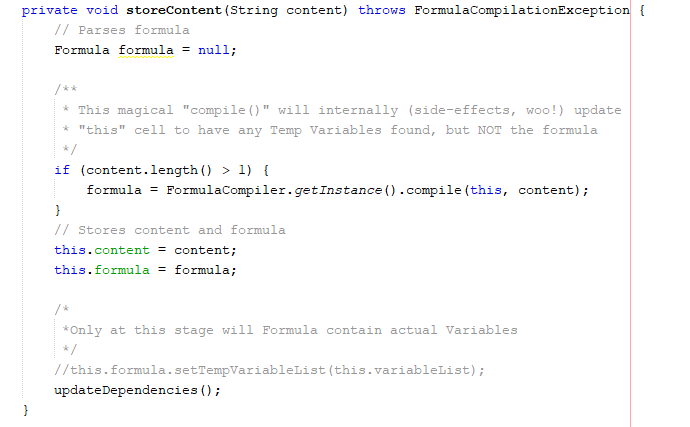
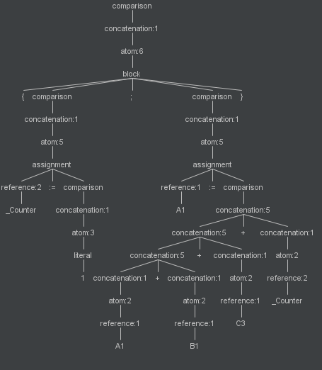
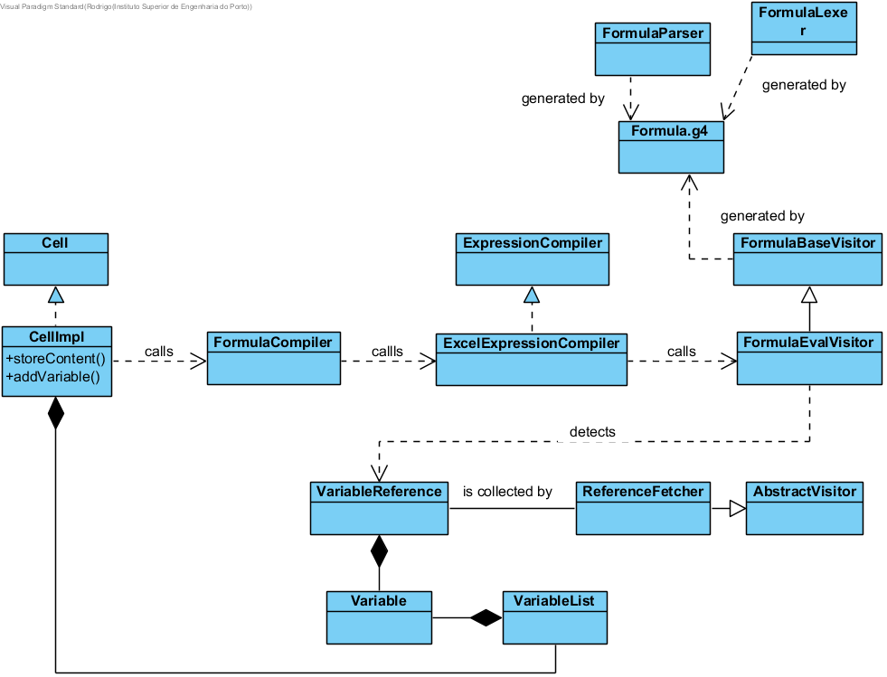
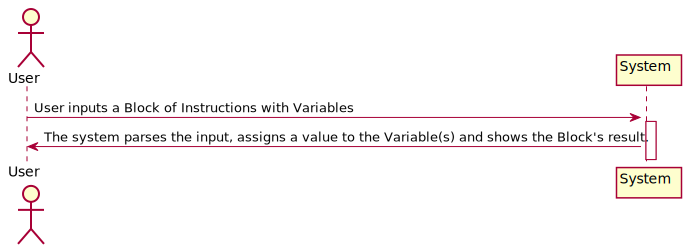
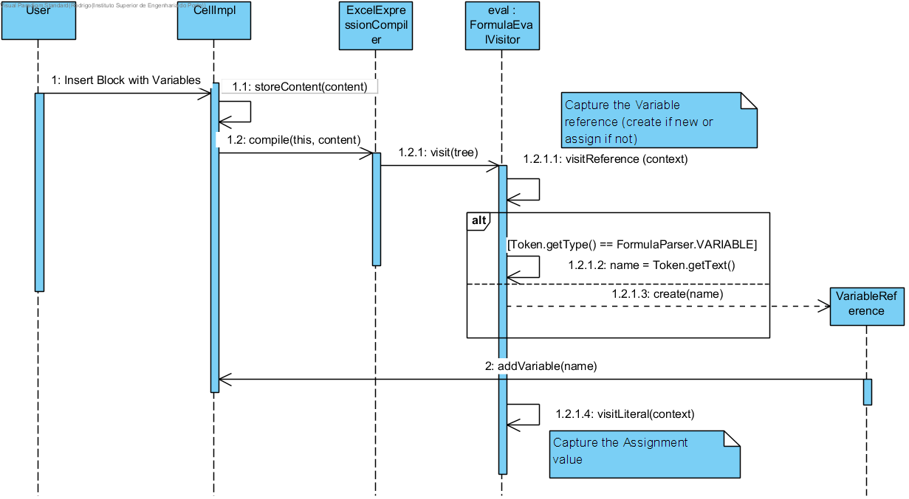

**João Vieira** (s1150575) - Sprint 2 - Lang02.1
===============================

# 1. General Notes

The first 2 days (Tuesday and Wednesday) I was trying to understand how the Lang component works. Initially I was going to do Lang02.2 but then the teacher told me it was better and more important to complete Lang02.1, which was when I started to study what Rodrigo did and thinking about what he could have done wrong.

# 2. Requirements

Lang02.1 - Temporary Variables should be recognized within the scope of an input formula.

Quoting the Product Owner:
"Add support for temporary variables. The name of temporary variables must start with the "\_" sign. When a variable is referred in a formula for the first time, it is created. To set the value of a variable it must be used on the left of the assign operator (":="). Temporary variables are variables that only exist in the context of the execution of a formula. Therefore, it is possible for several formulas to use temporary variables with the same name and they will be different instances. Example: "= {\_Counter:=1; WhileDo(Eval( "A"&\_Counter)> 0; {C1:=C1+Eval("B"&\_Counter); \_Counter:=\_Counter+1 }) }” . In this example, the cell C1 will get the sum of all the values of column B in that the corresponding values in column A are greater than zero."

Instead of the previous example, which uses artefacts that will supposedly only be implemented in Sprints 2 or 3 (like "WhileDo" and "Eval", Lang01.3), let's use a simpler one:

  *"= {\_Counter:=1; A1:=A1+B1+C3+\_Counter}*

If that block goes into a Cell in the bootstrapped workbook, and in conjunction with the specs for Lang01.1, the result A1 must be set is "23" because a "Counter" variable is set to "1" and A1 initial value is "10", B1 value is "9" and C3 value is "3".

This behavior therefore seems to be a very basic acceptance criteria. Note, however, that the requirements state VARIABLES (plural), which means a given Formula can include declarations for multiple ones.

Dependencies:

Lang01.1 is a critical dependency, because if NSheets is not capable of processing Blocks of Instructions as a Formula, then there is really no User-side way to check if the Variables are actually storing their value.

US - As a User of the Application I want to be able to use Variables in my Blocks of Instructions.

Proposal:

**US1** - Update grammar Formula.g4 to include new rules and operators:

RULES:

* **assignment** (reference ASSIGN comparison)
* **block**
* **loopfor**
* **atom** (added loopfor, block and assignment)
* **variable**

OPERATORS:

* **UND** ('\_')

**US2** - Understand how the application works when inserting a new formula on the worksheet:
  * Is it supposed to generate visitor and listener code automatically?

# 3. Analysis

For this feature increment I need to:  

- Create the ANTLR language.

- Create the Variable object.

- Create the VariableReference object.

- Create the VariableList object.

- Ensure that the Variable only exists in the formula context(temporary).

- Update the cell value according to the typed formula.

## 3.1 Which classes/packages am I gonna interact with (mainly)?

I've determined that I am probably going to spend my time in the "shared" Module of NSheets - that's where the "core", "formula" and "lang" packages are, after all.

I found out that:

- "pt.isep.nsheets.shared.core.CellImpl.storeContent()" is triggered whenever I select the "apply button" after typing something in a Cell.

- The "Content" parameter is the String to be parsed.

- On "storeContent()":

It starts by creating a "null" Formula and then, by calling "FormulaCompiler.getInstance().compile(this, content);". Judging by the already existing comment of "//Parses formula",  I'm going to have to go into the "compile()" method, because that's all it takes for Formula to have all its attributes properly set.

-Analysing the "compile()" method, it seems like it goes through a list of "compilers" that are able to parse the formula if it makes sense to them.

- Looking into "ExcelExpressionCompiler", I see that it's already taking care of defining and instantiating a basic Excel language.

## 3.2 Grammar and Language  

- Managed to find the Grammar "formula" for this "Excel Language" in "Other Sources", specifically "pt.isep.nsheets.shared.core.formula.compiler". Several definitions for "expression", "assignment", "comparison", but nothing for variables. I'll have to add rules for them here.

- Almost everything in this Grammar has a 1-to-1 match with "core" Java classes, so I'm probably gonna have to create one for "Variable", and maybe one for "VariableList" to ensure cases where someone inputs more than 1 Variable.

- With  IntelliJ ANTLR4 plugin I'm able to see the created grammar (for temporary variables) parse tree. I thought it could be an Atom, but I was wrong. It makes sense that a VARIABLE should behave just like a CELL_REF (e.g. "A1" or "B2"): they're both references.

- There is a "CellReference" class in "pt.isep.nsheets.shared.core.formula.lang" which implements "Reference". I'm gonna have to create a "VariableReference" in similar manner.

- Here are the proposed changes to "Formula.g4":

reference
	:	CELL_REF
		( ( COLON ) CELL_REF )?
                | VARIABLE
	;

  VARIABLE
          : UND LETTER ( NUMBER | LETTER) *
          ;

UND             : '\_';

## 3.3 GRAMMAR ANALYSIS

1 - Analysis for the case that we are using (referred above):

  * 1.1 - *"= {\_Counter:=1; A1:=A1+B1+C3+\_Counter}*

  

## 3.4 Server and RPC

. No changes here, this only affects the "core" in "NShared"

## 3.5 Analysis Diagrams

The main idea for the "workflow" of this feature increment.

**Use Cases**

- **Use Cases**. There is only one Use-Case, and that is typing in a Formula with Variables

**Domain Model (for this feature increment)**

**System Sequence Diagrams**

# 4. Design

. "CellImpl" reaches the "ExcelExpressionCompiler" after going through the more general "FormulaCompiler". This class goes through all available compilers ("Excel" being the only one available by default, additional ones will need to be added for the JavaScript and VisualBasic "inspired" languages).

. I have opted to create a new method "visitVariableReference()".

. Created "VariableReference", which is to "Variable" the same as "CellReference" is to "Cell": a kind-of "pointer" that includes a "Variable" in it.

. Altered "CellImpl.storeContent()" to copy Variable data to the FormulaCompiler.

## 4.1. Tests

  Regarding tests I try to follow an approach inspired by test driven development. All of the tests made are in the test folder, package pt.isep.nsheets.shared.core.formula.lapr4.green.s2.lang.n1150575.tempVariables. Here are the tests made:

**Domain classes**

      - public class Variable

**Test1:** I should ensure that the getName() method returns the correct name.

    @Test
    public void ensureGetNameReturnsRightName() {
        String expResult = "Name";
        String result = this.instance.getName();

        assertEquals(expResult, result);
    }

**Test2:** I should ensure that the getValue() method returns the correct value.

    @Test
    public void ensureGetValueReturnsRightValue() {
        Value expResult = new Value(0);
        Value result = this.instance.getValue();

        assertEquals(expResult, result);
    }

**Test3:** I should ensure that are the the setValue() method sets the correct value.

    @Test
    public void ensureSetValueReturnsRightValue() {
        Value expResult = new Value(10);
        this.instance.setValue(new Value(10));

        Value result = this.instance.getValue();

        assertEquals(expResult, result);
    }

**Test4:** I should ensure that the equals() method returns the correct answer.

    @Test
    public void ensureEqualsReturnsTrueWithEqualObjects() {
        Variable newVariable = new Variable("Name",new Value(0));

        boolean expResult = true;
        boolean result = this.instance.equals(newVariable);

        assertEquals(expResult, result);
    }

**Test5:** I should ensure that the equals() method returns the correct answer.

    @Test
    public void ensureEqualsReturnsFalseWithNullObjects() {
        Variable newVariable = null;

        boolean expResult = false;
        boolean result = this.instance.equals(newVariable);

        assertEquals(expResult, result);
    }

**Test6:** I should ensure that the equals() method returns the correct answer.

    @Test
    public void ensureEqualsReturnsFalseWithDifferentClassObjects() {
        Value newVariable = new Value(0);

        boolean expResult = false;
        boolean result = this.instance.equals(newVariable);

        assertEquals(expResult, result);
    }

      - public class VariableReference

**Test1:** I should ensure that the getName() method returns the correct name.

    @Test
    public void ensureGetNameReturnsCorrectName(){
        String name = "Name";

        String expResult = name;
        String result = instance.getName();

        assertEquals(expResult, result);
    }

**Test2:** I should ensure that the evaluate() method returns the correct value.

    @Test
    public void ensureEvaluateReturnsTheCorrectValue(){
        Value value = new Value(10);
        instance.setVariableValue(value);

        Value expResult = instance.evaluate();
        Value result = value;

        assertEquals(expResult, result);
      }

**Test3:** I should ensure that are the the setValue() method sets the correct value.

    @Test
    public void ensureSetVariableValueSetsTheCorrectValue(){
        Value value = new Value(10);
        instance.setVariableValue(value);

        Value expResult = instance.evaluate();
        Value result = value;

        assertEquals(expResult, result);
    }

**Test4:** I should ensure that the toString() method returns the correct answer.

    @Test
    public void ensureToStringReturnsTheCorrectString(){

        String expResult = "Name";
        String result = instance.toString();

        assertEquals(expResult, result);
    }

      - public class VariableList

**Test1:** I should ensure that the contains() method returns the correct value.

    @Test
    public void ensureContainsReturnsCorrectVariable(){
        String variableName = "Name";

        boolean expResult = true;
        boolean result = instance.contains(variableName);

        assertEquals(expResult, result);
    }

**Test2:** I should ensure that the addVariable() method adds the correct variable.

    @Test
    public void ensureAddVariableAddsVariable(){
        String variableName = "Name";
        instance.addVariable(new Variable(variableName, new Value(0)));

        boolean expResult = true;
        boolean result = instance.contains(variableName);

        assertEquals(expResult, result);
    }

**Test3:** I should ensure that are the the get() method returns the correct variable.

    @Test
    public void ensureGetReturnsVariable(){
        String variableName = "Name";
        instance.addVariable(new Variable(variableName, new Value(0)));

        Variable expResult = new Variable(variableName, new Value(0));
        Variable result = instance.get(variableName);

        assertEquals(expResult, result);
    }

**Services/Controllers:** There are no controllers or services to be tested.

**Test Coverage:** Due to problems regarding the use of the GWT framework it is not possible to quantify the test coverage.  

## 4.2. Requirements Realization

I envision a scenario like the following for realizing the use case for this feature increment.

Notes:  
- The diagram only depicts the less technical details of the scenario;
- **CellImpl** extends **Cell** making it the information expert regarding contents of a cell;
- **ExcelExpressionCompiler** is the compiler that will compile the block with the temporary variables;  
- **FormulaEvalVisitor** is the visitor that will visit every node of the block with the temporary variables;  
- **VariableReference** is the reference to a temporary variable.

## 4.3. Classes

All the needed classes for the use case were already implemented by Rodrigo. I changed a method implemented by Rodrigo (pt.isep.nsheets.shared.lapr4.blue.s1.lang.s1091234.blockOfInstructions.Assignment.applyTo) in order to make the uc work.

## 4.4. Design Patterns and Best Practices

I applied/used:  
- Information Expert
- MVP

# 5. Implementation

**Code Organization**  

As stated previously, all development was done only on the "NShared" module - User Input and Persistence are not my concerns for this Sprint, so no need to deal with Client or Server.

I followed the recommended organization for packages:  
- Code should be added (when possible) inside packages that identify the group, sprint, functional area and author;
- I used **pt.isep.nsheets.shared.core.formula.lapr4.blue.s1.lang.n1140420.tempVariables** that was a package created by Rodrigo and left a comment with my student number "1150575" in other classes I have made modifications to.

Here are the classes Rodrigo created:  
- Variable;
- VariableReference - container for "Variable", works similarly to "CellReference";
- VariableList - contains a HashMap that maps a Variable's "name" to the actual "Variable", so you can know if a Variable already exists or not;

Here is a brief summary of changed classes:

- AbstractVisitor - created "visitVariableReference()";
- FormulaEvalVisitor.visitReference() - condition to detect "VARIABLE" tokens included;
- ExpressionVisitor - changed "visitVariableReference()"";
- ExpressionBuilder - implements "visitVariableReference()";
- CellImpl.storeContent()
- CellImpl.addVariable() - adds a Variable if new, but returns it without adding if not (Created by Rogrigo).
- Formula - added a field of "VariableList"
- VariableList - implements Serializable

# 6. Integration/Demonstration

Since the model classes needed for this uc were already created by Rodrigo I focused on finding what he made wrong and fixing it. When I figured it out, I fixed it and made the tests.
On the weekend, Pedro Tedim was having some problems in the persistence because the model classes Rodrigo implemented were not persisting as they should(because they kind of belong to the workbook itself). We talked and then I made the VariableList able to persist to help him solve his problem.

# 7. Final Remarks and Tips for the next guy

I think my tests are a little bit weak but I did my best according to my knowledge. I searched how I could visualize the parse tree for the uc language and found out that IntelliJ has a plugin that allows us to do that.

Commits:

[Lang02.1: Updated the structure for sprint 2.](https://bitbucket.org/lei-isep/lapr4-18-2dl/commits/1c51267089e74e9f618e5335c23d71bf34cd6215)

[Lang02.1: I'm changing the selected use case. I'm enhancing Rodrigo's use case because it's not finished and it's of extreme importance to finish it. Wiki structure changed.](https://bitbucket.org/lei-isep/lapr4-18-2dl/commits/fa19d9e52afcf081874c54a9656c0c750a2b9ec8)

[Lang02.1: Merge branch 'master' of https://bitbucket.org/lei-isep/lapr4-18-2dl](https://bitbucket.org/lei-isep/lapr4-18-2dl/commits/a0de9efab54f67265cb1031ff3a1c321d1e4e9d0)

[Lang02.1: Modified the classes Rodrigo created in order to make Lang 2.1 work. Deleted class VariableList because it was not needed.](https://bitbucket.org/lei-isep/lapr4-18-2dl/commits/1ecee3cd6de68153e3e7e810a6a88d5777192a3a)

[Lang02.1: Modified the classes Rodrigo created in order to make Lang 2.1 work. Deleted class VariableList because it was not needed.](https://bitbucket.org/lei-isep/lapr4-18-2dl/commits/2fd3888e7b8cf5fceb3d48e856615d9004b59d26)

[Lang02.1: Modified the classes Rodrigo created in order to make Lang 2.1 work. Solved a small bug related to the spreadsheets.](https://bitbucket.org/lei-isep/lapr4-18-2dl/commits/2474b7f1cae68d65c968cbae75df884ca1771358)

[Lang02.1: Modified VariableList in order to make Workbook persistence work.](https://bitbucket.org/lei-isep/lapr4-18-2dl/commits/7b159ebe7f11d002163ceef2ae55c9aed2e4c16a)

[Lang02.1: Modified VariableList in order to make Workbook persistence work.](https://bitbucket.org/lei-isep/lapr4-18-2dl/commits/61c7db9e5d60574ba94ad256b97bc03b293592b8)

[Lang02.1: Merge branch 'master' of https://bitbucket.org/lei-isep/lapr4-18-2dl](https://bitbucket.org/lei-isep/lapr4-18-2dl/commits/f64e6385b2457d8ab4fd0a1bf86e66250e616074)

[Lang02.1: Tests added to the classes.](https://bitbucket.org/lei-isep/lapr4-18-2dl/commits/a7b437b2269f3277de68498f4cfd06fc79dcb0af)

[Lang02.1: Merge branch 'master' of https://bitbucket.org/lei-isep/lapr4-18-2dl](https://bitbucket.org/lei-isep/lapr4-18-2dl/commits/a9e161eab6630963e7ab16d007de5a56d329db03)
