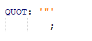
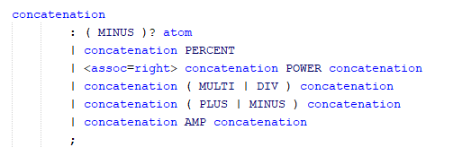

**João Vieira** (s1150575) - Sprint 3 - Core01.2
===============================
# 1. General Notes

In this sprint I tried to finish Pedro Tedim's job. Pedro couldn't manage to persist spreadsheets and wasn't able to make reference between spreadsheets. This being said I can say that I tried to finish his job but I wasn't able to do so because someone messed up with the work he had done and now it doesn't even persists workbooks, wich made me fail my attempt to implement the remaining things of this use case. I was able to create the ANTLR language to make references between spreadsheets but then got stuck when trying to implement it because of the problems referred above.

# 2. Requirements

Core01.2 - Complete Workbook View

The application should now support complete workbooks, i.e., workbooks with several spreadsheets. It should be possible to make references between sheets in the formulas. It should also be possible to delete workbooks and update their metadata (name and description).

During interpretation of the use case, I was able to identify three different user stories as represented in the use case diagram above.

**US1** Edit Workbook name/description

**US2** Delete workbook

**US3** Add new Spreadsheets to Workbook

- The user story above is supposed to answer to how one workbook now supports several spreadsheets.

**US4** Make reference between spreadsheets in the formulas

# 3. Analysis
## 3.1 Project Structure

In this project there are 3 main modules to be mentioned:

* Client
* Shared
* Server

In this specific use case, these three modules will have the following responsibilities:

**Client**
Because we use a MVP approach, classes like WorkbookView and WorkbookPresenter, HomeView and HomePresenter should be available.

WorkbookView should have available a function to add a new spreadsheet or to select another one apart from the present one.

**Shared**
This module should wrap all the information produced by the user and send it to the server or to receive information from the server, wrap it, and present it to the user in the client module.

To be able to wrap the information mentioned above, in this module, there should be classes responsible for this action. I will apply a DTO pattern to answer to this problem.

DTO classes:

  * WorkbookDTO
  * WorkbookDescriptionDTO
  * SpreadsheetDTO

**Server**
This module should be responsible for transactions related with the database.

This module should be able to persist Workbooks, Spreadsheets and WorkbookDescriptions. To be able to do just that, entity classes like Workbook, WorkbookDescription and Spreadsheet should be available.

## 3.2 Analysis Diagrams

Because there were some mistakes in the implementation of the use case Core01.1 some modifications are in need to be implemented.

To understand how the flow of Core01.1 should be, Pedro Tedim designed the following diagram:

The reconstruction of the project in terms of persistence proved to be difficult, a lot of classes implemented in sprint 1 had to be deleted or moved to another module.

## 3.3 Grammar and Language

There was no "structure" to be followed to refer to a spreadsheet, so I created a language capable of doing so. To refer a specific spreadsheet we should use the following notation:

**={A1:="!spread1.A1"}**

- **A1** would be the A1 cell of the current workbook.
- **"!spread1"** would be the name of the spreadsheet we wanted to refer to.
- **".A1"** would be the A1 cell of the spreadsheet we wanted to refer to.

Getting it all together this formula would give the A1 cell of the current spreadsheet the value of the A1 cell of the spreadsheet named spread1.

In the grammar I added the following tokens and rules:

## 3.4 Grammar Analysis

I used IntelliJ to be able to generate the parse tree that will be presented bellow(the presented parse tree is generated using the formula referred above):

## 3.5 Which classes/packages am I gonna interact with (mainly)?

I've determined that I am going to work in all the packages, but since I wasn't able to do anything related to core because of the problems I referred above, most of my time was spent in the shared package, because of the language itself.

I found out that:

- "pt.isep.nsheets.shared.core.CellImpl.storeContent()" is triggered whenever I select the "apply button" after typing something in a Cell.

- The "Content" parameter is the String to be parsed.

- On "storeContent()":

It starts by creating a "null" Formula and then, by calling "FormulaCompiler.getInstance().compile(this, content);". Judging by the already existing comment of "//Parses formula",  I'm going to have to go into the "compile()" method, because that's all it takes for Formula to have all its attributes properly set.

-Analysing the "compile()" method, it seems like it goes through a list of "compilers" that are able to parse the formula if it makes sense to them.

- Looking into "ExcelExpressionCompiler", I see that it's already taking care of defining and instantiating a basic Excel language.

# 4. Design

To add a spreadsheet to an existing workbook I created the following diagram:

The application should be able to find the workbook with the same name from the database, create a DTO related to that workbook with the information gathered from the database.
Then a new SpreadsheetDTO is created, added to the workbookDTO, persisted in the database and finally the updated workbookDTO will be saved in the DB.

To be able to persist spreadsheets of a workbook, the class SpreadsheetDTO should be implemented.

To delete an existing workbook, Pedro Tedim created the following Diagram:

error* The save(wb) method should be delete(wb)

## 4.1. Tests

I wasn't able to implement anything and since the workbooks weren't persisting after someone messed with the classes and I wasn't able to find the problem, no tests were implemented.

## 4.2. Design Patterns and Best Practices

By memory we apply/use:  
- DTO
- Factory
- Repository
- MVP

# 5. Implementation

To understand how the project structure in terms of persistence should be implemented these jpa annotations should do the trick:

**WorkbookDescription**
This class should have the information of which Workbook it belongs with a relation of OneToOne, because one Workbook should only have one description.

    @Entity
    public class WorkbookDescription implements AggregateRoot<Long>, Serializable {

    // ORM primary key
    @Id
    @GeneratedValue
    private Long id;

    private String name;
    private String description;

    /**
     * The user email of the user that created this workbook, empty if public workbook
     */
    private String userMail;

    @OneToOne
    private Workbook workbook;

 **Workbook**
 This class should have the ability to store many Spreadsheets so a List of spreadsheets should be available. The annotation @OneToMany(targetEntity = SpreadsheetImpl.class) the target entity of the List is an object of SpreadsheetImpl.

    @Entity
    public class Workbook implements Iterable<Spreadsheet>, Serializable {

    @Id
    @GeneratedValue(strategy = GenerationType.AUTO)
    Long id;
    /**
     * The unique version identifier used for serialization
     */
    private static final long serialVersionUID = -6324252462576447242L;
    /**
     * The spreadsheets of which the workbook consists
     */
    @OneToMany(targetEntity = SpreadsheetImpl.class)
    private List<Spreadsheet> spreadsheets = new ArrayList<>();

    @ElementCollection
    private List<Macro> macros = new ArrayList<>();

**SpreadsheetImpl**
The spreadsheet should have the information of what Workbook it belongs. A relation of ManyToOne was implemented. To persist the cells, it's addresses and it's value. I created a OneToMany relationship with CellImp entity class. Because a spreadsheet consists in a n number of cells an ElementCollection should be implemented, this ElementColection should be compiled as a table that stores the cell addresses.

    @Entity
    public class SpreadsheetImpl implements Spreadsheet {

    @Id
    @GeneratedValue(strategy = GenerationType.AUTO)
    private Long id;

    /**
     * The unique version identifier used for serialization
     */
    private static final long serialVersionUID = 7010464744129096272L;

    /**
     * The workbook to which the spreadsheet belongs
     */
    @ManyToOne
    private Workbook workbook;

    /**
     * The cells that have been instantiated
     */
    @OneToMany(targetEntity = CellImpl.class)
    @ElementCollection
    @CollectionTable(name = "Cell_Adresses")
    @MapKeyColumn(name = "Column_Adresses")
    @Column(name = "Cell_Columns")
    private Map<Address, Cell> cells = new HashMap<Address, Cell>();

**CellImpl**
This class should have the information of which spreadsheet it belongs, because of this the annotation should be @VariableOneToOne to map to an interface, in this case Spreadsheet.

    @Entity
    public class CellImpl implements Cell, Serializable, IsSerializable {

    @Id
    @GeneratedValue(strategy = GenerationType.AUTO)
    /**
     * The unique version identifier used for serialization
     */
    private static final long serialVersionUID = 926673794084390673L;

    /**
     * The spreadsheet to which the cell belongs
     */
    @VariableOneToOne
    private Spreadsheet spreadsheet;

    /**
     * The address of the cell
     */
    @Embedded
    private Address address;

    /**
     * The value of the cell
     */
    @Embedded
    private Value value = new Value();

    /**
     * The cell's precedents
     */
    @ElementCollection
    private Set<Cell> precedents = new TreeSet<Cell>();

    /**
     * The cell's dependents
     */
    @ElementCollection
    private Set<Cell> dependents = new TreeSet<Cell>();

    @Id
    @GeneratedValue(strategy = GenerationType.AUTO)
    private Long id;   

**Address**
Because Address is dependent on the existence of a cell
the @Embeddable annotation over a class defines that, it does not have independent existence. The same goes for value.

    @Embeddable
    public class Address implements Comparable<Address>, Serializable {

**Value**
As described for Address

    @Embeddable
    public class Value implements Comparable<Value>, Serializable {

# 6. Integration/Demonstration

Since the model classes needed for this use case were already implemented by John Doe I focused on finding how could I persist spreadsheets, how can I create references between spreadsheets and how to have several spreadsheets in a workbook, as well as presenting them. I spent some of my time helping other elements of the red team solving their use cases because I'm more confortable with the Lang part of this project and since they were having some problems implementing their use cases I decided to help.

# 7. Final Remarks

I'm very disappointed with this sprint because I wasn't able to do as much as I wished to do. Unfortunately the persistency stopped working and that affected my work throughout the sprint. I tried hard to find the problem but I wasn't able to solve it.

# 8. Work Log

As you'll notice reading the documentation I didn't did much because I really got stuck with the problems that appeared througout the week, so my worklog is very poor.

[Core01.2: Updated the documentation structure for sprint 3.](https://bitbucket.org/lei-isep/lapr4-18-2dl/commits/add6f81f2c0da10e022d552896e08770453931e1)

[Core01.2: Created the language in Formula.g4 in order to be able to refer another spreadsheets.](https://bitbucket.org/lei-isep/lapr4-18-2dl/commits/add6f81f2c0da10e022d552896e08770453931e1)

[Core01.2: Final Documentation added.](https://bitbucket.org/lei-isep/lapr4-18-2dl/commits/add6f81f2c0da10e022d552896e08770453931e1)
