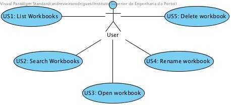
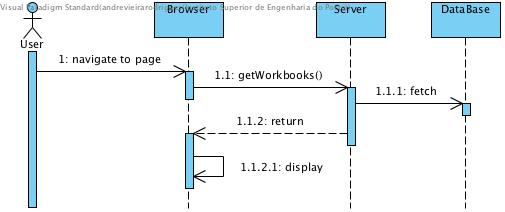
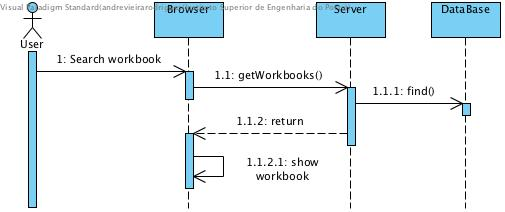
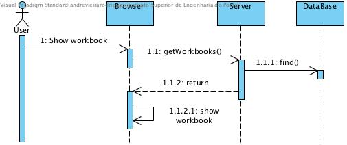
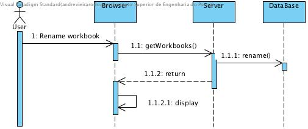
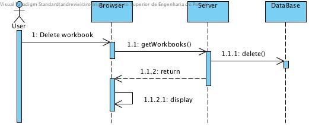

**Carlos Rodrigues** (s1151136) - Sprint 1 - IPC06.1
===============================

# 1. General Notes

# 2. Requirements

- **IPC06.1 - Public Workbooks**

 Workbooks should be considered public. A public workbook is a workbook that can be accessed by all users. The "Home" page should display all the workbooks. It should be possible to apply filters to this view/page to display only workbooks with specific names or descriptions (the application should accepted regular expressions to filter the workbooks). It should be possible to open, rename or delete a selected workbook in this page/view.

Proposal:

US1 - As a User of the application I want all workbooks to be displayed in the Home Page

US2 - As a User i want to be able searching workbooks by name, description or regular expressions

US3 - As a User i want to be able to open a selected workbook in this page/view

US4 - As a User i want to be able to rename a selected workbook in this page/view

US5 - As a User i want to be able to delete a selected workbook in this page/view

# 3. Analysis

For this feature increment, since it is the first one to be developed in a new project I need to:  

- Understand how the application works and also understand the key aspects of GWT, since it is the main technology behind the application  

- Understand how the Home Page is implemented (for instance, how the UI gets the Workbooks that are displayed)

- Enable a search bar (MaterialSearch) for searching workbooks by name, description or regular expressions

- Enable a modal action on title card to open the selected workbook in this page/view

- Enable a link button (MaterialLink) on card (MaterialCard) to rename the selected workbook

- Enable a link button on card to delete the selected workbook

## 3.4 Analysis Diagrams

The main idea for the "workflow" of this feature increment.

**Use Cases**

- **Use Cases**. Since these use cases have a one-to-one correspondence with the User Stories we do not add here more detailed use case descriptions. We find that these use cases are very simple and may eventually add more specification at a later stage if necessary.

**System Sequence Diagrams**

**For US1**

**For US2**

**For US3**

**For US4**

**For US5**

# 4. Design

## 4.2. Requirements Realization

Following the guidelines for JPA from EAPLI we envision a scenario like the following for realizing the use cases for this feature increment.

**For US1**

Notes:  

**For US2**

Notes:

**For US3**

Notes:  

**For US4**

Notes:

**For US5**

Notes:

# 5. Implementation

**For US1**

The UI for this US was already implemented.

**For US2**

**UI: Navigation search bar for searching Workbooks**

For this concern we decided to use a Material Widget called Material Nav Bar (Navigation Bar). This is a navigation bar that contains a text field that appears at the top of the screen and contains actions available for keep the search element saved on a variable.

We updated the HomeView.ui.xml accordingly and declare the element with a tag *ui:field="txtSearch"*.

    @UiField
    MaterialSearch txtSearch;

We must now add the code that invokes the server to add a new workbook description when the user clicks in the button. This is an event. To implement this behavior we could use GWT Events such as the SetPageTitleEvent already used in the application. These are special type of events that GWT manages and are available to all pages in the application.

We chose to provide our click event globally but to simple use the click event handler of the button and connect it to a method in the HomePresenter.

Since Presenters should only depend on a View interface we added a new method to the HomePresenter.MyView:

	interface MyView extends View {
		void setContents(ArrayList<WorkbookDescriptionDTO> contents);
		void addClickHandler(ClickHandler ch);
	}

Then, we implemented the *addClickHandler* in the HomeView class and call this method in the constructor of the HomePresenter. In the constructor our handler class the server method that adds a new workbook description.   

**Code Organization**  

We followed the recommended organization for packages:  
- Code should be added (when possible) inside packages that identify the group, sprint, functional area and author;
- For instance, we used **lapr4.white.s1.core.n4567890**

The code for this sprint:  
Project **server**    
- pt.isep.nsheets.server.**lapr4.white.s1.core.n4567890**.workbooks.application: contains the controllers  
- pt.isep.nsheets.server.**lapr4.white.s1.core.n4567890**.workbooks.domain: contains the domain classes  
- pt.isep.nsheets.server.**lapr4.white.s1.core.n4567890**.workbooks.persistence: contains the persistence/JPA classes
- Updated the existing class: **pt.isep.nsheets.server.WorkbookServiceImpl**

Project **shared**  
- Added the class: **pt.isep.nsheets.shared.services.DataException**: This class is new and is used to return database exceptions from the server  
- Updated the classes: **pt.isep.nsheets.shared.services.WorkbookService** and **pt.isep.nsheets.shared.services.WorkbookServiceAsync**  

Project **NShests**
- Updated the classes: **pt.isep.nsheets.client.aaplication.home.HomeView** and **pt.isep.nsheets.client.aaplication.home.HomePresenter**  
- Updated the file: **pt.isep.nsheets.client.aaplication.home.HomeView.ui.xml**  

# 6. Integration/Demonstration

# 7. Final Remarks

Some Questions/Issues identified during the work in this feature increment:

1. The method getWorkbooks in the WorkbooksService returns an ArrayList. Maybe we should not bind the result to a specific collection implementation.

# 8. Work Log

Commits:

[Started new example documentation for John Doe Core00.0.](https://bitbucket.org/lei-isep/nsheets/commits/7d9ae99772cce77627454021ea814867a8ef3223)
