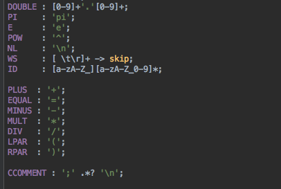

**Carlos Rodrigues** (s1151136) - Sprint 2 - Lang06.1
===============================

# 1. General Notes

Taking into account that it did not make sense to give the beginning to the UC Lang06.2 without the UC Lang06.1 be working I opted to give continuity to this. From the beginning I had some problems to understand everything that was implemented, especially about the grammar. Initially I opted to do the import of the grammar already existing, formula, but after some problems, I had to implement in another way.

# 2. Requirements

- **Lang06.1 - Macros Language**

The application should have a new option to open a window to edit and execute a single macro. Macros should be designed as a complete new language in the application. However, its initial grammar should be very simple and "inspired" in the language of the formulas. In particular, a macro is simply a sequence of formulas that are executed sequentially. The formulas are the same as those used in the cells. Each line of the macro may contain a formula or be a comment. A comment is a line that starts with the character ";". The lines of the macros must support all that is possible to do with the cell formulas that start with "=" (but in the macros the lines can not start with "="). The macro is to be associated with the current workbook. The result of executing a macro is the result of the last executed instruction. The new window should have an area to edit the text of the macro and button to run the macro. The result of the execution of the macro should also appear in the window.

Proposal:

US1 - Create macro

US2 - Run macro

# 3. Analysis

- Understand how the application compiles and validates the formulas

- Understand all of the association of the formulas and expressions to the antlr4 files

-  Implement a grammar that accepts invocations of comments and expressions

## 3.1 Grammar Analysis

- Each line of the macro may contain a formula or be a comment. A comment is a line that starts with the character ";". The lines of the macros must support all that is possible to do with the cell formulas that start with "=" (but in the macros the lines can not start with "=").

## 3.4 Analysis Diagrams

**Use Cases**

**System Sequence Diagrams**

**For US1**

**For US2**

# 4. Design

## 4.1. Tests

- Result:
	

## 4.3. Classes

- Macro
- MacroCompiler
- MacrosBaseVisitorImpl

## 4.4. Design Patterns and Best Practices

By memory we apply/use:  
- Singleton  
- MVP  

**TODO:** Exemplify the realization of these patterns using class diagrams and/or SD with roles marked as stereotypes.

# 5. Implementation

**For US1**

- The UI for this US was already implemented, i just had to change some options, like buttons and add a new type of macro.

**For US2**

- For this use case it was necessary to change the grammar, so you could also accept comments. Initially i chose to import the existing grammar project, formulas. During all the changes in grammar, made in IntelIJ, apparently was working, but moving to JAVA, the import didn't work. So I opted to make changes to the Macros grammar, completed and test successfully passed to java and dealt with the classes responsible for visiting the tree.

# 6. Integration/Demonstration

- Button to create macro:

	

- Macro View window:

	

- Executing:

	

- Grammar:

	

	
