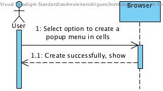
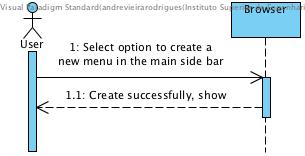
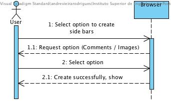
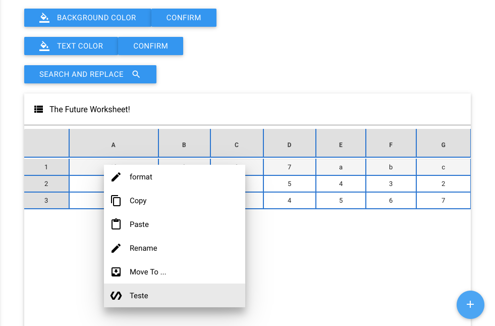

**Carlos Rodrigues** (s1151136) - Sprint 3 - Core02.2
===============================

# 1. General Notes

At the beginning of the sprint, i lost a bit time to help a colleague in the improvement of the delivery of the sprint 2.
I also had some doubts about what i was supposed to do in concrete  regarding this use case.

# 2. Requirements

- **Core02.2 - Full Extension Mechanism**

> The extensions should now contribute also with popup menus in cells, menu options in the navigator and side bars.

Proposal:

US1 - Create/add a popup menu

US2 - Create/add a new menu in the main side bar

US3 - Create side bars

# 3. Analysis

For this feature increment, since it is the first one to be developed in a new project I need to:  

- Understand how the application works and also understand the key aspects of GWT, since it is the main technology behind the application  

- Understand how to create/add new fields through other classes   

## 3.4 Analysis Diagrams

**Use Cases**

**System Sequence Diagrams**

**For US1**

**For US2**

**For US3**

# 4. Design

## 4.1. Tests

No tests were developed, not was necessary.

## 4.3. Classes

- ExtensionModule
- ExtensionPresenter
- ExtensionView
- ExtensionView.ui

## 4.4. Design Patterns and Best Practices

No design patterns were used.

# 5. Implementation

- I initially created a new menu in the main side bar, named Extension, where there were three options of extensions.

**For US1**

> Create/add a popup menu
- When selected the option to create a new popup menu, after entering the name is added to the popup list items in workbook class. To make this possible it was necessary to change the static reference in WorkbookView class, popupMenu field and make a get of the same.

**For US2**

> Create/add a new menu in the main side bar
- When selectd the option to create a new menu in the main side bar, after entering the name is added to the list items in Menu class. To make this possible it was necessary change to static the reference in MenuView class the sideNav field and make a get.

**For US3**

> Create side bars
- Unfortunately I couldn't finish this user storie, the attempts were several, but I did not have time to find a solution with the expected result. All of them changed the visual aspect of the application, which made it unpleasant to see and made it lose some of the functionality already implemented.

# 6. Integration/Demonstration

**For US1**

**For US2**

# 8. Work Log

Commits:

[Core 02.2 - (Documentation and implementation) - Initial documentation, added extension window and configurate buttons  ](https://bitbucket.org/lei-isep/lapr4-18-2dl/commits/875da4aa99d4)

[Core 02.2 - Implementation - Create popup menu in cells and a new menu in the main side bar ](https://bitbucket.org/lei-isep/lapr4-18-2dl/commits/e06ffa03f8ee)
