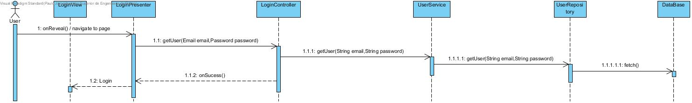

**Paulo Magalhães** (s1160570) - Sprint 1 - IPC01.1
===============================

# 1. General Notes

# 2. Requirements

IPC01.1 - All the pages of the application should require an authenticated user (except the "About" page). The application should have a "Login" page (Hint: Gatekeepers in GWTP). Some hard-coded users should be defined to be initially used for authentication. There should also exist a super-user that is able to access everything.

US1 - As Product Owner, I want users (email and password) to come from a relational database, so they are persistent and we can log in and subsequently change the email or password.

US2 - As an application user, I wish to be able to log in to access my workbooks.

# 3. Analysis

*In this section you should describe the study/analysis/research you developed in order to design a solution.*

For this feature increment, since it is the first one to be developed in a new project I need to:  

- Understand how the application works and also understand the key aspects of GWT, since it is the main technology behind the application  

- Understand how the Home Page is implemented (for instance, how the UI gets the Workbook Descriptions that are displayed)  

- Understand how to integrate a relational database into the project (Will be assuming JPA since it is studied in EAPLI)   

## 3.1 GWT and Project Structure

**Modules**. From the pom.xml file we can see that the application is composed of 5 modules:  
- **server**. It is the "server part" of the web application.  
- **shared**. It contains code that is shared between the client (i.e., web application) and the server.   
- **nsheets**. It is the web application (i.e., Client).  
- **util**. This is the same module as the one of EAPLI.  
- **framework**. This is the same module as the one of EAPLI.   

From [GWT Overview](http://www.gwtproject.org/overview.html): *"The GWT SDK contains the Java API libraries, compiler, and development server. It lets you write client-side applications in Java and deploy them as JavaScript."*

Therefore:
  - The project is totally developed in Java, event for the UI parts.
  - GWT uses a technique know as "transpilation" to translate Java code to Javascript. This is totally transparent to the user
  - A GWT application is comprised of "GWT modules" (see [GWT Tutorial](http://www.gwtproject.org/doc/latest/tutorial/create.html)). These GWT modules are described in .gwt.xml files.
   The nsheets project contains a .gwt.xml file named nsheets.gwt.xml (nsheets/src/main/resources/pt/isep/nsheets/nsheets.gwt.xml). One of the important contents of the file is the specification of the entry point of the application. However, since the application uses the [GWTP framework](http://dev.arcbees.com/gwtp/) the entry point is automatically provided (no need to specify it in the .gwt.xml file). In this case what is specified is the GIN client module pt.isep.nsheets.client.gin.ClientModule:

	    <extend-configuration-property name="gin.ginjector.modules"
                                   value="pt.isep.nsheets.client.gin.ClientModule"/>

   It is from this **ClientModule** that the application starts.
   Another important content of a .gwt.xml file is setting the paths for translatable code, .i.e., java code that should be translated to javascript. Usually the default source path is the client subpackage underneath where the .gwt.xml File is stored. In this case every code inside package pt.isep.nsheets.client and pt.isep.nsheets.shared will be translated to javascript.

	<!-- Specify the paths for translatable code                    -->
    <source path='client'/>
    <source path='shared'/>

   The shared package is where shared code between server and client should reside. See [GWT - What to put in the shared folder?](https://stackoverflow.com/questions/5664601/gwt-what-to-put-in-the-shared-folder?utm_medium=organic&utm_source=google_rich_qa&utm_campaign=google_rich_qa) and also [using GWT RPC](http://www.gwtproject.org/doc/latest/tutorial/RPC.html).

   In this project the shared, server and client (i.e, nsheets) code are separated also in Maven modules (but they could all be in the same project/maven module).

## 3.2 Application Startup and GWTP

  As described before the entry point for the application is the class **pt.isep.nsheets.client.gin.ClientModule**.

  GWTP follows the MVP (Model-View-Presenter) pattern. It uses [GIN dependency injection](http://dev.arcbees.com/gwtp/core/presenters/gin-bindings.html) to put together the parts of each MVP. How the GWTP structures the application and uses GIN to bind all the required elements is described in [GWTP Beginner's Tutorial](http://dev.arcbees.com/gwtp/tutorials/index.html).

  We can see that **ClientModule** installs the base presenter of the application:

      install(new ApplicationModule());

  The **ApplicationModule** module install all the other modules of the application:

    install(new HomeModule());
    install(new MenuModule());
    install(new AboutModule());
    install(new WorkbookModule());
    install(new loginModule());  

  Each module represents an MVP page in the application.

  In this MVP pattern each presenter defines a specific interface that is use to communicate with the UI (i.e., the View). Therefore the presenter can be fully isolated from dependencies related to the UI. For instance, the View interface that is defined by the ApplicationPresenter only has one method:

  interface MyView extends View {
          void setPageTitle(String title, String description, String link, String specification);
  }

In this specific case the only type that is "shared" between Presenter and View is the String.

  The View class is where all the UI code should be implemented. In GWT it is possible to create UI elements programmatically (see [GWT Build the UI](http://www.gwtproject.org/doc/latest/tutorial/buildui.html)). The UI can also be described in .ui.xml files using [UIBinder](http://www.gwtproject.org/doc/latest/DevGuideUiBinder.html). The NSheets project is using [GWT Material Design](https://github.com/GwtMaterialDesign/gwt-material) and therefore all the UI widgets are from that library.

  In the case of the Application module we can see that there is a ApplicationView.ui.xml. This file declares some widgets. The attribute ui:field can be used to specify an id that can be then used to bind that element to a class in the code. For instance, in ApplicationView.ui.xml:

  <m:MaterialPanel ui:field="panel">
    <m:MaterialLabel ui:field="title" text="NSheets" fontSize="2.3em"/>
    <m:MaterialLabel ui:field="description" text="A Sophisticated Web Spreadsheet Application." fontSize="1.1em"/>
  </m:MaterialPanel>

  It is set the ui:field attribute for two existing labels. In the code (ApplicationView.java) one can bind to Widgets classes. For instance:

  @UiField
    MaterialLabel title, description;

  Then we can use this instances to access the widgets link in:

  @Override
  public void setPageTitle(String title, String description, String link, String specification) {
        this.title.setText(title);
        this.description.setText(description);
        new MaterialAnimation().transition(Transition.BOUNCEINLEFT).animate(this.title);
        new MaterialAnimation().transition(Transition.BOUNCEINLEFT).animate(this.description);
    }    

## 3.4 Analysis Diagrams

**Use Cases**

- **Use Cases**. Since these use cases have a one-to-one correspondence with the User Stories we do not add here more detailed use case descriptions. We find that these use cases are very simple and may eventually add more specification at a later stage if necessary.

**Domain Model (for this feature increment)**

- **Domain Model**. Since we found no specific requirements for the structure of User we follow the Structure of the existing DTO (UserDTO).

**System Sequence Diagrams**

**For US1**

# 4. Design

## 4.1. Requirements Realization

*In this section you should present the design realization of the requirements.*

Following the guidelines for JPA from EAPLI we envision a scenario like the following for realizing the use cases for this feature increment.

**For US1**

Notes:  
- The diagram only depicts the less technical details of the scenario;  
- For clarity reasons details such as the PersistenceContext or the RepositoryFactory are not depicted in this diagram.   
- **UserServices** realizes the GWT RPC mechanism;  
- **LoginController** is the *use case controller*;  

## 4.2. Design Patterns and Best Practices

*Present and explain how you applied design patterns and best practices.*

By memory we apply/use:  
- Singleton  
- Repository  
- DTO  
- MVP  

**TODO:** Exemplify the realization of these patterns using class diagrams and/or SD with roles marked as stereotypes.

# 5. Implementation

**Code Organization**  

We followed the recommended organization for packages:  
- Code should be added (when possible) inside packages that identify the group, sprint, functional area and author;
- For instance, we used **lapr4.white.s1.core.n4567890**

The code for this sprint:  
Project **server**    
- pt.isep.nsheets.server.**lapr4.white.s1.core.s1160570.login.application**: contains the controllers  
- pt.isep.nsheets.server.**lapr4.white.s1.core.s1160570.login.domain**: contains the domain classes User,Email,Password,Name,UserType
- pt.isep.nsheets.server.**lapr4.white.s1.core.n4567890.workbooks.persistence**: contains the persistence/JPA classes
- Add the class: **pt.isep.nsheets.server.UserServiceImpl**

Project **shared**  
- Added the class: **pt.isep.nsheets.shared.services.DataException**: This class is new and is used to return database exceptions from the server  
- Create the classes: **pt.isep.nsheets.shared.services.UserService** and **pt.isep.nsheets.shared.services.UserServiceAsync**  

Project **NShests**
- Updated the classes: **pt.isep.nsheets.client.lapr4.green.s1.s1150670.aplication.login.LoginView** and **pt.isep.nsheets.client.lapr4.gren.s1.s1160570.aplication.login.LoginApresenter**  
**pt.isep.nsheets.client.lapr4.gren.s1.s1160570.aplication.login.LoginModule**  
- Create the file: **pt.isep.nsheets.client.lapr4.gren.s1.s1160570.aplication.login.LoginView.ui.xml**  

# 6. Integration/Demonstration

*In this section document your contribution and efforts to the integration of your work with the work of the other elements of the team and also your work regarding the demonstration (i.e., tests, updating of scripts, etc.)*

# 7. Final Remarks

*In this section present your views regarding alternatives, extra work and future work on the issue.*

# 8. Work Log

*Insert here a log of you daily work. This is in essence the log of your daily work. It should reference your commits as much as possible.*

Commits:
