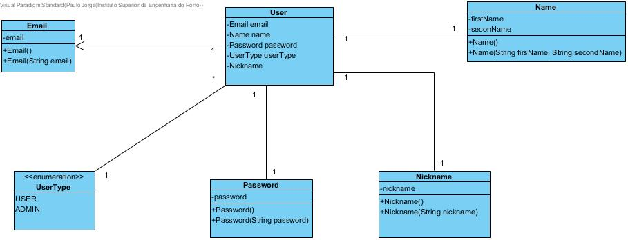
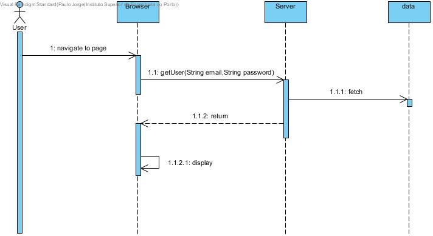
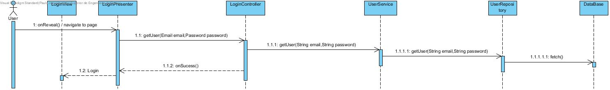

**Paulo Magalhães** (s1160570) - Sprint 1 - IPC01.1
===============================

# 1. General Notes

# 2. Requirements

IPC01.1 - User Authentication

All the pages of the application should require an authenticated user (except the "About" page). The application should have a "Login" page (Hint: Gatekeepers in GWTP). Some hard-coded users should be defined to be initially used for authentication. There should also exist a super-user that is able to access everything.

US1 - Understand how the application works and later the Gatekeeper.

US2 - Create classes in Server.

* **Email**
* **Password**
* **UserType**
* **Name**
* **Nickname**
* **UserServiceImpl**
* **LoginController**
* **User**

US3 - Create classes in shared

* **EmailDTO**
* **PasswordDTO**
* **UserTypeDTO**
* **NameDTO**
* **NicknameDTO**
* **UsersServiceAsync**
* **UsersService**
* **UserDTO**

US4 - Create classes in Web

* **CurrentUser**

# 3. Analysis

For this feature increment, since it is the first one to be developed in a new project I need to:  

- Understand how the application works and also understand the key aspects of GWT, since it is the main technology behind the application  

- Understand how the Home Page is implemented (for instance, how the UI gets the Workbook Descriptions that are displayed)  

- Understand how to integrate a relational database into the project (Will be assuming JPA since it is studied in EAPLI)   

- Understand how the gatekeeper works to put dysfunctional buttons before login

## 3.1 GWT and Project Structure

**Modules**. From the pom.xml file we can see that the application is composed of 5 modules:  
- **server**. It is the "server part" of the web application.  
- **shared**. It contains code that is shared between the client (i.e., web application) and the server.   
- **nsheets**. It is the web application (i.e., Client).  
- **util**. This is the same module as the one of EAPLI.  
- **framework**. This is the same module as the one of EAPLI.   

### 3.1.1 Server

  These classes have the method need of fromDTO and toDTO that serve to convert the classes to be possible to use the shared classes.

 * **Email** - It is a class that presents a string ('email') that refers to the User's email.
 * **Password** - Is a class that has a string ('password') that refers to the User's password.
 * **Name** - This is a class that has two string ('firstName', 'seconName') that refers to the User name.
 * **Nickname** -This is a class that has a string ('nickname') that refers to the nickname of the User.
 * **UserType** - Is an enumeration that displays the type of User ('USER', 'ADMIN').

---------------------------------------------------------

 * **LoginController** - This class presents the method that will get a certain User the database, through the method (getUser (String email, String password))

* **UserServiceImpl** - This class serves to connect the shered to server

* **User** - It is a class that presents a Email,PAssword,Name,Nickname and UserType.

### 3.1.2 Shared

* **EmailDTO** - It is a class that presents a string ('email') that refers to the User's email.
* **PasswordDTO** - Is a class that has a string ('password') that refers to the User's password.
* **NameDTO** - This is a class that has two string ('firstName', 'seconName') that refers to the User name.
* **NicknameDTO** -This is a class that has a string ('nickname') that refers to the nickname of the User.
* **UserType** - Is an enumeration that displays the type of User ('USER', 'ADMIN')
* **UsersServiceAsync/UsersService**- These classes serve to communicate with the userServiceImp

### 3.1.2 Web

* **CurrentUser** - This class has a userDto and a boolean both static to check which user logged in.

## 3.4 Analysis Diagrams

**Use Cases**

- **Use Cases**. Since these use cases have a one-to-one correspondence with the User Stories we do not add here more detailed use case descriptions. We find that these use cases are very simple and may eventually add more specification at a later stage if necessary.

**Domain Model (for this feature increment)**

- **Domain Model**. Since we found no specific requirements for the structure of User we follow the Structure of the existing DTO (UserDTO).

**System Sequence Diagrams**

**For US1**

# 4. Design

## 4.1. Requirements Realization

*In this section you should present the design realization of the requirements.*

Following the guidelines for JPA from EAPLI we envision a scenario like the following for realizing the use cases for this feature increment.

**For US1**

Notes:  
- The diagram only depicts the less technical details of the scenario;  
- For clarity reasons details such as the PersistenceContext or the RepositoryFactory are not depicted in this diagram.   
- **UserServices** realizes the GWT RPC mechanism;  
- **LoginController** is the *use case controller*;  

# 5. Implementation

**Code Organization**  

We followed the recommended organization for packages:  
- Code should be added (when possible) inside packages that identify the group, sprint, functional area and author;
- For instance, we used **lapr4.white.s1.core.n4567890**

The code for this sprint:  
Project **server**    
- pt.isep.nsheets.server.**lapr4.white.s1.core.s1160570.login.application**: contains the controllers  
- pt.isep.nsheets.server.**lapr4.white.s1.core.s1160570.login.domain**: contains the domain classes User,Email,Password,Name,UserType
- pt.isep.nsheets.server.**lapr4.white.s1.core.n4567890.workbooks.persistence**: contains the persistence/JPA classes
- Add the class: **pt.isep.nsheets.server.UserServiceImpl**

Project **shared**  
- Added the class: **pt.isep.nsheets.shared.services.DataException**: This class is new and is used to return database exceptions from the server  
- Create the classes: **pt.isep.nsheets.shared.services.UserService** and **pt.isep.nsheets.shared.services.UserServiceAsync**  

Project **NShests**
- Updated the classes: **pt.isep.nsheets.client.lapr4.green.s1.s1150670.aplication.login.LoginView** and **pt.isep.nsheets.client.lapr4.gren.s1.s1160570.aplication.login.LoginApresenter**  
**pt.isep.nsheets.client.lapr4.gren.s1.s1160570.aplication.login.LoginModule**  
- Create the file: **pt.isep.nsheets.client.lapr4.gren.s1.s1160570.aplication.login.LoginView.ui.xml**  

# 6. Integration/Demonstration

During the implementation of my UC I tried to be aware of what was going on with my colleagues work. I think I tried to be as helpful as possible while organizing my time and work.

# 7. Final Remarks

This was an extremely interesting Use Case to Design and implement, I applied a lot of the knowledge obtained through the semester on RCOMP course.

# 8. Work Log

*Insert here a log of you daily work. This is in essence the log of your daily work. It should reference your commits as much as possible.*

Commits:
https://bitbucket.org/lei-isep/lapr4-18-2dl/commits/47ddf73504756b40033195c97418e6c50b7964cc

https://bitbucket.org/lei-isep/lapr4-18-2dl/commits/2d61ce3e3ca1b699939be7ebfaf6c9c5089ff191

https://bitbucket.org/lei-isep/lapr4-18-2dl/commits/68b2d3b30b24672e20a453e2dad3ddc187f74391
