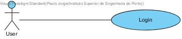
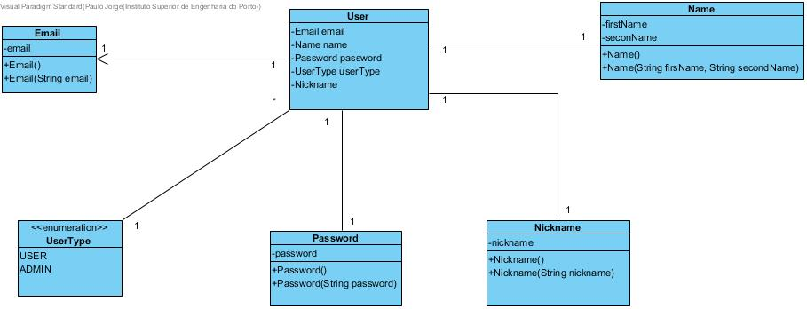
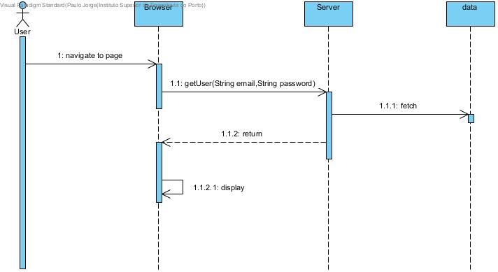

**Paulo Magalhães** (s1160570) - Sprint 1 - IPC01.1
===============================

# 1. General Notes

# 2. Requirements

IPC01.1 - All the pages of the application should require an authenticated user (except the "About" page). The application should have a "Login" page (Hint: Gatekeepers in GWTP). Some hard-coded users should be defined to be initially used for authentication. There should also exist a super-user that is able to access everything.

US1 - As Product Owner, I want users (email and password) to come from a relational database, so they are persistent and we can log in and subsequently change the email or password.

US2 - As an application user, I wish to be able to log in to access my workbooks.

# 3. Analysis

## 3.1 Analysis Diagrams

**Use Cases**

- **Use Cases**. Since these use cases have a one-to-one correspondence with the User Stories we do not add here more detailed use case descriptions. We find that these use cases are very simple and may eventually add more specification at a later stage if necessary.

**Domain Model (for this feature increment)**

- **Domain Model**. Since we found no specific requirements for the structure of User we follow the Structure of the existing DTO (UserDTO).

**System Sequence Diagrams**

**For US1**

# 4. Design

## 4.1. Requirements Realization

*In this section you should present the design realization of the requirements.*

Following the guidelines for JPA from EAPLI we envision a scenario like the following for realizing the use cases for this feature increment.

**For US1**

Notes:  
- The diagram only depicts the less technical details of the scenario;  
- For clarity reasons details such as the PersistenceContext or the RepositoryFactory are not depicted in this diagram.   
- **UserServices** realizes the GWT RPC mechanism;  
- **LoginController** is the *use case controller*;  
- **ListWorkbookDescriptionServices** is to group together all the services related to WorkbookDescription.

**For US2**

## 4.3. Classes

*Present and describe the major classes of you solution.*

## 4.4. Design Patterns and Best Practices

*Present and explain how you applied design patterns and best practices.*

By memory we apply/use:  
- Singleton  
- Repository  
- DTO  
- MVP  

**TODO:** Exemplify the realization of these patterns using class diagrams and/or SD with roles marked as stereotypes.

# 5. Implementation

*If required you should present in this section more details about the implementation. For instance, configuration files, grammar files, etc. You may also explain the organization of you code. You may reference important commits.*

**For US1**

The UI for this US was already implemented. We simply implemented the server as described previously.

**For US2**

**UI: Button for adding a new Workbook Description**

For this concern we decided to use a Material Widget called Material FAB (Floating Action Button). This is a kind of button that usually appears at the left bottom part of the screen and contains actions available for the elements of the page.  

We updated the HomeView.ui.xml accordingly and declare the element with a tag *ui:field="newWorkbookButton"*. In the corresponding class View (i.e., HomeView) we bind that button to the corresponding widget class: 	

	@UiField
	MaterialButton newWorkbookButton;

We must now add the code that invokes the server to add a new workbook description when the user clicks in the button. This is an event. To implement this behavior we could use GWT Events such as the SetPageTitleEvent already used in the application. These are special type of events that GWT manages and are available to all pages in the application.

We chose to provide our click event globally but to simple use the click event handler of the button and connect it to a method in the HomePresenter.

Since Presenters should only depend on a View interface we added a new method to the HomePresenter.MyView:

	interface MyView extends View {
		void setContents(ArrayList<WorkbookDescriptionDTO> contents);
		void addClickHandler(ClickHandler ch);
	}

Then, we implemented the *addClickHandler* in the HomeView class and call this method in the constructor of the HomePresenter. In the constructor our handler class the server method that adds a new workbook description.   

**Code Organization**  

We followed the recommended organization for packages:  
- Code should be added (when possible) inside packages that identify the group, sprint, functional area and author;
- For instance, we used **lapr4.white.s1.core.n4567890**

The code for this sprint:  
Project **server**    
- pt.isep.nsheets.server.**lapr4.white.s1.core.n4567890**.workbooks.application: contains the controllers  
- pt.isep.nsheets.server.**lapr4.white.s1.core.n4567890**.workbooks.domain: contains the domain classes  
- pt.isep.nsheets.server.**lapr4.white.s1.core.n4567890**.workbooks.persistence: contains the persistence/JPA classes
- Updated the existing class: **pt.isep.nsheets.server.WorkbookServiceImpl**

Project **shared**  
- Added the class: **pt.isep.nsheets.shared.services.DataException**: This class is new and is used to return database exceptions from the server  
- Updated the classes: **pt.isep.nsheets.shared.services.WorkbookService** and **pt.isep.nsheets.shared.services.WorkbookServiceAsync**  

Project **NShests**
- Updated the classes: **pt.isep.nsheets.client.aaplication.home.HomeView** and **pt.isep.nsheets.client.aaplication.home.HomePresenter**  
- Updated the file: **pt.isep.nsheets.client.aaplication.home.HomeView.ui.xml**  

# 6. Integration/Demonstration

*In this section document your contribution and efforts to the integration of your work with the work of the other elements of the team and also your work regarding the demonstration (i.e., tests, updating of scripts, etc.)*

# 7. Final Remarks

*In this section present your views regarding alternatives, extra work and future work on the issue.*

Some Questions/Issues identified during the work in this feature increment:

1. The method getWorkbooks in the WorkbooksService returns an ArrayList. Maybe we should not bind the result to a specific collection implementation.

# 8. Work Log

*Insert here a log of you daily work. This is in essence the log of your daily work. It should reference your commits as much as possible.*

Commits:

[Started new example documentation for John Doe Core00.0.](https://bitbucket.org/lei-isep/nsheets/commits/7d9ae99772cce77627454021ea814867a8ef3223)

[Started UI code for Core00.0](https://bitbucket.org/lei-isep/nsheets/commits/88cd76f001939c0fd49ac124a258a3d6ee3dc087) This commit contains some experimental code for studying how the application works. Since it was done in a feature branch no harm to others.  

[Core00.0 Added Analysis SD](https://bitbucket.org/lei-isep/nsheets/commits/e98286e5dbaf11bdd363d0228008acd86f4155c1)

[Core00.0 - Added user stories](https://bitbucket.org/lei-isep/nsheets/commits/5238a88d01a46b4dd10e3d99c8977ac3950c4ea2)

[Core00.0 - Added analysis how GWT and the application work](https://bitbucket.org/lei-isep/nsheets/commits/cbd2bf4669e9b781657ad909aaa27a425c5cbdfd)

[Core00.0 - Analysis: explain GWTP and MVP](https://bitbucket.org/lei-isep/nsheets/commits/0c3e56339fbd7fc8a421770ce041dc29b2b1af40)

[Core00.0 - Analysis: Explain Server and the RPC mechanism](https://bitbucket.org/lei-isep/nsheets/commits/a11f952fd69f03d45cbb804bbad98f7feabfe30e)

[Core00.0 Worklog update](https://bitbucket.org/lei-isep/nsheets/commits/24c168ba5a7da770461fbebe566414ab98c90338)

[Core00.0 Analysis: update to the analysis sequence diagram with vision for integrating database/JPA.](https://bitbucket.org/lei-isep/nsheets/commits/30fbbeb02fa4a705eef213f30e0f7cd430550de9)

[Core00.0 - Analysis: Added Use Cases, Domain Model and more detailed "Analysis" Sequence Diagrams.](https://bitbucket.org/lei-isep/nsheets/commits/ec2e2a5ad8b9a7bf1cfa49cf5d464811e365f7b2)

[Updated some meta-descriptions in the example readme-md of Core00.0.](https://bitbucket.org/lei-isep/nsheets/commits/e2ad8d831bc730181e07af37651a814d245fe3e9)

[Core00.0: Analysis - Added system sequence diagrams / Design - SD moved to design section of documentation.](https://bitbucket.org/lei-isep/nsheets/commits/2e7873a1c56ab2c7844e19919fe13156edfcc332)

[Core00.0: Design/Tests- First draft for tests.](https://bitbucket.org/lei-isep/nsheets/commits/42411adda325fbab58c7d770ddc8fbe2b962d8aa)

[Core00.0 - Design/Tests: Added test for domain class WorkbookDescription.](https://bitbucket.org/lei-isep/nsheets/commits/fc5831bc452d4b69c0c9f568849e7aeddae329d1)

[Core00.0: Design/Implementation - Added design/implementation for list WorkbookDescriptions. Updated the documentation.](https://bitbucket.org/lei-isep/nsheets/commits/cd7ef6dec31a7b7b95b01b16f4cc82fd8c9b0d66)

[Core00.0 - Test/Design/Implementation: Added first draft for AddWorkbookDescription.](https://bitbucket.org/lei-isep/nsheets/commits/0fee8bbc971593596e23b5e4b5132f25f575e93e)

[Core00.0 - Tests/Design/Implementation: The server code is completed.](https://bitbucket.org/lei-isep/nsheets/commits/414db8752df3ba7af3233470408486de57afda11)

[Core00.0: Design - Updated SD for US add workbook description.](https://bitbucket.org/lei-isep/nsheets/commits/c5207e99c74b82209f46a123a93b9d0498efbe4e)

[Core00.0: Implementation - Added documentation about implementation of US2 (Add Workbook Description)](https://bitbucket.org/lei-isep/nsheets/commits/323b1199ba277f063502e6e7bc9b13ccb59a2147)

[Core00.0: Implementation - Added documentation.](https://bitbucket.org/lei-isep/nsheets/commits/48167bcfcc8c4bdd26f3352d16e41ca9eab072c1)

[Core00.0: Implementation: Updated Presenter implementation for add new workbook description.](https://bitbucket.org/lei-isep/nsheets/commits/7fb703f3718178e6ffde4a49d0b959064585f209)
