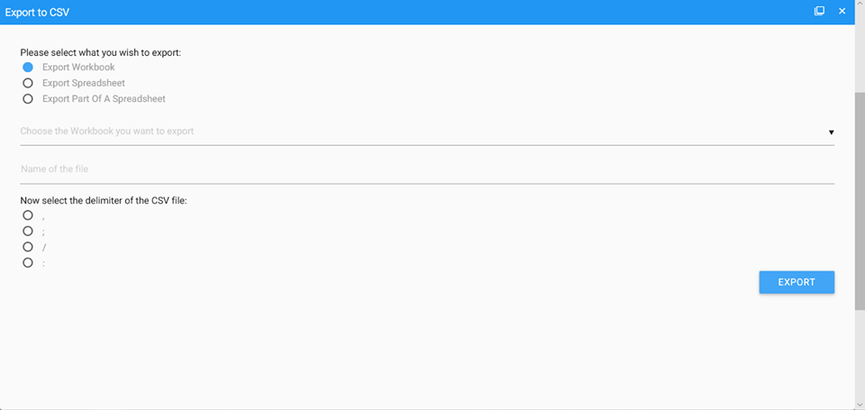
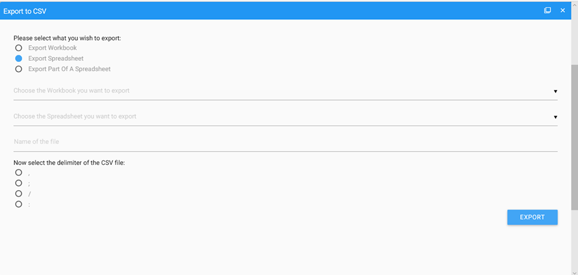
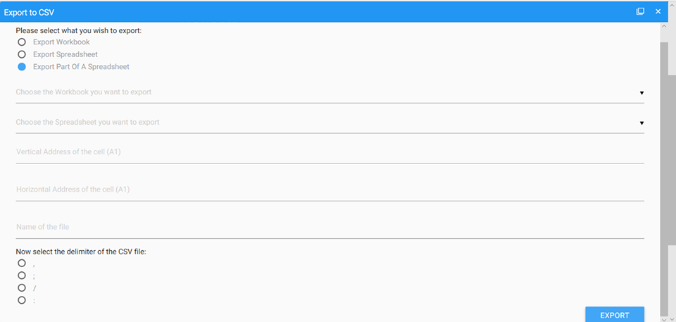
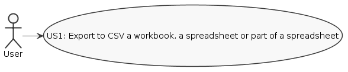
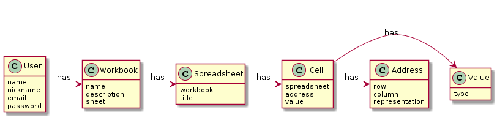
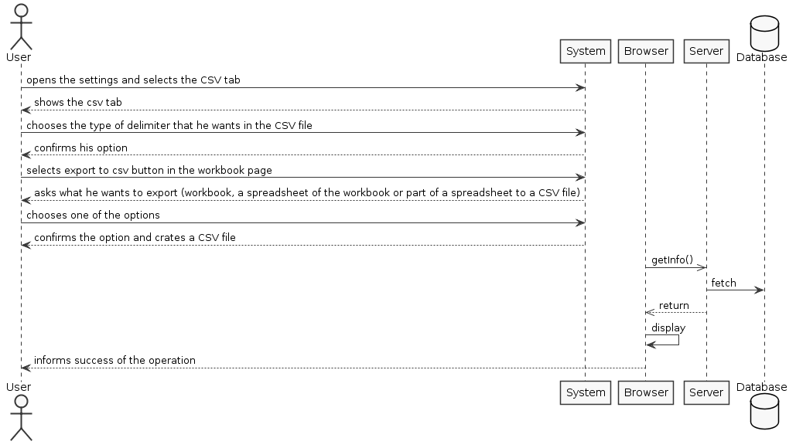
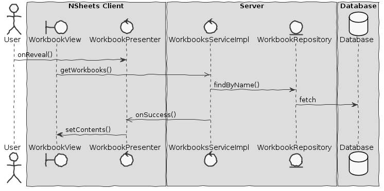

**Jo�o Santiago** (s1160696) - Sprint 1 - IPC05.1
===============================
# 1. General Notes

- I had some problems with the implementation in the exportToCSV method.

# 2. Requirements

IPC05.1 - Export to CSV

It should be possible to export the contents of an workbook, spreadsheet or part of a spreadsheet to a CSV file. As we want to optimize as much as possible the process the solution should not rely on any third party library. The application should have a window/page to configure the CSV format (e.g, field separator or string delimiter). The export should only include the value of the cells. The generated CSV should be downloaded to the user local file system.

Proposal:

US1 - As the application user I want to be able to export the contents of an workbook, spreadsheet or part of a spreadsheet to a CSV file.

# 3. Analysis

For this project i had to understand how the application works and also understand the aspects of GWT.  

- As the application user I want export to an CSV file.

- I have to know how a workbook works. I want to export the entire workbook.

- I have to know how a spreadsheet works. I want to export a single spreadsheet from a workbook.

- I want to export part of a spreadsheet from a workbook.

## 3.1 Analysis Diagrams

**Use Cases**

**Domain Model**

**System Sequence Diagrams**

**For US1**

# 4. Design

## 4.1. Tests

- No tests were implemented because when the user clicks on the export button it already downloads the file (.csv).

## 4.2. Requirements Realization

**For US1**

Notes:  

- **WorkBookView** is the view whe appears the button and its implementation;    
- **ExportToCSV** is the class that has the methods to export;
- **Workbook** is a class.

## 4.3. Classes

- **WorkBookView** is the view whe appears the button and its implementation;    
- **ExportToCSV** is the class that has the methods to export;
- **Workbook** is a class.
-	**WorkbookView.ui** - XML scheme of the workbook view.

## 4.4. Design Patterns and Best Practices

By memory we apply/use:  
- Singleton  
- Repository  
- DTO  
- MVP

For UI Implementation we used the GWT Material Documentation   

# 5. Implementation

**For US1**

I implemented the following button:
In WorkbookView Class:

    @UiField
      MaterialButton exportToCSVButton;

In WorkbookView.ui Class:

<m:MaterialButton ui:field="exportToCSVButton" type="FLOATING" waves="LIGHT" iconType="INSERT_DRIVE_FILE" tooltip="Export To CSV" tooltipPosition="LEFT"/>

**Code Organization**  

Code for sp1:  
Project **server**
- Domain: **pt.isep.nsheets.server.lapr4.green.s1.core.n1160696.export.domain**
- Application: **pt.isep.nsheets.server.lapr4.green.s1.core.n1160696.export.application**

Project **NShests**
- Views: **pt.isep.nsheets.client.application.workbook**

# 6. Integration/Demonstration

In my opinion this sprint was to people understand how the program and the GWT tool works, so in my defense I can say that my UI was a strong part, therefore my code wasn´t the best part because I couldn´t implement the necessary methods to export to CSV file.

# 7. Final Remarks
----------------------------------------------------------------------------------------------------------------
# 8. Work Log

[IPC05.1 - minor change in export to csv.](https://bitbucket.org/lei-isep/lapr4-18-2dl/commits/856e1876eb1d44149705cffffe19dfe59d0ce23e)

[IPC05.1 - UI export to csv [Implementation][Issue#37]](https://bitbucket.org/lei-isep/lapr4-18-2dl/commits/ae01d54d65f549d2b771eaac28c0e4b1192f12b0)

[IPC05.1 - UI export to csv [Implementation][Issue#37]](https://bitbucket.org/lei-isep/lapr4-18-2dl/commits/abc392f60a2c82f01d7909b9e59e979bc606c5d7)

[IPC05.1 - [Implementation][Issue #37] some changes in UI and start of CSV export method](https://bitbucket.org/lei-isep/lapr4-18-2dl/commits/8f05fa33e67cdd022bd211e3de4b8ee9f679338b)

[IPC05.1 - [Implementation][Issue #37] changes](https://bitbucket.org/lei-isep/lapr4-18-2dl/commits/59678a26654ac518eb8600d7ed7e1de81bdfb458)
