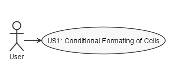
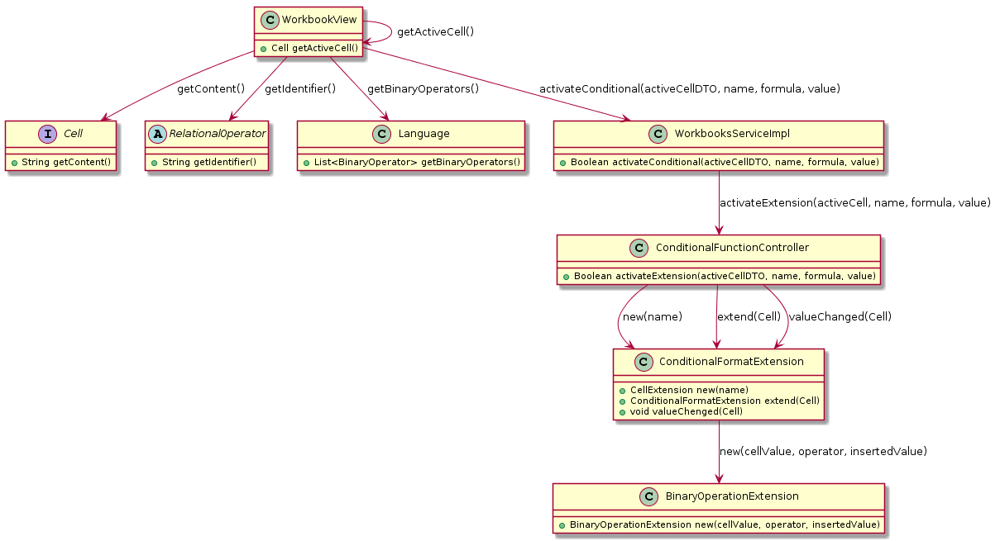
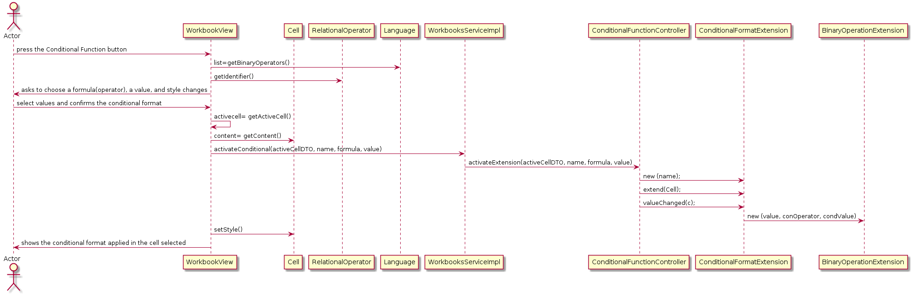
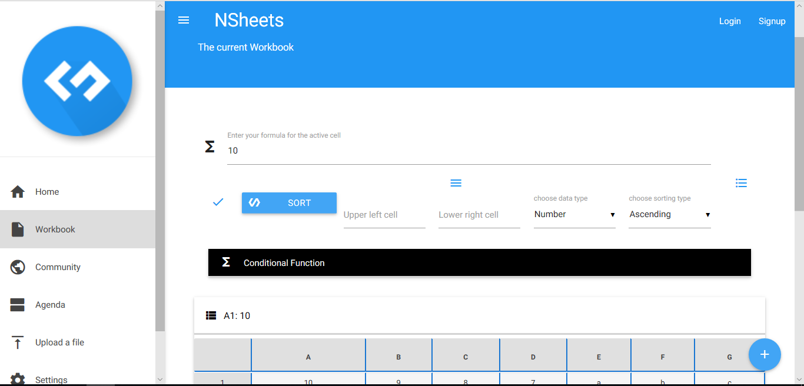
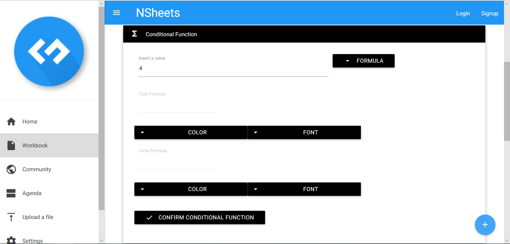
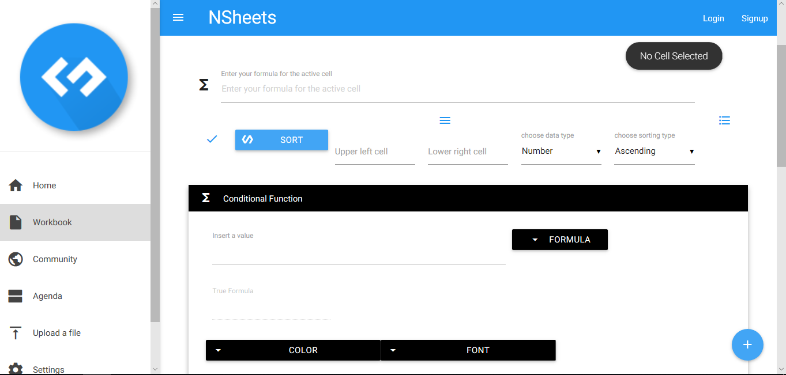
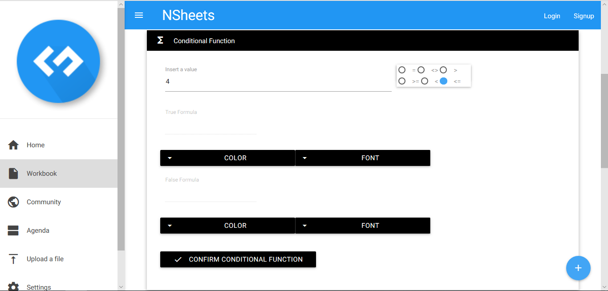
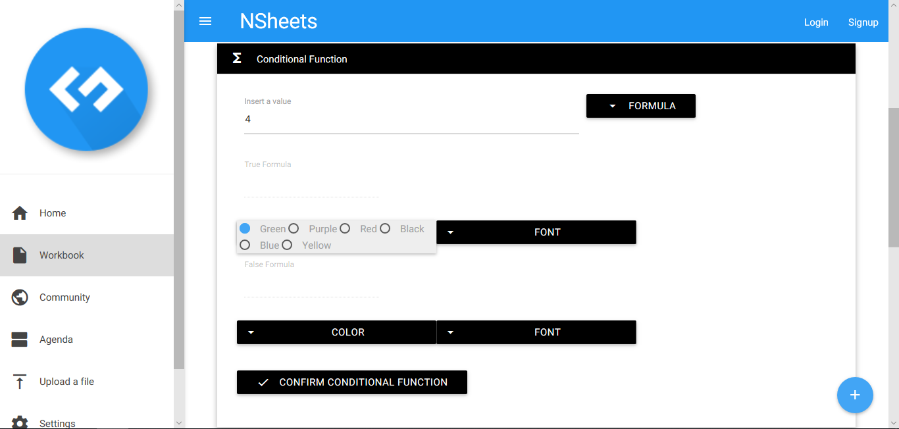
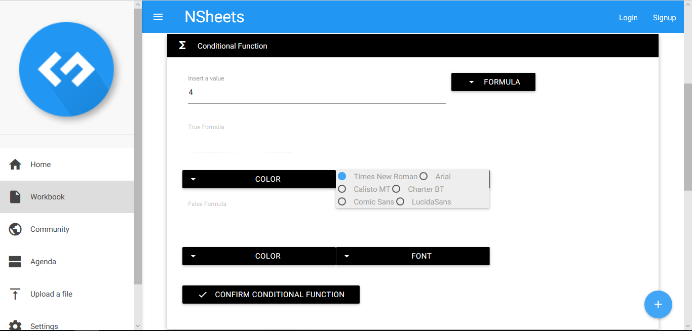
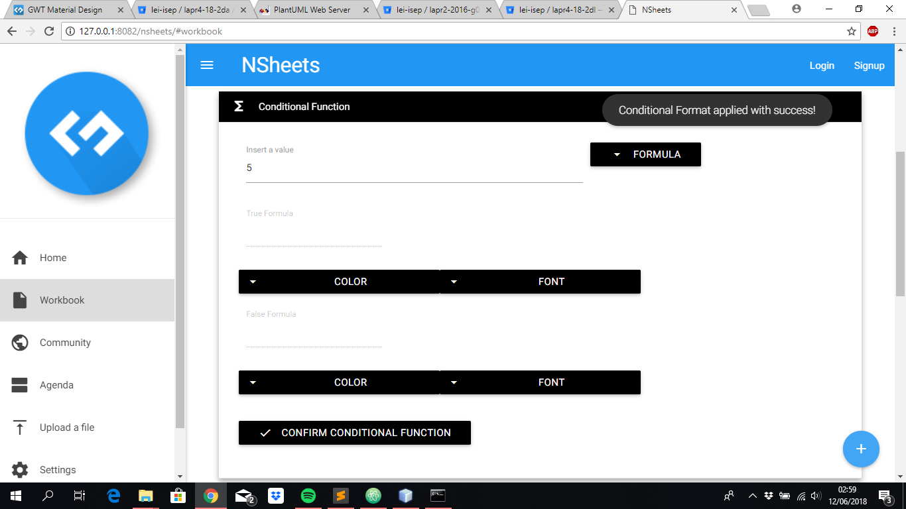

**João Santiago** (s1160696) - Sprint 2 - Lang03.1
===============================
# 1. General Notes

- I could not test my UC because Core08.1 was not implemented and I needed that to work with the conditional formmating of the cells. However I did everything and the code and UI are running fine, so I still have been able to do the entire use case.

# 2. Requirements

Lang03.1 - Conditional Formating of Cells

- Update the "style" extension so that it can be used for the conditional formatting of cells based on the result of the execution of formulas. For the style of a cell to be conditional it must have an associated formula and two formatting styles. One of the styles is applied when the formula evaluates to true and the other when it evaluates to false. The editing of these settings should be done in a window.

# 3. Analysis

- For the resolution of this user case i had to understand how the styles are implemented in order to be applied to cells.

- I had to understand how the relational operators work and how I can use them to do my work.

## 3.1 Analysis Diagrams

US1 - As a user I want to do a conditional formating of the selected cell based on the result of the execution of formulas.

Here we can see the classes were I implemented the user case.

**User Case**

**Domain Model**

# 4. Design

**Sequence Diagrams**

## 4.1. Tests

Unfortunately I couldn´t implement any tests because of the lack of time that we have to do the user case. In first place I had to learn a little about this part of the code so I could do the user case and I hadn´t time to do tests.

## 4.2. Design Patterns and Best Practices

By memory I used:  
- Singleton    
- DTO

For UI Implementation we used the GWT Material Documentation   

# 5. Implementation

I first start implement in 06/06/2018 and I was trying to understand how I could do the best solution to this problem. I t was when I saw that I needed the user case Core08.1 done to implement my user case, Lang03.1. Unfortunately, the student that was supposed to do this in the first sprint could not did it so I implemented just the needed in my user case. It may not apply styles to cells, since they don't work, but after that UC is implemented it would be extremely easy to adapt what I have done to the Core08.1 user case. I just had to connect the UI with valid colors and fonts, implemented in a StylesExtension class for example, and then make them visible in the UI.

# 6. Integration/Demonstration

First we have to click in the Conditional Function button. The user will see various buttons to apply the pretended formula and the styles he want.

Various messages will appear if the user doesn´t apply the required requisits.
One example is, when the user tries to apply a conditional function without selecting any cell to apply it, there will be thrown a message in the right upper side saying what he should do. Various messages will appear if the user doesn´t apply the required requisits.

If the user click the Formula button will appear some operators that he can use.

If the user click the Color button will appear some colors that he can use.(Not in use because Core08.1 is not implemented).

If the user click the Font button will appear some colors that he can use.(Not in use because Core08.1 is not implemented).

When the user wants to confirm the conditional format to apply he clicks in the Confirm Conditional Function and it will appear a message of success.

# 7. Final Remarks

Is important to say that all students helped each other in order to provide a good work flow and to make a good final project.

# 8. Work Log

[[Lang03.1][ref #55] UC done (I think) implementation of several DTO classes so it can be possible to update the cells.](https://bitbucket.org/lei-isep/lapr4-18-2dl/commits/541a5d8d126d997cfd59857a056f8baded68f063)
