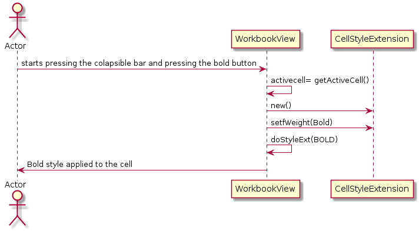

**João Santiago** (s1160696) - Sprint 3 - Core08.1
===============================
# 1. General Notes

- In this sprint, everything in this user case was done successfuly, and the styles can be applied to the cells just fine.

# 2. Requirements

Core08.1 - Styles in Cells Extension

-The application should have a new extension to associate styles with cells. The functionality should be similar to the one present in the desktop version of Cleansheets.

# 3. Analysis

- For the resolution of this user case i had to understand how the styles are implemented in order to be applied to cells.

## 3.1 Analysis Diagrams

Proposal:

US1 - As a user I want to format the text in a cell

- US1.1 - Apply bold.

- US1.2 - Apply italic.

- US1.3 - Apply underline.

US2 - As a user I want to adjust/align the position of the text in a cell, to the left, right or center.

US3 - As a user I want to format the cell with different colors, change the color of the cell background.

US4 - As a user I want to format the cell with different colors, change the color of the text inside the cell.

Here we can see the classes were I implemented the user case.

**User Cases**

**Domain Model**

# 4. Design

**Sequence Diagrams**

**US1.1**

**US1.2**

**US1.3**

**US2**

**US3**

**US4**

## 4.1. Tests

Unfortunately I couldn´t implement any tests because of the lack of time that we have to do the user case. In first place I had to learn a little about this part of the code so I could do the user case and I hadn´t time to do tests.

## 4.2. Design Patterns and Best Practices

By memory I used:  
- Singleton    
- DTO

For UI Implementation we used the GWT Material Documentation   

# 5. Implementation

I first start implement in 13/06/2018 and I was trying to understand how I could do the best solution to this problem. First I I put the Bold, italic and underline styles working, and then it was the harder part but I could implement the background and text colors to the content in the cell and the cell itself. Finally I tested the UI and it worked pretty well.

# 6. Integration/Demonstration

First we have to click in the Styles Extension colapsible button. Once it is pressed the user will see various buttons to apply the pretended style to apply to the active cell.

Then the user can see a lack of buttons that do some styles in the active cell.

Once the user selects the active cell he can apply the styles he want to that cell, like appply bold and italic at the same time and even apply colors to the same cell.

The user can even align the text with all the other styles in use.

If the user forgets to select the cell he pretends to edit, a message will appear to make sure the user knows he have to select a cell first.

# 7. Final Remarks

Is important to say that all students helped each other in order to provide a good work flow and to make a good final project.

# 8. Work Log

[[Core08.1][ref #22] Start implementation, added classes for styles.](https://bitbucket.org/lei-isep/lapr4-18-2dl/commits/dc91ae4e9563)

[[Core08.1][ref #22] Bold style already working.](https://bitbucket.org/lei-isep/lapr4-18-2dl/commits/8a06e513852c)

[[Core08.1][ref #22] Underline and Text Align already working. Needs some improvement.](https://bitbucket.org/lei-isep/lapr4-18-2dl/commits/a2f862a95df9)

[[Core08.1][ref #22] Background colors and text colors working. Cells Styles done. Just need to improve the messages of exceptions.](https://bitbucket.org/lei-isep/lapr4-18-2dl/commits/1a326d3a9e2a)

[[Core08.1][ref #22] Trying to persist the styles in database. Messages of exceptions already created in Styles Extension.](https://bitbucket.org/lei-isep/lapr4-18-2dl/commits/4fbefb5be302)

[[Core08.1][ref #22] Documentation almost finished.](https://bitbucket.org/lei-isep/lapr4-18-2dl/commits/a2b09b850718)

[[Core08.1][ref #22] Minor changes. Removed unused buttons.](https://bitbucket.org/lei-isep/lapr4-18-2dl/commits/55dddb1abea8)
