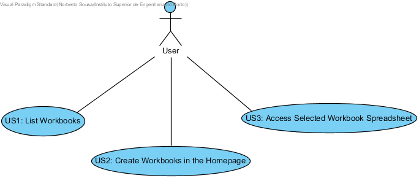
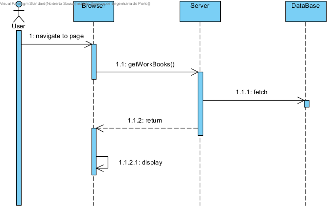
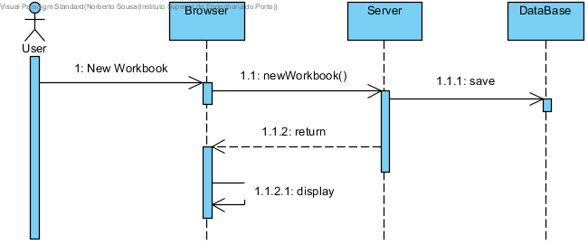
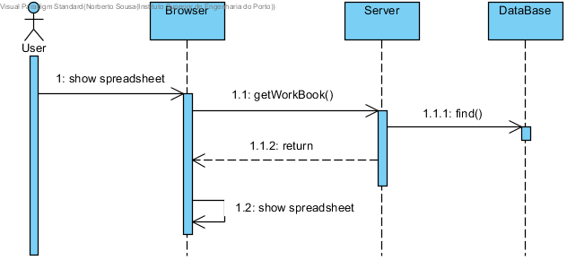

**Norberto Sousa** (s1120608)
===============================

# 1. General Notes
# 2. Requirements

- **Core01.1 - Partial Workbook View**

The workbook page should be related to one of the workbooks displayed in the home page. It should be possible to create a new empty workbook in the home page. Workbooks should be persisted in the server. At this moment a workbook must only have one spreadsheet.

Proposal:

Us1 - As a user I want all my workbooks to be displayed in the homepage and saved between sessions.
US2 - As a user I want to be able to create a new workbook in the home page.
US3 - As a user I want to be able to access the spreadsheet of a workbook.

# 3. Analysis

Since this is the first implementation I will be doing in this project, I need to:

- Understand how the application works and also understand the key aspects of GWT, since it is the main technology behind the application.
- Understand how the UI works, so i can change it accordingly.

## 3.4 Analysis Diagrams

**Use Cases**

- **Use Cases** Us1 and US2 are basically a rewrite of John Doe's (team White) Uc.

**System Sequence Diagrams**

**For US1**

**For US2**

**For US3**

