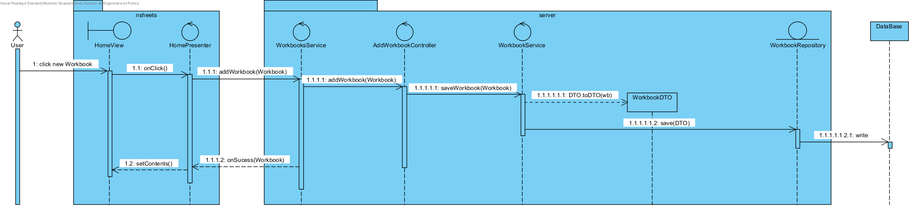

**Norberto Sousa** (s1120608)
===============================

# 1. General Notes
# 2. Requirements

- **Core01.1 - Partial Workbook View**

The workbook page should be related to one of the workbooks displayed in the home page. It should be possible to create a new empty workbook in the home page. Workbooks should be persisted in the server. At this moment a workbook must only have one spreadsheet.

Proposal:

Us1 - As a user I want all my workbooks to be displayed in the homepage and saved between sessions.
US2 - As a user I want to be able to create a new workbook in the home page.
US3 - As a user I want to be able to access the spreadsheet of a workbook.

# 3. Analysis

Since this is the first implementation I will be doing in this project, I need to:

- Understand how the application works and also understand the key aspects of GWT, since it is the main technology behind the application.
- Understand how the UI works, so i can change it accordingly.

## 3.4 Analysis Diagrams

**Use Cases**

- **Use Cases** Us1 and US2 are basically a rewrite of John Doe's (team White) Uc.

**System Sequence Diagrams**

**For US1**

**For US2**

**For US3**

# 4. Design

## 4.1. Tests
## 4.2. Requirements Realization

Following the guidelines for JPA from EAPLI we envision a scenario like the following for realizing the use cases for this feature increment.

**For US1**

Notes:     
- **addWorkbookController** is the *use case controller*;  
- **WorkbookService** is to group together all the services related to Workbook.

**For US2**

Notes:     
- **WorkbookDTO** Maybe not the best name, it is a wrapper to persist  only the important imformation of workbook;  
- **addWorkbookController** is the *use case controller*;  
- **WorkbookService** is to group together all the services related to Workbook.

**For US3**

Notes:      
- **SelectedWorkbookController** is a static class that has the current workbook, selected by the user;  
- **WorkbookService** is to group together all the services related to Workbook.
- This US is not implemented, there is the skeleton controller so that my colleagues could use it when needed but it's not fully functional.

# 5. Implementation
# 6. Integration/Demonstration
# 7. Final Remarks

Had some problems during the impementation of the UC, the fact that the type of project is really different from what we experimented with during class did not help at all. Lost several days just trying to grasp the inner workings of the client/shared/server/ dynamic.

All in all only about 2/3 of the uc were implemented, and what is implemented is not fully functional.
Despite the workbook being persistable the spreadsheets, the information persisted is really basic (name, description).

# 8. Work Log

[Started code for Core01.1](https://bitbucket.org/lei-isep/lapr4-18-2dl/commits/4a7ba1379d9922a5254772ce2b50134a13e8dd1a) This commit contains some experimental code for studying how the application works. It starts converting from WorkbookDescription to Workbook only. Added some documentation and UC Analysis. Started Implementation of WorkbookDTO as a way to persist the workbooks.

[Changing existing UI for Core01.1](https://bitbucket.org/lei-isep/lapr4-18-2dl/commits/ebf870891e9769a146b2af62a5a522cfe3fb80e8) Experimenting with the aSyncCalls code. Continuing to implement WorkbookDTO as a form of persistence.

[Implementing controllers for Core01.1](https://bitbucket.org/lei-isep/lapr4-18-2dl/commits/868327d8ed562c19402aaeea6c733a8c0f1f467f) Finished Implementing controllers for the UC.

[Implementing US1 and US2 of Core01.1](https://bitbucket.org/lei-isep/lapr4-18-2dl/commits/ef4efca0173644313ad8f6006360e36fbddf625a) Finished Implementing the first 2 user stories.

[Small changes to UI Core01.1](https://bitbucket.org/lei-isep/lapr4-18-2dl/commits/6be0a619bc142caa88796259fc998038ed4b539a) Changed the generation of the default name of a workbook when it is created.

[Error Corrections UI](https://bitbucket.org/lei-isep/lapr4-18-2dl/commits/bd03a2431b69d0908aa0cd5bf2e15246d7193db7) After a colleague from another team implemented some of his functionalities it broke the way the list of existing workbooks were presented in the UI, worked with him to correct this.

[Error Corrections Code](https://bitbucket.org/lei-isep/lapr4-18-2dl/commits/77a344ff2c087d0dd80ebd5fb68ca99b51a36724) A class was not implementing Serializablegiving errors during compiling.

[Error Corrections Code]() Last Commit was the update of all the documentation
