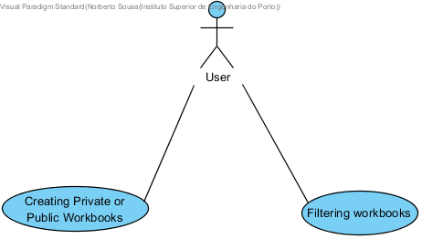
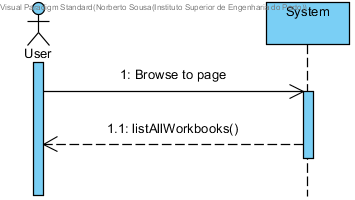
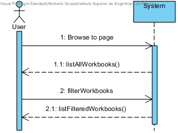
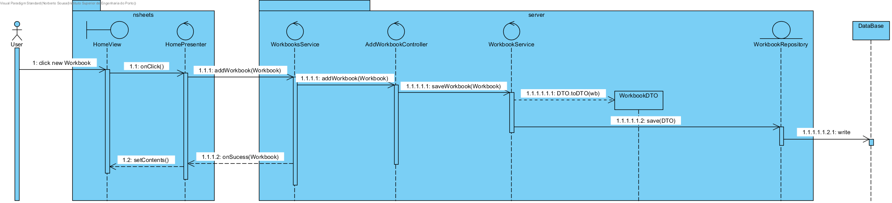
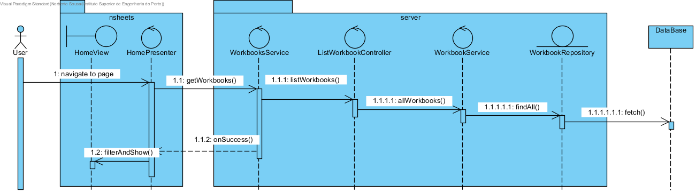

**Norberto Sousa** (s1120608) - Sprint 2 - IPC06.2
===============================

# 1. General Notes

Given the fact that this UC sprint 1 functionalities are not necessary for this sprint, they will not be considered.
Only after finishing this sprint requirements will there be an attempt made in finishing the last sprint requirements.

# 2. Requirements

IPC06.2 - Workbooks that are created by the user should be considered private. The "Home" page should now be able to display private and public workbooks. It should be possible to apply filters to this view/page to display only private or public workbooks with specific names or descriptions (the application should accepted regular expressions to filter the workbooks). Public and private workbooks should have some visual distinction (e.g., icon).

Proposal:

US1 - As a User I want to be able to create public and private Workbooks.
US2 - As a User I want to be able to filter my workbooks with keywords and/or regular expressions.

# 3. Analysis

For this feature increment, since I'm building on top of what was made in the first sprint I need to:

- Alter workbooks so that there is distinction between Private and Public ones.

- Change the HomePage UI so that that there is a Graphic difference between the two types of Workbooks.

- Add a button/switch so that it is possible to change the Workbook listing to only show private/all workbooks.

- Alter the existing search bar so that it allows the user to search Workbooks by keywords/regex.

## 3.1 Application Startup

For this Uc all of the changes were made to the HomePage, the way this page is presented suffered some alterations due to changes in the **HomeView** and **HomePresenter**.

## 3.2 Server and RPC
The Home page displays Workbooks that reside in the server.

In the method onReveal the Home presenter invokes a WorkbookService asynchronously. It uses the base communication mechanism of GWT called GWT RPC.

Basically, it requires the definition of an interface for the service. In this case:

    @RemoteServiceRelativePath("workbooksService")
    public interface WorkbooksService extends RemoteService {
        ArrayList<WorkbookDescriptionDTO> getWorkbooks();
    }

Note: The @RemoteServiceRelativePath annotation associates the service with a default path relative to the module base URL.

When an RPC is invoked since it is always executed asynchronously we have to prove a callback:

    // Make the call to the stock price service.
    workbooksSvc.getWorkbooks(callback);
    
The callback is simple a class that provides two methods, one for a successful result and the other for a failure:

    // Set up the callback object.
    AsyncCallback<ArrayList<WorkbookDescriptionDTO>> callback = new AsyncCallback<ArrayList<WorkbookDescriptionDTO>>() {
        public void onFailure(Throwable caught) {
            MaterialToast.fireToast("Error " + caught.getMessage());
        }

        public void onSuccess(ArrayList<WorkbookDescriptionDTO> result) {
            nrWb = result.size();
            view.setContents(result);
        }
    };
    
Since the interface is code that must be accessed by both server and client code it should reside in the shared project.

Finally since the service is a servlet it must be declared in the web.xml file of the project (see file nsheets/src/main/webapp/WEB-INF/web.xml).

    <!-- Servlets for the workbooks -->
    <servlet>
        <servlet-name>workbooksServiceServlet</servlet-name>
        <servlet-class>pt.isep.nsheets.server.services.WorkbooksServiceImpl</servlet-class>
    </servlet>
    <servlet-mapping>
        <servlet-name>workbooksServiceServlet</servlet-name>
        <!-- The first "part" of the url is the name of the GWT module as in "rename-to" in .gwt.xml -->
        <url-pattern>/nsheets/workbooksService</url-pattern>
    </servlet-mapping>

## 3.3 Analysis Diagrams

- **Use Case**. Since the use cases have a one-to-one correspondence with the User Stories I do not add more detailed use case description in this section.

Domain Model (for this feature increment)

Since I found no specific requirements in terms of domain, I follow the Structure of the existing entities.

**For Us1**

This Us applies to workbooks private and public both.

**For Us2**

# 4. Design

In terms of design there is only the need to add a new attribute to workbook so that it is possible to distinguish between private and public Workbooks.
After that I need to add in the ui the means to select what the user wants to see, to do this I will add both a search bar and a toggle between private/public Workbooks. 

## 4.1. Tests

Due to the fact that my implementation only alters the UI, all the tests are functional.

## 4.2. Requirements Realization

**For Us1**

Notes:

- This SD applies to both types of workbooks, the only difference is the button that is click will change the **userMail** attribute of workbook to that of the user that created it, or empty if public.

**For Us2**

Notes:

- The filter is applied after receiving the list from the DataBase.

## 4.3. Classes

In terms of design there is only the need to add a new attribute to workbook so that it is possible to distinguish between private and public Workbooks.
After that I need to add in the ui the means to select what the user wants to see, to do this I will add both a search bar and a toggle between private/public Workbooks. 

## 4.4. Design Patterns and Best Practices

By memory I apply/use:  
- Information Expert
- MVP

# 5. Implementation

**UI: Toggle to list all Workbooks or Private Workbooks only**

For this I used a Material Widget called MaterialListBox.

I updated the HomeView.ui.xml accordingly and declared the element ListBox and its options with a the tags:

    <m:MaterialListBox ui:field="showAllWb" placeholder="Workbook Listing:">
        <m.html:Option ui:field="allWorkbooksOn" text="Show Private and Public Workbooks"/>
        <m.html:Option ui:field="allWorkbooksOff" text="Show Only Private Workbooks"/>
    </m:MaterialListBox>
 
In the corresponding class View (i.e., HomeView) I bound that button to the corresponding widget class: 	
 
    @UiField
    MaterialListBox showAllWb;
    
**UI: Search box**

I altered the existing searchBar to work with partial Strings and Regular Expressions by adding the the method:

    @Override
    public void addEventChangeSearch(ValueChangeHandler<String> vc) {
        txtSearch.addValueChangeHandler(vc);
    }
    
Where **txtSearch** is the Material Widget:

    @UiField
    MaterialSearch txtSearch; 

**UI: Added create Private workbook and Create Public Workbook**

Altered the existing **Create Workbook** button to create a public workbook and added a new button to create a private workbook.

The material widget are:

    @UiField
    MaterialButton newWorkbookButtonPublic;

    @UiField
    MaterialButton newWorkbookButtonPrivate;

And both got their own method that creates the respective workbook:

    @Override
    public void addClickHandlerPublic(ClickHandler ch) {
        newWorkbookButtonPublic.addClickHandler(ch);
    }

    @Override
    public void addClickHandlerPrivate(ClickHandler ch) {
        newWorkbookButtonPrivate.addClickHandler(ch);
    } 
    
# 6. Integration/Demonstration

The Uc is fully implemented and functional. Inside the home tab, after hovering the mouse over the floating plus symbol, the buttons to create both workbooks appear.

Clicking on those will open a prompt for the name and description of the new workbook.

Typing the name, partial name or a regular expression on the search bar will filter the existing workbooks and present the result.

And finally selecting **All Workbooks/Private only** in the combo box will also filter the workbooks accordingly.

# 7. Final Remarks

 After Finishing this uc implementation, I also implemented part of what was leftover from this UCs last sprint such as the rename and the delete workbook buttons.
 I helped Helped Pedro Tedim - s1091234 to alter the structure of the workbooks and its persistence implementation.
 I also helped my colleagues from my Team with their Ucs.
 
 
# 8. Work Log

Commits:

[Core06.2: Alterations to UI of Home Page to accommodate new functionalities. Small alterations to workbook.](https://bitbucket.org/lei-isep/lapr4-18-2dl/commits/601674207c61)

[Core06.2: Added initial Analysis Documentation. Added filter of private/public workbooks to homepage.](https://bitbucket.org/lei-isep/lapr4-18-2dl/commits/b96223bd6207)

[Core06.2: Added search of workbooks function to HomePage.](https://bitbucket.org/lei-isep/lapr4-18-2dl/commits/3c4ccc590ef9)
 
[Core06.2: Added ability to search workbooks using Regular Expressions.](https://bitbucket.org/lei-isep/lapr4-18-2dl/commits/dd55dd1825fe)
 
[Core06.2: Added ability to name workbooks when creating them.](https://bitbucket.org/lei-isep/lapr4-18-2dl/commits/2fffb72763ab)

[Core06.2: Added working rename button to workbook card.](https://bitbucket.org/lei-isep/lapr4-18-2dl/commits/46709081ff79)

