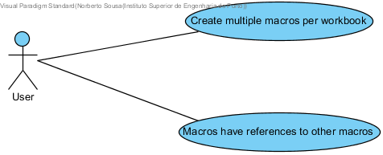
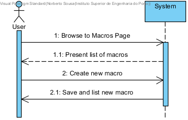
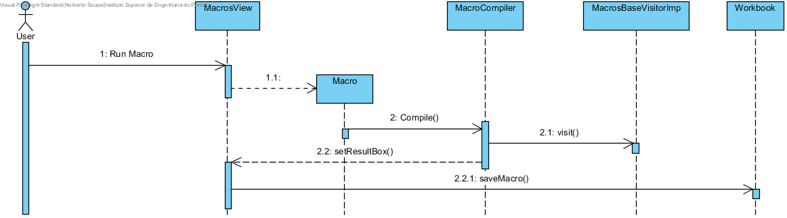

**Norberto Sousa** (s1120608) - Sprint 3 - Lang06.2
===============================

# 1. General Notes

# 2. Requirements

The application should now support multiple macros. Each macro should have a name and should be associated with an workbook. The grammar of the macros should also have a mechanism to support the invocation of macros. It only should be possible to invoke macros of the same workbook. Special attention should be devoted to recursion (i.e., avoiding infinite recursion).

Proposal:

US1 - As a User I want to be able to be able to create multiple macros per workbook.

US2 - As a User I want to be able to call a macro from another macro. 

# 3. Analysis

For this feature increment, since I'm building on top of what was made in the first sprint I need to:

- Alter workbooks so that it is possible to store the all the macros created for each workbook.

- Alter macros so that it is possible to call a macro from another macro.

## 3.1 Application Startup

For this Uc all the UI changes were made in the **MacroView** page, it was added the dynamic generation of a list that contains all the current macros of the workbook.

The Workbook was altered to allow saving more than one macro per workbook.

Also the grammar of the macros was altered to allow calling an existing macro.

## 3.2 Analysis Diagrams

- **Use Case**. Since the use cases have a one-to-one correspondence with the User Stories I do not add more detailed use case description in this section.

Domain Model (for this feature increment)

Since I found no specific requirements in terms of domain, I follow the Structure of the existing entities.

**For Us1 and Us2**

This diagram applies to both user stories, what changes in Us2 is the content of the macro.

# 4. Design

In terms of design there is only the need to add a new attribute to workbook so that it is possible to save multiple macros.
After that I need to add in the ui the means to list the existing macros of an workbook.
Finally I need to alter the macros grammar to parse other macros names.

## 4.1. Tests

Due to problems regarding the use of the GWT framework I could not get the test to work.

## 4.2. Requirements Realization

**For Us1 and Us2**

Notes:

- This SD applies to both User stories, the difference is that in the second user story the macro visitor is called recursively for each macro name in the macro. 

## 4.3. Design Patterns and Best Practices

By memory I apply/use:  
- Information Expert
- MVP

# 5. Implementation

**UI: List of macros of a workbook**

For this I used a Material Widget called MaterialPanel that I Populate with cards by using the method **setContents**.

        public void setContents(List<Macro> contents) {
            int colCount = 1;
    
            MaterialRow row = null;
    
            macroCards.clear();
    
            for (Macro m : contents) {
    
    
                MaterialCard card = createCard(m);
    
                if (colCount == 1) {
                    row = new MaterialRow();
                    macroCards.add(row);
                    ++colCount;
                    if (colCount >= 4) {
                        colCount = 1;
                    }
                }
    
                MaterialColumn col = new MaterialColumn();
                col.setGrid("l4");
                row.add(col);
    
                col.add(card);
            }
        }

**Grammar**

To allow the macro to understand spreadsheet cell references and other macros I added the following to it:

    CELL_REF    :
         		    ( ABS )? LETTER ( LETTER )?
         		    ( ABS )? ( INT )+
         	        ;
    
    MACRO_REF :
                    ( AT ) ID
                    ;
                    
I then altered the **MacrosBaseVisitorImp** with instructions to use when any of the two were visited.

# 6. Integration/Demonstration

The Uc is fully implemented and functional. Inside the workbookView page, in the floating button on the bottom right there is an option to create macros.

After opening the macro's page we choose name for the macro and the code itself, this code can include references to cells in the current spreadsheet and names of other macros.

After running the macro, it is saved to the current workbook and can be reactivated.

# 7. Final Remarks
 
 
# 8. Work Log

Commits:

[Lang 06.2 - Added cellRefs to the grammar of macros](https://bitbucket.org/lei-isep/lapr4-18-2dl/commits/34fc9ad7aa94)

[Lang 06.2 - Finished adding cell support to macros. Macros now also can reference other macros from the same workbook.](https://bitbucket.org/lei-isep/lapr4-18-2dl/commits/f61b3902cf06)

