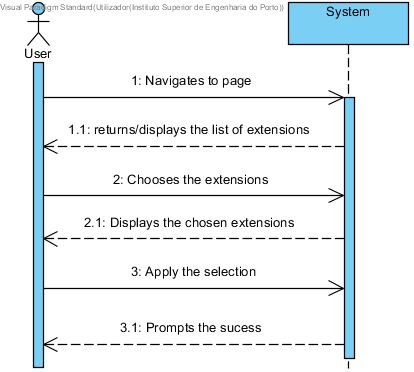
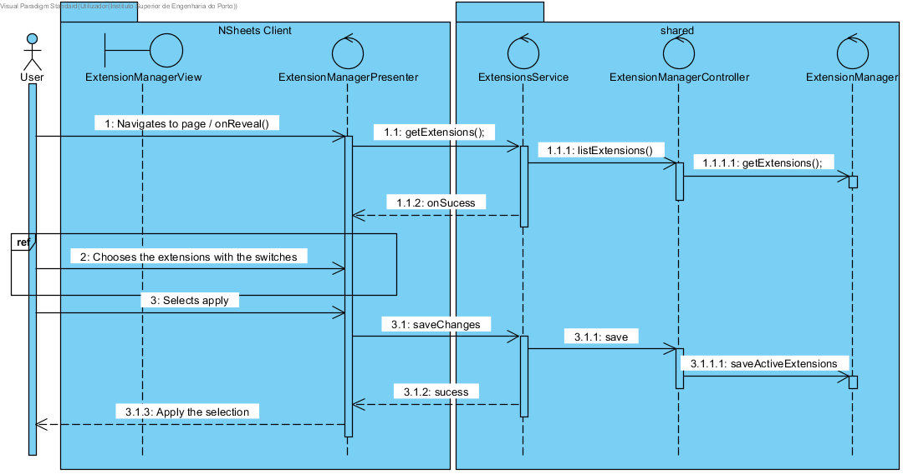

**Marco Carneiro** (s1160777) - Sprint 1 - Core02.1
===============================

# 1. General Notes

*Considerable difficulty implementing the Extensions Manager given the inability to understand the interaction between GWT and th way the NSheets application loads the extensions.*

# 2. Requirements

Core02.1 - The Extension Manager page should display a basic interpretation of the installed extensions.
           As a User of the Application I want to be able to view which extensions are active/inactive.
           As a User of the Application I want to be able to enable or disable certain extensions.
           Each extension should have a page of its own to change its settings.

**Proposal**:

  - **US1** : User can view and edit the desired extenions it wishes to use in the workbook environment.
  Also update required classes in application NSheets and **shared** packages.

# 3. Analysis

For this feature increment, since it is the first one to be developed in a new project I need to:  

- Understand how the application works and also understand the key aspects of GWT, since it is the main technology behind the application  

- Understand how the Settings Page works so that I may be able to integrate the Extenions Functionality  

- The extension page should display all available extensions for future development   

## 3.1 GWT and Project Structure

**Modules**. From the pom.xml file we can see that the application is composed of 5 modules:  
- **server**. It is the "server part" of the web application.  
- **shared**. It contains code that is shared between the client (i.e., web application) and the server.   
- **nsheets**. It is the web application (i.e., Client).  
- **util**. This is the same module as the one in EAPLI.  
- **framework**. This is the same module as the one in EAPLI.   

From [GWT Overview](http://www.gwtproject.org/overview.html): *"The GWT SDK contains the Java API libraries, compiler, and development server. It lets you write client-side applications in Java and deploy them as JavaScript."*

## 3.2 Application Startup and GWTP

As described before the entry point for the application is the class **pt.isep.nsheets.client.gin.ClientModule**.

GWTP follows the MVP (Model-View-Presenter) pattern. It uses [GIN dependency injection](http://dev.arcbees.com/gwtp/core/presenters/gin-bindings.html) to put together the parts of each MVP. How the GWTP structures the application and uses GIN to bind all the required elements is described in [GWTP Beginner's Tutorial](http://dev.arcbees.com/gwtp/tutorials/index.html).

We can see that **ClientModule** installs the base presenter of the application:

	    install(new ApplicationModule());

The **ApplicationModule** module install all the other modules of the application:

	    install(new HomeModule());
		install(new MenuModule());
		install(new AboutModule());
		install(new WorkbookModule());   

In this iteration of the Core 02.1 we install all the other modules of the **Extension Module** inside of the Setings page:

    @Override
    protected void configure() {
    install(new ExtensionManagerModule());

Each module represents an MVP page in the application.

In this MVP pattern each presenter defines a specific interface that is use to communicate with the UI (i.e., the View). Therefore the presenter can be fully isolated from dependencies related to the UI. For instance, the View interface that is defined by the ExtensionManagerPresenter has several methods:

      interface MyView extends View {

        void addClickHandlerApplyButton(ClickHandler ch);

          MaterialButton getApplyButton();

          MaterialCheckBox getCheckBox();

          MaterialSwitch getSwitchPanelSelection();

      }

The View class is where all the UI code should be implemented. In GWT it is possible to create UI elements programmatically (see [GWT Build the UI](http://www.gwtproject.org/doc/latest/tutorial/buildui.html)). The UI can also be described in .ui.xml files using [UIBinder](http://www.gwtproject.org/doc/latest/DevGuideUiBinder.html). The NSheets project is using [GWT Material Design](https://github.com/GwtMaterialDesign/gwt-material) and therefore all the UI widgets are from that library.

In the case of the ExtensionManager module we can see that there is a ExtensionManagerView.ui.xml. This file declares widgets. The attribute ui:field can be used to specify an id that can be then used to bind that element to a class in the code. For instance, in ExtensionManagerView.ui.xml:

    <g:HTMLPanel>
        <m:MaterialRow marginTop="60">
            <g:Hyperlink text="Back to Settings"  targetHistoryToken="{tokens.getSettings}"/>
            <m:MaterialLabel text="Basic view of the extensions"/>
            <m:MaterialButton ui:field="applyButton" text="Apply" size="MEDIUM"/>
          </m:MaterialRow>
      </g:HTMLPanel>

It is set the ui:field attribute for two existing labels. In the code ExtensionManagerView.java) one can bind to Widgets classes. For instance:

    @UiField
    MaterialButton applyButton;

## 3.3 Server and RPC

The Home page displays what seems to be Workbooks that should reside in the server.

In the method **onReveal** the ExtensionManager presenter invokes a ExtensionManagerService asynchronously. It uses the base communication mechanism of GWT called [GWT RPC](http://www.gwtproject.org/doc/latest/tutorial/RPC.html).

Basically, it requires the definition of an interface for the service. In this case:

    @RemoteServiceRelativePath("extensionsservice")
      public interface ExtensionsService extends RemoteService {
          ArrayList<Extension> getExtensions();
      }

Note: The @RemoteServiceRelativePath annotation associates the service with a default path relative to the module base URL.

When an RPC is invoked since it is always executed asynchronously we have to prove a callback:

    //Being extensios they are subject to change
	   extSvc.getExtensions(callback);

The callback is simple a class that provides two methods, one for a successful result and the other for a failure:

    //Subject To Change
    AsyncCallback<ArrayList<Extension>> callback = new AsyncCallback<ArrayList<Extension>>() {
              @Override
              public void onFailure(Throwable caught) {
                  //Change
                  MaterialToast.fireToast("Failure");
              }

              @Override
              public void onSuccess(ArrayList<Extension> result) {
                  //Change
                  MaterialToast.fireToast("Sucess");
              }
          };

Since the interface is code that must be accessed by both server and client code it should reside in the **shared** project.

## 3.4 Analysis Diagrams

The main idea for the "workflow" of this feature increment.

**System Sequence Diagrams**

**For US1**

# 4. Design

*Present and explain how you applied design patterns and best practices to use*

By memory we apply/use:  
- Singleton  
    - The singleton pattern was used on the ExtensionManager to ensure only one instance of that class was created and running simultaneously in runtime
- MVP  
    - Modulating the task helped with creating the presentation and in turn viewing the desired page for the  user to interface with. All components that should be at said page were only present there and nowhere else.

## 4.1. Tests

Regarding tests we try to follow an approach inspired by test driven development. However it was not possible to concluded this part of the test driven design. Difficulties arose when the time came to properly design the functionalities.

 - TODO - most test were not able to be concluded due difficulties in understanding the model in which the application worked.

Tests such as *@testVerifyExtensionActivation* and *@testVerifyExtensionDeactivation* should be expected as part of the testing porcedure to ensure all extensions can be managed by the user. Each extension should, on it's own, possess their own set of test to validate their functions and additions to the overall application.

## 4.2. Requirements Realization

Following the guidelines for JPA from EAPLI we envision a scenario like the following for realizing the use cases for this feature increment.

**For US1**

Notes:  
- The selection of the extensions are not depicted fully in this diagram as it only represents a small portion of the whole function;
- The diagram only depicts the less technical details of the scenario;  
- For clarity reasons details such as the PersistenceContext or the RepositoryFactory are not depicted in this diagram.

## 4.3. Classes

*Present and describe the major classes of your solution.*

## 4.4. Design Patterns and Best Practices

*Present and explain how you applied design patterns and best practices.*

By memory we apply/use:  
- Singleton  
- Repository  
- DTO  
- MVP  

**TODO:** Exemplify the realization of these patterns using class diagrams and/or SD with roles marked as stereotypes.

# 5. Implementation

**For US1**

For this UI we considered the MVP pattern in which the a whole new page displaying all the available extensions. Furthermore each extension has a switch. One element is to be expected in all extensions being displayed:

      @UiField
      MaterialSwitch colorSwitch;

In XML and in consequence in this very class, one MaterialIcon is meant to serve as the link to the settings page of each extension.

At the end of the page one button should capture and record all changes with the intent to later keep them binded to one user.

      @UiField
      MaterialButton applyButton;

This elements exists in the Extenions Page that can only be accessed via a MaterialButton in the *Settings* page:

      @UiField
      MaterialButton extensionManagerButton;

Each extension should then possess

**Code Organization**  

We followed the recommended organization for packages:  
- Code should be added (when possible) inside packages that identify the group, sprint, functional area and author;
- For instance, we used **pt.isep.nsheets.client.lapr4.red.s1.s1160777**

The code for this sprint:  

Project **shared**  
- Updated the class: **pt.isep.nsheets.shared.lapr4.red.s1160777.ext.ExtensionManager**: This class is new and is used to return database exceptions from the server  
- Created the classes: **pt.isep.nsheets.shared.services.ExtensionsService** and **pt.isep.nsheets.shared.services.ExtensionsServiceAsync**  

Project **NShests**
- Added the classes: **pt.isep.nsheets.client.lapr4.red.s1.s1160777.application.extensionmanager.ExtensionManagerModule** , **pt.isep.nsheets.client.lapr4.red.s1.s1160777.application.extensionmanager.ExtensionManagerView** and
**pt.isep.nsheets.client.lapr4.red.s1.s1160777.application.extensionmanager.ExtensionManagerPresenter**
- Also added the file: **pt.isep.nsheets.client.lapr4.red.s1.s1160777.application.extensionmanager.ExtensionManagerView.ui.xml**  

# 6. Integration/Demonstration

## Settings Page

## Extension Manager Page

Efforts were made with elements of the group and even with other groups to ensure proper integration of functionalities with minimum conflict (Core08.1 and IPC04.1) given that the SettingsPage was created by another team.
Integration of the Extenions Manager window in the Settings page required coordination with members from other groups.
Work was done alongside one other member of the our group to better understand the use of extensions and their role in the application.

# 7. Final Remarks

Some Questions/Issues identified during the work in this feature increment:

1. The implementation of any mandatory feature should've been a priority from the beginning.

2. Any delays/problems should be relayed sooner to rest of the team.

3. Several research work was put into trying to fully realize the function. Regardless it was not possible due to differences and lack of valid example of a proper implementation.

# 8. Work Log

Commits:

[Added exception in gitignore for all IntelliJ IDEA users](https://bitbucket.org/lei-isep/lapr4-18-2dl/commits/6f2017b852cc440dd90b1da7914bbe6c0193dabd)

[Added support for antlr4-runtime and updated ReadMe.md](https://bitbucket.org/lei-isep/lapr4-18-2dl/commits/86b477695bcf65d740a48704dc09d536c081fd72)

[Core02.1 - Basic implementation of the Extensions Manager page.](https://bitbucket.org/lei-isep/lapr4-18-2dl/commits/b738341ed24e4c163cbc93f12bf137494b6647a3)

[Core02.1 - Fixed some problems when displaying the ExtensionManager Window](https://bitbucket.org/lei-isep/lapr4-18-2dl/commits/e1aae638cde1478eb43670b335a8f29b5798f4c6)

[Core02.1 - Added some more funcionality. Added more documentation](https://bitbucket.org/lei-isep/lapr4-18-2dl/commits/bfdad6e95e8c5e1db0db8b74d17ac28469a84164)

[Core02.1 - Intergration of a Switch to represent Core08.1 extension.](https://bitbucket.org/lei-isep/lapr4-18-2dl/commits/b291b492ccb6f516909b335c8efcf9aef08ecaea)
