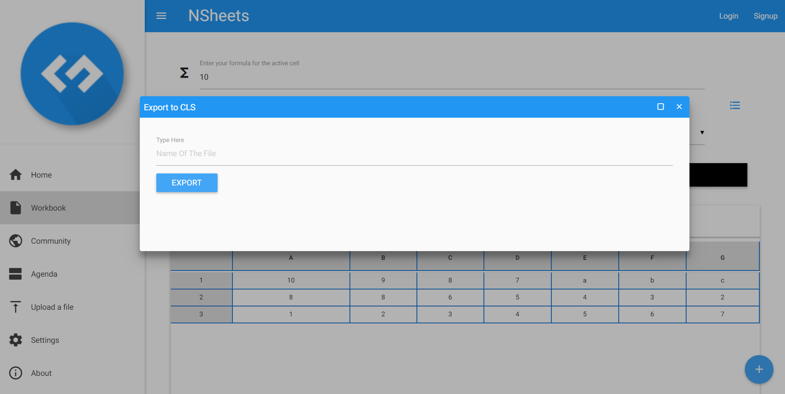

**Marco Carneiro** (s1160777) - Sprint 2 - IPC05.2
===============================

# 1. General Notes

*Add notes. Due to some imcompletions in the previous sprint, the previous team member.*

# 2. Requirements

IPC05.2 - It should be possible to export an workbook to a CLS file. The CLS format is the native format used by the desktop version of Cleansheets and now, as the application changed, also for NSheets.
The generated CLS should be downloaded to the user local file system.

Through research I must understand the structure of a **.cls** file and how it works, the way how the table from the workbooks can be transferred to such a file format.

**Proposal**:

  - **US1** : User can navigate to the desired Workbook and select the *Export to CLS* option. Then a prompt appears and the user must select the save path of the file. The file is, then, downloaded to the client's personal computer and can be accessed through the client's file browser.

# 3. Analysis

For this feature increment, since it is the first CLS exportation to be developed in a new project I need to:  

- Understand how the application works and also understand the key aspects of GWT, since it is the main technology behind the application  

- Understand how the Workbook works so that I may be able to integrate a proper page/prompt to select the save/download path for the CLS file

- The CLS file must be downloaded to the to the client's personal computer   

- The CLS file must valid and must display all of the Workbook information

## 3.1 GWT and Project Structure

### Modules
From the pom.xml file we can see that the application is composed of 5 modules:  
- **server**. It is the "server part" of the web application.  
- **shared**. It contains code that is shared between the client (i.e., web application) and the server.   
- **nsheets**. It is the web application (i.e., Client).  
- **util**. This is the same module as the one in EAPLI.  
- **framework**. This is the same module as the one in EAPLI.   

From [GWT Overview](http://www.gwtproject.org/overview.html): *"The GWT SDK contains the Java API libraries, compiler, and development server. It lets you write client-side applications in Java and deploy them as JavaScript."*

## 3.2 Application Startup and GWTP

As described before the entry point for the application is the class **pt.isep.nsheets.client.gin.ClientModule**.

GWTP follows the MVP (Model-View-Presenter) pattern. It uses [GIN dependency injection](http://dev.arcbees.com/gwtp/core/presenters/gin-bindings.html) to put together the parts of each MVP. How the GWTP structures the application and uses GIN to bind all the required elements is described in [GWTP Beginner's Tutorial](http://dev.arcbees.com/gwtp/tutorials/index.html).

We can see that **ClientModule** installs the base presenter of the application:

	    install(new ApplicationModule());

The **ApplicationModule** module install all the other modules of the application:

	    install(new HomeModule());
		install(new MenuModule());
		install(new AboutModule());
		install(new WorkbookModule());   

Each module represents an MVP page in the application.

In this iteration of the IPC 05.2 we need the **WorkbookView** and it's associated *ui.xml* file coupled with the Workbook page:

        //Opens the prompt for the user to type the name of the CLS
        exportToCLSButton.addClickHandler(event -> {
            new ExportToCLSView(/*send the current workbook*/this.getActiveCell().getSpreadsheet().getWorkbook());
        });

Despite MVP model, here it's not needed fully, since the Workbook page is already the working environment desired.

So, all we need is to instanciate a View class to couple with a *ui.xml* and a Binder, ando to finally present a simple window in the **Workbook** workplace.
As said,

        public class ExportToCLSView extends Composite {

          private static ExportToCLSBinder uiBinder = GWT.create(ExportToCLSBinder.class);

          interface ExportToCLSBinder extends UiBinder<Widget, ExportToCLSView> {
          }

          public ExportToCLSView(Workbook workbook) {
            //ommited code
          }

          //rest of class

In this interpretation of the MVP pattern no presenter is required and no module needs installing given that the window is seen as an extension of the prior **WorkbookView** class . For instance, the class will serve as an anchor point for all UI features and communicate directly with the servlet :

          public MaterialWindow popUpWindow() {
            return this.window;
          }

          public MaterialButton btnExport() {
            return this.btnExport;
          }

          public MaterialTextBox textBox() {
            return this.textBox1;
          }

Standard wise the View class is where all the UI code should be implemented. In GWT it is possible to create UI elements programmatically (see [GWT Build the UI](http://www.gwtproject.org/doc/latest/tutorial/buildui.html)). The UI can also be described in .ui.xml files using [UIBinder](http://www.gwtproject.org/doc/latest/DevGuideUiBinder.html). The NSheets project is using [GWT Material Design](https://github.com/GwtMaterialDesign/gwt-material) and therefore all the UI widgets are from that library. And even this particular case is no different however the class takes more responsability.

## 3.3 Analysis Diagrams

The main idea for the "workflow" of this feature increment:

**System Sequence Diagram**

**For US - Export To CLS Format**

# 4. Design

In this section the Design is further explored.

## 4.1. Tests

Regarding tests we try to follow an approach inspired by test driven development. However this UC mainly operates between the server and the client therefore it cannot be tested outside integration tests. The only way to verify it's proper working condition is to export the file and initiate the CleanSheets desktop app for later importation of information.

Tests such as checking the integrity of the file can only be
## 4.2. Requirements Realization

Following the guidelines for JPA from EAPLI we envision a scenario like the following for realizing the use cases for this feature increment.

**For US1**

Notes:  
- The diagram only depicts the less technical details of the scenario;  
- For clarity reasons details such as the PersistenceContext or the RepositoryFactory are not depicted in this diagram.

## 4.3. Classes

About half the classes needed to create this UC needed to be created. Namely the ***Servlet*** itself and the ***RPC*** interaction. Classes such as ***DownloadToCLSService***, ***DownloadToCLSServiceAsync*** and ***DownloadCLSImpl***. The UI was of course extended beyond the ***WorkbookView*** hence the need for a ***ExportToCLSView***.

## 4.4. Design Patterns and Best Practices

By memory we apply/use:

- RPC  

    - *The **GWT RPC** framework makes it possible for the client and server components of your web application to exchange Java objects over HTTP. The server-side code that gets invoked from the client is often referred to as a **service**. The implementation of a GWT RPC service is based on the well-known Java **servlet** architecture. Within the client code, it’ll use an automatically-generated proxy class to make calls to the service. GWT will handle serialization of the Java objects passing back and forth—the arguments in the method calls and the return value.*

- Modified MVP  

    - *Simplifying the modulation of the task helped with creating the presentation and in turn viewing the desired page for the user to interface with. All components that should be at said page were only present there and nowhere else. Given the different implementation in this case no Presenter and no Module were required.*

    **Note** :

  - We had available to us a different approach to the RPC method called *RequestFactory*. This method was not the best approach given the wide adoption of the **RPC** approach.

- DTO

**TODO:** Exemplify the realization of these patterns using class diagrams and/or SD with roles marked as stereotypes.

# 5. Implementation

**For US1**

For this UI we considered the MVP pattern in which the a whole new window displaying the text box and the export button,

      @UiField
      MaterialWindow window;

In the case of the ExportToCLSView class we can see that there is a ExportToCLSView.ui.xml. This file declares widgets. The attribute ui:field can be used to specify an id that can be then used to bind that element to a class in the code. For instance, in ExportToCLSView.ui.xml:

        <g:HTMLPanel>
            <ma:window.MaterialWindow ui:field="window" width="70%" title="Export to CLS" textAlign="LEFT" padding="32"
                              height="300px">
                <m:MaterialRow>
                    <m:MaterialPanel>
                        <m:MaterialLabel title="Type the name of the file"/>
                        <m:MaterialTextBox ui:field="textBox1" label="Type Here"/>
                        <m:MaterialButton ui:field="btnExport" text="Export" size="MEDIUM"/>
                    </m:MaterialPanel>
                </m:MaterialRow>
            </ma:window.MaterialWindow>
        </g:HTMLPanel>

It is set the ui:field attribute for two existing labels. In the code ExportToCLSView.java) one can bind to Widgets classes and the window above referred. For instance:

        @UiField
        MaterialWindow window;

        @UiField
        MaterialButton btnExport;

        @UiField
        MaterialTextBox textBox1;

After the **View** implementation the rest is **services**:

The Home page displays what seems to be Workbooks that should reside in the server.

The class View extends Composite and so it does not need any onReveal method, this is because this behaviour is manifestated by the constructor in the **WorkbookView** class. It uses the base communication mechanism of GWT called [GWT RPC](http://www.gwtproject.org/doc/latest/tutorial/RPC.html).

Basically, it only requires the **WorkbookView** class to define a *ClickHandler* and it initiates the require source code to present the Window. It then provides the *ClickHandler* for the Service present in the **DownloadToCLSService** class :

    @RemoteServiceRelativePath("downloadToCLSService")
    public interface DownloadToCLSService extends RemoteService {

      WorkbookDTO exportToDownload(WorkbookDTO toExport) throws DataException;

    }

Note: The @RemoteServiceRelativePath annotation associates the service with a default path relative to the module base URL.
In this case this service could not be used correctly given the complexity of the RPC method.

When an RPC is invoked since it is always executed asynchronously we have to prove a callback:

    void exportToDownload(WorkbookDTO toExport, AsyncCallback<WorkbookDTO> async);

The callback is simple a class that provides two methods, one for a successful result and the other for a failure:

    DownloadToCLSServiceAsync downAsync = GWT.create(DownloadToCLSService.class);
    downAsync.exportToDownload(dto, new AsyncCallback<WorkbookDTO>() {

            @Override
            public void onFailure(Throwable caught) {
                MaterialToast.fireToast("Error in Export to CLS! " + caught.getMessage());
            }

            @Override
            public void onSuccess(WorkbookDTO result) {
                String url = GWT.getModuleBaseURL() + "downloadToCLSService?filename=" + textBox1.getText();
                Window.open(url, "Download CLS file", "status=0,toolbar=0,menubar=0,location=0");
            }
        });

Since the interface is code that must be accessed by both server and client code it should reside in the **shared** module in the project.

**Code Organization**  

We followed the recommended organization for packages:  
- Code should be added (when possible) inside packages that identify the group, sprint, functional area and author;
- For instance, we used **pt.isep.nsheets.client.lapr4.red.s2.s1160777**

The code for this sprint:  

Project **shared**  
- Created the classes: **pt.isep.nsheets.shared.services.DownloadToCLSService** and **pt.isep.nsheets.shared.services.DownloadToCLSServiceAsync**  

Project **NShests**
- Added the classes: **pt.isep.nsheets.client.lapr4.red.s2.s1160777.application.exportToCLS.ExportToCLSView**
- Also added the file: **pt.isep.nsheets.client.lapr4.red.s2.s1160777.application.exportToCLS.ExportToCLSView.ui.xml**  

Project **Server**
- Created the classes:
**pt.isep.nsheets.server.services.DownloadCLSImpl**
- Updated:
**web.xml** of this project to add the description for the *servlet*

# 6. Integration/Demonstration

## Workbook Page

## CLS export window

Efforts were made with elements of the group and even with other groups to ensure proper integration of functionalities with minimum conflict (IPC03.1) given that the PDF exportation had a very close implementation process.
Integration of the CLS Exporter window in the Workbook page required coordination with members from the same team.
Work was done alongside one other member of the our group to better understand the use of the exportation tools, their role in the application and they work with the  **RPC**.

# 7. Final Remarks

Some Questions/Issues identified during the work in this feature increment:

1. Some problems arose when the implementaion of the RPC method didnt recognize the service.

2. Several research work was put into trying to fully realize the function. Different approaches were trialed before so that we could determine the best way to implemente RPC and exchange information with the servlet

# 8. Work Log

Commits:

[Added a missing link to the readMe.md responsible for linking the index to the proper Analysis/Design page](https://bitbucket.org/lei-isep/lapr4-18-2dl/commits/a92c5e8135c0)

[Added the button to ui.xml file and it's prototype behaviour on WorkbookView. Next step is to add the servlet behaviour. More analysis of the Services classes and ServicesAssync classes are in order.](https://bitbucket.org/lei-isep/lapr4-18-2dl/commits/e22683a87403)

[Added a very basic implementation of the Download Servlet and it's service. As it stands only an empty file with the name downloadService is in function.
The servlet itself may be subject to changes in regards of its implementation. Some exportation methods may require it and thus, it may be changed to abstract to help other team members to export using the servlet only by changing the way the output information is built](https://bitbucket.org/lei-isep/lapr4-18-2dl/commits/08cbe9f2c5a0)

[Added a View class that is responsible for the presentation and logic of exporting the current workbook to a .cls file and then proceed to it's download. Currently the button in the FAB structure is not workin as intended because rescieving the workbook object in the service prevents the pop-up from showing. The window works otherwise, so, if needed another way to devise is to provide the workbook data directly to the servlet or restructure the way it recieves this data.](https://bitbucket.org/lei-isep/lapr4-18-2dl/commits/18d1a691bb27)

[Further devolopment on the servlet. Now properly downloads .cls files, no data has yet been output given that the builder/OutputStream hasnt been implemented yet. Added the full UI integration.
(One issue remains : For the workbook to be loaded further down the line a cell must be selected , if not a NullPointerException is liable to occur)](https://bitbucket.org/lei-isep/lapr4-18-2dl/commits/f540ad9b37df)

[Fixed an issue where the download would not work outside 127.0.0.1 . As of the last testing run, files can be downloaded from other computers using server software such as a Tomcat server or XAMPP. Docker still is not liable enough to use outside its intended OS.](https://bitbucket.org/lei-isep/lapr4-18-2dl/commits/5ad70c242363)

[Added the ability to download the file and export the DTO data to it. No tests have been done yet to see if the file can be uploaded to the CleanSheets desktop app.
Problems arose with the Services classes and with the Async service.](https://bitbucket.org/lei-isep/lapr4-18-2dl/commits/c3cc426b7d9c)

[Core02.1 - Intergration of a Switch to represent Core08.1 extension.](https://bitbucket.org/lei-isep/lapr4-18-2dl/commits/b291b492ccb6f516909b335c8efcf9aef08ecaea)

[Revert a small change to the server.gwt.xml which made its way to the previous commit](https://bitbucket.org/lei-isep/lapr4-18-2dl/commits/6419ae0ac930)

[Managed to export the actual data from the RPC to the Servlet. The server now recieves the proper data and can export. No tests have been implemented since they are all integration tests.](https://bitbucket.org/lei-isep/lapr4-18-2dl/commits/40ecc4a1da33)

[Close the issue (Refer to next one)](https://bitbucket.org/lei-isep/lapr4-18-2dl/commits/40ecc4a1da33)
