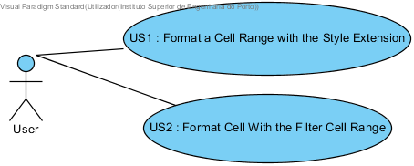
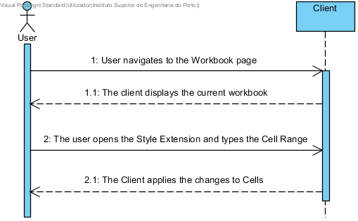
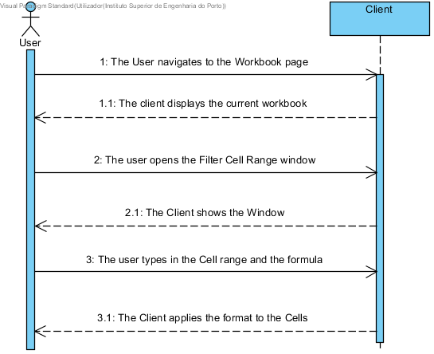
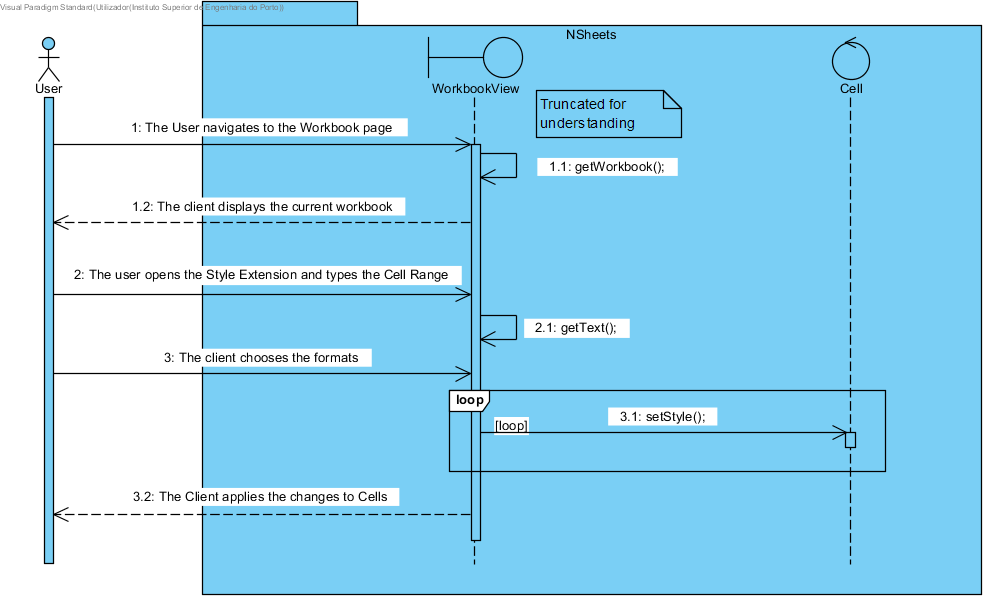

**Marco Carneiro** (s1160777) - Sprint 3 - Lang03.2
===============================

# 1. General Notes

*Add notes. Due to some imcompletions in the previous sprint, the previous team member.*

# 2. Requirements

Lang03.2 - Enable the application to apply conditional formatting to a range of cells (also in the style extension). The idea is that a single formula could be applied to all the cells in the range (one at a time) in order to evaluate what style to apply.

The application would evaluate the formula for each cell in the range and apply the formatting style in accordance with the result of the formula.

**Proposal**:

  - **US1** : User can navigate to the desired Workbook and select the Style extension. From these it may apply different formatting rules just by stating which Cells it may need to change.

  - **US2** : User can navigate to the desired Workbook and select the Filter Cell Range functionality. From these it may apply different formatting rules based on formulas.

# 3. Analysis

For this feature increment, since it is an evolution of two existing features I need to:  

- Understand how the extension interfaces with the Spreadsheet  

- Understand how the Workbook works so that I may be able to integrate a proper page/prompt to provide the right Cell Range selector / text boxes.

- The Cell Range must be selected by the user and they must change based on the User input   

- The Cell Range must be valid and must applied by Collumns

## 3.1 GWT and Project Structure

### Modules
From the pom.xml file we can see that the application is composed of 5 modules:  
- **server**. It is the "server part" of the web application.  
- **shared**. It contains code that is shared between the client (i.e., web application) and the server.   
- **nsheets**. It is the web application (i.e., Client).  
- **util**. This is the same module as the one in EAPLI.  
- **framework**. This is the same module as the one in EAPLI.   

From [GWT Overview](http://www.gwtproject.org/overview.html): *"The GWT SDK contains the Java API libraries, compiler, and development server. It lets you write client-side applications in Java and deploy them as JavaScript."*

## 3.2 Application Startup and GWTP

As described before the entry point for the application is the class **pt.isep.nsheets.client.gin.ClientModule**.

GWTP follows the MVP (Model-View-Presenter) pattern. It uses [GIN dependency injection](http://dev.arcbees.com/gwtp/core/presenters/gin-bindings.html) to put together the parts of each MVP. How the GWTP structures the application and uses GIN to bind all the required elements is described in [GWTP Beginner's Tutorial](http://dev.arcbees.com/gwtp/tutorials/index.html).

We can see that **ClientModule** installs the base presenter of the application:

	    install(new ApplicationModule());

The **ApplicationModule** module install all the other modules of the application:

	    install(new HomeModule());
		install(new MenuModule());
		install(new AboutModule());
		install(new WorkbookModule());   

Each module represents an MVP page in the application.

In this iteration of the Lang 03.2 we need the **WorkbookView** and it's associated *ui.xml* file coupled with the Workbook page:

        //Opens the prompt for the user to type the name of the CLS
        applyToSetOfCells.addClickHandler(event -> {
           MaterialToast.fireToast("Formatting from Cell " + firstCell.getText() + " to " + lastCell.getText());
           /*Add a verification if needed*/
       });

Despite MVP model, here it's not needed fully, since the Workbook page is already the working environment desired.

In this interpretation of the MVP pattern no presenter is required and no module needs installing given that the window is seen as an extension of the prior **WorkbookView** class . For instance, the class will serve as an anchor point for all UI features and communicate directly with the user. All of the features would be shown through the Collapsible Body present on this very class.

The other point that was needed update was the Filter Cell Range functionality which is present in this class too.

        //Activate the Filter Cell Range Window
        filterCellRange.addClickHandler(event -> {
          new FilterCellRangeView(customTable.getRow(0).getData().sheet);
        });

Referred above are both of the starting points of all the functionalities that need update to fit the requirements set by the ***User***.

#### ***Standard of the UI***

Standard wise the View class is where all the UI code should be implemented. In GWT it is possible to create UI elements programmatically (see [GWT Build the UI](http://www.gwtproject.org/doc/latest/t
  **Standards**
  utorial/buildui.html)). The UI can also be described in .ui.xml files using [UIBinder](http://www.gwtproject.org/doc/latest/DevGuideUiBinder.html). The NSheets project is using [GWT Material Design](https://github.com/GwtMaterialDesign/gwt-material) and therefore all the UI widgets are from that library. And even this particular case is no different however the class takes more responsability.

## 3.3 Analysis Diagrams

The main idea for the "workflow" of this feature increment:

**System Sequence Diagram**

**For US - Cell Range in Style Extension**

**For US - Cell Range in filter cell range**

# 4. Design

In this section the Design is further explored.

## 4.1. Tests

Regarding tests we try to follow an approach inspired by test driven development. However this UC mainly operates within the already established Extension or FilterCellRange. The only way to verify it's proper working condition is to set a Range and use the already defined formatting functionalities.

      public void testRangeSelection(){
        Cell cell1;
        Cell cell2;

        List<Cell> rangeEstablished = new LinkedList<Cell>();
        rangeEstablished.add(cell1);
        rangeEstablished.add(cell2);

        List<Cell> rangeSelected = new LinkedList<Cell>();

                //use the fucntionality

        assertTrue(rangeSelected,rangeEstablished);
      }

Tests such as checking the change of the Cells can be viewed on the working Spreadsheet.

## 4.2. Requirements Realization

Following the guidelines for MVP employed by previous members that worked on this part of the project.
To fulfill the requirements it was needed to analyse the already implemented structure of the project.

**For US1**

Notes:  
- The diagram only depicts the less technical details of the scenario;  
- For clarity reasons details such as the PersistenceContext or the RepositoryFactory are not depicted in this diagram. They are not required per ser but they are in fact needed to fetch the current Workbook and Spreadsheet.

## 4.3. Classes

Almost all of the classes for this function were already implemented and only needed updates. Namely the ***WorkbookView*** and the ***FilterCellRangeView*** Window. The UI was of course extended beyond the ***WorkbookView*** hence the need for a ***FilterCellRangeView***, however only some updates were required to keep everything in function.

## 4.4. Design Patterns and Best Practices

By memory we apply/use:

- MVP  

    - *Simplifying the modulation of the task helped with creating the presentation and in turn viewing the desired page for the user to interface with. All components that should be at said page were only present there and nowhere else. Given the different implementation in this case no Presenter and no Module were required.
    The **WorkbookView** appliance was the most notable place in need of update.*

  **Note** :

  - We had available the use of a Composite extended Class for the Style Extension but a CollapsibleBody was chosen instead. It may increase the complexity of the WorkbookView class but its presentation is more pleasant for usage.

# 5. Implementation

For this UI we considered the MVP pattern in which the a whole new window displaying the text box and the export button was already in the WorkbookView,

**For US1**

        //Firstly the FilterCellRangeView
        @UiField
        MaterialButton filterCellRange;

**For US2**

        //Secondly the StyleExtension
        @UiField
        MaterialLink conditionalLink;

**For US2**

In the case of the WorkbookView (Style Extension) class we can see that there is a WorkbookView.ui.xml. The attribute ui:field can be used to specify an id that can be then used to bind that element to a class in the code. For instance, in WorkbookView.ui.xml:

          <!--1160777-->
          <m:MaterialRow>
              <m:MaterialTextBox ui:field="firstCell" placeholder="First Cell" grid="s2" />
              <m:MaterialTextBox ui:field="lastCell" placeholder="Last Cell" grid="s2"  />
          </m:MaterialRow>

          <!--1160777-->
          <m:MaterialRow>
              <m:MaterialButton ui:field="applyToSetOfCells" text="Apply To Set" grid="s2"/>
          </m:MaterialRow>

**For US1**

For the FilterCellRange in the FilterCellRangeView we add in it's specific FilterCellRangeView.ui.xml. As in:

          @UiField
          MaterialWindow filterCellRangeWindow;

          @UiField
          MaterialLabel label;

          @UiField
          MaterialTextBox formulaBox, upperCellInfo, lowerCellInfo;

          @UiField
          MaterialButton filterCellsButton;

And it's ui.xml:

      <ma:window.MaterialWindow ui:field="filterCellRangeWindow" title="Filter Cell Range">

              <m:MaterialRow>
                  <m:MaterialLabel text="Conditional Formatting Of Cells" ui:field="label"/>
              </m:MaterialRow>

              <m:MaterialRow>
                  <m:MaterialTextBox ui:field="upperCellInfo" placeholder="First Cell" grid="s2" />
                  <m:MaterialTextBox ui:field="lowerCellInfo" placeholder="Last Cell" grid="s2"  />
              </m:MaterialRow>

              <m:MaterialRow>
                  <m:MaterialTextBox ui:field="formulaBox" placeholder="Type in your formula" grid="s8" />
              </m:MaterialRow>

              <m:MaterialRow>
                  <m:MaterialButton ui:field="filterCellsButton" text="Filter Cells" waves="LIGHT" textColor="WHITE" iconType="POLYMER" grid="s2" size="MEDIUM"/>
              </m:MaterialRow>

      </ma:window.MaterialWindow>

The class View extends Composite and so it does not need any onReveal method, this is because this behaviour is manifestated by the constructor in the **WorkbookView** class. It uses the base communication mechanism of GWT called [GWT RPC](http://www.gwtproject.org/doc/latest/tutorial/RPC.html).

Basically, it only requires the **WorkbookView** class to define a *ClickHandler* and it initiates the require source code to present the Window.

Since the interface is code that must be accessed by only the client it should reside in the **nsheets**/**client** module in the project.

**Code Organization**  

We followed the recommended organization for packages:  
- Code should be added (when possible) inside packages that identify the group, sprint, functional area and author;
- For instance, we used **pt.isep.nsheets.client.lapr4.blue.s2.s1171715.filterCellRange**
and **pt.isep.nsheets.client.application.workbook**

The code for this sprint:  

Project **NShests**
- Modified the classes: **pt.isep.nsheets.client.lapr4.blue.s2.s1171715.filterCellRange.FFilterCellRangeView**
and **pt.isep.nsheets.client.application.workbook.WorkbookView**

Note: The respective ui.xml files also suffered alterations in this iteration.

# 6. Integration/Demonstration

## Style Extension

## Filter Cell Range

Efforts were made with elements of the group and even with other groups to ensure proper integration of functionalities with minimum conflict.
Work was done alongside one other member of the our group to better understand the use of the extension tools, their role in the application and how they work with the  **View** in which they were present.

# 7. Final Remarks

Some Questions/Issues identified during the work in this feature increment:

1. Some problems arose when we needed to select various cells at once given the way the workbook treates the active Cell.

2. The same problem came up in the FilterCellRange.

# 8. Work Log

Commits:

[Added two fields to the Style Extensions [subject to change].
Reformatted the filtering Cell Window to later modify it further. The changes to cells will probably use the existing buttons on the extension and then apply the change one by one](https://bitbucket.org/lei-isep/lapr4-18-2dl/commits/bee2c5c30a1d)

[Added a missing button to allow the settings to be applied porperly. Added to the WorkbookView the missing TextBoxes so that the Cell data can be fetched form there.
Now only misses all the cells in between and after adding them to a list starting to apply the settings to one by one.](https://bitbucket.org/lei-isep/lapr4-18-2dl/commits/d3697c71a865)

[Adding one last small alteration not featured in the latest commit, one simple prompt to ensure that the user sees when the Cell data is being fetched in the FilterCell Window](https://bitbucket.org/lei-isep/lapr4-18-2dl/commits/8db22522e82f)

[Added a simple button and a prompt to better reflect the true purpose of the functionality and to provide feedback to the user. An existing problem persists in the Style Extension where it refuses to select a range because it requires the active Cell to be previously selected.](https://bitbucket.org/lei-isep/lapr4-18-2dl/commits/d598da0e66ae)

[Added required images for the documentation files. These images demonstrate the functionality and where to find it](https://bitbucket.org/lei-isep/lapr4-18-2dl/commits/35d6a1b1143e)

[Added documentation file that was missing. More images for the design and analysis added alongside their respective information regarding their correlation with the project classes. No more chnages made code wise (Refer to previous commit)](https://bitbucket.org/lei-isep/lapr4-18-2dl/commits/35d6a1b1143e)
