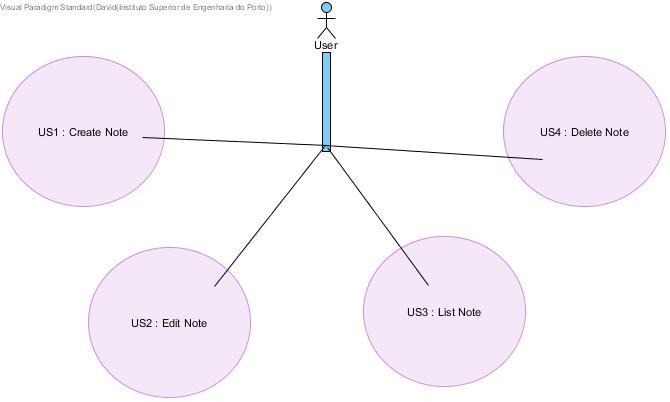

**David Santiago** (s1161109) - Sprint 1 - Core02.1
===============================

# 1. General Notes

The UC is not properly implemented because of many unsolved errors that stoped me from developing more code.

# 2. Requirements

Core07.1 - User should create notes.
	       All Versions of the notes must be persisted and acessible by browser.
		   Notes should have an option to be deleted.
		   
		   

**Proposal**:

  - **US1** : User can view, edit and delete notes.

# 3. Analysis

For this feature increment I need to:  

- Understand how the application works and also understand the key aspects of GWT

- Understand how the View Communicates with the "BackEnd"

## 3.1 GWT and Project Structure

**Modules**. The application is composed by 5 modules:  

- **server**. -> Connection to server ( persist data) 
- **shared**. -> Code shared by client and server 
- **nsheets**. -> WebApplication 
- **util**. -> Package of util classes
- **framework**. -> Given framework for the work

## 3.2 Application Startup and GWTP

The **ApplicationModule** module installed by my uc:

	    install(new NoteModule());
  

      interface MyView extends View {

        void addClickHandlerApplyButton(ClickHandler ch);

          MaterialTextBox getTextBox();
		  
		  MaterialButton getButton();

      }

## 3.4 Analysis Diagrams

The main idea for the "workflow" of this feature increment.

**Use Cases**

- **Use Cases**. Since these use cases have a one-to-one correspondence with the User Stories we do not add here more detailed use case descriptions. We find that these use cases are very simple and may eventually add more specification at a later stage if necessary.

- **Domain Model**. Since we found no specific requirements for the structure of Workbook Descriptions we follow the Structure of the existing DTO (WorkbookDescriptionDTO).

**System Sequence Diagrams**

**For US1**

**For US2**

**For US3**

**For US4**

# 4. Design

*In this section you should present the design solution for the requirements of this sprint.*

## 4.1. Tests

## 4.2. Requirements Realization

*In this section you should present the design realization of the requirements.*

Following the guidelines for JPA from EAPLI we envision a scenario like the following for realizing the use cases for this feature increment.

**For US1**

**For US2**

# 5. Implementation

# 6. Integration/Demonstration

*

# 7. Final Remarks

	There where severel errors occurred that stoped me from doing my UC.
	Some of those erros took a while to be solved even with teachers help.

# 8. Work Log

Commits:

No Commits on main branch because of the errors.