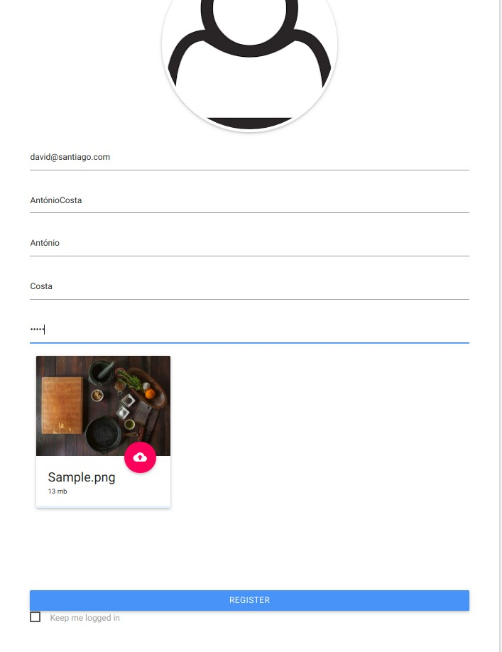

**David Santiago** (s1161109) - Sprint 2 - IPC01.2
===============================

# 1. General Notes

# 2. Requirements

IPC01.2 - User Registration

User Email Should be valid and unique.
PassWord should be encrypted for safety reasons.
User is by defaul only user(not admin)

US1 - Understand how the application works and later the Gatekeeper.

US2 - Changed classes in Server.

* **Email**
* **Password**
* **UserType**
* **Name**
* **Nickname**
* **UserServiceImpl**
* **LoginController**
* **User**

US3 -Changed classes in shared

* **EmailDTO**
* **PasswordDTO**
* **UserTypeDTO**
* **NameDTO**
* **NicknameDTO**
* **UsersServiceAsync**
* **UsersService**
* **UserDTO**

US4 - Create classes in Web

* **CurrentMenu**

# 3. Analysis

For this feature increment i needed to:

-Understand how the application works and also understand the key aspects of GWT

-Understand how the Home Page is implemented, so i can edit menu from another modules.

-Understand how to connect JPA technology with the database;

-Understand how the UI communicates with server;

-Learn to add patterns to java;

-Learn how to encrypt passwords;

-Create a view/page that will be used for the register

-Add a button to the menu to sing up

-Add a button to logout

-Add a image of user on the top

-Add the nickname of user on the top

-Persist the user data on the server

  Special Case of Email Verification:

  Email is verified by the next pattern:

  [a-z0-9._%+-]+@[a-z0-9.-]+\\.[a-z]{2,4}_

## 3.1 GWT and Project Structure

**Modules**. From the pom.xml file we can see that the application is composed of 5 modules:  
- **server**. It is the "server part" of the web application.  
- **shared**. It contains code that is shared between the client (i.e., web application) and the server.   
- **nsheets**. It is the web application (i.e., Client).  
- **util**. This is the same module as the one of EAPLI.  
- **framework**. This is the same module as the one of EAPLI.   

### 3.1.1 Server

  These classes have the method need of fromDTO and toDTO that serve to convert the classes to be possible to use the shared classes.

 * **Email** - It is a class that presents a string ('email') that refers to the User's email.
 * **Password** - Is a class that has a string ('password') that refers to the User's password.
 * **Name** - This is a class that has two string ('firstName', 'secondName') that refers to the User name.
 * **Nickname** -This is a class that has a string ('nickname') that refers to the nickname of the User.
 * **UserType** - Is an enumeration that displays the type of User ('USER', 'ADMIN').

---------------------------------------------------------

 * **RegisterController** - This class presents the method that will save a user and its information to the database;

* **UserServiceImpl** - This class serves to connect the shered to server

* **User** - It is a class that presents a Email,PAssword,Name,Nickname and UserType.

### 3.1.2 Shared

* **EmailDTO** - It is a class that presents a string ('email') that refers to the User's email.
* **PasswordDTO** - Is a class that has a string ('password') that refers to the User's password.
* **NameDTO** - This is a class that has two string ('firstName', 'seconName') that refers to the User name.
* **NicknameDTO** -This is a class that has a string ('nickname') that refers to the nickname of the User.
* **UserType** - Is an enumeration that displays the type of User ('USER', 'ADMIN')
* **UsersServiceAsync/UsersService**- These classes serve to communicate with the userServiceImp

### 3.1.2 Web

* **CurrentMenur** - This class has the CurrentMenu that is beeing shown;

## 3.2 Applciation Startup

  The ApplicationModule must install a new model for the registering page:

  

  This module will represent an sing up Page.

  When Module is presented, the next method is called so it can manage ( in the CurrentMenu ) the login,logout,register buttons and the userName and userImage :

  

## 3.2 Server and RepositoryFactory

The Register page displays several fields that,if corrected verified will persist on server.

In the method onReveal the Register presenter invokes a RegisterService asynchronously.

For this purpose I will require an interface for the service. In this case:

  

When the RPC is invoked since it will always execute asynchronously  I have to prove that i received a callback:

Since the interface has methods that must be accessed by both server and client classes it must be implemented on the shared package.

The interface must be implemented in the server since it will be the one responsible for communicating with the data base. The RegisterController will be the assign controller for this task of implementing the interface

Since this service is an servlet the web.xml file of the project must know about its existence (see file nsheets/src/main/webapp/WEB-INF/web.xml).

## 3.4 Analysis Diagrams

**Use Cases**

**Domain Model (for this feature increment)**

- **Domain Model**. Since we found no specific requirements for the structure of User we follow the Structure of the existing DTO (UserDTO).

**System Sequence Diagrams**

**For US1**

# 4. Design

## 4.1. Requirements Realization

*In this section you should present the design realization of the requirements.*

Following the guidelines for JPA from EAPLI we envision a scenario like the following for realizing the use cases for this feature increment.

**For US1**

Notes:  
- The diagram only depicts the less technical details of the scenario;  
- For clarity reasons details such as the PersistenceContext or the RepositoryFactory are not depicted in this diagram.   
- **UserServices** realizes the GWT RPC mechanism;  
- **RegisterController** is the *use case controller*;  

# 5. Implementation

**Code Organization**  

We followed the recommended organization for packages:  

- Code should be added (when possible) inside packages that identify the group, sprint, functional area and author;
- For instance, we used **lapr4.red.s2.ipc.s1161109.*

The code for this sprint:  

Project **server**    
- pt.isep.nsheets.server.**lapr4.white.s1.core.s1161109.register.application**: contains the controllers  
- pt.isep.nsheets.server.**lapr4.white.s1.core.n4567890.workbooks.persistence**: contains the persistence/JPA classes

I edited this class's:
- pt.isep.nsheets.server.**lapr4.white.s1.core.s1160570.login.domain**: contains the domain classes User,Email,Password,Name,UserType
- **pt.isep.nsheets.server.UserServiceImpl**

Project **shared**  

- Edited the classes: **pt.isep.nsheets.shared.services.UserService** and **pt.isep.nsheets.shared.services.UserServiceAsync**  

Project **NShests**

Created the classes:

-**RegisterView**
-**RegisterModule**
-**RegisterPresenter**
-**RegisterController**

# 6. Integration/Demonstration

During the implementation of my UC I helped and been helped by my team several times.

##6.1 Demonstration

Register Page:

After Registering we have to do the login:

  

If the login is sucessefully than it changes the top menu and open a logged in restrict page:

  

# 6. Test Class's

  The only class that deserved a test class because of the complexity of its code was the email class:

  The tests are the next:

  

# 7. Work Log

Commits:

[IPC01.2: Starting development of IPC01.2. Analysis of user story and necessary components for realization of this use case](https://bitbucket.org/lei-isep/lapr4-18-2dl/commits/209ebbb10e11)

[IPC01.2: Started design. Planification of the necessary domain and services tests](https://bitbucket.org/lei-isep/lapr4-18-2dl/commits/7beb2ebd5a8a667b6b71822167370e0f5375d678)

[IPC01.2: User is now beigin Persisted](https://bitbucket.org/lei-isep/lapr4-18-2dl/commits/7beb2ebd5a8a667b6b71822167370e0f5375d678)

[IPC01.2: Updated documentation. Sequence diagram added. UI materials added in order to retain chat messages. Missing only tests and the ability to use the actual user of the app instead of a default](https://bitbucket.org/lei-isep/lapr4-18-2dl/commits/2bcee7a4021730a74d39550aeb83807b51b9cb73)

[IPC01.2: Updated documentation](https://bitbucket.org/lei-isep/lapr4-18-2dl/commits/ffb7ba5ab8fc7a8957da5579a37c30bd3408668e)

[IPC01.2: Analysis completed. Added domain model image and ssd image](https://bitbucket.org/lei-isep/lapr4-18-2dl/commits/ffb7ba5ab8fc7a8957da5579a37c30bd3408668e)

[IPC01.2: Update documentation. Added domain tests. Use case almost completed](https://bitbucket.org/lei-isep/lapr4-18-2dl/commits/ffb7ba5ab8fc7a8957da5579a37c30bd3408668e)

[IPC01.2: Updated documentation](https://bitbucket.org/lei-isep/lapr4-18-2dl/commits/ffb7ba5ab8fc7a8957da5579a37c30bd3408668e)

# 8. Final Remarks

 For lack of time i didn't implemented password encryptation.

 After several tries and after asking the teacher Bragança for help for doing image upload it was not possible to do it.

 User doesn't login after register for compatibility pruposes regarding next UC.
