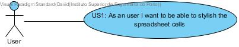
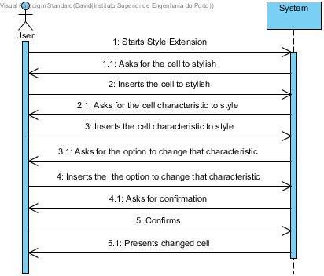
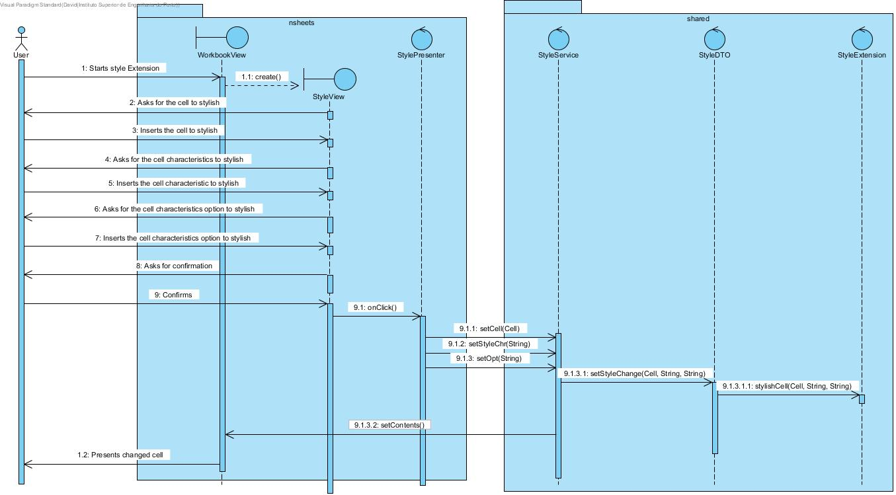
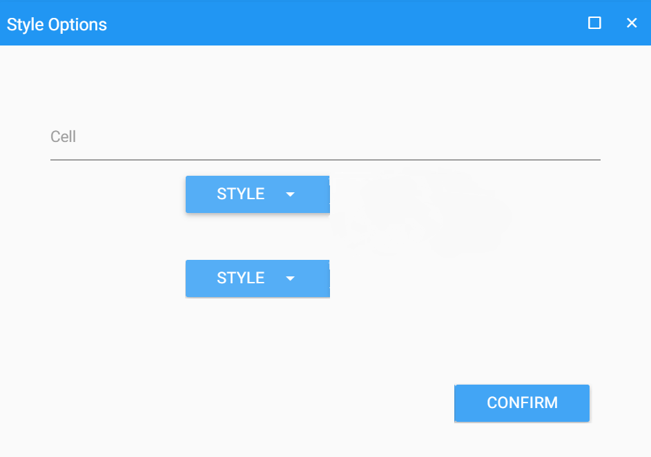

**David Maia** (s1161110) - Sprint 1 - Core08.1
===============================

# 1. General Notes

This sprint was full of problems, it was hard to understand the design of the application. My Use Case depends on the Core02.1 so I helped my colleague, but with little success.

# 2. Requirements

Core08.1 - Styles in Cells Extension

The application should have a new extension to associate styles with cells. The functionality should be similar to the one present in the desktop version of Cleansheets.
It adds the option to change colour (text or background), text formatting, alignments and fonts of each cell on a spreadsheet.

-US1: As an user I want to be able to stylish the spreadsheet cells.

# 3. Analysis

For this feature creation, since it is the first one to be developed regarding style in cells I need to:  

- Enable a button that allows to pop a menu for the user to choose one cell and select the caracteristic to change: colour, text formatting or alignments (example: background colour);

- After choosing the caracteristic I want to change, I may choose one change option (example: Black);

## 3.1 Analysis Diagrams

**Use Cases**

- **Use Cases**.

**Domain Model (for this feature increment)**

- Since I found no specific requirements in terms of domain, I follow the Structure of the existing entitys.

**System Sequence Diagrams**

# 4. Design

## 4.1. Tests

There are not many tests possible for this use case other than the functional use of this feature.

**Domain classes**

This classes were not changed so there is no need to test anything.

**Services/Controllers**

**Test 1**

**Test Coverage**  
- There were no tests made

## 4.2. Requirements Realization

For this Use Case to fully work, the extension manager needs to be fully working as well as workbook persistence.

**For US1**

Notes:  
- The diagram only depicts the less technical details of the scenario;  
- The implementation of this design was not done so there is no way I could test it.   
- The use of the RPC mechanism is very reduced in the diagram;  

## 4.3. Classes
* StyleDTO
* StyleView
* StyleModule
* StylePresenter
* WorkbookView
* Style Extension

## 4.4. Design Patterns and Best Practices

By memory we apply/use:  
- Singleton  
- Repository  
- DTO  
- MVP  

# 5. Implementation

**For US1**

**Workbook page style button**
I added a button on the top of the spreadsheet to allow the style window to open.

**Style Window**
I created a popup window, with a text field for cell insertion, a dropdown to choose the characteristic to change, and after choosing it should appear another dropdown and after click confirm this window should dissapear.

e.g. background colour change on cell A1
Cell -> A1
dropdown style-> background colour
dropdown option appears
dropdown  option -> Black
confirms
window closes

**Code Organization**  

I followed the recommended organization for packages:  

The code for this sprint:  

Project **shared**  
-StyleDTO
-StyleService
-Style Extension

Project **NSheets**
-WorkbookView
-StyleView
-StylePresenter
-StyleModule

# 6. Integration/Demonstration

I worked 2 days with my colleague on the Core02.1, we had little success but we tried to interact to design a program that make sense.
My use Case functional idea is shown in this picture:

# 7. Final Remarks

In conclusion, I wasn't able o finish this Use Case, the time spent in starting to get our ide ready for work was too much. The use of a framework like gwt without previous knowledge made our work really slow. With more time I might would be able to make a better work, or at least a functional version of this use case.

Some Questions/Issues identified during the work in this feature increment:

1. Do this styles need to be persisted?
2. How to interact client and shared, when shared needs to save gwt objects?

# 8. Work Log
Tuesday - May 29
First day of work, I started by clonning the Repository. There was when the problems started: Intellij configurations errors, missing maven dependencies and some other errors.

Wednesday - May 30
On this day I solved all the problems and the team finally started the work together. I first analysed my Use Case and started to understand how would be the building of a plugin/extension on this project in particular. I started to understand that it would be a lot harder and I decided to help Core02.1 because that was the extension manager to see if I could understand more about extensions.

Thursday (Holiday)- May 31
I spent the day trying to help my colleague on the Core 02.1, research on plugin and extension use on java code was not very easy, and we spent a lot of time in the wrong path.
One post on the moodle forum (https://moodle.isep.ipp.pt/mod/forum/discuss.php?d=16860) made us understand what was the right path to work on. Later that day I decided to go back to my use case, with some ideas of how it would work.

Friday - June 1
This day was dedicated for gwt research, I never used it so there were too many problems in understanding the use of this framework and the interation with other parts of the code.

Saturday - June 2
I started the day by making the requirements and analysis of the use case.
Decided to try to create an UI to test my knowledge in gwt, I made a button in the workbook page, and start the popup window to select the changes (more about the fucntionality on the documentation above).

Sunday -  June 3
Several problems on the UI implementation, as I already started the design and I wasn't sure it would work I tried more research.

Monday - June 4
The popup window started working, but the dropdown was causing several problems that wouldn't allow me to finish on time. After the meeting I decided to focus on the documentation.

Tuesday - Delivery Day -  June 5
Documentation finalization, some non-functional code commited to show some of my work. The Design was finnally commited, because there was no total implementation there is no way I can be sure it would work.

Commits:

[Requirements Core08.1](https://bitbucket.org/lei-isep/lapr4-18-2dl/commits/694b77c7913ae5bd5bd2a7ba1da641bd0b0028c4)

[Analysis Core08.1](https://bitbucket.org/lei-isep/lapr4-18-2dl/commits/838b2cc7d9e9aad27ebac10872ff20f49db934e5)

[Design Core08.1]()

[Tests (documentation) Core08.1]()

[Code Implementation Core08.1](https://bitbucket.org/lei-isep/lapr4-18-2dl/commits/d378b9a9e8aebeda64bace81ef1f85ccfc68aedb)
