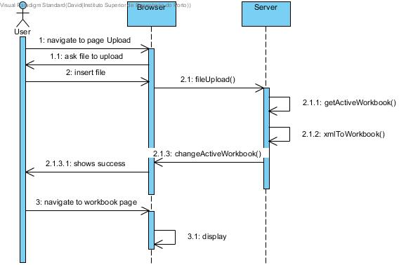
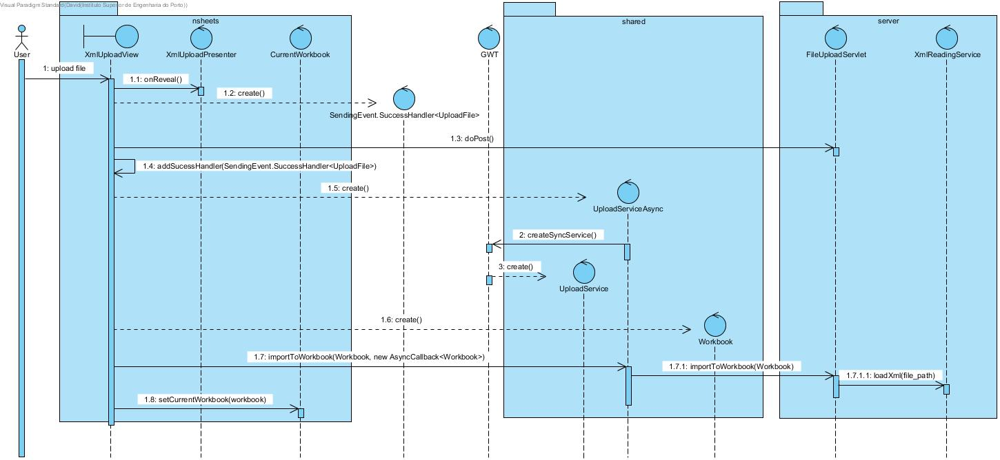

**David Maia** (s1161110) - Sprint 2 - IPC04.2
===============================

# 1. General Notes

For this sprint I will allow the import of xml files, but because in the previous sprint the other team did not completed the export of a xml file, I will create my own schema.

# 2. Requirements

IPC04.2 - Import XML

It should be possible to import (i.e., upload) data from an XML file (this operation is the "inverse" of the previous one). Depending on the contents of the XML file, the data from the file can replace the contents of the active workbook, a spreadsheet or a range of a spreadsheet.

-US1: As an user I want to be able to upload a XML file and import the data to the current workbook.

# 3. Analysis

For this feature increment, since it in the first sprint it wasn't developed a xml schema, and there is not any upload file system. I need to:

* Create a XML Schema for workbook;

* Create an upload file page and servlet;

* Create a file reader system;

* Understand how to change the value of the cells for the current workbook;

## 3.1 Analysis Diagrams

**Use Cases**

 **Use Case 1**.

**Domain Model (for this feature increment)**

- Since I found no specific requirements in terms of domain, I follow the Structure of the existing entitys.

**System Sequence Diagrams**

# 4. Design

## 4.1. Tests

There are not many tests possible for this use case other than the functional use of this feature.

**Domain classes**

This classes were not changed so there is no need to test anything.

**Services/Controllers**

For the services I created a service specified in the interface **UploadService**:

    @RemoteServiceRelativePath("uploadService")
    public interface UploadService extends RemoteService {
        Workbook importToWorkbook(Workbook wb) throws IOException, NumberFormatException, FormulaCompilationException;
    }

This Service is sufficient for the US1. It connects the View with the UploadServlet and with the XmlReadingService.

**Test Coverage**  
- There was not any change in the domain so there was nothing to test.

## 4.2. Requirements Realization

**For US1**

Notes:  
- The diagram only depicts the less technical details of the scenario;
- For clarity reasons details such as the XmlUploadModule and others are not depicted in this diagram.
- **UploadService** realizes the GWT RPC mechanism;
- There is no need for a controller since the **FileUploadServlet** realizes all the tasks need and bundles the other necessary service.

## 4.3. Classes
There were several classes created for this Use case, in the UI there was three: **XmlUploadView**, **XmlUploadPresenter** and **XmlUploadModule**. For the shared I only created the **UploadService** and the **UploadServiceAsync**. In the server I created another two services, one is the Upload Servlet (**FileUploadServlet**) and the other is the **XmlReadingService** that creates a workbook given a xml file.

## 4.4. Design Patterns and Best Practices

In this sprint I used:  
- Singleton
- MVP  

# 5. Implementation

**For US1**

**UI: Upload Page**

For this concern I decided to use a Material Widget called MaterialFileUploader. This Material allows the creation of a box with a DropZone(JavaScript library that enables file dropping).

    @UiField
    MaterialFileUploader uploader;

Most of the View work was the Handler, because of this MaterialWidget Requirements. On a total of 9 Handlers, this enable several functions acording to the behavior of the User with the UI.

List of Handlers:
* AddedFileHandler
* RemovedFileHandler
* ErrorHandler
* SendingHandler
* SuccessHandler
* CompleteHandler
* CancelHandler
* MaxFilesExceededHandler
* MaxFilesReachHandler

The most important is the SuccessHandler:

    uploader.addSuccessHandler(new SuccessEvent.SuccessHandler<UploadFile>() {
                @Override
                public void onSuccess(SuccessEvent<UploadFile> event) {
                    MaterialToast.fireToast("Event : Success (" + event.getTarget().getName() + ")");
                    UploadServiceAsync uploadASync = GWT.create(UploadService.class);
                    Workbook wb = new Workbook();
                    uploadASync.importToWorkbook(wb, new AsyncCallback<Workbook>() {
                        @Override
                        public void onFailure(Throwable caught) {
                            MaterialToast.fireToast("Error in Import to XML! " + caught.getMessage());
                        }

                        @Override
                        public void onSuccess(Workbook result) {
                            MaterialToast.fireToast("Success in Import to XML! ");
                        }
                    });
                    CurrentWorkbook.setCurrentWorkbook(wb);
                }
            });

This Handler creates a workbook that will replace the current workbook on display. It calls the services interfaces and the UploadServlet as well as the XmlReadingService.

**Services interfaces**
This simple interface just connects the View with the needed services.

    @RemoteServiceRelativePath("uploadService")
    public interface UploadService extends RemoteService {

        Workbook importToWorkbook(Workbook wb) throws IOException, NumberFormatException, FormulaCompilationException;

    }

**FileUploadServlet**

There are only two methods, but the first one is really big so is better to consult on the class itself, that is the method that saves the file to a server folder, specified there.

This method is the one in the service interface and connects with the XmlReadingService to allow the file previously uploaded to be read and transformed into a workbook.
@Override
   public Workbook importToWorkbook(Workbook wb) throws IOException, NumberFormatException, DOMException, FormulaCompilationException {

       if (wb != null) {
           try {
               return XmlReadingService.loadXml(path);
           } catch (ParserConfigurationException e) {
               e.printStackTrace();
           } catch (SAXException e) {
               e.printStackTrace();
           }
       } else {
           try{
               return XmlReadingService.loadXml(TEST_PATH);
           } catch (ParserConfigurationException e) {
               e.printStackTrace();
           } catch (SAXException e) {
               e.printStackTrace();
           }
       }
       return null;
   }

A servlet link was created in the web.xml file so that the service could be used, but it no success.

**XmlReadingService**

This is just a service to read the created xml file and create a workbook based on that.

    public static Workbook loadXml(String file) throws IOException, NumberFormatException, ParserConfigurationException, DOMException, SAXException, FormulaCompilationException {

            File inputFile = new File(file);
            DocumentBuilderFactory dbFactory = DocumentBuilderFactory.newInstance();
            DocumentBuilder dBuilder = dbFactory.newDocumentBuilder();
            Document doc = dBuilder.parse(inputFile);
            doc.getDocumentElement().normalize();

            NodeList nList = doc.getElementsByTagName("spreadsheet");//spreadsheet
            Workbook wb = new Workbook(nList.getLength());/**Need to replace the current workbook*/
            for (int i = 0; i < nList.getLength(); i++) {
                if (nList.item(i).getNodeType() == Node.ELEMENT_NODE) {
                    Element e = (Element) nList.item(i);//spreadsheet
                    SpreadsheetImpl sp = (SpreadsheetImpl) wb.getSpreadsheet(i);

                    NodeList nodes = e.getElementsByTagName("cell");//cell
                    for (int j = 0; j < nodes.getLength(); j++) {
                        if (nodes.item(j).getNodeType() == Node.ELEMENT_NODE) {
                            Element el = (Element) nodes.item(j);//cell
                            int column = Integer.parseInt(elementValueByTag(e, "column"));
                            int row = Integer.parseInt(elementValueByTag(e, "row"));
                            Address add = new Address(column, row);

                            String value = elementValueByTag(e, "value");

                            sp.getCell(add).setContent(value);

                        }
                    }
                }
            }
            return wb;
        }

  **Xml Schema Structure Example**

            <workbook>
            	<spreadsheet>
            		<cell>
            			<Column>A</Column>
            			<Row>1</Row>
            			<value>value</value>

            		</cell>
            		<cell>
            			<Column>A</Column>
            			<Row>1</Row>
            			<value>value2</value>
            		</cell>
            	</spreadsheet>
            </workbook>

**Code Organization**  

I followed the recommended organization for packages:  

The code for this sprint:  

Project **server**

-XmlReadingService

Project **shared**  

-UploadService

-UploadServiceAsync

Project **NSheets**

-XmlUploadView

-XmlUploadModule

-XmlUploadPresenter

# 6. Integration/Demonstration
Since there was not a previous Use Case with an upload Task I decided to create a new page with a FileUploader. As we can see on this image, the page is simple and interacts with the user giving live feedback on the uploading process.

We simply drag a file to the dropzone (that's the actual name of the javascript library) or simply click on the cloud simple and it will open the file explorer.

# 7. Final Remarks
This sprint was better than the previous one by far, the interation of the FileUpload with its Servlet was the only problem I encountered, and made me unable to test the complete functionality of this Use Case.

# 8. Work Log
**Tuesday - June 5**
* Previous Sprint review

**Wednesday - June 6**
* New Use case attributed, research on upload files and servlet builds started.

**Thrusday - June 7**
* Documentation: Requirements and Analysis start.
* Implementation/ Research: UI Upload of files.

**Friday - June 8**
* Documentation: Analysis completed, short sequence diagram and user story diagram created.
* Implementation: UploadServlet creation, web.xml and pom updated.

**Saturday - June 9**
* Documentation: Design started
* Implementation: UploadServlet, UploadService and UploadServiceAsync updated

**Monday- June 11**
* Documentation: Design updated
* Implementation:Solving problems, finishing Implementation

**Tuesday - June 12**
* Documentation: Finishing Documentation
* Implementation: Attempting to solve issues

Commits:

[Requirements IPC04.2](https://bitbucket.org/lei-isep/lapr4-18-2dl/commits/aa568d2e52c9)

[Analysis IPC04.2](https://bitbucket.org/lei-isep/lapr4-18-2dl/commits/23b5d30ff1fc)

[Design IPC04.2](https://bitbucket.org/lei-isep/lapr4-18-2dl/commits/924ccc362713)

[Code Implementation IPC04.2 UI and UploadServlet](https://bitbucket.org/lei-isep/lapr4-18-2dl/commits/841e9fdefcd4)

[Code Implementation IPC04.2](https://bitbucket.org/lei-isep/lapr4-18-2dl/commits/8597a7379a3d)
