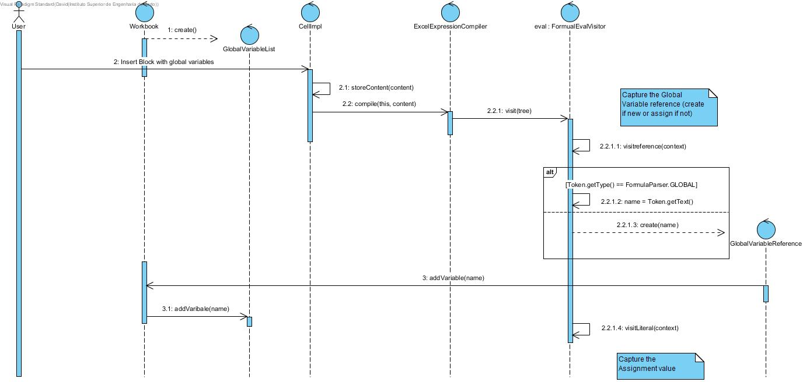
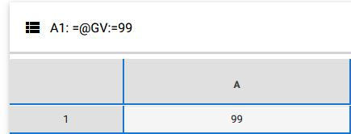

**David Maia** (s1161110) - Sprint 3 - LANG2.2
===============================

# 1. General Notes
This Use Case is really close to the previous one, the main difference is that the variables are saved in the workbook, and that way can be used in any cell of the same workbook.

# 2. Requirements

LANG 02.2

Add support for global variables. Global variables are variables that exist in the context of the workbook and are persisted with the workbook. The name of global variables must start with the "@" sign. When a variable is referred in a formula for the first time it is created. To set the value of a variable it must be used on the left of the assign operator (":="). Attention should be given to synchronization problems. For an example of the use of global variables see Lang01.3.

US - As a User of the Application I want to be able to use Global Variables in my Blocks of Instructions, so that the values stored in those variables can be used in the whole workbook.

**Proposal**

**US1**- Update grammar Formula.g4 to include new rules and operators:

RULES:
* assignment (reference ASSIGN comparison)
* block
* loopfor
* atom (added loopfor, block and assignment)
* global variable

OPERATORS:
* ARR ('@')

**US2**-Alter code so that the application, when inserting a new formula on the worksheet, saves the global variable data and updates the cell displayed data.

# 3. Analysis
For this feature increment I need to:

* Create the ANTLR grammar.
* Create the GlobalVariable object.
* Create the GlobalVariableReference object.
* Create the GlobalVariableList object.
* Ensure that the GlobalVariable exists in the whole workbook context.
* Update the cell value according to the typed formula.

## 3.1 Grammar and Language
There was already an previous Use Case that used variables, but temporary variables. Although the differences of this two Use Cases the grammar follows the same logic, so the grammar that I created is the following:

    ARR     : '@' ;

    GLOBAL
            : ARR LETTER ( NUMBER | LETTER) *
            ;

To use this grammar I had to add it to the existing one on the formula.g4 file.

    reference
    :	CELL_REF
    ( ( COLON ) CELL_REF )?
                | VARIABLE
                | spreadsheet_reference
                | GLOBAL
    ;

## 3.2 Grammar Analysis
This is an example of the use of this grammar:

={@GV:=4;@GV2:=6+8}

This is the result parse tree:

## 3.3 Server and RPC
There were no changes in this part

## 3.4 Analysis Diagrams

**Use Cases**

 **Use Case**.

**Domain Model (for this feature increment)**

**System Sequence Diagrams**

# 4. Design
Followed the same approach as in the previous sprint LANG02.1. The major change is that the Variable List, in this case GlobalVariableList, is stored in the workbook.

## 4.1. Tests

Regarding tests I try to follow an approach inspired by test driven development. All of the tests are very simillar to the ones used in temporary variables. Here are the tests made:

**Domain classes**

**public class GlobalVariable**

**Test1:** I should ensure that the getName() method returns the correct name.

    @Test
    public void ensureGetNameReturnsRightName() {
        String expResult = "Name";
        String result = this.instance.getName();

        assertEquals(expResult, result);
    }

**Test2:** I should ensure that the getValue() method returns the correct value.

    @Test
    public void ensureGetValueReturnsRightValue() {
        Value expResult = new Value(0);
        Value result = this.instance.getValue();

        assertEquals(expResult, result);
    }

**Test3:** I should ensure that are the the setValue() method sets the correct value.

    @Test
    public void ensureSetValueReturnsRightValue() {
        Value expResult = new Value(10);
        this.instance.setValue(new Value(10));

        Value result = this.instance.getValue();

        assertEquals(expResult, result);
    }

**Test4:** I should ensure that the equals() method returns the correct answer.

    @Test
    public void ensureEqualsReturnsTrueWithEqualObjects() {
        GlobalVariable newVariable = new GlobalVariable("Name",new Value(0));

        boolean expResult = true;
        boolean result = this.instance.equals(newVariable);

        assertEquals(expResult, result);
    }

**Test5:** I should ensure that the equals() method returns the correct answer.

    @Test
    public void ensureEqualsReturnsFalseWithNullObjects() {
        GlobalVariable newVariable = null;

        boolean expResult = false;
        boolean result = this.instance.equals(newVariable);

        assertEquals(expResult, result);
    }

**Test6:** I should ensure that the equals() method returns the correct answer.

    @Test
    public void ensureEqualsReturnsFalseWithDifferentClassObjects() {
        Value newVariable = new Value(0);

        boolean expResult = false;
        boolean result = this.instance.equals(newVariable);

        assertEquals(expResult, result);
    }

**public class GlobalVariableReference**

**Test1:** I should ensure that the getName() method returns the correct name.

    @Test
    public void ensureGetNameReturnsCorrectName(){
        String name = "Name";

        String expResult = name;
        String result = instance.getName();

        assertEquals(expResult, result);
    }

**Test2:** I should ensure that the evaluate() method returns the correct value.

    @Test
    public void ensureEvaluateReturnsTheCorrectValue(){
        Value value = new Value(10);
        instance.setVariableValue(value);

        Value expResult = instance.evaluate();
        Value result = value;

        assertEquals(expResult, result);
      }

**Test3:** I should ensure that are the the setValue() method sets the correct value.

    @Test
    public void ensureSetVariableValueSetsTheCorrectValue(){
        Value value = new Value(10);
        instance.setVariableValue(value);

        Value expResult = instance.evaluate();
        Value result = value;

        assertEquals(expResult, result);
    }

**Test4:** I should ensure that the toString() method returns the correct answer.

    @Test
    public void ensureToStringReturnsTheCorrectString(){

        String expResult = "Name";
        String result = instance.toString();

        assertEquals(expResult, result);
    }

**public class GlobalVariableList**

**Test1:** I should ensure that the contains() method returns the correct value.

    @Test
    public void ensureContainsReturnsCorrectVariable(){
        instance.addVariable(new GlobalVariable("Name", new Value(0)));
        String variableName = "Name";

        boolean expResult = true;
        boolean result = instance.contains(variableName);

        assertEquals(expResult, result);
    }

**Test2:** I should ensure that the addVariable() method adds the correct variable.

    @Test
    public void ensureAddVariableAddsVariable(){
        String variableName = "Name";
        instance.addVariable(new GlobalVariable(variableName, new Value(0)));

        boolean expResult = true;
        boolean result = instance.contains(variableName);

        assertEquals(expResult, result);
    }

**Test3:** I should ensure that are the the get() method returns the correct variable.

    @Test
    public void ensureGetReturnsVariable(){
        String variableName = "Name";
        instance.addVariable(new GlobalVariable(variableName, new Value(0)));

        GlobalVariable expResult = new GlobalVariable(variableName, new Value(0));
        GlobalVariable result = instance.get(variableName);

        assertEquals(expResult, result);
    }

**Services/Controllers**
There were no services or controllers used.

**Test Coverage**  
- Due to problems regarding the use of the GWT framework it is not possible to quantify the test coverage.

## 4.2. Requirements Realization

**For US**

Notes:  
- The diagram only depicts the less technical details of the scenario;
- **CellImpl** extends **Cell** making it the information expert regarding contents of a cell;
- **ExcelExpressionCompiler** is the compiler that will compile the block with the global variables;
- **FormulaEvalVisitor** is the visitor that will visit every node of the block with the global variables;
- **GlobalVariableReference** is the reference to a global variable.

## 4.3. Classes
For this Use Case I created 3 classes:
* GlobalVariable
* GlobalVariableReference
* GlobalVariableList
and Updated others to add or change methods.

## 4.4. Design Patterns and Best Practices

In this sprint I used:  
- Information Expert
- MVP  

# 5. Implementation

**For US**

As stated previously, all development was done only on the "NShared" module - User Input and Persistence are not my concerns for this Sprint, so no need to deal with Client or Server.

**Code Organization**  

I followed the recommended organization for packages:  

The code for this sprint:  

Project **shared**
 * GlobalVariable
 * GlobalVariableReference
 * GlobalVariableList

# 6. Integration/Demonstration
The demonstration of this Use Case is very simple,  as shown on the following images:

# 7. Final Remarks
For this sprint I have to thanks to João Vieira from team Green, he had the previous Use Case and helped a lot understanding how the program compiles formulas and how I could add my features.

# 8. Work Log
**Wednesday - June 13**
* Previous Sprint review

**Thursday - June 14**
* Research and Requirements started.
* Analysis started.

**Friday - June 15**
 * Created the grammar for the Use Case
 * Updated the analysis and started the design

**Weekend - June 16 and 17**
 * Finished the implementation of the Use Case
 * Updated the design and finished the analysis.

**Monday - June 18**
 * Methods testing
 * Updated the design and final touches in the documentation

**Tuesday - June 19**
* Final touches in the documentation

Commits:

[Documentation Start](https://bitbucket.org/lei-isep/lapr4-18-2dl/commits/1514ceb2a44e)

[Requirements](https://bitbucket.org/lei-isep/lapr4-18-2dl/commits/c3f10f03c610)

[Analysis](https://bitbucket.org/lei-isep/lapr4-18-2dl/commits/a6c75f0df2b7)

[Design](https://bitbucket.org/lei-isep/lapr4-18-2dl/commits/a1cdec6a7370)

[Code Implementation ](https://bitbucket.org/lei-isep/lapr4-18-2dl/commits/f40e297d4a41)
