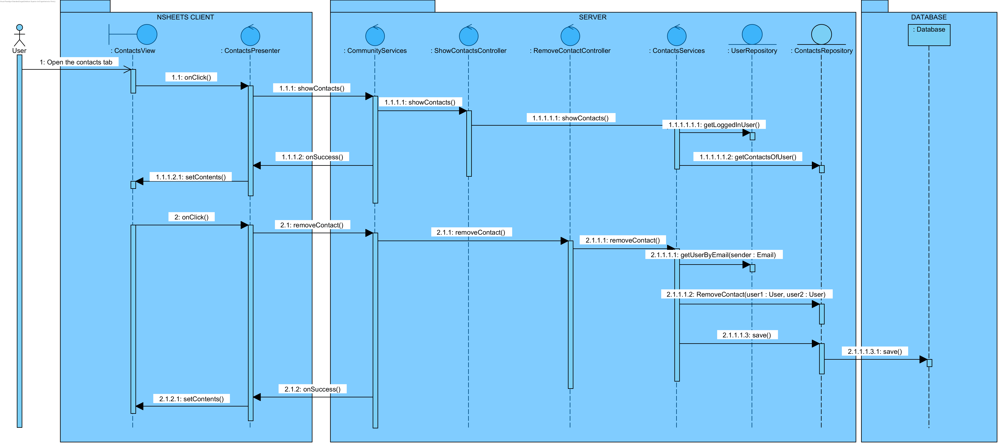

**Hugo Fernandes** (s1161155)
===============================

# 1. General Notes
   Was not able to finish the implementation, due to some persisting issues on the ideal Contact domain class structure I designed and the fact that the user portion is not fully implemented yet, so I could not acquire the current user at any given time.
# 2. Requirements

- **Core05.1 - Contacts**

	Each user of the applications should have a list of contacts. A contact is another user of the application that has established a contact with the user of the application. A user of the application may establish a contact with another user by sending an invitation if he/she knows the email of the other user. A user may or not accept an invitation. A user can block/unblock invitations from other users.

  Proposal:

  US1 - As the Product Owner I want to have a community icon in them menu that allows a logged in user to open the Contacts page or the requests page.

  US2 - As a User of the Application I want to be able to check my friend requests and answer that were sent to me..

  US3 - As a User of the Application I want to be able to send friend requests to emails.

  US4 - As a User of the Application I want to be able to remove friends from my contact list.(This ends both sides of the friendship).

# 3. Analysis

For this feature, since it is the first one implemented by me in this project I need to:  

- Study the existing GWT implementation to understand how to change the UI design according to my needs.

- Study the existing xml layouts.  

- Implement UI changes and the corresponding background methods.

- Coordinate with the IPC team on the User log in subject.  

## 3.4 Analysis Diagrams

**Use Cases**

 - **Use Cases**. Since all the four use stories are encompassed by the Use Case CORE05.1, and all the restrictions are pretty simple at the time no in depth description is needed in my view. I do however want to point out that the functionality of this use case is reliant on the existance of a log in system and singed up users.

**Domain Model (for this feature)**

- **Domain Model**.

**System Sequence Diagrams**

**For US1**

**For US2 & US3**

Since both of these US are both working on the requests, they were both displayed in this diagram separated by an alt section.

**For US4**

# 4. Design

## 4.1. Tests

Regarding tests we try to follow an approach inspired by test driven development. However it is not realistic to apply it for all the application (for instance for the UI part). Therefore we focus on the domain classes and also on the services provided by the server.

**Domain classes**

The Domain classes this feature revolves around are the entity **User** and **Request** and **Contact**. These entity will have attributes (some of which are **Email**'s and **Password**'s and are validated by those class's), these attributes are.
    
   User:    
	
	- name (string)
	- nickname (Nickname)
	- pass (Password)
	- mail (Email)
	
	
   Request:    
    
    - sender (Email)
    - reciever (Email)
    
   Contact:
    
     - User1 (User)
     - User2 (User)

**Test:** We should ensure that a User can be created when all the attributes are set, save for the contacts and requests lists.  

	@Test(expected = IllegalArgumentException.class)
		public void ensureNullIsNotAllowed() {
		System.out.println("ensureNullIsNotAllowed");
		User instance = new User(null,null,null);
	}

    @Test(expected = IllegalArgumentException.class)
    	public void ensureNullIsNotAllowed() {
    	System.out.println("ensureNullIsNotAllowed");
    	Request instance = new Request(null,null);
    }
    

For this funcionality we will need a **ContactsService**, which will have a method to list the contacts and remove a select contact.

**Proposal**:

        INSERT service CODE HERE.

For this funcionality we will need a **RequestsService**, which will have a method to list the requests, answer them either yes or no depending on a button on the UI, and creating and sending a new Request.
    
 **Proposal**:
    
        INSERT service CODE HERE.

Tests:  

- The tests on the controllers require the presence of a database.  

- We will use the database in memory (H2).  

- We will have a *controller* for showing and answering Requests. This controller will be invoked by the GWT RPC service.

- We will have a *controller* for sending a Request. This controller will be invoked by the GWT RPC service.

- We will have a *controller* for showing Contacts. This controller will be invoked by the GWT RPC service.

- We will have a *controller* for removing a Contact. This controller will be invoked by the GWT RPC service.

Controller **ListingAndAnsweringRequestsController**

**Test**: verify the normal listing of Requests.

	@Test
	public void testNormalListingBehaviour() throws Exception {
        //INSERT CODE HERE
    }

**Test**: verify the answering of Requests.

	@Test
     	public void testNormalAnsweringBehaviour() throws Exception {
             //INSERT CODE HERE
         }

**Test**: verify the persistence in the database.

	@Test
     	public void testDatabaseRequestRemoval() throws Exception {
             //INSERT CODE HERE
         }

Controller **SendingNewRequestController**

**Test**: verify the sending of a new Request.

	@Test
	public void testNormalSendingBehaviour() throws Exception {
        //INSERT CODE HERE
    }

**Test**: verify the persistence in the database.

	@Test
     	public void testDatabaseRequestInsertion() throws Exception {
             //INSERT CODE HERE
         }

Controller **ListingContactsController**

**Test**: verify the normal listing of Contacts.

	@Test
	public void testNormalListingBehaviour() throws Exception {
        //INSERT CODE HERE
    }

Controller **RemovingContactController**

**Test**: verify the normal removing of a contact for a user.

	@Test
     	public void testRemoveContactBehavior() throws Exception {
             //INSERT CODE HERE
         }

**Test**: verify the persistence in the database.

	@Test
     	public void testDatabaseRequestRemoval() throws Exception {
             //INSERT CODE HERE
         }

**Test Coverage**  
- The actual coverage for domain classes: 
- The actual coverage for application(controller) classes: 
 
## 4.2. Requirements Realization

Following the guidelines for JPA from EAPLI we envision a scenario like the following for realizing the use cases for this feature increment.

The diagram only depicts the less technical details of the scenario;  
For clarity reasons details such as the PersistenceContext or the RepositoryFactory are not depicted in these diagrams.   

**For US1 & US2**

Notes:  
- **CommunityServices** realizes the GWT RPC mechanism;  
- **AnswerRequestController** is the *use case controller*;  
- **ShowRequestController** is the *use case controller*;  
- **RequestServices** is to group together all the services related to Request. 

**For US3**

Notes:     
- **CommunityServices** realizes the GWT RPC mechanism;  
- **CreateRequestController** is the *use case controller*;  
- **RequestServices** is to group together all the services related to WorkbookDescription. 

**For US4**

Notes:  
- **CommunityServices** realizes the GWT RPC mechanism;  
- **ShowContactsController** is the *use case controller*;  
- **RemoveContactsController** is the *use case controller*;  
- **ContactsServices** is to group together all the services related to WorkbookDescription. 

## 4.3. Classes

### Request
    This class represents the connection between two email adresses.
    One email address is from the user that sent the event and the other is from the user that will recieve it.
    This class should be persisted in the database I managed to do that.
### Contact
    This class represents is the representation of the extablished connection between two users 
    After the acceptance of a request by one of the user's from the other one.
    This class should also be persisted in the database however I was not able to do that due to some table restrictions.
    I tried to solve the problem but was unsuccessful.

## 4.4. Design Patterns and Best Practices

By memory we apply/use:  
- Repository  
- MVP  

**TODO:** Exemplify the realization of these patterns using class diagrams and/or SD with roles marked as stereotypes. 

# 5. Implementation
 
- In respect to implementing my use case, I was unsuccessful in fully implementing the functionality, however I did manage to create all the query methods service classes and controllers, and the structure of the UI is represented with hardcoded examples of what I imagined for the funcionality.

- For example, in the contacts tab inside the community tab there is a example of name, nickname and email displayed, as well as the button which I wanted to implement to allow for the deletion of a contact.

- The connection between the UI and the server methods that would run the operations I needed is non existent because i would need to be able to access the current user and that feature was not correctly implemented.

- The requirement of the user being able to block requests, was overlooked by me by mistake when interpreting the UC, this is why this particular feature inst displayed

# 6. Integration/Demonstration

- We can see in the sidenav an icon with the "Community" text next to it, by pressing this icon it shows the two views I  created.

- The request view, has a badge that is suposed to indicate the number of current requests, however currently there is a fixed number two as an example. By entering this page we can se that there is one test request presented there, this request is hard coded for presentation only of how it should present real requests once it is funcional.

- The contacts view, this view features a search bar, that lets you look by nickname for one of your contacts, this is also dependent of being able to access the current user, this part of the view has no "example" list to search by, I do show how the nickname, name and email would be presented if this was functional with examples.

# 7. Final Remarks

As it stands the use case is not implemented I would have needed more time, and the current user to be available for accessing. In order to be able to even try to implement the connection between the UI and the server portion of my code, not to mention solving the Contact persistence issues.

# 8. Work Log

- In the first days of the first sprint all of my team was quite confused with the project in general, we struggled to understand how to and where to implement what.

- We had the misfortune of not having classes in the 31st of May this was a shame, because that was the only class we had with the Professor responsible for the CORE area until the day of delivery, this caused us to have to figure things out by looking at the examples provided only, some of us had the luck of their UC's beign similar in structure to the ones already implemented, others however were not so fortunate and took quite a while to understand what the should do and how they should be doing it.

- I started by doing the analysis and design of this UC, to do so I looked at the examples provided for guidance, a problem appeared because I couldnt seem to get the tool to convert .puml files to diagrams to work, so I decided to use the Visual Paradigm 15.0 program as that was the program we used before this project.

- After finishing my analysis and design I chose to first implement the view, in order to be able to do so I relied heavily on the site [GWT Material Demo](https://gwtmaterialdesign.github.io/gwt-material-demo/), using this site I was able to understand how to create the panels and search bars and  cards i wanted using both the .xml files and the java code, for exameple the structure of the contacts tab is all created in the .ui.xml file and the request example that i hard coded is created in the java code as well as the text this card possesses.

- Some issues occurred with h2 database, which slowed down my development considerably in the last days, this problem caused me to have to restart the computer everytime I used the h2 database because the program wouldnt run I managed to resolve this problem but it was quite at the last minute.

- I implemented the services classes, the domain classes, Controllers and JPA repositories last, I managed to implement all the queries and methods that preceed them in the corresponding controllers, as well as persist the Request's, I did not however manage to solver a problem in the persistence of Contacts, the table has a problem when being created this issue could be solved if i had more time to solve it, however I would still not be able to implement the rest without the access to current user. 

- Since I did not commit multiple times while I was implementing i only have 2 commits plus the last one to submit this text. However each of the two commits encompasses either the full Analysis + Desing or all the Code I wrote 

##Commits:
- [First commit with all the analysis and design](https://bitbucket.org/lei-isep/lapr4-18-2dl/commits/c674bac3106275b4e9d9e4521b063e5d7208297a)

- [Last commit with all the code I implemented "Implementation of my UI, all controllers services and domain classes that i add (my UC is not funcional)"](https://bitbucket.org/lei-isep/lapr4-18-2dl/commits/7c3b2d9f8e0631adabc205c998047f68ae7ab041)
