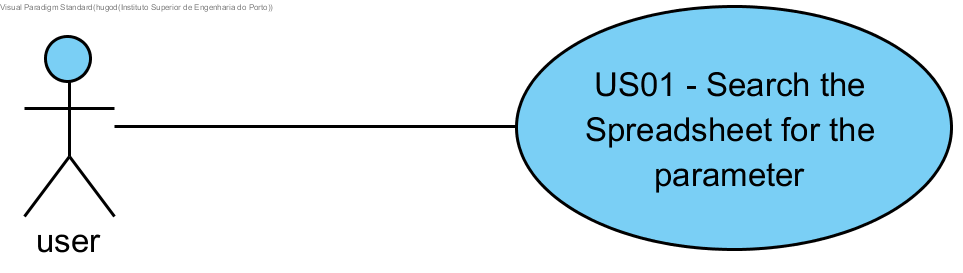
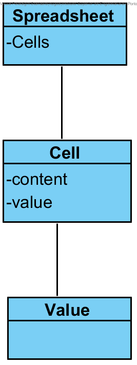
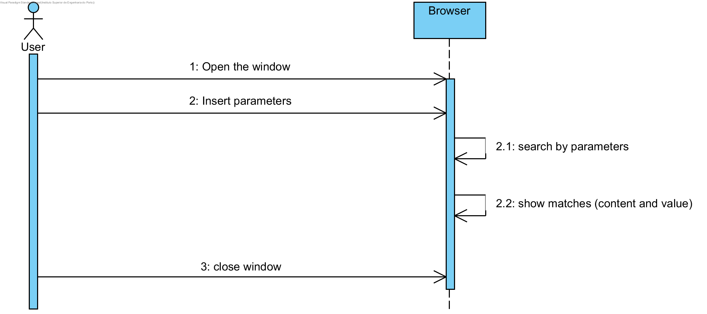
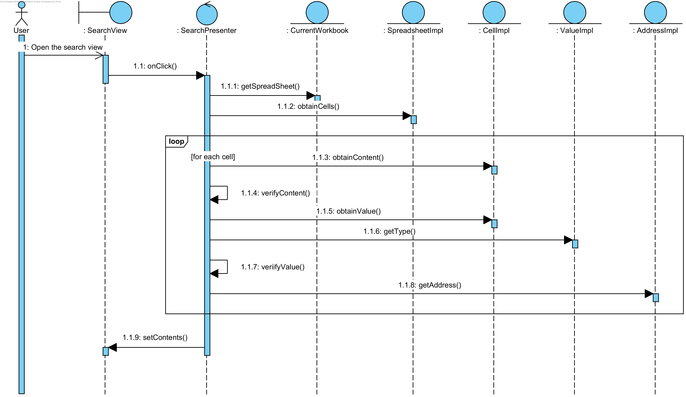

**Hugo Fernandes** (s1161155)
===============================

# 1. General Notes
 Although this is the second sprint I'm implementing the first part of this UC because since our team os comprised of 7 members and the old IPC team is comprised of 4 working members there wasn't enough UC's for everyone to continue solely from the previous work. In order to facilitate my work I requested help from 1161569 since in the first sprint he handled a UC with a similar structure, that reefers to the same area.
# 2. Requirements
   
   - **IPC02.1 - Spreadsheet Search**
   
   The application should now allow for searching the contents of the active workbook. The new window should be composed of two parts. The first part (upper part of the window) should contain a text box for the user to enter a regular expression to be the basis for the search. This part should also contain a button to launch the search. The second part (lower part of the window) should be used to display the search results (cell coordinates and value or contents). The search should include no only the content of the cell (i.e., the text entered by the user) but also its value (that could have been calculated by a formula). 

   Proposal:
   
   - US01 - As a user I want to search the spreadsheet for a value or text.
   
# 3. Analysis

For this feature I need to:  

- Study how the spreadsheet and cells work, since I haven't previously touched this subject.

- Implement UI changes and the corresponding background methods. 

- This envolves implementing a pop up window, with two parts.

- The top part of the window will have a search box so that the user can type in the parameters.

- The bottom half of the window will present the results.

## 3.4 Analysis Diagrams

**Use Case**

 - The user presses a button in the workbook tab and opens the new search window, there he types in the search parameter, presses the search button and the results are presented in the lower part of the search UI.

**Domain Model (for this feature)**

- In this Use Case the only domain classes with which I will interact are Spreadsheet, Cell and Value.

**System Sequence Diagrams**

**For US1**

- The user will open the window, and type in the search box the term he wants to look for, the browser will look for the value and prenent it's position and content and value. 

# 4. Design

## 4.1. Tests

**Domain classes**

The Domain classes this feature revolves around are the entity **Cell** and **Spreadsheet** and **Value**. 
 
**Test:** We should ensure that the position returned by the controller is the correct position of the cell that contains the wanted parameter.  

	@Test(expected = Exception.class)
		public void ensurePositionIsCorrect() {
		System.out.println("ensurePositionIsCorrect");
		address = new address(1,1);
		String content = "teste123"; 
		Cell c = new Cell(sheet,address,content);
		if(!getPositionOfTheCell().equals(address){
		    throw new Exception();
		}
	}

**Services/Controllers:** As referred to previously in the beginning of this section there are no controllers or services to be tested.

## 4.2. Requirements Realization

I envision a scenario like the following for realizing the use case for this feature increment.

Notes:  
- The diagram only depicts the less technical details of the scenario;  
- For clarity reasons, details such as the private sub-methods of the sortCells method and the interaction with the different GWT Material objects are not depicted in this diagram.   
- **SpreadsheetImpl** extends **Spreadsheet** making it the information expert regarding the existing cells and correponding addresses on the cell grid;  
- **CellImpl** extends **Cell** making it the information expert regarding contents of a cell;
- **Address** is the information expert regarding the positioning of a cell within the cell grid;  
- **SearchView** called from the **SearchPresenter** will be the MVP in charge of both asking the user for the necessary data and show the results of the operation;
- **SearchPresenter** is called from the **WorkbookView** which it self is called by **WorkPresenter**  and will be the MVP of the whole workbook.

## 4.3. Classes

All the needed classes for the use case are already implemented. The only things that have been added are the new ui elements on **WorkBookView** and some methods of interface **Spreadsheet**/**Cell**/**Value** implemented in their ..impl classes.

## 4.4. Design Patterns and Best Practices

By memory we apply/use:  
- Information Expert
- Repository  
- MVP  

**TODO:** Exemplify the realization of these patterns using class diagrams and/or SD with roles marked as stereotypes. 

# 5. Implementation
# 6. Integration/Demonstration
# 7. Final Remarks
# 8. Work Log
##Commits: