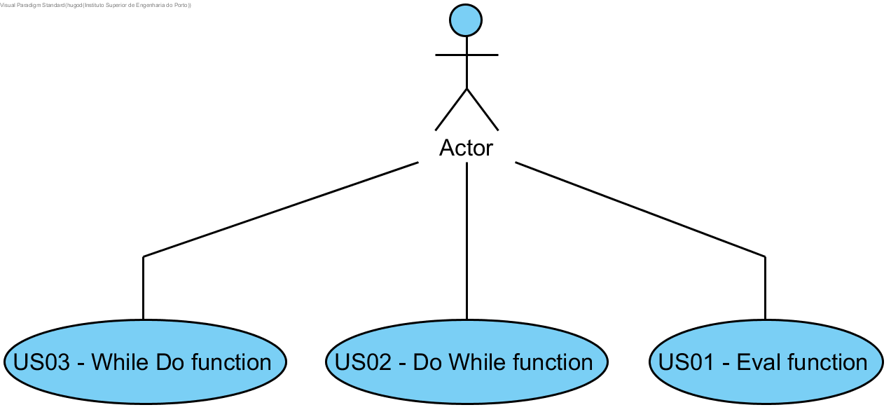

**Hugo Fernandes** (s1161155)
===============================

# 1. General Notes
I had tremendous difficulty in understanding how to implement the functions in the existing structure of Nsheets. As a result the UC is not fully implemented, even tho I understood what each function was supposed to do, I could not successfully implement them, because of this I commented out the lines of code that would initiate those functions in order to not harm the work of my colleagues since the workbook page could not be opened in that state.

# 2. Requirements

- **Lang01.3 - Eval and While Loops**

	Add the Eval function. This function has a single parameter that is a string. When executed, this function will "compile" the formula contained in the only parameter and execute the resulting expression. The result of Eval is the result of the execution of the compiled expression. For example, if we write the following formula "=" 2 + 3 "" we get the string "2 + 3" in the cell. However, if we write the formula "= eval (" 2 + 3 ")" the value obtained in the cell is 5. Add the following two loop functions: DoWhile and WhileDo. The DoWhile executes the first expression in loop while the second expression evaluates to true. In each iteration of the loop the the first expression is the first to be evaluated. The WhileDo executes the second expression in loop while the first evaluates to true. In each iteration of the loop the the first expression is the first to be evaluated. Example: "= {@Counter:=1; WhileDo(Eval( "A"&@Counter)> 0; {C1:=C1+Eval("B"&@Counter); @Counter:=@Counter+1 }) }" . In this example, the cell C1 will get the sum of all the values of column B in that the corresponding values in column A are greater than zero.

 Proposal:
   
   - US01 - As a user I want to use the eval function.
   - US02 - As a user I want to use the do while function.
   - US03 - As a user I want to use the while do function.
   
# 3. Analysis

For this feature I need to:  

- Study how to create functions, both Eval and DoWhile/WhileDo. 

- Study how to use the functions and expressions on the user interface.

- Implement the functions.

- Test the functions.

## 3.4 Analysis Diagrams

**Use Case**

- In the workbook page the user should be able to use the functions. And they should be shown in the funtion wizard

# 4. Design

Due to the different type of UC that this one is in comparisson to the usual UC's I found it hard to explain the design in sequence diagrams or system diagrams, as such i have no diagrams here I can and will however explain in writing what I believe to be the way this use case shoould be designed.

- The new rules created for each function in the .g4 file we generate methods in the autogenerated files

- After this we have to implement the java visitor methods ( which I was not able to do correctly)

- And finally initiate the functions in the language classes in the initFunction method.

## 4.1. Tests
The tests I invisioned in this use case were purely functional tests.

Namely: 

- Test the eval function with multiple types of operations

- Test the results of all the 3 functions

- Test the whiledo and dowhile functions on multiple types of both conditions and operations

## 4.2. Requirements Realization

As said previously I was not able to create the sequence diagrams however the classes which I used or envisioned to use were as follows and the interaction order should be in this order too:

- formula.g4
- Language.java
- FormulaBaseVisitor
- FormulaEvalVisitor
- Eval / DoWhile / WhileDo

## 4.3. Classes
The classes mentioned above were the classes/file that were used in this use case:
        
        - formula.g4
        - Language.java
        - FormulaBaseVisitor
        - FormulaEvalVisitor
        - Eval / DoWhile / WhileDo

## 4.4. Design Patterns and Best Practices
Information expert

TODO: Exemplify the realization of these patterns using class diagrams and/or SD with roles marked as stereotypes.

# 5. Implementation

- The biggest problem I ran into trying to implement this use case was the structure of how functions are complied and read by nsheets, as well as the grammar conditions themselves.

- This caused me to be unable to implement the UC completely, some classes are created and methods defined, however the visitor methods were not inplemented at an early point because I did not know I had to implement them.
 
- In the later stages of the sprint I still tried to implement them I was however unsuccessful, as such I did not commit the attempted local changes because the did not work. 

- I believe some complementary work would be needed in order to finnish this use case properly, however there are still many doubts on my mind on how to implement these functions.

# 6. Integration/Demonstration
- Unfortunaly in order for the project to work properly I had to comment out the lines that would initiate my functions, so I cannot present results, both because teh function is not fully implemented and also because I had to not initiate them in order for my colleagues to be able to present their work.

# 7. Final Remarks
- As mentioned before I was not able to end the UC. I managed to understand what was requested and believe I would have been able to finnish it if I had understood how to implement functions from the beginning of the sprint. 

- Of course this responsibility is mine and solely mine, I should have requested help from the previous lang teams to understand this sooner, this being said I did get help in the last days from Pedro Tedim from the Green team.

- There is currently no way to see the code I implemented work, the uncommenting of the intiation, freezes the programm upon trying to open the workbook tab.

# 8. Work Log

- In the beggining of the third sprint I had a lot of problems with understanding how the lang functions I had to implement worked, and how to begin both the analysis and the implementation.

- Some of these doubts had begone to be cleared be the 3rd or 4th day of the sprint, had all of them disappeared by this point i might have been able to finnish however many things I at the time thought were correct were far from it.

- At the end of the sprint in great part thanks to Pedro Tedim from the Green team, I began to understand the way to implement the Use case, at this point I already had most of the analysis done.

- Errors in my grammars and inability to implement the visitors made it imposible for me to finnish this use case in time.  
##Commits:

- [Lang 01.3 - Start of the analysis](https://bitbucket.org/lei-isep/lapr4-18-2dl/commits/cdc73809aeda5fc137d6fe9b32cf079dc439c5bb)

- [Lang 01.3 - Creation and implementation of the function classes](https://bitbucket.org/lei-isep/lapr4-18-2dl/commits/395f30bd10d4368d35656d02b25f45a6360de425)

- [Lang 01.3 - Last commit, some corrections to the grammars, still not functional ](https://bitbucket.org/lei-isep/lapr4-18-2dl/commits/4df29d0bbc8e66d64e3b8c3f3e16af280cbd5d0d)
