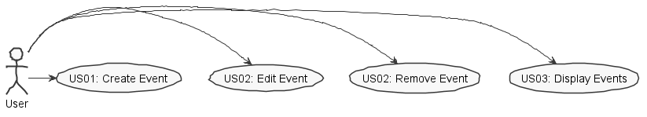

**Filipe Simão** (s1161213) - Sprint 1 - Core06.1
=============================

# 1. General Notes

- This week I used a lot of my sprint time (the first days of the week) understanding and analysing the structure of the project and all the code that was already implemented.

# 2. Requirements

Core06.1 - The application should have a calendar view to display events. An event has a title, description, time stamp and duration. Events should be displayed in the calendar ordered by their time stamp. It should be possible to create, edit and delete events. The calendar should display all events.

This requirement can be divided in two simple user stories, specified in the following points.

Proposal:

US01 - As an user I want to create event so that they can be be persisted and always presented in the calendar ordered by timestamps.

US02 - As an user I want to edit or remove events so that these alterations can be persisted and reflected in the GUI view of these events.

US03 - As an user I want the calendar to display my events so that I can keep track of future Events

# 3. Analysis

I need to:  

- After understanding how the application works is from major importance to understand where to implement my solution for this feature and connect all the parts involved(Client, server, etc...)

- Understand how the application works and also understand the key aspects of GWT, since it is the main technology behind the application  

- Understand how to implement a UI solution to present the calendar view, display all the events and involved parts in the browser programming this with GWT in java.

## 3.1 Analysis Diagrams

**Use Cases**

- **Use Cases**. For this feature I considered four very simple use cases. The use case to create an event corresponds to US01. On the contrary the US02 can be divided in two UC's, one to edit an event and the other is to remove an event from the database and calendar. And a use case corresponding US03, display events.

**Domain Model (for this feature increment)**

- **Domain Model**. The only thing added to then Domain Model in this feature is the"entity event which represents the events created by the user and the value object Duration. The event knows the user who created it.

**System Sequence Diagrams**

**For US01**

**For US02**

**Edit Event**

**Delete Event**

**For US03**

# 4. Design

## 4.1. Tests

*In this section you should describe the design of the tests that, as much as possibe, cover the requirements of the sprint.*

**Domain classes**

For the Domain classes we will have a class that represents the entity **Event**. This entity will have all the atribbutes needed to represent an event in the calendar, such as:
	- user (User)
	- title (string)
	- description (string)
	- timestamp (Calendar)
	- duration (Duration)

**Test:** We should ensure that an Event can only be created when all the attributes are passed to the constructor.

	@Test(expected = IllegalArgumentException.class)
		public void ensureNullIsNotAllowed() {
		System.out.println("ensureNullIsNotAllowed");
		WorkbookDescription instance = new WorkbookDescription(null, null);
	}

**Test:** We should ensure that an Event timestamp and duration are valid and matching. For instance, in the 1st of july we can't create an event to the 3rd of April

		@Test(expected = IllegalArgumentException.class)
			public void ensureTimeAndDatesValid() {
			System.out.println("ensureDatesAreValid");
		}

We will also have the class **Duration** to represent the duration of the event, a value object to event with the following attributes:
	- from (Integer)
	- to (Integer)
	- isAllDay (boolean)

**Services/Controllers**

- We will have a *controller* from creating an Event **(CreateEventController)**.
- We will have a *controller* from editing an Event **(EditEventController)**.
- We will have a *controller* from deleting an Event **(DeleteEventController)**.
- - We will have a *controller* from displaying events **(ListEventsController)**.

## 4.2. Requirements Realization

**For US01**

Notes:  
- The diagram only depicts the less technical details of the scenario;  
- For clarity reasons details such as the PersistenceContext or the RepositoryFactory are not depicted in this diagram.
- The part of the design where we can get the authenticated user using the AuthorizationService and the UserSession is also not represented.
- **CreateEventController** is the *use case controller*;

**For US02**

**Edit Event**

**Delete Event**

**For US03**

## 4.3. Classes

*Present and describe the major classes of you solution.*
The following classes will be created:
- Event: This class will represent an Event and should be an agregate root
- Duration: It as value object that keeps all the information regarding the hours that an event starts and finishes
- CreateEventController: Controller to create an event
- EditEventController: Controller to edit an event
- DeleteEventController: Controller do delete event

## 4.4. Design Patterns and Best Practices

*Present and explain how you applied design patterns and best practices.*

By memory we apply/use:  
- Factory
- Repository
- Controller
- MVP

# 5. Implementation

*If required you should present in this section more details about the implementation. For instance, configuration files, grammar files, etc. You may also explain the organization of you code. You may reference important commits.*

In the domain I thought that was important to represent the Duration of an event as a value object. The duration of an event has some very specific rules and makes sense to be represented as an entity. This class has a start hour and end hour that are represented from an interval from 100(1h00) to 2400(24h00) and keeps a boolean to indicate if an Event is set to occupy all day.

**Code Organization**

Project **server**
- pt.isep.nsheets.server.**lapr4.red.s1.core.n1161213**.events.application: contains the controllers  
- pt.isep.nsheets.server.**lapr4.red.s1.core.n1161213**.events.domain: contains the domain classes  
- pt.isep.nsheets.server.**lapr4.white.s1.core.n4567890**.workbooks.persistence: contains the persistence/JPA classes

Project **NShests** (Not implemented)
- The idea was to create the classes: **pt.isep.nsheets.client.aplication.calendar.CalendarView**, **pt.isep.nsheets.client.aplication.calendar.CalendarPresenter**  and **pt.isep.nsheets.client.aplication.calendar.CalendarModule**
- And the file: **pt.isep.nsheets.client.aplication.calendar.CalendarView.ui.xml**  

# 6. Integration/Demonstration

I am going to use this chapter to explain how I imagined the UI to be implemented since I wasn't able to do it. The idea was to have a page with a Calendar and has the user was making clicks on the days in this calendar he would receive a list of the events for that day below the calendar. Since I wasn't able to implement the UI I couldn't test the controller implementation and wasn't sure on how to handle the data returned by the UI which lead to a simple and incomplete Controller implementation.

# 7. Final Remarks

# 8. Work Log

**29th May - Tuesday**

Made the clone of the repository and spent all day resolving problems with maven dependecies and plug-ins to work. Started analysing the code that was already implemented to facilitate my work.

**30th May - Wednesday**

The second day of work I continued to try understandin the code that was already implemented. This was something that gave me a lot of problems and I spent a lot of time doing this. Despite the time spent I think my understanding in the structure of the application isn't the best.

**31th May - Thursday**

Started to work on the documentation of my Feature. This was very difficult to do because I needed a better understanding of how to implement a UI because I had to plan how to implement the feature and needed to know how the Ui should be implemented to know wich type of data/objects the UI would return to the controllers and how to handle it.
This is when I started some research on the UI. Used some of time reading the websites provided by the teachers and seeing some tutorials on how to implement a calendar view. Here follows some of the places I read:
	- http://www.gwtproject.org/doc/latest/tutorial/create.html
	- https://stackoverflow.com/questions/5664601/gwt-what-to-put-in-the-shared-folder?utm_medium=organic&utm_source=google_rich_qa&utm_campaign=google_rich_qa
	- http://www.gwtproject.org/doc/latest/tutorial/RPC.html
	- https://examples.javacodegeeks.com/enterprise-java/gwt/gwt-calendar-example/
	- http://www.gwtproject.org/javadoc/latest/com/google/gwt/user/datepicker/client/CalendarView.html
	- https://gwtmaterialdesign.github.io/gwt-material-demo/#pickers
	- http://www.gwtproject.org/javadoc/latest/com/google/gwt/user/datepicker/client/DatePicker.html

**1st June - Friday**

Made major advances in the documentation of my feature. Continued to research and tried to implement a calendar view with the links that are in the point before to understand how to implement it on our project. It didn't work so I continued to work on the documentation. Also tried to get help from my team but none was able to help me so I got together with a student from another class that was working on the same feature to discuss solutions.

**3rd June - Sunday**

Continued to work on the documentation and made major advances as can be confirmed by the following commits:

[Core06.1 Added Analysis](https://bitbucket.org/lei-isep/lapr4-18-2dl/commits/2d8b6df05e557eb1ba4c70d64f9998404c3cd9f1)
[Core06.1 Added Design](https://bitbucket.org/lei-isep/lapr4-18-2dl/commits/ed28816723f334f844162170bb3da7712809161a)

**4th June - Monday**

In this considering the time that I had left I concentrated in the implemention of what I knew how to Implement. This gave me some minor problems because I still didn't knew wich type of data or objects I would obtain from the UI and how to handle it considering the user input. Despite this I was able to implement all the classes I needed regarding the domain and the persistence of data regarding Events. Also implemented the necessary controllers, altough in a very simple and incomplete manner. These  are the commits made in this day:
	- [Core06.1 Domain Implementation](https://bitbucket.org/lei-isep/lapr4-18-2dl/commits/d2bd7eaa323da422a90ce782b547bfe89d2a11be)
	- [Core06.1 Persistence](https://bitbucket.org/lei-isep/lapr4-18-2dl/commits/0e2d2522e72523ada93a195327bcd42f0a0ec474)
	- [Core06.1 Application](https://bitbucket.org/lei-isep/lapr4-18-2dl/commits/93b788555b13327835d47ac05121c3ab1b33fc87)

The end of the day I perceived that I had some errors in the documentation because I didn't considered the feature to list the events of the user and I concluded that I didn't need EventService.

**5th June - Tuesday**

Used the morning time to correct the errors and to finish the documentation.
