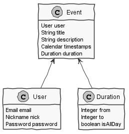
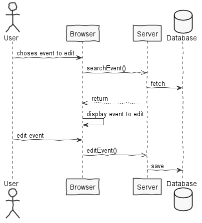
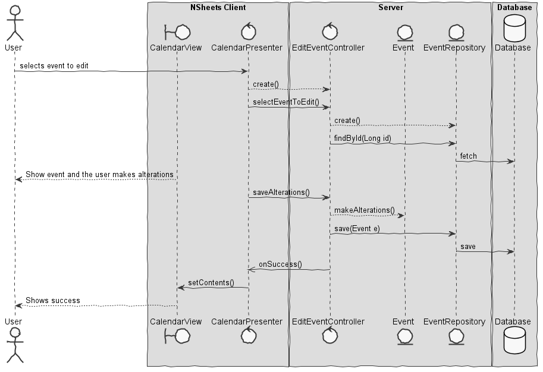

**Filipe Simão** (s1161213) - Sprint 1 - Core06.1
=============================

# 1. General Notes

- This week I used a lot of my sprint time (the first days of the week) understanding and analysing the structure of the project and all the code that was already implemented.

# 2. Requirements

Core06.1 - The application should have a calendar view to display events. An event has a title, description, time stamp and duration. Events should be displayed in the calendar ordered by their time stamp. It should be possible to create, edit and delete events. The calendar should display all events.

This requirement can be divided in two simple user stories, specified in the following points.

Proposal:

US01 - As an user I want to create event so that they can be be persisted and always presented in the calendar ordered by timestamps.

US02 - As an user I want to edit or remove events so thtat these alterations can be persisted and reflected in the GUI view of these events.

In addiction to these cases, the GUI of the nsheets should have an option to present te calendar displaying all the existing events and giving the user the chance to add, edit and remove events.

# 3. Analysis

I need to:  

- After understanding how the application works is from major importance to understand where to implement my solution for this feature and connect all the parts involved(Client, server, etc...)

- Understand how the application works and also understand the key aspects of GWT, since it is the main technology behind the application  

- Understand how to implement a UI solution to present the calendar view, display all the events and involved parts in the browser programming this with GWT in java.

## 3.1 Analysis Diagrams

**Use Cases**

- **Use Cases**. For this feature I considered three very simple use cases. The use case to create an event corresponds to US01. On the contrary the US02 can be divided in two UC's, one to edit an event and the other is to remove an event from the database and calendar.

**Domain Model (for this feature increment)**

- **Domain Model**. The only thing added to then Domain Model in this feature is the "entity" event which represents the events created by the user. The event knows the user who created it.

**System Sequence Diagrams**

**For US1**

**For US2**

**Edit Event**

**Delete Event**

# 4. Design

## 4.1. Tests

*In this section you should describe the design of the tests that, as much as possibe, cover the requirements of the sprint.*

**Domain classes**

For the Domain classes we will have a class that represents the entity **Event**. This entity will have all the atribbutes needed to represent an event in the calendar, such as:
	- user (User)
	- title (string)
	- description (string)
	- timestamp (Calendar)
	- duration (Duration)

**Test:** We should ensure that an Event can only be created when all the attributes are passed to the constructor.

	@Test(expected = IllegalArgumentException.class)
		public void ensureNullIsNotAllowed() {
		System.out.println("ensureNullIsNotAllowed");
		WorkbookDescription instance = new WorkbookDescription(null, null);
	}

**Test:** We should ensure that an Event timestamp and duration are valid and matching. For instance, in the 1st of july we can't create an event to the 3rd of April

		@Test(expected = IllegalArgumentException.class)
			public void ensureTimeAndDatesValid() {
			System.out.println("ensureDatesAreValid");
		}

We will also have the class **Duration** to represent the duration of the event, a value object to event with the following attributes:
	- from (Integer)
	- to (Integer)
	- isAllDay (boolean)

**Services/Controllers**

For this feature my proposal is to use an EventService that will be used for all the possible actions regarding events(create, delete and edit)

For this feature I need a method thas is used in more than one US.

The proposal is:

	public interface EventsService extends RemoteService {
		Iterable<Event> findbyUser(User user);
		Event searchEvent();
	}

Tests:  
- We will have a *controller* from creating an Event **(CreateEventController)**.
- We will have a *controller* from editing an Event **(EditEventController)**.
- We will have a *controller* from deleting an Event **(DeleteEventController)**.

## 4.2. Requirements Realization

**For US1**

Notes:  
- The diagram only depicts the less technical details of the scenario;  
- For clarity reasons details such as the PersistenceContext or the RepositoryFactory are not depicted in this diagram.
- **CreateEventController** is the *use case controller*;  
- **EventServices** groups all the actions regarding Events.

**For US2**

**Edit Event**

Notes:  
- The diagram only depicts the less technical details of the scenario;  
- For clarity reasons details such as the PersistenceContext or the RepositoryFactory are not depicted in this diagram.
- **EditEventController** is the *use case controller*;  
- **EventServices** groups all the actions regarding Events.

**Delete Event**

Notes:  
- The diagram only depicts the less technical details of the scenario;  
- For clarity reasons details such as the PersistenceContext or the RepositoryFactory are not depicted in this diagram.
- **DeleteEventController** is the *use case controller*;  
- **EventServices** groups all the actions regarding Events.

## 4.3. Classes

*Present and describe the major classes of you solution.*
The following classes will be created:
- Event: This class will represent an Event and should be an agregate root
- Duration: It as value object that keeps all the information regarding the hours that an event starts and finishes
- EventServices: Will have methods that can be used by multiple cases (ex. findAll(), findByID())
- CreateEventController: Controller to create an event
- EditEventController: Controller to edit an event
- DeleteEventController: Controller do delete event
- EventRepository: Repository for events

## 4.4. Design Patterns and Best Practices

*Present and explain how you applied design patterns and best practices.*

By memory we apply/use:  
- Factory
- Repository
- Controller

# 5. Implementation

*If required you should present in this section more details about the implementation. For instance, configuration files, grammar files, etc. You may also explain the organization of you code. You may reference important commits.*

**For US1**

**For US2**

**Code Organization**  

# 6. Integration/Demonstration

*In this section document your contribution and efforts to the integration of your work with the work of the other elements of the team and also your work regarding the demonstration (i.e., tests, updating of scripts, etc.)*

# 7. Final Remarks

*In this section present your views regarding alternatives, extra work and future work on the issue.*

# 8. Work Log

*Insert here a log of you daily work. This is in essence the log of your daily work. It should reference your commits as much as possible.*
