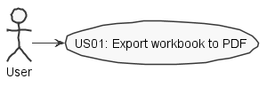
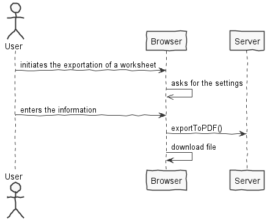
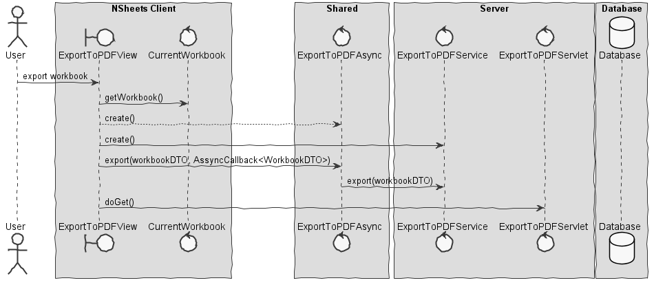

**Filipe Simão** (s1161213) - Sprint 2 - IPC03.1
===============================

# 1. General Notes

*In this section you should register important notes regarding your work during the sprint. For instance, if you spend significant time helping a colleague or if you work in more than one feature increment.*

- Since this feature doesn't have any work relative to sprint1 I decide to work on it instead of the feature IPC03.2

- This sprint I decided to start by creating the UI. Altough this is an incorrect workflow I did it this way because in the last sprint I wasn't able to create an UI.

# 2. Requirements

*In this section you should describe the requirements for this sprint.*
*This is simply an example of documentation*

IPC03.1 - It should be possible to export to PDF an entire workbook, a spreadsheet or a range of cells. The contents should include only the values of the cells (and not its formulas, for instance). The user should be able to select the content to be exported and also if the document should have a table of contents with links to the sections or not. If select, sections/chapters should be generated for each spreadsheet of the workbook. The generated PDF should be downloaded to the user local file system.

Proposal:

US - As an user I want to be able to export a workbook or part of it to a pdf file in order to keep my spreadsheets in my computer

# 3. Analysis

*In this section you should describe the study/analysis/research you developed in order to design a solution.*
For this feature increment, since it is the first one to be developed regardin the exportation to pdf files I need to:

- Enable a button on the Workbook page to open a pop up page where the user defines the the exportation options. These option are used to define if the user wants to export just part of a spreadsheet, a complete spreadsheet or the complete workbook. In the last option the pdf file should have different chapters for each spreadsheet.

- The pop up page will have three options. The first one is to export the whole workbook and the only thing the user needs to do is to chose the name of the file where this workbook should be exported. The second option is to export an entire spreadsheet of a workbook and the user needs to choose a spreadsheet of the active workbook and the name of the result file. The last option is used to export part of a spreadsheet and after choosing the spreadsheet the user has to indicate the range of cells to export and the name of the result file.

- After these options are defined the user clicks the download button and the pdf file is generated.

- The pdf file is downloaded to the user local file system.

- Need to undesrtand the use of the iText library. This library is used to export data to pdf files.

- Also need to undestand how the act of downloading files to the user desktop from a web page works using HTTPServlets. This part was made with the support of David Maia(1161110) and Marco Carneiro

## 3.1 Server and RPC

The export to PDF page display the choices to export a workbook or a part of it to a PDF file. After choses his options a clicks the button to export the export to pdf view calls a DownloadTOPDF asynchronously. The following interfaces are used:

    @RemoteServiceRelativePath("downloadToPDFService")
    public interface DownloadToPDFService extends RemoteService {
        WorkbookDTO exportToDownload(WorkbookDTO toExport) throws DataException;
    }

    public interface DownloadToPDFServiceAsync {
        void exportToDownload(WorkbookDTO toExport, AsyncCallback<WorkbookDTO> async);
    }

The interface should be implemented in the server since the communication to db is made in the server and the conversion of the workbook to the pdf file too.

## 3.2 Analysis Diagrams

**Use Cases**

- Since this use case has a one-to-one correspondence to US I don't see the need to add more detailed explanations to to the use case description.

**Domain Model (for this feature increment)**

For this feature there is no need to add or alter anything in the Domain Model.

**System Sequence Diagrams**

# 4. Design

## 4.1. Tests

The only intended tests for this feature was to make functionality tests that consisted in downloading the file and see if everything was has intended.

## 4.2. Requirements Realization

## 4.3. Classes

*Present and describe the major classes of you solution.*

The classes that I intended to implement are the following:
- ExportToPDFView
- DownloadToPDFService
- ExportToPDFServiceImpl

## 4.4. Design Patterns and Best Practices

By memmory we use:
- RPC
- Modified MVP

**Note**
It was possible to do this with a differet aproach called request factory but because the adoption of the RCP method it was prefered to continue this usage.

# 5. Implementation

For the implementation of this feature I created a pop up button in the WorkBookView to export it to PDF. This button opens a pop up window to define the options of exportation and has a MaterialButton to export with the defined settings.

**Code Organization**

Project **server**
- **pt.isep.nsheets.server.services** - keeps the services classes (DownloadPDFImpl and ExporttoPDFServiceImpl)

Project **shared**
- **pt.isep.nsheets.shared.services** - keeps the needed interfaces for the RCP(DownloadToPDFService and DownloadToPDFServiceAsync)

Project **nsheets**
- pt.isep.nsheets.client.**lapr4.red.s2.n1161213**.application.exportpdf : keeps the ExportToPDFView

# 6. Integration/Demonstration

*In this section document your contribution and efforts to the integration of your work with the work of the other elements of the team and also your work regarding the demonstration (i.e., tests, updating of scripts, etc.)*

In this sprint I tried to work together with my colleagues that where also making the features of exporting and importing files (David Maia and Marco Carneiro). Despite this effort I wasn't able to complete this feature. I spent a lot of time with these colleagues to understand how to implement RPC.

# 7. Final Remarks

*In this section present your views regarding alternatives, extra work and future work on the issue.*

For the final remark I believe this feature needs a lot of future work regarding the Implementation of the GWT RPC(Servlets and Services). I believe that the UI created by me is good so as the documentation.

# 8. Work Log
[IPC03.1 UI Implementation](https://bitbucket.org/lei-isep/lapr4-18-2dl/commits/0ae419151fc62704b7a6bced9c8c3bc9ccd6732f)
[IPC03.1 Services and Servlet Implementation](https://bitbucket.org/lei-isep/lapr4-18-2dl/commits/b3fd2d583f819086acd3e622dde95d3c1a851da7)
[IPC03.1 Documentation final commit]()
