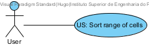
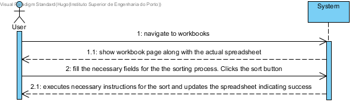
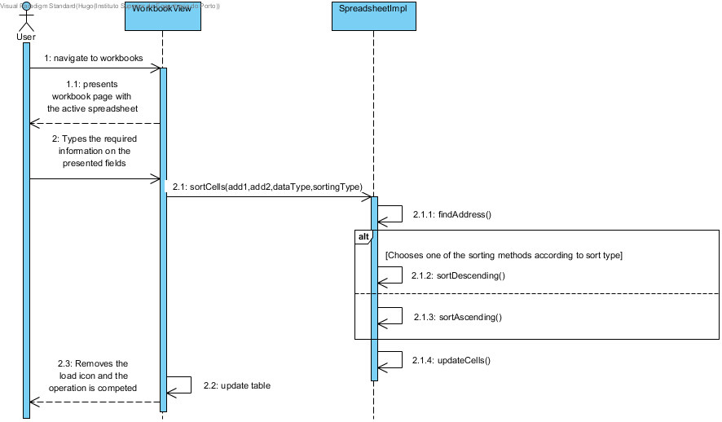
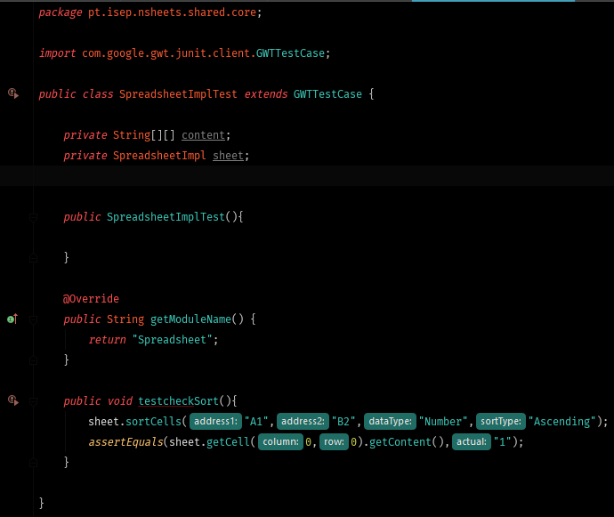

**Hugo Carvalho** (s1161569) - Sprint 1 - Core03.1
===============================

# 1. General Notes

# 2. Requirements

Core03.1 - Sort a range of cells. A range of cells is a rectangular area delimited by an upper left corner and a lower right corner. The sorting is based on one or more columns of the range. It should be possible to select the order: ascending or descending. Interaction with the user should be based on a popup menu. It should be possible to sort data of the following types: numeric, text or date.

Proposal:

US - As a User of the Application I want to be able to sort a range of cells so that the information on the selected cells becomes more organized. I want to choose both the upper left cell and lower right cell. I also want the application to validate the type of data it is handling and the type of ordering(ascending or descending).

# 3. Analysis

For this feature increment, since it is the first one to be developed regarding sort and dependencies in cells i need to:  

- Enable a button(MaterialButton) that will execute the sorting operation

- Enable two text fields(MaterialTextBox) where the user will choose the upper left cell and lower right cell

- Enable two configuration selection boxes (MaterialListValueBox) that will be used by the user to specify both data type(Number, Text or Date) and sort type(Ascending or Descending)

- After clicking the sort button find in the active spreadsheet the addresses of the cells chosen by the user

- Iterate all the spreadsheet´s "cell grid" in order to find all the cells between the selected range

- Order the obtained cells by updating their values according to the sorting type while also validating the type of data inside the cell.

- Update previous cells with the sorted values

- Update the UI with the new result grid

Note: For the purpose of keeping the user aware of the sorting operation a MaterialLoader will be used to block the browser until the operation is completed

## 3.1 Analysis Diagrams

The main idea for the "workflow" of this feature increment.

**Use Case**

- **Use Case**. Since the use case has a one-to-one correspondence with the User Story i do not add more detailed use case description in this section. I find that this use case is very simple in terms of concept and will add more specifications at a later stage.

**Domain Model (for this feature increment)**

- Since i found no specific requirements in terms of domain, i follow the Structure of the existing entities provided by Jonh Doe.

**System Sequence Diagrams**

# 4. Design

*In this section you should present the design solution for the requirements of this sprint.*
In terms of design there is only the need to add new methods on class SpreadsheetImpl for cell sorting with diferent configurations

## 4.1. Tests

Regarding tests i try to follow an approach inspired by test driven development. However it is not realistic to apply it for all the application (for instance for the UI part) but due to the problems encountered with the gwt framework, the tests will not be implemented by the time of delivery but they have been design to test all the invariants of this use case. Since the main focus of the use case is on updanting the actual spreadsheet according to the user´s instructions and this same spreadsheet is already located on the UI i have found no need for the implementation of both the controller and service patterns.

**Domain classes**

For the Domain classes i will have to test the sorting method added to the class that represents the entity **Spreadsheet**. This entity will have methods that, for the moment, will be based on the class **SpreadsheetImpl**:

  - public void sortCells(String address1, String address2, String dataType, String sortType)

**Test1:** I should ensure that are the cells are of the same data type(number(float)). Ascending case

	@Test(expected = IllegalValueTypeException.class)
		public void ensureOnlyNumberIsAllowedOnAscending {
		System.out.println("ensureOnlyNumberIsAllowedOnAscending");
		spreadsheet.sortCells(add1,add2,"Number","Ascending");
	}

**Test2:** I should ensure that are the cells are of the same data type(text(string)). Ascending case

	@Test(expected = IllegalValueTypeException.class)
		public void ensureOnlyTextIsAllowedOnAscending {
		System.out.println("ensureOnlyTextIsAllowedOnAscending");
		spreadsheet.sortCells(add1,add2,"Text","Ascending");
	}

**Test3:** I should ensure that are the cells are of the same data type(date). Ascending case

  	@Test(expected = IllegalValueTypeException.class)
  		public void ensureOnlyDateIsAllowedOnAscending {
  		System.out.println("ensureOnlyDateIsAllowedOnAscending");
  		spreadsheet.sortCells(add1,add2,"Date","Ascending");
  	}

**Test4:** I should ensure that are the cells are of the same data type(number(float)). Descending case

    @Test(expected = IllegalValueTypeException.class)
    	public void ensureOnlyNumberIsAllowedOnAscending {
    	System.out.println("ensureOnlyNumberIsAllowedOnAscending");
    	spreadsheet.sortCells(add1,add2,"Number","Descending");
    }

**Test5:** I should ensure that are the cells are of the same data type(text(string)). Descending case

    @Test(expected = IllegalValueTypeException.class)
    	public void ensureOnlyTextIsAllowedOnDescending {
    	System.out.println("ensureOnlyTextIsAllowedOnDescending");
    	spreadsheet.sortCells(add1,add2,"Text","Descending");
    }

**Test6:** I should ensure that are the cells are of the same data type(date). Descending case

      @Test(expected = IllegalValueTypeException.class)
      	public void ensureOnlyDateIsAllowedOnDescending {
      	System.out.println("ensureOnlyDateIsAllowedOnDescending");
      	spreadsheet.sortCells(add1,add2,"Date","Descending");
      }

**Test7...Test12:** The remaining tests reflect the sort output expectations being one for each method data type and sort type being like the previous error check methods a total of 6.

**Services/Controllers:** As refered previously in the beginning of this section there are no controllers or services to be tested.

**Test Coverage:** Due to problems regarding the use of the GWT framework it is not possible to quantify the test coverage.  

## 4.2. Requirements Realization

I envision a scenario like the following for realizing the use case for this feature increment.

Notes:  
- The diagram only depicts the less technical details of the scenario;  
- For clarity reasons, details such as the private sub-methods of the sortCells method and the interaction with the different GWT Material objects are not depicted in this diagram.   
- **SpreadsheetImpl** extends **Spreadsheet** making it the information expert regarding the existing cells and correponding addresses on the cell grid;  
- **CellImpl** extends **Cell** making it the information expert regarding contents of a cell;
- **Address** is the information expert regarding the positioning of a cell within the cell grid;  
- **WorkBookView** called from the **WorkBookPresenter** will be the MVP in charge of both asking the user for the necessary data and show the results of the operation;

## 4.3. Classes

All the needed classes for the use case are already implemented. The only things that have been added are the new ui elements and the sortCells method of interface **Spreadsheet** implemented on the class **SpreadsheetImpl**.

## 4.4. Design Patterns and Best Practices

By memory I apply/use:  
- Information Expert
- MVP

**TODO:** Exemplify the realization of these patterns using class diagrams and/or SD with roles marked as stereotypes.

# 5. Implementation

*If required you should present in this section more details about the implementation. For instance, configuration files, grammar files, etc. You may also explain the organization of you code. You may reference important commits.*

**For US**

**UI: Button for sorting the active spreadsheet**

For this concern i decided to use a Material Widget called Icon button witch is also an extension of a MaterialButton (Icon Action Button). This is a kind of button that usually appears associated to a toolbar(spreadsheet header in this case).  

I updated the WorkBookView.ui.xml accordingly and declare the element with a tag *ui:field="sortButton"*. In the corresponding class View (i.e., WorkBookView) i bind that button to the corresponding widget class: 	

	@UiField
	MaterialButton sortButton;

I must now add the code that invokes the spreadsheet to find all the cells between the two specified ones by the user and sort those cells according to the user specifications. Once sorted the spreadsheet must update the content of the previous selected cells. The event that provides this function is the new sort button and the popup menu that will be provided by the user once the button is pressed.

We chose to provide our click event globally but to simple use the click event handler of the button and connect it to a method in the HomePresenter.

Since Presenters should only depend on a View interface we added a new method to the HomePresenter.MyView:

	interface MyView extends View {
		void setContents(ArrayList<WorkbookDescriptionDTO> contents);
		void addClickHandler(ClickHandler ch);
	}

Then, we implemented the *addClickHandler* in the HomeView class and call this method in the constructor of the HomePresenter. In the constructor our handler class the server method that adds a new workbook description.   

**Code Organization**  

We followed the recommended organization for packages:  
- Code should be added (when possible) inside packages that identify the group, sprint, functional area and author;
- For instance, we used **lapr4.white.s1.core.n4567890**

The code for this sprint:  
Project **server**    
- pt.isep.nsheets.server.**lapr4.white.s1.core.n4567890**.workbooks.application: contains the controllers  
- pt.isep.nsheets.server.**lapr4.white.s1.core.n4567890**.workbooks.domain: contains the domain classes  
- pt.isep.nsheets.server.**lapr4.white.s1.core.n4567890**.workbooks.persistence: contains the persistence/JPA classes
- Updated the existing class: **pt.isep.nsheets.server.WorkbookServiceImpl**

Project **shared**  
- Added the class: **pt.isep.nsheets.shared.services.DataException**: This class is new and is used to return database exceptions from the server  
- Updated the classes: **pt.isep.nsheets.shared.services.WorkbookService** and **pt.isep.nsheets.shared.services.WorkbookServiceAsync**  

Project **NShests**
- Updated the classes: **pt.isep.nsheets.client.aaplication.home.HomeView** and **pt.isep.nsheets.client.aaplication.home.HomePresenter**  
- Updated the file: **pt.isep.nsheets.client.aaplication.home.HomeView.ui.xml**  

# 6. Integration/Demonstration

*In this section document your contribution and efforts to the integration of your work with the work of the other elements of the team and also your work regarding the demonstration (i.e., tests, updating of scripts, etc.)*

# 7. Final Remarks

I have encountered many issues regarding gwt interactions with the implemented java classes. One of this cases is the SpreadsheetImpl located on the shared package. Because it is a class that will also be converted into javaScript, the normal application of jUnit tests is unavailable. For testing porpuses it is needed to implement a gwt testcase but it his asking for a module that i connot figure on my own. I looked on the webpages like stackOverflow and http://www.gwtproject.org/doc/latest/tutorial/JUnit.html and i did not find any reference to a [path of the class].gwt.xml that apparently is needed for the execution of the GWTTestCase. Here are the html with the results of the test run and pictures of the created test class. Also as a note the program does not recognize the shared package as a possible test holder. It only allows to build tests either on server or nsheets packages.

[TestResults](TestResults-SpreadsheetImplTest_testcheckSort.html)

# 8. Work Log

*Insert here a log of you daily work. This is in essence the log of your daily work. It should reference your commits as much as possible.*

Commits:
