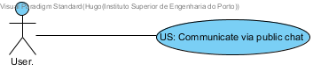
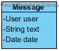
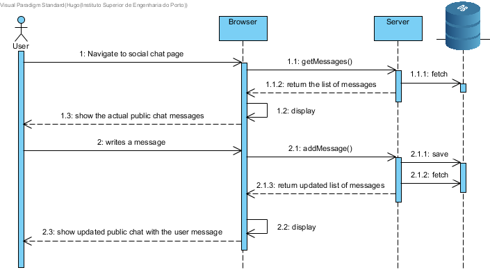
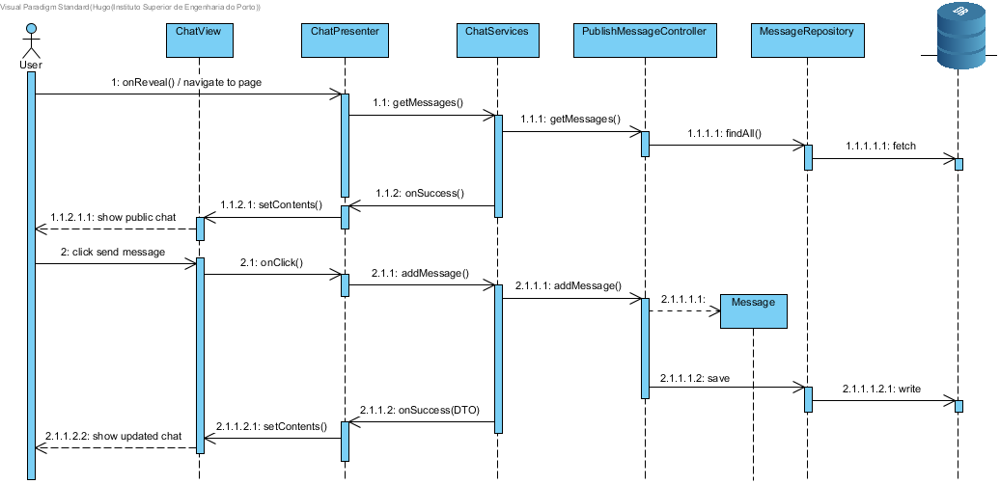

**Hugo Carvalho** (s1161569) - Sprint 2 - IPC08.1
===============================

# 1. General Notes

Given the fact that this functionality does not have any work (documentation, code and so on) associated on sprint 1, I decided to develop this functionality instead of the IPC08.2 which was intended for development in sprint2

# 2. Requirements

IPC08.1 - Add a Page/View to allow all online users to exchange text messages (i.e., a public chat room).

Proposal:

US - As a User of the Application I want a public chat so that I can communicate with other users of the Nsheets.

# 3. Analysis

For this feature increment, since it is the first one to be developed regarding any type of chat I need to:  

- Create a view/page that will be used for the public chat

- Add a button to the menu side navigation bar to enable the public chat page

- Add a button to the chat view/page to reload the chat in order to keep the text updated

- Add a button and a text field in the chat page/view for the user to write a message in the public chat 

- Create a message entity to store the text written, the user who wrote it and the exact time of said message.

- Persist on the server the new message and fetch the actual chat (collection of all messages ordered by date) 

- Refresh the chat to accommodate the user message an other new messages that might have appeared 

## 3.1 Application Startup
	        
The **ApplicationModule** must also install the new model destined for the social chat:

		install(new ChatModule());   

This module will represent an MVP page in the application for the chat.

In this MVP pattern, the **ChatPresenter** will define a specific interface that is used to communicate with the UI (i.e., the ChatView). Therefore the presenter can will fully isolated from dependencies related to the UI. 

	interface MyView extends View {
    		void setPageTitle(String title, String description, String link, String specification);
    } 
	
## 3.2 Server and RPC

The Chat page displays what seems to be Messages that should reside in the server.

In the method **onReveal** the Chat presenter invokes a **ChatService** asynchronously.

For this purpose I will require an interface for the service. In this case:

	@RemoteServiceRelativePath("chatService")
	public interface ChatService extends RemoteService {
		ArrayList<MessageDTO> getMessages();
	}

When the RPC is invoked since it will always execute asynchronously, so I have to prove a callback: 

	// Make the call to the message service.
	chatSvc.getMessages(callback);
	
The callback will be similar to the one developed by John Doe:

	// Set up the callback object.
	AsyncCallback<ArrayList<MessageDTO>> callback = new AsyncCallback<ArrayList<MessageDTO>>() {
		public void onFailure(Throwable caught) {
			// TODO: Do something with errors.
		}
		public void onSuccess(ArrayList<MessageDTO> result) {
			refreshView(result);
		}
	}; 

Since the interface is code that must be accessed by both server and client code it will reside in the **shared** project.

The interface must be implemented in the **server** since it will be the one responsible for communicating with the data base. The **publicMessagingController** will be the assign controller for this task of implementing the interface

	@Override
	public ArrayList<MessageDTO> getMessages() {
	    ArrayList<MessageDTO> messages = new ArrayList<MessageDTO>();
	    for(Message message:messageRepository.findAllByDate()){
	        messages.add(message.toDTO());
	    }   
		return messages;
	}

Since the service is a servlet it must be declared in the **web.xml** file of the project (see file nsheets/src/main/webapp/WEB-INF/web.xml).

	<!-- Servlets for the Messages -->
	<servlet>
		<servlet-name>chatServiceServlet</servlet-name>
		<servlet-class>pt.isep.nsheets.server.lapr4.red.s2.ipc.s1161569.application.ChatServiceImpl</servlet-class>
	</servlet>
	<servlet-mapping>
		<servlet-name>chatServiceServlet</servlet-name>
		<!-- The first "part" of the url is the name of the GWT module as in "rename-to" in .gwt.xml -->
		<url-pattern>/nsheets/chatService</url-pattern>
	</servlet-mapping> 
	

## 3.3 Analysis Diagrams

The main idea for the "workflow" of this feature increment.

**Use Cases**

- **Use Case**. Since these use case has a one-to-one correspondence with the User Story I do not add more detailed use case description in this section.

**Domain Model (for this feature increment)**

- **Domain Model**. The message entity will be represented by the class **Message** int server side and when transitioning to the client side will be represented by the **MessageDTO**. The reverse process also occurs. In therms of already existing entities this use case requires the use of the **User** entity developed by Paulo Magalhães (s1160570)  

**System Sequence Diagrams**

# 4. Design

## 4.1. Tests

*In this section you should describe the design of the tests that, as much as possibe, cover the requirements of the sprint.*

Regarding tests I try to follow an test driven development approach. I concentrate all the testing effort on the domain classes and also on the services provided by the server.

**Domain classes**

For the Domain classes I will have a class that represents the entity **Message**:
	
	- user (User)
	- name (string)
	- description (string) 

**Test:** I should ensure that a Message can be created only when all the attributes are set.  

	@Test(expected = IllegalArgumentException.class)
		public void ensureNullIsNotAllowedOnMessageUsername() {
		System.out.println("ensureNullIsNotAllowedOnMessage");
		Message instance = new Message(null, null, null);
	}
	@Test(expected = IllegalArgumentException.class)
    		public void ensureNullIsNotAllowedOnMessageText() {
    		System.out.println("ensureNullIsNotAllowedOnMessage");
    		Message instance = new Message(null, null, null);
    }
    @Test(expected = IllegalArgumentException.class)
    		public void ensureNullIsNotAllowedOnMessageDate() {
    		System.out.println("ensureNullIsNotAllowedOnMessage");
    		Message instance = new Message(null, null, null);
    }

**Services/Controllers**

For the services I must test the service specified in the interface **ChatService**:

	@RemoteServiceRelativePath("chatService")
	public interface ChatService extends RemoteService {
		ArrayList<MessageDTO> getMessages();
		MessageDTO addMessage(MessageDTO mDto) throws DataException;
	}
		
Tests:  
- The tests on the controllers require the presence of a database.  
- I will use the database in memory (H2).  
- I will have a *controller* from adding and fetching the public chat Messages. This controller will be invoked by the GWT RPC service.

Controller **PublishPublicMessageController**

**Test:** Verify the normal creation of a Message.  

	@Test
	public void testNormalBehaviour() throws Exception {
		System.out.println("testNormalBehaviour");
		final String text = "This is a public chat message";
		final Date date = new Date();
		final User user = new user();
		final MessageDTO expected = new MessageDTO(user.toDTO(), text, date);
		PublishMessageController ctrl = new PublishMessageController();
		MessageDTO result = ctrl.addMessage(expected);
		assertTrue("the added Message does not have the same data as input", Message.fromDTO(expected).sameAs(Message.fromDTO(result)));
	}

**Test:** At the beginning of the tests the memory database should be empty, so PublishPublicMessageController should return an empty set.

	   @Test 
	   public void testEnsureGetMessagesEmpty() {
		   System.out.println("testEnsureGetMessagesEmpty");
		   PublishMessageController ctrl=new PublishMessageController();
		   Iterable<Messages> messageList=ctrl.getMessages();
		   assertTrue("the list of Messages is not empty", !messageList.iterator().hasNext());
	   } 
 
**Test:** If a Message is created it should be present in a following invocation of getMessages().

		@Test
		public void testBtestDatabaseInsertion() throws Exception {
			System.out.println("testBtestDatabaseInsertion");
			final String text = "This is a public chat message";
            final Date date = new Date();
            final User user = new user();
            final MessageDTO expected = new MessageDTO(user.toDTO(), text, date);
			PublishPublicMessageController ctrl=new PublishPublicMessageController();
			MessageDTO result = ctrl.addMessage(dto);
			Iterable<Messages> messageList=ctrl.getMessages();
			assertTrue("the added Message is not in the database", messageList.iterator().hasNext());
		}

**Test Coverage**  
- The actual coverage for domain classes: 0%
- The actual coverage for application(controller) classes: 0%
 

## 4.2. Requirements Realization

Following the guidelines for JPA from EAPLI I envision a scenario like the following for realizing the use case for this feature increment.

Notes:  
- The diagram only depicts the less technical details of the scenario;  
- For clarity reasons details such as the PersistenceContext or the RepositoryFactory are not depicted in this diagram.   
- **ChatServices** realizes the GWT RPC mechanism;  
- **PublishPublicMessageController** is the *use case controller*;  

## 4.3. Classes

For this functionality the most important classes are **Message** (Represents the message entity on server side), **MessageDTO** (Represents message entity on the client side), **PublishPublicMessageController** (establishes a connection between the client and the server) and the **MessageRepository** (Persistence mechanism) 

## 4.4. Design Patterns and Best Practices

By memory I apply/use:  
- Information Expert 
- Service/Controller 
- Repository  
- DTO  
- MVP  

# 5. Implementation

**UI: View/page to support the chat**

For this concern i decided to create a new module called **ChatModule** to suport the page that contains the public chat.

**UI: Text area for writing the message**

For this concern i decided to use a Material Widget called MaterialTextArea. It  has a similar structure to the MaterialTextBox but supports a larger area for text writing. 

I updated the ChatView.ui.xml accordingly and declare the element with the tags **ui:field="textField" label="Text Area" allowBlank='false'**. In the corresponding class View (i.e., ChatView) i bind this text area to the corresponding widget class: 	

      @UiField
      MaterialTextArea textField;

**UI: Buttons for sending a message and refresh the chat**

For this concern i decided to use a Material Widget called MaterialButton. These are the two buttons in which the user will either send a message(send button) which also refreshes the chat or just refresh the chat(refresh button).  

I updated the ChatView.ui.xml accordingly and declare the elements with the tags **ui:field="publishButton" text="Send" waves="LIGHT" textColor="WHITE" iconType="POLYMER" iconPosition="RIGHT"** and **ui:field="refreshButton" text="Refresh" waves="LIGHT" textColor="WHITE" iconType="POLYMER" size="LARGE"**. In the corresponding class View (i.e., ChatView) i bind these buttons to the corresponding widget class: 	

      @UiField
      MaterialButton publishButton;

      @UiField
      MaterialButton refreshButton;

**Code Organization**  

I followed the recommended organization for packages:  
- Code should be added (when possible) inside packages that identify the group, sprint, functional area and author;
- In this case since i do not have to add new packages since i use existing classes and files;

The code for this sprint:  
Project **server**    
- pt.isep.nsheets.server.**lapr4.red.s2.ipc.n1161569.application**: contains the PublishMessageController  
- pt.isep.nsheets.server.**lapr4.red.s2.ipc.n1161569.domain**: Message class 
- pt.isep.nsheets.server.**lapr4.white.s1.core.n4567890.workbooks.persistence**: contains the persistence/JPA class for the Messages  
- Created the service class: **pt.isep.nsheets.server.services.ChatServiceImpl**

Project **shared**  
- Added the interface: **pt.isep.nsheets.shared.services.ChatService**: Interface to be applied to the respective class(ChatServiceImpl). Comply with rpc   
- Added the interface: **pt.isep.nsheets.shared.services.ChatServiceAsync**: Interface that defines the async calls regarding messages fetch and commit.
- Added the Class: **pt.isep.nsheets.shared.services.MessageDTO**: UI representation of the Message entity.  

Project **NShests** 
- Created the classes: **pt.isep.nsheets.client.lapr4.red.s2.n1161569.ChatModule**, **pt.isep.nsheets.client.lapr4.red.s2.n1161569.ChatPresenter** and **pt.isep.nsheets.client.lapr4.red.s2.n1161569.ChatView**
- Created the file: **pt.isep.nsheets.client.lapr4.red.s2.n1161569.ChatView.ui.xml**: File that orders the UI elements on the page
- Updated the class: **pt.isep.nsheets.client.application.ApplicationModule**: Adde the instruction to initialize the **ChatModule**

# 6. Integration/Demonstration

Since the use case involved a new page and new domain concepts there was not much need to conciliate with the team the realization of this use case. The only thing that was needed to conciliate was the structure of the user login and how the actual user was saved since I needed the username for the message so this issue was coordinated with colleague **s1161109**.

# 7. Final Remarks

I have encountered some issues regarding gwt UI elements namely on the capability to show the chat messages. With the help of **s1120608** it was possible to develop a MaterialCard capable of containing the chat message, the username who created said message and the exact time at which the message was created. 

# 8. Work Log

Commits:
