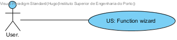

**Hugo Carvalho** (s1161569) - Sprint 3 - Lang04.1
===============================

# 1. General Notes

Given the fact that this functionality does not have any work (documentation, code and so on) associated on sprint 1, I decided to develop this functionality instead of the Lang04.3 which was intended for development in sprint3

# 2. Requirements

Lang04.1 - The application should have an option to launch a wizard to aid the user in calling functions in formulas. This new window should display a list of possible functions. The construction of this list should be made dynamically based on the self-description of the functions. When a function is selected in the list its syntax should be displayed in a edit box. The "syntax" should include the name of the function and its parameters. For example, for the factorial function, that only has one parameter, the following text should be displayed in the edit box "= FACT(Number)". The window should also contain an area to display a text describing the selected function (i.e., help text). The window should have an "Apply" and a "Cancel" button. If the user selects the "Apply" button the text of the syntax of the function should be written in the "formula bar".
Proposal:

US - As a User of the Application I want a function wizard so that I can see all the available functions and the information regarding them.

# 3. Analysis

For this feature increment, since it is the first one to be developed regarding a function wizard I need to:  

- Create a popup menu on the workbook page/view that will be used as the wizard menu

- Add a button to the menu for canceling the operation

- Add a button to the menu for confirming the selection

- Add a text box for the description of the function and it's syntax

- Add a edit box where the expression for that formula will be written and the user may change the parameters

- After confirmation the expression should be inserted in the formula text box in the workbook page/view for the user to be able to execute it if he chooses to.

## 3.1 Analysis Diagrams

**Use Case:** Since these use case has a one-to-one correspondence with the User Story I do not add more detailed use case description in this section.

**Domain Model (for this feature increment)**
