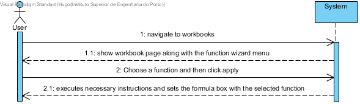
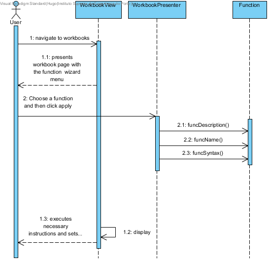

**Hugo Carvalho** (s1161569) - Sprint 3 - Lang04.1
===============================

# 1. General Notes

Given the fact that this functionality does not have any work (documentation, code and so on) associated on sprint 1, I decided to develop this functionality instead of the Lang04.3 which was intended for development in sprint3

# 2. Requirements

Lang04.1 - The application should have an option to launch a wizard to aid the user in calling functions in formulas. This new window should display a list of possible functions. The construction of this list should be made dynamically based on the self-description of the functions. When a function is selected in the list its syntax should be displayed in a edit box. The "syntax" should include the name of the function and its parameters. For example, for the factorial function, that only has one parameter, the following text should be displayed in the edit box "= FACT(Number)". The window should also contain an area to display a text describing the selected function (i.e., help text). The window should have an "Apply" and a "Cancel" button. If the user selects the "Apply" button the text of the syntax of the function should be written in the "formula bar".
Proposal:

US - As a User of the Application I want a function wizard so that I can see all the available functions and the information regarding them.

# 3. Analysis

For this feature increment, since it is the first one to be developed regarding a function wizard I need to:  

- Create a popup menu on the workbook page/view that will be used as the wizard menu

- Add a button to the menu for confirming the selection

- Add a text box for the description of the function and it's syntax

- Add a edit box where the expression for that formula will be written and the user may change the parameters

- After confirmation the expression should be inserted in the formula text box in the workbook page/view for the user to be able to execute it if he chooses to.

## 3.1 Analysis Diagrams

- **Use Case**. Since the use case has a one-to-one correspondence with the User Story i do not add more detailed use case description in this section. I find that this use case is very simple in terms of concept and will add more specifications at a later stage.

**Domain Model (for this feature increment)**

- Since i found no specific requirements in terms of domain, i follow the Structure of the existing entities.

**System Sequence Diagrams**

# 4. Design

In terms of design there is only the need to add new methods on the function classes. Each method will provide the name of the function, the description and the syntax example.

## 4.1. Tests

There where no tests for this feature besides an integration test with the app running.  

## 4.2. Requirements Realization

I envision a scenario like the following for realizing the use case for this feature increment.

## 4.3. Classes

All the needed classes for the use case are already implemented. The only things that have been added are the new ui elements on **WorkBookView** and the design methods of interface **Function** implemented on each of the developed functions.

## 4.4. Design Patterns and Best Practices

By memory I apply/use:  
- Information Expert
- MVP

# 5. Implementation

**UI: Collapsible menu for the function wizard**

For this concern i decided to use a Material Widget called MaterialCollapsible. This is a collapsible menu for the function wizard.  

I updated the WorkBookView.ui.xml accordingly and declare the element with a the tags **ui:field = "colapFuncWizard" type="POPOUT"**. In the corresponding class View (i.e., WorkBookView) i bind that this menu to the corresponding widget class: 	

	 @UiField
	 MaterialCollapsible colapFuncWizard;

**UI: Text box for the description**

For this concern i decided to use a Material Widget called MaterialTextBox. This will contain the description of the selected function. This box will not be editable.

I updated the WorkBookView.ui.xml accordingly and declare the elements with the tags **ui:field="funcDescription" readOnly="true" label="Description"**. In the corresponding class View (i.e., WorkBookView) i bind this text box to the corresponding widget class: 	

      @UiField
      MaterialTextBox funcDescription;

**UI: List box for choosing the function**

For this concern i decided to use a Material Widget called MaterialListValueBox. This will allow the user to choose the function. When the function is selected it will update the description field with the corresponding function description.

I updated the WorkBookView.ui.xml accordingly and declare the elements with the tags **ui:field="funcName" placeholder="Choose function"**. In the corresponding class View (i.e., WorkBookView) i bind this list value box to the corresponding widget class: 	

      @UiField
      MaterialListValueBox<String> funcName;

**UI: Text box for the syntax**

For this concern i decided to use a Material Widget called MaterialTextBox. This will contain a viable example of the selected function.
I updated the WorkBookView.ui.xml accordingly and declare the elements with the tags **ui:field="funcSyntax" placeholder="Function preview"**. In the corresponding class View (i.e., WorkBookView) i bind this text box to the corresponding widget class: 	

      @UiField
      MaterialTextBox funcSyntax;
   
**UI: Button for the function wizard**

For this concern i decided to use a Material Widget called MaterialButton. This will be the button for applying the function. 
I updated the WorkBookView.ui.xml accordingly and declare the elements with the tags **ui:field="applyFuncWizard" text="Apply"**. In the corresponding class View (i.e., WorkBookView) i bind this button to the corresponding widget class: 	

      @UiField
      MaterialButtton applyFuncWizard;   

**Code Organization**  

I followed the recommended organization for packages:  
- Code should be added (when possible) inside packages that identify the group, sprint, functional area and author;
- In this case since i do not have to add new packages since i use existing classes and files;

The code for this sprint:  

Project **shared**
- Updated the interface: **pt.isep.nsheets.shared.core.formula.Funtion**: This interface as the header of the new description, syntax and name methods
- Updated the classes: **pt.isep.nsheets.shared.core.formula.lang**: Updated the classes that implement the **Function** interface with the three new methods    

Project **NShests**
- Updated the classe: **pt.isep.nsheets.client.application.workbook.WorkbookView**: Added new ui fields for the function wizard  
- Updated the file: **pt.isep.nsheets.client.application.workbook.WorkbookView.ui.xml**  

# 6. Integration/Demonstration

Since the entire implementation is on the ui, The only possible tests are integration tests

# 7. Final Remarks

Due to lack of time, some functions do not have their intended description and syntax. 

# 8. Work Log

Commits:

[Lang04.1: Started documentation. Identification of main ui elements and actions necessary for this use case. Started analysis](https://bitbucket.org/lei-isep/lapr4-18-2dl/commits/43c691cef2cd)

[Lang04.1: Updated Function interface with the necessary methods for the function wizard](https://bitbucket.org/lei-isep/lapr4-18-2dl/commits/3ef8e0516595)

[Lang04.1: Implemented ui. Functions still have placeholders in their methods](https://bitbucket.org/lei-isep/lapr4-18-2dl/commits/3810a12cb660)

[Lang04.1: Implementation completed. Added actual information instead of placeholders for each function.](https://bitbucket.org/lei-isep/lapr4-18-2dl/commits/e51a28383903)