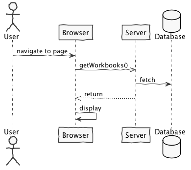

**John Doe** (s4567890) - Sprint 1 - Core00.0
===============================

# 1. General Notes

*In this section you should register important notes regarding your work during the sprint. For instance, if you spend significant time helping a colleague or if you work in more than a feature.*

# 2. Requirements

*In this section you should describe the requirements for this sprint.*

*This is simply an example of documentation*

Core00.0 - The Home page should present metadata about all workbooks (i.e., Workbook Descriptions). This metadata should be persisted in a relational database (using JPA). In the UI of the Home page it should be possible to add a new Workbook Description.

We can further specify this textual requirements as user stories.

Proposal:

US1 - As the Product Owner I want that the workbooks that are displayed in the Home Page come from a relational database so that they are persisted and can be updated.

US2 - As a User of the Application I want to be able to add new Workbook Descriptions when I am in the Home Page.

# 3. Analysis

*In this section you should describe the study/analysis/research you developed in order to design a solution.*

For this feature increment, since it is the first one to be developed in a new project I need to:

- Understand how the application works and also understand the key aspects of GWT, since it is the main technology behind the application

- Understand how the Home Page is implemented (for instance, how the UI gets the Workbook Descriptions that are displayed)

- Understand how to integrate a relational database into the project (Will be assuming JPA since it is studied in EAPLI) 

## 3.1 How the Application Works

1. Modules. From the pom.xml file we can see that the application is composed of 5 modules:
  - **server**. It is the "server part" of the web application.
  - **shared**. It contains code that is shared between the client (i.e., web application) and the server. 
  - **nsheets**. It is the web application (i.e., Client).
  - **util**. This is the same module as the one of EAPLI.
  - **framework**. This is the same module as the one of EAPLI. 
  
From [GWT Overview](http://www.gwtproject.org/overview.html): *"The GWT SDK contains the Java API libraries, compiler, and development server. It lets you write client-side applications in Java and deploy them as JavaScript."*

Therefore:
  - The project is totally developed in Java, event for the UI parts.
  - GWT uses a technique know as "transpilation" to translate Java code to Javascript. This is totally transparent to the user
  - A GWT application is comprised of "GWT modules" (see [GWT Tutorial](http://www.gwtproject.org/doc/latest/tutorial/create.html)). These GWT modules are described in .gwt.xml files.
   The nsheets project contains a .gwt.xml file named nsheets.gwt.xml (nsheets/src/main/resources/pt/isep/nsheets/nsheets.gwt.xml). One of the important contents of the file is the specification of the entry point of the application. However, since the application uses the [GWTP framework](http://dev.arcbees.com/gwtp/) the entry point is automatically provided (no need to specify it in the .gwt.xml file). In this case what is specified is the GIN client module pt.isep.nsheets.client.gin.ClientModule:
   
	    <extend-configuration-property name="gin.ginjector.modules"
                                   value="pt.isep.nsheets.client.gin.ClientModule"/>
                                   
   It is from this **ClientModule** that the application starts.
   Another important content of a .gwt.xml file is setting the paths for translatable code, .i.e., java code that should be translated to javascript. Usually the default source path is the client subpackage underneath where the .gwt.xml File is stored. In this case every code inside package pt.isep.nsheets.client and pt.isep.nsheets.shared will be translated to javascript. 
   
	    <!-- Specify the paths for translatable code                    -->
    <source path='client'/>
    <source path='shared'/>
        
   The shared package is where shared code between server and client should reside. See [GWT - What to put in the shared folder?](https://stackoverflow.com/questions/5664601/gwt-what-to-put-in-the-shared-folder?utm_medium=organic&utm_source=google_rich_qa&utm_campaign=google_rich_qa) and also [using GWT RPC](http://www.gwtproject.org/doc/latest/tutorial/RPC.html).
   
   In this project the shared, server and client (i.e, nsheets) code are separated also in Maven modules. 

## Analysis SD Diagram

The main idea for the "workflow" of this feature increment.

# 4. Design

*In this section you should present the design solution for the requirements of this sprint.*

## 4.1. Functional Tests

*In this section you should describe the design of the functional tests that cover the requirements of the sprint.*

## 4.2. Requirements Realization

*In this section you should present the design realization of the requirements.*

## 4.3. Classes

*Present and describe the major classes of you solution.*

## 4.4. Design Patterns and Best Practices

*Present and explain how you applied design patterns and best practices.*

# 5. Implementation

*If required present in this section mode details of the implementation. For instance, configuration files, grammar files, etc. You may reference important commits.*

# 6. Integration/Demonstration

*In this section document your contribution and efforts to the integration of your work with the work of the other elements of the team and also your work regarding the demonstration (i.e., tests, updating of scripts, etc.)*

# 7. Final Remarks 

*In this section present your views regarding alternatives, extra work and future work on the issue.*

# 8. Work Log

*Insert here a log of you daily work. This is in essence the log of your daily standup meetings.*
