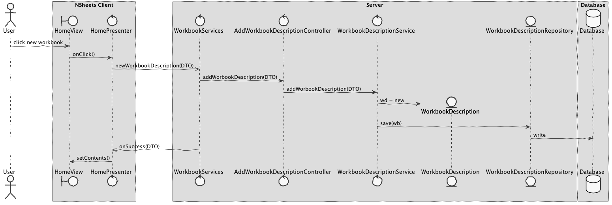

**John Doe** (s4567890) - Sprint 1 - Core00.0
===============================

# 1. General Notes

*In this section you should register important notes regarding your work during the sprint. For instance, if you spend significant time helping a colleague or if you work in more than one feature increment.*

# 2. Requirements

*In this section you should describe the requirements for this sprint.*

*This is simply an example of documentation*

Core00.0 - The Home page should present metadata about all workbooks (i.e., Workbook Descriptions). This metadata should be persisted in a relational database (using JPA). In the UI of the Home page it should be possible to add a new Workbook Description.

We can further specify this textual requirements as user stories.

Proposal:

US1 - As the Product Owner I want that the workbooks that are displayed in the Home Page come from a relational database so that they are persisted and can be updated.

US2 - As a User of the Application I want to be able to add new Workbook Descriptions when I am in the Home Page.

# 3. Analysis

*In this section you should describe the study/analysis/research you developed in order to design a solution.*

For this feature increment, since it is the first one to be developed in a new project I need to:  

- Understand how the application works and also understand the key aspects of GWT, since it is the main technology behind the application  

- Understand how the Home Page is implemented (for instance, how the UI gets the Workbook Descriptions that are displayed)  

- Understand how to integrate a relational database into the project (Will be assuming JPA since it is studied in EAPLI)   

## 3.1 GWT and Project Structure

**Modules**. From the pom.xml file we can see that the application is composed of 5 modules:  
- **server**. It is the "server part" of the web application.  
- **shared**. It contains code that is shared between the client (i.e., web application) and the server.   
- **nsheets**. It is the web application (i.e., Client).  
- **util**. This is the same module as the one of EAPLI.  
- **framework**. This is the same module as the one of EAPLI.   
  
From [GWT Overview](http://www.gwtproject.org/overview.html): *"The GWT SDK contains the Java API libraries, compiler, and development server. It lets you write client-side applications in Java and deploy them as JavaScript."*

Therefore:
  - The project is totally developed in Java, event for the UI parts.
  - GWT uses a technique know as "transpilation" to translate Java code to Javascript. This is totally transparent to the user
  - A GWT application is comprised of "GWT modules" (see [GWT Tutorial](http://www.gwtproject.org/doc/latest/tutorial/create.html)). These GWT modules are described in .gwt.xml files.
   The nsheets project contains a .gwt.xml file named nsheets.gwt.xml (nsheets/src/main/resources/pt/isep/nsheets/nsheets.gwt.xml). One of the important contents of the file is the specification of the entry point of the application. However, since the application uses the [GWTP framework](http://dev.arcbees.com/gwtp/) the entry point is automatically provided (no need to specify it in the .gwt.xml file). In this case what is specified is the GIN client module pt.isep.nsheets.client.gin.ClientModule:
   
	    <extend-configuration-property name="gin.ginjector.modules"
                                   value="pt.isep.nsheets.client.gin.ClientModule"/>
                                   
   It is from this **ClientModule** that the application starts.
   Another important content of a .gwt.xml file is setting the paths for translatable code, .i.e., java code that should be translated to javascript. Usually the default source path is the client subpackage underneath where the .gwt.xml File is stored. In this case every code inside package pt.isep.nsheets.client and pt.isep.nsheets.shared will be translated to javascript. 
   
	<!-- Specify the paths for translatable code                    -->
    <source path='client'/>
    <source path='shared'/>
        
   The shared package is where shared code between server and client should reside. See [GWT - What to put in the shared folder?](https://stackoverflow.com/questions/5664601/gwt-what-to-put-in-the-shared-folder?utm_medium=organic&utm_source=google_rich_qa&utm_campaign=google_rich_qa) and also [using GWT RPC](http://www.gwtproject.org/doc/latest/tutorial/RPC.html).
   
   In this project the shared, server and client (i.e, nsheets) code are separated also in Maven modules (but they could all be in the same project/maven module). 
   
## 3.2 Application Startup and GWTP

As described before the entry point for the application is the class **pt.isep.nsheets.client.gin.ClientModule**.

GWTP follows the MVP (Model-View-Presenter) pattern. It uses [GIN dependency injection](http://dev.arcbees.com/gwtp/core/presenters/gin-bindings.html) to put together the parts of each MVP. How the GWTP structures the application and uses GIN to bind all the required elements is described in [GWTP Beginner's Tutorial](http://dev.arcbees.com/gwtp/tutorials/index.html).

We can see that **ClientModule** installs the base presenter of the application:

	    install(new ApplicationModule());
	        
The **ApplicationModule** module install all the other modules of the application:

	    install(new HomeModule());
		install(new MenuModule());
		install(new AboutModule());
		install(new WorkbookModule());   

Each module represents an MVP page in the application.

In this MVP pattern each presenter defines a specific interface that is use to communicate with the UI (i.e., the View). Therefore the presenter can be fully isolated from dependencies related to the UI. For instance, the View interface that is defined by the ApplicationPresenter only has one method:

	interface MyView extends View {
    		void setPageTitle(String title, String description, String link, String specification);
    } 

In this specific case the only type that is "shared" between Presenter and View is the String.

The View class is where all the UI code should be implemented. In GWT it is possible to create UI elements programmatically (see [GWT Build the UI](http://www.gwtproject.org/doc/latest/tutorial/buildui.html)). The UI can also be described in .ui.xml files using [UIBinder](http://www.gwtproject.org/doc/latest/DevGuideUiBinder.html). The NSheets project is using [GWT Material Design](https://github.com/GwtMaterialDesign/gwt-material) and therefore all the UI widgets are from that library. 

In the case of the Application module we can see that there is a ApplicationView.ui.xml. This file declares some widgets. The attribute ui:field can be used to specify an id that can be then used to bind that element to a class in the code. For instance, in ApplicationView.ui.xml:

	<m:MaterialPanel ui:field="panel">
		<m:MaterialLabel ui:field="title" text="NSheets" fontSize="2.3em"/>
		<m:MaterialLabel ui:field="description" text="A Sophisticated Web Spreadsheet Application." fontSize="1.1em"/>
	</m:MaterialPanel>
	
It is set the ui:field attribute for two existing labels. In the code (ApplicationView.java) one can bind to Widgets classes. For instance:

	@UiField
    MaterialLabel title, description;
    
Then we can use this instances to access the widgets link in:

	@Override
	public void setPageTitle(String title, String description, String link, String specification) {
        this.title.setText(title);
        this.description.setText(description);
        new MaterialAnimation().transition(Transition.BOUNCEINLEFT).animate(this.title);
        new MaterialAnimation().transition(Transition.BOUNCEINLEFT).animate(this.description);
    }    

## 3.3 Server and RPC

The Home page displays what seems to be Workbooks that should reside in the server.

In the method **onReveal** the Home presenter invokes a WorkbookService asynchronously. It uses the base communication mechanism of GWT called [GWT RPC](http://www.gwtproject.org/doc/latest/tutorial/RPC.html).

Basically, it requires the definition of an interface for the service. In this case:

	@RemoteServiceRelativePath("workbooksService")
	public interface WorkbooksService extends RemoteService {
		ArrayList<WorkbookDescriptionDTO> getWorkbooks();
	}
	
Note: The @RemoteServiceRelativePath annotation associates the service with a default path relative to the module base URL.

When an RPC is invoked since it is always executed asynchronously we have to prove a callback: 

	// Make the call to the stock price service.
	workbooksSvc.getWorkbooks(callback);
	
The callback is simple a class that provides two methods, one for a successful result and the other for a failure:

	// Set up the callback object.
	AsyncCallback<ArrayList<WorkbookDescriptionDTO>> callback = new AsyncCallback<ArrayList<WorkbookDescriptionDTO>>() {
		public void onFailure(Throwable caught) {
			// TODO: Do something with errors.
		}
		public void onSuccess(ArrayList<WorkbookDescriptionDTO> result) {
			refreshView(result);
		}
	}; 

Since the interface is code that must be accessed by both server and client code it should reside in the **shared** project.

The interface must be implemented in the **server**. The implementation can be very simple, like the one presented in the project. In this case the server simply returns always the same objects:

	@Override
	public ArrayList<WorkbookDescriptionDTO> getWorkbooks() {
	    ArrayList<WorkbookDescriptionDTO> workbooks = new ArrayList<WorkbookDescriptionDTO>();
	    WorkbookDescriptionDTO wb=new WorkbookDescriptionDTO("workbook1", "Este workbook contem uma lista...");
	    workbooks.add(wb);
		WorkbookDescriptionDTO wb2=new WorkbookDescriptionDTO("workbook notas", "Este workbook contem notas de disciplinas...");
	    workbooks.add(wb2);	    
		return workbooks;
	}

Since the service is a servlet it must be declared in the **web.xml** file of the project (see file nsheets/src/main/webapp/WEB-INF/web.xml).

	<!-- Servlets for the workbooks -->
	<servlet>
		<servlet-name>workbooksServiceServlet</servlet-name>
		<servlet-class>pt.isep.nsheets.server.services.WorkbooksServiceImpl</servlet-class>
	</servlet>
	<servlet-mapping>
		<servlet-name>workbooksServiceServlet</servlet-name>
		<!-- The first "part" of the url is the name of the GWT module as in "rename-to" in .gwt.xml -->
		<url-pattern>/nsheets/workbooksService</url-pattern>
	</servlet-mapping> 
	

## 3.4 Analysis Diagrams

The main idea for the "workflow" of this feature increment.

**Use Cases**

- **Use Cases**. Since these use cases have a one-to-one correspondence with the User Stories we do not add here more detailed use case descriptions. We find that these use cases are very simple and may eventually add more specification at a later stage if necessary.

**Domain Model (for this feature increment)**

- **Domain Model**. Since we found no specific requirements for the structure of Workbook Descriptions we follow the Structure of the existing DTO (WorkbookDescriptionDTO).

**System Sequence Diagrams**

**For US1**

**For US2**

# 4. Design

*In this section you should present the design solution for the requirements of this sprint.*

## 4.1. Tests

*In this section you should describe the design of the tests that, as much as possibe, cover the requirements of the sprint.*

Regarding tests we try to follow an approach inspired by test driven development. However it is not realistic to apply it for all the application (for instance for the UI part). Therefore we focus on the domain classes and also on the services provided by the server.

**Domain classes**

For the Domain classes we will have a class that represents the entity **WorkbookDescription**. This entity will have attributes that, for the moment, will be based on the class **WorkbookDescriptionDTO**:
	
	- name (string)
	- description (string) 

**Test:** We should ensure that a WorkbookDescription can be created when all the attributes are set.  

	@Test(expected = IllegalArgumentException.class)
		public void ensureNullIsNotAllowed() {
		System.out.println("ensureNullIsNotAllowed");
		WorkbookDescription instance = new WorkbookDescription(null, null);
	}

**Services/Controllers**

For the services the application already has a service specified in the interface **WorkbooksService**:

	@RemoteServiceRelativePath("workbooksService")
	public interface WorkbooksService extends RemoteService {
		ArrayList<WorkbookDescriptionDTO> getWorkbooks();
	}
	
This method seems to be sufficient for supporting US1 but not US2.

For US2 we need a method that can be used to create a new WorkbookDescription given a WorkbookDescriptionDTO.

The proposal is:

	@RemoteServiceRelativePath("workbooksService")
	public interface WorkbooksService extends RemoteService {
		ArrayList<WorkbookDescriptionDTO> getWorkbooks();
		WorkbookDescriptionDTO addWorkbookDescription(WorkbookDescriptionDTO wdDto) throws DataException;
	}
		
Tests:  
- The tests on the controllers require the presence of a database.  
- We will use the database in memory (H2).  
- We will have a *controller* from adding new WorkbookDescriptions. This controller will be invoked by the GWT RPC service.
- We will have a *controller* from listing WorkbookDescriptions. This controller will be invoked by the GWT RPC service.

Controller **AddWorkbookDescriptionController**

**Test:** Verify the normal creation of an WorkbookDescription.  

	@Test
	public void testNormalBehaviour() throws Exception {
		System.out.println("testNormalBehaviour");
		final String name = "Workbook1";
		final String description = "Description for Workbook1";
		final WorkbookDescription expected = new WorkbookDescription(name, description);
		AddWorkbookDescriptionController ctrl = new AddWorkbookDescriptionController();
		WorkbookDescription result = ctrl.addWorkbookDescription(expected.toDTO());
		assertTrue("the added WorkbookDescription does not have the same data as input", expected.sameAs(result));
	}

Controller **ListWorkbookDescriptionController**

Note: We will be using the annotation @FixMethodOrder(MethodSorters.NAME_ASCENDING) to ensure the test methods are executed in order. This is useful since the memory database will have state changing between tests.
 
**Test:** At the beginning of the tests the memory database should be empty, so listWorkbookDiscriptions should return an empty set.

	   @Test 
	   public void testAensureGetWorkbooksEmpty() {
		   System.out.println("testAensureGetWorkbooksEmpty");
		   ListWorkbookDescriptionController ctrl=new ListWorkbookDescriptionController();
		   Iterable<WorkbookDescription> wbs=ctrl.listWorkbookDescriptions();
		   assertTrue("the list of WorkbookDescriptions is not empty", !wbs.iterator().hasNext());
	   } 
 
**Test:** If a WorkbookDescription is created it should be present in a following invocation of getWorkbooks().

		@Test
		public void testBtestDatabaseInsertion() throws Exception {
			System.out.println("testBtestDatabaseInsertion");
			final String name = "Workbook1";
			final String description = "Description for Workbook1";
			final WorkbookDescription expected = new WorkbookDescription(name, description);
			AddWorkbookDescriptionController ctrlAdd = new AddWorkbookDescriptionController();
			WorkbookDescription result = ctrlAdd.addWorkbookDescription(expected.toDTO());
			ListWorkbookDescriptionController ctrlList=new ListWorkbookDescriptionController();
			Iterable<WorkbookDescription> wbs=ctrlList.listWorkbookDescriptions();
			assertTrue("the added WorkbookDescription is not in the database", wbs.iterator().hasNext());
		}

**Test Coverage**  
- The actual coverage for domain classes: 61%
- The actual coverage for application(controller) classes: 100%
 
- TODO: Add more tests to increase the coverage of the domain class. 

## 4.2. Requirements Realization

*In this section you should present the design realization of the requirements.*

Following the guidelines for JPA from EAPLI we envision a scenario like the following for realizing the use cases for this feature increment.

**For US1**

Notes:  
- The diagram only depicts the less technical details of the scenario;  
- For clarity reasons details such as the PersistenceContext or the RepositoryFactory are not depicted in this diagram.   
- **WorkbookServices** realizes the GWT RPC mechanism;  
- **ListWorkbookDescriptionController** is the *use case controller*;  
- **ListWorkbookDescriptionServices** is to group together all the services related to WorkbookDescription. 

**For US2**

## 4.3. Classes

*Present and describe the major classes of you solution.*

## 4.4. Design Patterns and Best Practices

*Present and explain how you applied design patterns and best practices.*

By memory we apply/use:  
- Singleton  
- Repository  
- DTO  
- MVP  

**TODO:** Exemplify the realization of these patterns using class diagrams and/or SD with roles marked as stereotypes. 

# 5. Implementation

*If required you should present in this section more details about the implementation. For instance, configuration files, grammar files, etc. You may also explain the organization of you code. You may reference important commits.*

**For US1**

The UI for this US was already implemented. We simply implemented the server as described previously.

**For US2**

**UI: Button for adding a new Workbook Description**

For this concern we decided to use a Material Widget called Material FAB (Floating Action Button). This is a kind of button that usually appears at the left bottom part of the screen and contains actions available for the elements of the page.  

We updated the HomeView.ui.xml accordingly and declare the element with a tag *ui:field="newWorkbookButton"*. In the corresponding class View (i.e., HomeView) we bind that button to the corresponding widget class: 	

	@UiField
	MaterialButton newWorkbookButton;

We must now add the code that invokes the server to add a new workbook description when the user clicks in the button. This is an event. To implement this behavior we could use GWT Events such as the SetPageTitleEvent already used in the application. These are special type of events that GWT manages and are available to all pages in the application. 

We chose to provide our click event globally but to simple use the click event handler of the button and connect it to a method in the HomePresenter.

Since Presenters should only depend on a View interface we added a new method to the HomePresenter.MyView:

	interface MyView extends View {
		void setContents(ArrayList<WorkbookDescriptionDTO> contents);
		void addClickHandler(ClickHandler ch);
	}

Then, we implemented the *addClickHandler* in the HomeView class and call this method in the constructor of the HomePresenter. In the constructor our handler class the server method that adds a new workbook description.   

**Code Organization**  

We followed the recommended organization for packages:  
- Code should be added (when possible) inside packages that identify the group, sprint, functional area and author;
- For instance, we used **lapr4.white.s1.core.n4567890**

The code for this sprint:  
Project **server**    
- pt.isep.nsheets.server.**lapr4.white.s1.core.n4567890**.workbooks.application: contains the controllers  
- pt.isep.nsheets.server.**lapr4.white.s1.core.n4567890**.workbooks.domain: contains the domain classes  
- pt.isep.nsheets.server.**lapr4.white.s1.core.n4567890**.workbooks.persistence: contains the persistence/JPA classes 
- Updated the existing class: **pt.isep.nsheets.server.WorkbookServiceImpl**

Project **shared**  
- Added the class: **pt.isep.nsheets.shared.services.DataException**: This class is new and is used to return database exceptions from the server  
- Updated the classes: **pt.isep.nsheets.shared.services.WorkbookService** and **pt.isep.nsheets.shared.services.WorkbookServiceAsync**  

Project **NShests** 
- Updated the classes: **pt.isep.nsheets.client.aaplication.home.HomeView** and **pt.isep.nsheets.client.aaplication.home.HomePresenter**  
- Updated the file: **pt.isep.nsheets.client.aaplication.home.HomeView.ui.xml**  

# 6. Integration/Demonstration

*In this section document your contribution and efforts to the integration of your work with the work of the other elements of the team and also your work regarding the demonstration (i.e., tests, updating of scripts, etc.)*

# 7. Final Remarks 

*In this section present your views regarding alternatives, extra work and future work on the issue.*

Some Questions/Issues identified during the work in this feature increment:

1. The method getWorkbooks in the WorkbooksService returns an ArrayList. Maybe we should not bind the result to a specific collection implementation.

# 8. Work Log

*Insert here a log of you daily work. This is in essence the log of your daily work. It should reference your commits as much as possible.*

Commits:

[Started new example documentation for John Doe Core00.0.](https://bitbucket.org/lei-isep/nsheets/commits/7d9ae99772cce77627454021ea814867a8ef3223)

[Started UI code for Core00.0](https://bitbucket.org/lei-isep/nsheets/commits/88cd76f001939c0fd49ac124a258a3d6ee3dc087) This commit contains some experimental code for studying how the application works. Since it was done in a feature branch no harm to others.  

[Core00.0 Added Analysis SD](https://bitbucket.org/lei-isep/nsheets/commits/e98286e5dbaf11bdd363d0228008acd86f4155c1)

[Core00.0 - Added user stories](https://bitbucket.org/lei-isep/nsheets/commits/5238a88d01a46b4dd10e3d99c8977ac3950c4ea2)

[Core00.0 - Added analysis how GWT and the application work](https://bitbucket.org/lei-isep/nsheets/commits/cbd2bf4669e9b781657ad909aaa27a425c5cbdfd)

[Core00.0 - Analysis: explain GWTP and MVP](https://bitbucket.org/lei-isep/nsheets/commits/0c3e56339fbd7fc8a421770ce041dc29b2b1af40)

[Core00.0 - Analysis: Explain Server and the RPC mechanism](https://bitbucket.org/lei-isep/nsheets/commits/a11f952fd69f03d45cbb804bbad98f7feabfe30e)

